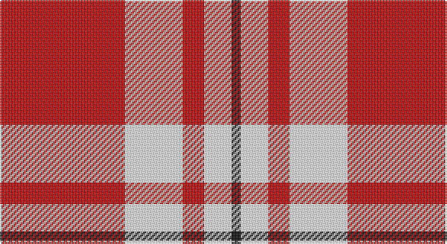

This page is one **sett** — a single exact thread-count. It belongs to the [tartan](/setts/r41w19r7w8w1k3/)
(the same proportion at any scale), whose colour order is pattern [KWWRWR](/stripes/kwwrwr/).

Part of the [MacGregor](/tartans/macgregor/) tartan — the named design grouping this sett with its other cloths.

Sourced from tartans-authority.  It is a [6 stripe tartan](/stripes/stripes6/).

Original link http://www.tartansauthority.com/tartan-ferret/display/6988/

## Also known as

This cloth is also recorded under:

- MacGregor #2
- MacGregor #3
- MacGregor #4
- MacGregor of Glengyle
- MacGregor, Black
- MacGregor, Modern

## Register references

External register numbers recorded for this tartan.

- Scottish Tartans Authority (ITI): 6988

## Thread count
R/82 W38 R14 W16 W2 K/6

One full sett is **228 threads**.

## Palette

Palette: <strong>Tartan Register</strong>
<table><thead><tr><th>Colour</th><th>Threads</th><th>Shade</th><th>Base</th><th>OKLCh</th></tr></thead><tbody><tr><td>R/</td><td style="text-align:right;font-variant-numeric:tabular-nums">82</td><td><code style="background-color:#C80000;">#C80000</code> <small style="color:#888">#C80000</small></td><td>R <code style="background-color:#CC0000;">#CC0000</code></td><td><small style="color:#888">oklch(52.3% 0.215 29.2)</small></td></tr><tr><td>W</td><td style="text-align:right;font-variant-numeric:tabular-nums">38</td><td><code style="background-color:#FCFCFC;">#FCFCFC</code> <small style="color:#888">#FCFCFC</small></td><td>W <code style="background-color:#F7F7F7;">#F7F7F7</code></td><td><small style="color:#888">oklch(99.1% 0.000 89.9)</small></td></tr><tr><td>R</td><td style="text-align:right;font-variant-numeric:tabular-nums">14</td><td><code style="background-color:#C80000;">#C80000</code> <small style="color:#888">#C80000</small></td><td>R <code style="background-color:#CC0000;">#CC0000</code></td><td><small style="color:#888">oklch(52.3% 0.215 29.2)</small></td></tr><tr><td>W</td><td style="text-align:right;font-variant-numeric:tabular-nums">16</td><td><code style="background-color:#FCFCFC;">#FCFCFC</code> <small style="color:#888">#FCFCFC</small></td><td>W <code style="background-color:#F7F7F7;">#F7F7F7</code></td><td><small style="color:#888">oklch(99.1% 0.000 89.9)</small></td></tr><tr><td>W</td><td style="text-align:right;font-variant-numeric:tabular-nums">2</td><td><code style="background-color:#FCFCFC;">#FCFCFC</code> <small style="color:#888">#FCFCFC</small></td><td>W <code style="background-color:#F7F7F7;">#F7F7F7</code></td><td><small style="color:#888">oklch(99.1% 0.000 89.9)</small></td></tr><tr><td>K/</td><td style="text-align:right;font-variant-numeric:tabular-nums">6</td><td><code style="background-color:#101010;">#101010</code> <small style="color:#888">#101010</small></td><td>K <code style="background-color:#000000;">#000000</code></td><td><small style="color:#888">oklch(17.3% 0.000 89.9)</small></td></tr></tbody></table>

# Sample pattern

## Compared to the master

This cloth is one sett of its design; the master sett (the exemplar the design is anchored on) is below for comparison.

<figure style="margin:0"><figcaption style="color:#888;font-size:smaller">this sett</figcaption></figure>
<figure style="margin:0"><figcaption style="color:#888;font-size:smaller"><a href="/setts/r39dg6r2dg3w1/">master sett →</a></figcaption></figure>

## Nearest tartans

The nearest existing variants by ΔTartan distance, with this tartan at the top so the swatches line up against it.

ΔTartan

Tartan

Sett

—

<a href="/ttd/edit/#slug=r41w19r7w8w1k3~x2">MacGregor - 2005 (Black - Personal)</a> <a class="nn-out" href="/variants/s6/r41w19r7w8w1k3~x2/" title="open its dictionary page">↗</a>

1.50

<a href="/ttd/edit/#slug=r36w4r3w4r6w2r1w12~x4&amp;base=r41w19r7w8w1k3~x2">Menzies (1815)</a> <a class="nn-out" href="/variants/s8/r36w4r3w4r6w2r1w12~x4/" title="open its dictionary page">↗</a>

1.56

<a href="/ttd/edit/#slug=lg5k1w11k1r42k1~x2&amp;base=r41w19r7w8w1k3~x2">Davet (2014)</a> <a class="nn-out" href="/variants/s6/lg5k1w11k1r42k1~x2/" title="open its dictionary page">↗</a>

1.62

<a href="/ttd/edit/#slug=r60w28ly2t3~x2&amp;base=r41w19r7w8w1k3~x2">Willis, H Graham</a> <a class="nn-out" href="/variants/s4/r60w28ly2t3~x2/" title="open its dictionary page">↗</a>

1.63

<a href="/ttd/edit/#slug=r36w4r3w4r6w2r1w12~x2&amp;base=r41w19r7w8w1k3~x2">Menzies</a> <a class="nn-out" href="/variants/s8/r36w4r3w4r6w2r1w12~x2/" title="open its dictionary page">↗</a>

1.63

<a href="/ttd/edit/#slug=t5k1w11k1r42k1~x2&amp;base=r41w19r7w8w1k3~x2">Davet (2014)</a> <a class="nn-out" href="/variants/s6/t5k1w11k1r42k1~x2/" title="open its dictionary page">↗</a>

1.70

<a href="/ttd/edit/#slug=r40w2db2w2r1ly20~x2&amp;base=r41w19r7w8w1k3~x2">National Defense</a> <a class="nn-out" href="/variants/s6/r40w2db2w2r1ly20~x2/" title="open its dictionary page">↗</a>

1.72

<a href="/ttd/edit/#slug=r80lr30k3p2lr30k12&amp;base=r41w19r7w8w1k3~x2">Double Elvis Gallery</a> <a class="nn-out" href="/variants/s6/r80lr30k3p2lr30k12/" title="open its dictionary page">↗</a>

1.84

<a href="/ttd/edit/#slug=r17dy5w1r5w7dy47r7~x2&amp;base=r41w19r7w8w1k3~x2">Pride of Cleveland Fall</a> <a class="nn-out" href="/variants/s7/r17dy5w1r5w7dy47r7~x2/" title="open its dictionary page">↗</a>

1.87

<a href="/ttd/edit/#slug=r36lb4r3lb4r6lb2r1lb12&amp;base=r41w19r7w8w1k3~x2">Menzies Dress</a> <a class="nn-out" href="/variants/s8/r36lb4r3lb4r6lb2r1lb12/" title="open its dictionary page">↗</a>

1.89

<a href="/variants/s10/w52r22w6r8k1db3~x2/">MacGregor Dress Red Fancy Tartan</a>

## Neighbour map

Every grey dot is one of 14360 variants placed by the first two principal components of the ΔTartan feature space (44% of its variance). Red is this tartan; blue dots are its nearest — click one to open its page.

<svg viewBox="0 0 640 380" role="img" style="max-width:100%;height:auto;border:1px solid #e0e0e0;border-radius:4px;display:block" xmlns="http://www.w3.org/2000/svg"><image href="/nn/cloud.v1.png" width="640" height="380"/><a href="/variants/s8/r36w4r3w4r6w2r1w12~x4/"><circle cx="482.3" cy="117.3" r="4" fill="#3465a4"><title>Menzies (1815)</title></circle></a><a href="/variants/s6/lg5k1w11k1r42k1~x2/"><circle cx="455.5" cy="85.1" r="4" fill="#3465a4"><title>Davet (2014)</title></circle></a><a href="/variants/s4/r60w28ly2t3~x2/"><circle cx="429.7" cy="145.7" r="4" fill="#3465a4"><title>Willis, H Graham</title></circle></a><a href="/variants/s8/r36w4r3w4r6w2r1w12~x2/"><circle cx="495.1" cy="125.8" r="4" fill="#3465a4"><title>Menzies</title></circle></a><a href="/variants/s6/t5k1w11k1r42k1~x2/"><circle cx="462.6" cy="91.0" r="4" fill="#3465a4"><title>Davet (2014)</title></circle></a><a href="/variants/s6/r40w2db2w2r1ly20~x2/"><circle cx="407.7" cy="104.4" r="4" fill="#3465a4"><title>National Defense</title></circle></a><a href="/variants/s6/r80lr30k3p2lr30k12/"><circle cx="344.0" cy="119.8" r="4" fill="#3465a4"><title>Double Elvis Gallery</title></circle></a><a href="/variants/s7/r17dy5w1r5w7dy47r7~x2/"><circle cx="416.4" cy="123.9" r="4" fill="#3465a4"><title>Pride of Cleveland Fall</title></circle></a><a href="/variants/s8/r36lb4r3lb4r6lb2r1lb12/"><circle cx="509.2" cy="131.9" r="4" fill="#3465a4"><title>Menzies Dress</title></circle></a><a href="/variants/s10/w52r22w6r8k1db3~x2/"><circle cx="339.3" cy="68.3" r="4" fill="#3465a4"><title>MacGregor Dress Red Fancy Tartan</title></circle></a><circle cx="406.7" cy="120.6" r="5" fill="#c00000"/></svg>

ID: /variants/s6/r41w19r7w8w1k3~x2/
