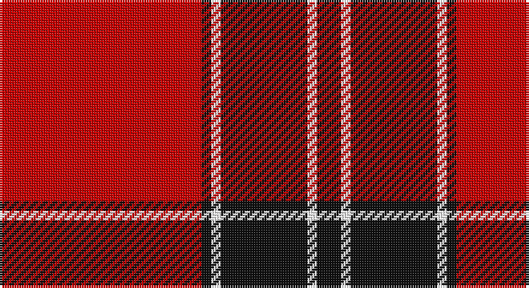

This page is one **sett** — a single exact thread-count. It belongs to the [tartan](/setts/r42k2w2k18w2k5/)
(the same proportion at any scale), whose colour order is pattern [KWKWKR](/stripes/kwkwkr/).

Part of the [Forget](/tartans/forget/) tartan — the named design grouping this sett with its other cloths.

Sourced from register-of-tartans.  It is a [6 stripe tartan](/stripes/stripes6/).

Original link https://www.tartanregister.gov.uk/tartanDetails.aspx?ref=11623

## Also known as

This cloth is also recorded under:

- Forget Family

## Register references

External register numbers recorded for this tartan.

- Scottish Register of Tartans: [11623](https://www.tartanregister.gov.uk/tartanDetails.aspx?ref=11623)

## Thread count
R/84 K4 W4 K36 W4 K/10

One full sett is **190 threads**.

## Palette

Palette: <strong>Tartan Register</strong>
<table><thead><tr><th>Colour</th><th>Threads</th><th>Shade</th><th>Base</th><th>OKLCh</th></tr></thead><tbody><tr><td>R/</td><td style="text-align:right;font-variant-numeric:tabular-nums">84</td><td><code style="background-color:#C80000;">#C80000</code> <small style="color:#888">#C80000</small></td><td>R <code style="background-color:#CC0000;">#CC0000</code></td><td><small style="color:#888">oklch(52.3% 0.215 29.2)</small></td></tr><tr><td>K</td><td style="text-align:right;font-variant-numeric:tabular-nums">4</td><td><code style="background-color:#101010;">#101010</code> <small style="color:#888">#101010</small></td><td>K <code style="background-color:#000000;">#000000</code></td><td><small style="color:#888">oklch(17.3% 0.000 89.9)</small></td></tr><tr><td>W</td><td style="text-align:right;font-variant-numeric:tabular-nums">4</td><td><code style="background-color:#FFFFFF;">#FFFFFF</code> <small style="color:#888">#FFFFFF</small></td><td>W <code style="background-color:#F7F7F7;">#F7F7F7</code></td><td><small style="color:#888">oklch(100.0% 0.000 89.9)</small></td></tr><tr><td>K</td><td style="text-align:right;font-variant-numeric:tabular-nums">36</td><td><code style="background-color:#101010;">#101010</code> <small style="color:#888">#101010</small></td><td>K <code style="background-color:#000000;">#000000</code></td><td><small style="color:#888">oklch(17.3% 0.000 89.9)</small></td></tr><tr><td>W</td><td style="text-align:right;font-variant-numeric:tabular-nums">4</td><td><code style="background-color:#FFFFFF;">#FFFFFF</code> <small style="color:#888">#FFFFFF</small></td><td>W <code style="background-color:#F7F7F7;">#F7F7F7</code></td><td><small style="color:#888">oklch(100.0% 0.000 89.9)</small></td></tr><tr><td>K/</td><td style="text-align:right;font-variant-numeric:tabular-nums">10</td><td><code style="background-color:#101010;">#101010</code> <small style="color:#888">#101010</small></td><td>K <code style="background-color:#000000;">#000000</code></td><td><small style="color:#888">oklch(17.3% 0.000 89.9)</small></td></tr></tbody></table>

# Sample pattern

## Compared to the master

This cloth is one sett of its design; the master sett (the exemplar the design is anchored on) is below for comparison.

<figure style="margin:0"><figcaption style="color:#888;font-size:smaller">this sett</figcaption></figure>
<figure style="margin:0"><figcaption style="color:#888;font-size:smaller"><a href="/setts/dg8lo1dg8lo12r1lo1/">master sett →</a></figcaption></figure>

## Nearest tartans

The nearest existing variants by ΔTartan distance, with this tartan at the top so the swatches line up against it.

ΔTartan

Tartan

Sett

—

<a href="/ttd/edit/#slug=r42k2w2k18w2k5~x2">Forget Family (Red)</a> <a class="nn-out" href="/variants/s6/r42k2w2k18w2k5~x2/" title="open its dictionary page">↗</a>

0.95

<a href="/ttd/edit/#slug=r20k2r2k15w1~x2&amp;base=r42k2w2k18w2k5~x2">Masai Shuka 15 (Artefact)</a> <a class="nn-out" href="/variants/s5/r20k2r2k15w1~x2/" title="open its dictionary page">↗</a>

0.98

<a href="/ttd/edit/#slug=lb3r3k4lb2r18k1r2k2~x4&amp;base=r42k2w2k18w2k5~x2">Lougheed</a> <a class="nn-out" href="/variants/s8/lb3r3k4lb2r18k1r2k2~x4/" title="open its dictionary page">↗</a>

0.99

<a href="/ttd/edit/#slug=r36k18r4k7w2~x2&amp;base=r42k2w2k18w2k5~x2">Hopkins (Name)</a> <a class="nn-out" href="/variants/s5/r36k18r4k7w2~x2/" title="open its dictionary page">↗</a>

1.13

<a href="/ttd/edit/#slug=k3r1k30r28k1r1w3~x2&amp;base=r42k2w2k18w2k5~x2">Cunningham</a> <a class="nn-out" href="/variants/s7/k3r1k30r28k1r1w3~x2/" title="open its dictionary page">↗</a>

1.15

<a href="/ttd/edit/#slug=k4w2k28r30k1r3~x2&amp;base=r42k2w2k18w2k5~x2">Ramsay of Dalhousie</a> <a class="nn-out" href="/variants/s6/k4w2k28r30k1r3~x2/" title="open its dictionary page">↗</a>

1.18

<a href="/ttd/edit/#slug=r22db5r2dg11r3db1&amp;base=r42k2w2k18w2k5~x2">MacKintosh D</a> <a class="nn-out" href="/variants/s6/r22db5r2dg11r3db1/" title="open its dictionary page">↗</a>

1.23

<a href="/variants/s6/r28k4w2k13~x2/">Dunbar Ancient</a>

1.25

<a href="/ttd/edit/#slug=k3r2k30r28k2r2w3~x2&amp;base=r42k2w2k18w2k5~x2">Cunningham #2</a> <a class="nn-out" href="/variants/s7/k3r2k30r28k2r2w3~x2/" title="open its dictionary page">↗</a>

1.25

<a href="/ttd/edit/#slug=r4k4r3k8w3r3k20r40w2r4&amp;base=r42k2w2k18w2k5~x2">University of South Carolina (Corp)</a> <a class="nn-out" href="/variants/s10/r4k4r3k8w3r3k20r40w2r4/" title="open its dictionary page">↗</a>

1.26

<a href="/ttd/edit/#slug=r48k12o7k5w3~x2&amp;base=r42k2w2k18w2k5~x2">Turner (Personal)</a> <a class="nn-out" href="/variants/s5/r48k12o7k5w3~x2/" title="open its dictionary page">↗</a>

## Neighbour map

Every grey dot is one of 14360 variants placed by the first two principal components of the ΔTartan feature space (44% of its variance). Red is this tartan; blue dots are its nearest — click one to open its page.

<svg viewBox="0 0 640 380" role="img" style="max-width:100%;height:auto;border:1px solid #e0e0e0;border-radius:4px;display:block" xmlns="http://www.w3.org/2000/svg"><image href="/nn/cloud.v1.png" width="640" height="380"/><a href="/variants/s5/r20k2r2k15w1~x2/"><circle cx="385.2" cy="184.7" r="4" fill="#3465a4"><title>Masai Shuka 15 (Artefact)</title></circle></a><a href="/variants/s8/lb3r3k4lb2r18k1r2k2~x4/"><circle cx="422.1" cy="156.2" r="4" fill="#3465a4"><title>Lougheed</title></circle></a><a href="/variants/s5/r36k18r4k7w2~x2/"><circle cx="398.3" cy="190.2" r="4" fill="#3465a4"><title>Hopkins (Name)</title></circle></a><a href="/variants/s7/k3r1k30r28k1r1w3~x2/"><circle cx="375.9" cy="133.9" r="4" fill="#3465a4"><title>Cunningham</title></circle></a><a href="/variants/s6/k4w2k28r30k1r3~x2/"><circle cx="369.6" cy="151.3" r="4" fill="#3465a4"><title>Ramsay of Dalhousie</title></circle></a><a href="/variants/s6/r22db5r2dg11r3db1/"><circle cx="407.5" cy="178.0" r="4" fill="#3465a4"><title>MacKintosh D</title></circle></a><a href="/variants/s6/r28k4w2k13~x2/"><circle cx="333.3" cy="177.6" r="4" fill="#3465a4"><title>Dunbar Ancient</title></circle></a><a href="/variants/s7/k3r2k30r28k2r2w3~x2/"><circle cx="349.9" cy="167.6" r="4" fill="#3465a4"><title>Cunningham #2</title></circle></a><a href="/variants/s10/r4k4r3k8w3r3k20r40w2r4/"><circle cx="401.6" cy="141.9" r="4" fill="#3465a4"><title>University of South Carolina (Corp)</title></circle></a><a href="/variants/s5/r48k12o7k5w3~x2/"><circle cx="393.7" cy="161.5" r="4" fill="#3465a4"><title>Turner (Personal)</title></circle></a><circle cx="400.0" cy="151.5" r="5" fill="#c00000"/></svg>

ID: /variants/s6/r42k2w2k18w2k5~x2/
