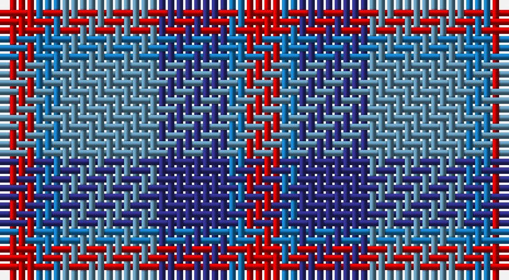

This page is one **sett** — a single exact thread-count. It belongs to the [tartan](/setts/r4b3t11db8b2r4/)
(the same proportion at any scale), whose colour order is pattern [RBBBBR](/stripes/rbbbbr/).

Sourced from tartans-authority.  It is a [6 stripe tartan](/stripes/stripes6/).

Original link http://www.tartansauthority.com/tartan-ferret/display/8244/

## Register references

External register numbers recorded for this tartan.

- Scottish Register of Tartans: [8244](https://www.tartanregister.gov.uk/tartanDetails?ref=8244)
- Scottish Tartans Authority (ITI): 8244

## Thread count
R/4 Ba3 B11 DB8 Ba2 R/4

One full sett is **56 threads**.

## Palette

Palette: <strong>Tartan Register</strong>
<table><thead><tr><th>Colour</th><th>Threads</th><th>Shade</th><th>Base</th><th>OKLCh</th></tr></thead><tbody><tr><td>R/</td><td style="text-align:right;font-variant-numeric:tabular-nums">4</td><td><code style="background-color:#C80000;">#C80000</code> <small style="color:#888">#C80000</small></td><td>R <code style="background-color:#CC0000;">#CC0000</code></td><td><small style="color:#888">oklch(52.3% 0.215 29.2)</small></td></tr><tr><td>Ba</td><td style="text-align:right;font-variant-numeric:tabular-nums">3</td><td><code style="background-color:#1474B4;">#1474B4</code> <small style="color:#888">#1474B4</small></td><td>B <code style="background-color:#2A418A;">#2A418A</code></td><td><small style="color:#888">oklch(54.0% 0.129 245.1)</small></td></tr><tr><td>B</td><td style="text-align:right;font-variant-numeric:tabular-nums">11</td><td><code style="background-color:#5C8CA8;">#5C8CA8</code> <small style="color:#888">#5C8CA8</small></td><td>B <code style="background-color:#2A418A;">#2A418A</code></td><td><small style="color:#888">oklch(61.7% 0.067 235.0)</small></td></tr><tr><td>DB</td><td style="text-align:right;font-variant-numeric:tabular-nums">8</td><td><code style="background-color:#2C2C80;">#2C2C80</code> <small style="color:#888">#2C2C80</small></td><td>B <code style="background-color:#2A418A;">#2A418A</code></td><td><small style="color:#888">oklch(35.0% 0.138 276.6)</small></td></tr><tr><td>Ba</td><td style="text-align:right;font-variant-numeric:tabular-nums">2</td><td><code style="background-color:#1474B4;">#1474B4</code> <small style="color:#888">#1474B4</small></td><td>B <code style="background-color:#2A418A;">#2A418A</code></td><td><small style="color:#888">oklch(54.0% 0.129 245.1)</small></td></tr><tr><td>R/</td><td style="text-align:right;font-variant-numeric:tabular-nums">4</td><td><code style="background-color:#C80000;">#C80000</code> <small style="color:#888">#C80000</small></td><td>R <code style="background-color:#CC0000;">#CC0000</code></td><td><small style="color:#888">oklch(52.3% 0.215 29.2)</small></td></tr></tbody></table>

# Sample pattern

## Nearest tartans

The nearest existing variants by ΔTartan distance, with this tartan at the top so the swatches line up against it.

ΔTartan

Tartan

Sett

—

<a href="/ttd/edit/#slug=r4b3t11db8b2r4">St. Edmunds (School)</a> <a class="nn-out" href="/variants/s6/r4b3t11db8b2r4/" title="open its dictionary page">↗</a>

1.08

<a href="/ttd/edit/#slug=db4lr3db4lr3m3o11m3~x2&amp;base=r4b3t11db8b2r4">Stevens #2</a> <a class="nn-out" href="/variants/s7/db4lr3db4lr3m3o11m3~x2/" title="open its dictionary page">↗</a>

1.26

<a href="/ttd/edit/#slug=r9b6dt13b21o18w4~x2&amp;base=r4b3t11db8b2r4">Fox-Eves Wedding (Personal)</a> <a class="nn-out" href="/variants/s6/r9b6dt13b21o18w4~x2/" title="open its dictionary page">↗</a>

1.29

<a href="/ttd/edit/#slug=t1dg3r1dp3t1~x4&amp;base=r4b3t11db8b2r4">Wilson's No.95</a> <a class="nn-out" href="/variants/s5/t1dg3r1dp3t1~x4/" title="open its dictionary page">↗</a>

1.32

<a href="/variants/s6/r4ni3n12db8ni2r4/">Bristol Gramar School Check (School)</a>

1.34

<a href="/ttd/edit/#slug=r5o20dt13db42dt13o20lo5&amp;base=r4b3t11db8b2r4">Newmill Corporate Tartan</a> <a class="nn-out" href="/variants/s7/r5o20dt13db42dt13o20lo5/" title="open its dictionary page">↗</a>

1.42

<a href="/ttd/edit/#slug=t1g3r1p3t1~x4&amp;base=r4b3t11db8b2r4">Wilson's, No 95</a> <a class="nn-out" href="/variants/s5/t1g3r1p3t1~x4/" title="open its dictionary page">↗</a>

1.44

<a href="/ttd/edit/#slug=r9dt6db13dt21y18w4~x2&amp;base=r4b3t11db8b2r4">Fox-Eves Wedding</a> <a class="nn-out" href="/variants/s6/r9dt6db13dt21y18w4~x2/" title="open its dictionary page">↗</a>

1.59

<a href="/ttd/edit/#slug=r2dbi11r3dbi11t12db10w2~x2&amp;base=r4b3t11db8b2r4">Blue Family Tartan</a> <a class="nn-out" href="/variants/s7/r2dbi11r3dbi11t12db10w2~x2/" title="open its dictionary page">↗</a>

1.60

<a href="/ttd/edit/#slug=db1n8w1db4m8w1~x6&amp;base=r4b3t11db8b2r4">Little's Chauffeur Drive</a> <a class="nn-out" href="/variants/s6/db1n8w1db4m8w1~x6/" title="open its dictionary page">↗</a>

1.64

<a href="/ttd/edit/#slug=r2b1db8b8o8b1o1~x2&amp;base=r4b3t11db8b2r4">Over Mountain</a> <a class="nn-out" href="/variants/s7/r2b1db8b8o8b1o1~x2/" title="open its dictionary page">↗</a>

## Neighbour map

Every grey dot is one of 14360 variants placed by the first two principal components of the ΔTartan feature space (44% of its variance). Red is this tartan; blue dots are its nearest — click one to open its page.

<svg viewBox="0 0 640 380" role="img" style="max-width:100%;height:auto;border:1px solid #e0e0e0;border-radius:4px;display:block" xmlns="http://www.w3.org/2000/svg"><image href="/nn/cloud.v1.png" width="640" height="380"/><a href="/variants/s7/db4lr3db4lr3m3o11m3~x2/"><circle cx="122.9" cy="253.8" r="4" fill="#3465a4"><title>Stevens #2</title></circle></a><a href="/variants/s6/r9b6dt13b21o18w4~x2/"><circle cx="131.5" cy="258.4" r="4" fill="#3465a4"><title>Fox-Eves Wedding (Personal)</title></circle></a><a href="/variants/s5/t1dg3r1dp3t1~x4/"><circle cx="128.8" cy="296.7" r="4" fill="#3465a4"><title>Wilson's No.95</title></circle></a><a href="/variants/s6/r4ni3n12db8ni2r4/"><circle cx="197.3" cy="266.6" r="4" fill="#3465a4"><title>Bristol Gramar School Check (School)</title></circle></a><a href="/variants/s7/r5o20dt13db42dt13o20lo5/"><circle cx="177.0" cy="219.4" r="4" fill="#3465a4"><title>Newmill Corporate Tartan</title></circle></a><a href="/variants/s5/t1g3r1p3t1~x4/"><circle cx="123.8" cy="289.4" r="4" fill="#3465a4"><title>Wilson's, No 95</title></circle></a><a href="/variants/s6/r9dt6db13dt21y18w4~x2/"><circle cx="123.0" cy="255.8" r="4" fill="#3465a4"><title>Fox-Eves Wedding</title></circle></a><a href="/variants/s7/r2dbi11r3dbi11t12db10w2~x2/"><circle cx="168.3" cy="240.1" r="4" fill="#3465a4"><title>Blue Family Tartan</title></circle></a><a href="/variants/s6/db1n8w1db4m8w1~x6/"><circle cx="208.2" cy="229.9" r="4" fill="#3465a4"><title>Little's Chauffeur Drive</title></circle></a><a href="/variants/s7/r2b1db8b8o8b1o1~x2/"><circle cx="170.9" cy="207.6" r="4" fill="#3465a4"><title>Over Mountain</title></circle></a><circle cx="157.5" cy="262.0" r="5" fill="#c00000"/></svg>

ID: /variants/s6/r4b3t11db8b2r4/
