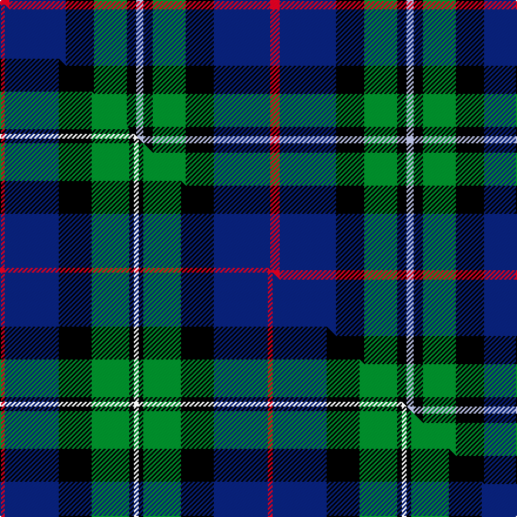

This is one **variant** — a specific cloth: this exact thread count and colourway, with its own
provenance below. It is one weaving of the [sett](/setts/r4db24k12g14k4lb3/) (the scale-free proportion — the
same cloth at any scale or shade), whose colour order is pattern [RBKGKW](/stripes/rbkgkw/).

Part of the [MacPhail Hunting](/tartans/m/ma/macphail-hunting/) tartan — the named design grouping this sett with its other cloths.

Sourced from register-of-tartans.  It is a [6 stripe tartan](/stripes/stripes6/).

Original link [https://www.tartanregister.gov.uk/tartanDetails.aspx?ref=2698](https://www.tartanregister.gov.uk/tartanDetails.aspx?ref=2698)

2 attestations — the source records this cloth was collapsed from (oldest owns this page)

<ul>
<li>01/01/1880 — MacPhail Hunting #2 (register-of-tartans, <a href="https://www.tartanregister.gov.uk/tartanDetails.aspx?ref=2698">record</a>)  <em>In Clan Originaux (1880) as 'Macphail' with the thread count: R8 B48 K24 G28 K8 LN6 (LN = light neutral[grey]). Scottish Tartans Society also has a threadcount taken from a woven sample in the MacGregor Hastie collection: R4 B46 K28 G32 K4 W4 There is also another entry with exactly the same threadcount and the comments: 'A modern interpretation of the MacPhail tartan in hunting colours produced for the whisky merchants, Gordon and MacPhail, by the weaving firm, Johnstons of Elgin.' Johnstons state (February 2006) that this is in fact the normal MacPhail rendered in slightly different shades.</em></li>
<li>1880 — MacPhail Htg (tartans-authority, <a href="https://www.tartanregister.gov.uk/tartanDetails.aspx?ref=2158">record</a>)  <em>In Clan Originaux as 'Macphail'. with this thread count: R8 B48 K24 G28 K8 LN6 (LN = light neutral[grey]). STS also has 1367 from MacGregor Hastie with a count of R4 B46 K28 G32 K4 W4 and then it has 2158 with exactly the same count and the comments: "A modern interpretation of the MacPhail tartan in hunting colours produced for the whisky merchants, Gordon and MacPhail, by the weaving firm, Johnstons of Elgin. " Johnstons state (Feb 2006) that this is in fact the normal MacPhail rendered in slightly different shades. Sample in STA's Collection.</em></li>
</ul>

Dataset <small>— provenance for this record, inherited from the source manifest</small>

<dl class="dataset-prov">
<dt>source</dt><dd><a href="/sources/register-of-tartans/">Scottish Register of Tartans</a></dd>
<dt>data captured from</dt><dd><a href="https://github.com/thetartan/tartan-database/blob/master/data/register-of-tartans/data.csv">https://github.com/thetartan/tartan-database/blob/master/data/register-of-tartans/data.csv</a></dd>
<dt>data date</dt><dd>1880 <small>(this record)</small></dd>
<dt>licence</dt><dd><a href="https://www.tartanregister.gov.uk/copyright">Crown copyright</a></dd>
</dl>

Capture chain <small>— the hands this data passed through, oldest first; each capture carries its own licence</small>

<ol class="capture-chain">
<li><a href="https://www.tartanregister.gov.uk/">Scottish Register of Tartans</a> · <a href="https://www.tartanregister.gov.uk/copyright">Crown copyright</a> <small>the living register — still published by National Records of Scotland</small></li>
<li><a href="https://github.com/thetartan/tartan-database">thetartan/tartan-database</a> <small>2016-2017</small> · <a href="https://creativecommons.org/licenses/by-nc-nd/4.0/">CC BY-NC-ND 4.0</a> <small>Levko Kravets's frozen compilation — the capture we vendored, and where its CC licence text came from</small></li>
<li>this dictionary <small>captured 2026-06-10 · commit 5bf86c7566</small> <small>each re-capture is a git commit to data/sources</small></li>
</ol>

## Register references

External register numbers recorded for this tartan.

- Scottish Register of Tartans: [2698](https://www.tartanregister.gov.uk/tartanDetails.aspx?ref=2698)
- Scottish Tartans Authority (ITI): 2158
- Scottish Tartans World Register: 2158

## Thread count
R/8 DB48 K24 G28 K8 LB/6

One full sett is **230 threads**.

## Palette
<table><thead><tr><th>Colour</th><th>Shade</th><th>OKLCh</th></tr></thead><tbody><tr><td>DB</td><td><code style="background-color:#082077;">#082077</code> <small style="color:#888">#082077</small></td><td><small style="color:#888">oklch(30.0% 0.149 265.1)</small></td></tr><tr><td>G</td><td><code style="background-color:#008B2A;">#008B2A</code> <small style="color:#888">#008B2A</small></td><td><small style="color:#888">oklch(55.4% 0.170 145.9)</small></td></tr><tr><td>K</td><td><code style="background-color:#000000;">#000000</code> <small style="color:#888">#000000</small></td><td><small style="color:#888">oklch(0.0% 0.000 0.0)</small></td></tr><tr><td>LB</td><td><code style="background-color:#B5BBDE;">#B5BBDE</code> <small style="color:#888">#B5BBDE</small></td><td><small style="color:#888">oklch(79.9% 0.050 277.6)</small></td></tr><tr><td>R</td><td><code style="background-color:#D60020;">#D60020</code> <small style="color:#888">#D60020</small></td><td><small style="color:#888">oklch(55.2% 0.224 25.5)</small></td></tr></tbody></table>

# Sample pattern

## Compared to the master

This cloth is one sett of its design; the master sett (the exemplar the design is anchored on) is below for comparison.

Its **ΔTartan distance** from the master is **0.72** — the same measure the nearest-tartans table ranks by (0 is identical; a re-scale of the same cloth is near 0, a recolour or a different proportion further).

<figure class="master-compare" style="margin:0">

this sett
master sett ★

<figcaption style="color:#888;font-size:smaller">One weave of this sett against the <a href="/setts/r2db23k14g16k2w2/">master sett ★</a>, split on the diagonal: a shared proportion runs seamlessly across it with only the shades shifting; a different proportion breaks on it.</figcaption>
</figure>

## Nearest tartan variants

The nearest existing variants by ΔTartan distance, with this cloth at the top so the swatches line up against it.

ΔTartan

Threads

Variant

Sett

—

230

<a href="/variants/s6/r4db24k12g14k4lb3~x2/">MacPhail Hunting #2</a>

<a href="/ttd/edit/#slug=r2db23k14g16k2w2~x2&amp;base=r4db24k12g14k4lb3~x2" title="compare in the TTD">0.72</a>

228

<a href="/variants/s6/r2db23k14g16k2w2~x2/">MacPhail Hunting Clan Tartan</a>

<a href="/ttd/edit/#slug=r3k2g15k10db20y2~x2&amp;base=r4db24k12g14k4lb3~x2" title="compare in the TTD">1.01</a>

198

<a href="/variants/s6/r3k2g15k10db20y2~x2/">MacLeod of Assynt Clan Tartan</a>

<a href="/ttd/edit/#slug=dr1k1g6k6db6lr1~x4&amp;base=r4db24k12g14k4lb3~x2" title="compare in the TTD">1.07</a>

160

<a href="/variants/s6/dr1k1g6k6db6lr1~x4/">Gaines Center for the Humanities</a>

<a href="/ttd/edit/#slug=y3k2g12k12db14w3~x2&amp;base=r4db24k12g14k4lb3~x2" title="compare in the TTD">1.08</a>

172

<a href="/variants/s6/y3k2g12k12db14w3~x2/">MacNeil Clan Tartan</a>

<a href="/ttd/edit/#slug=y3k2g12k12db14w3&amp;base=r4db24k12g14k4lb3~x2" title="compare in the TTD">1.08</a>

86

<a href="/variants/s6/y3k2g12k12db14w3/">MacNeil of Barra</a>

<a href="/ttd/edit/#slug=k1g8w1k8db8r1~x4&amp;base=r4db24k12g14k4lb3~x2" title="compare in the TTD">1.09</a>

208

<a href="/variants/s6/k1g8w1k8db8r1~x4/">Leslie Hunting</a>

<a href="/ttd/edit/#slug=k1g8w1k8db8r1~x4~db1004274&amp;base=r4db24k12g14k4lb3~x2" title="compare in the TTD">1.09</a>

208

<a href="/variants/s6/k1g8w1k8db8r1~x4~db1004274/">Syme</a>

<a href="/ttd/edit/#slug=y1k1g9k9db8w1~x4&amp;base=r4db24k12g14k4lb3~x2" title="compare in the TTD">1.16</a>

224

<a href="/variants/s6/y1k1g9k9db8w1~x4/">MacNeil 4</a>

<a href="/ttd/edit/#slug=k2g11y1k8db9r2~x4&amp;base=r4db24k12g14k4lb3~x2" title="compare in the TTD">1.21</a>

248

<a href="/variants/s6/k2g11y1k8db9r2~x4/">Forsyth Clan Tartan</a>

<a href="/ttd/edit/#slug=r2db8k8w1g8k1&amp;base=r4db24k12g14k4lb3~x2" title="compare in the TTD">1.22</a>

53

<a href="/variants/s6/r2db8k8w1g8k1/">Leslie Hunting</a>

## Neighbour map

Every grey dot is one of 13621 variants placed by the first two principal components of the ΔTartan feature space (42% of its variance). Red is this tartan; blue dots are its nearest — click one to open its page.

<svg viewBox="0 0 640 380" role="img" style="max-width:100%;height:auto;border:1px solid #e0e0e0;border-radius:4px;display:block" xmlns="http://www.w3.org/2000/svg"><image href="/nn/cloud.v1.png" width="640" height="380"/><a href="/variants/s6/r2db23k14g16k2w2~x2/"><circle cx="152.7" cy="176.3" r="4" fill="#3465a4"><title>MacPhail Hunting Clan Tartan</title></circle></a><a href="/variants/s6/r3k2g15k10db20y2~x2/"><circle cx="146.8" cy="186.2" r="4" fill="#3465a4"><title>MacLeod of Assynt Clan Tartan</title></circle></a><a href="/variants/s6/dr1k1g6k6db6lr1~x4/"><circle cx="100.0" cy="213.3" r="4" fill="#3465a4"><title>Gaines Center for the Humanities</title></circle></a><a href="/variants/s6/y3k2g12k12db14w3~x2/"><circle cx="77.0" cy="212.4" r="4" fill="#3465a4"><title>MacNeil Clan Tartan</title></circle></a><a href="/variants/s6/y3k2g12k12db14w3/"><circle cx="77.0" cy="212.4" r="4" fill="#3465a4"><title>MacNeil of Barra</title></circle></a><a href="/variants/s6/k1g8w1k8db8r1~x4/"><circle cx="109.4" cy="194.1" r="4" fill="#3465a4"><title>Leslie Hunting</title></circle></a><a href="/variants/s6/k1g8w1k8db8r1~x4~db1004274/"><circle cx="111.9" cy="193.8" r="4" fill="#3465a4"><title>Syme</title></circle></a><a href="/variants/s6/y1k1g9k9db8w1~x4/"><circle cx="121.1" cy="190.1" r="4" fill="#3465a4"><title>MacNeil 4</title></circle></a><a href="/variants/s6/k2g11y1k8db9r2~x4/"><circle cx="118.9" cy="190.3" r="4" fill="#3465a4"><title>Forsyth Clan Tartan</title></circle></a><a href="/variants/s6/r2db8k8w1g8k1/"><circle cx="95.7" cy="199.1" r="4" fill="#3465a4"><title>Leslie Hunting</title></circle></a><circle cx="132.3" cy="198.9" r="5" fill="#c00000"/><text x="320" y="376" text-anchor="middle" font-size="11" fill="#999">ground</text><text x="11" y="190" text-anchor="middle" font-size="11" fill="#999" transform="rotate(-90 11 190)">complexity</text></svg>

ID: /variants/s6/r4db24k12g14k4lb3~x2/
