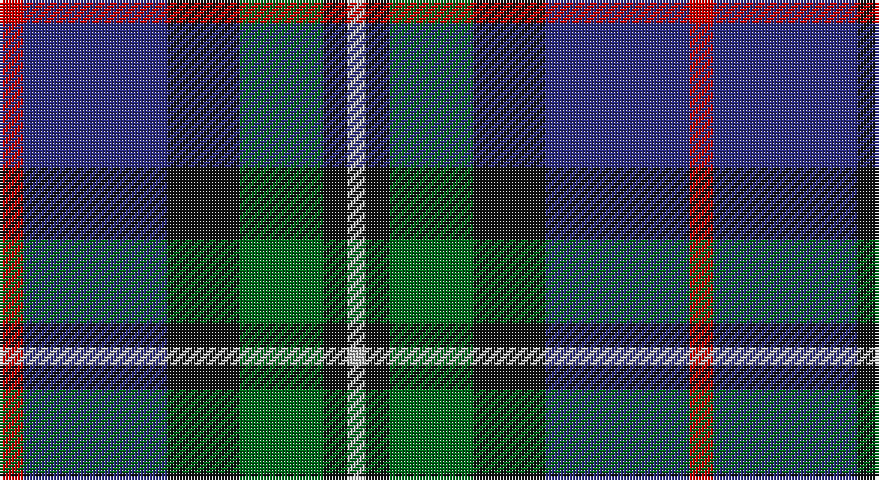

This page is one **sett** — a single exact thread-count. It belongs to the [tartan](/setts/r4db24k12g14k4lb3/)
(the same proportion at any scale), whose colour order is pattern [RBKGKW](/stripes/rbkgkw/).

Part of the [MacPhail Hunting](/tartans/macphail-hunting/) tartan — the named design grouping this sett with its other cloths.

Sourced from register-of-tartans.  It is a [6 stripe tartan](/stripes/stripes6/).

Original link https://www.tartanregister.gov.uk/tartanDetails.aspx?ref=2698

## Also known as

This cloth is also recorded under:

- MacPhail Htg
- MacPhail Hunting #2
- MacPhail, hunting

2 attestations — the source records this cloth was collapsed from (oldest owns this page)

<ul>
<li>01/01/1880 — MacPhail Hunting #2 (register-of-tartans, <a href="https://www.tartanregister.gov.uk/tartanDetails.aspx?ref=2698">record</a>)</li>
<li>1880 — MacPhail Htg (tartans-authority, <a href="http://www.tartansauthority.com/tartan-ferret/display/2158/">record</a>)</li>
</ul>

## Register references

External register numbers recorded for this tartan.

- Scottish Register of Tartans: [2698](https://www.tartanregister.gov.uk/tartanDetails.aspx?ref=2698)
- Scottish Tartans Authority (ITI): 2158
- Scottish Tartans World Register: 2158

## Thread count
R/8 DB48 K24 G28 K8 N/6

One full sett is **230 threads**.

## Palette

Palette: <strong>Tartan Register</strong>
<table><thead><tr><th>Colour</th><th>Threads</th><th>Shade</th><th>Base</th><th>OKLCh</th></tr></thead><tbody><tr><td>R/</td><td style="text-align:right;font-variant-numeric:tabular-nums">8</td><td><code style="background-color:#C80000;">#C80000</code> <small style="color:#888">#C80000</small></td><td>R <code style="background-color:#CC0000;">#CC0000</code></td><td><small style="color:#888">oklch(52.3% 0.215 29.2)</small></td></tr><tr><td>DB</td><td style="text-align:right;font-variant-numeric:tabular-nums">48</td><td><code style="background-color:#2C2C80;">#2C2C80</code> <small style="color:#888">#2C2C80</small></td><td>B <code style="background-color:#2A418A;">#2A418A</code></td><td><small style="color:#888">oklch(35.0% 0.138 276.6)</small></td></tr><tr><td>K</td><td style="text-align:right;font-variant-numeric:tabular-nums">24</td><td><code style="background-color:#101010;">#101010</code> <small style="color:#888">#101010</small></td><td>K <code style="background-color:#000000;">#000000</code></td><td><small style="color:#888">oklch(17.3% 0.000 89.9)</small></td></tr><tr><td>G</td><td style="text-align:right;font-variant-numeric:tabular-nums">28</td><td><code style="background-color:#006818;">#006818</code> <small style="color:#888">#006818</small></td><td>G <code style="background-color:#006100;">#006100</code></td><td><small style="color:#888">oklch(45.0% 0.142 145.0)</small></td></tr><tr><td>K</td><td style="text-align:right;font-variant-numeric:tabular-nums">8</td><td><code style="background-color:#101010;">#101010</code> <small style="color:#888">#101010</small></td><td>K <code style="background-color:#000000;">#000000</code></td><td><small style="color:#888">oklch(17.3% 0.000 89.9)</small></td></tr><tr><td>N/</td><td style="text-align:right;font-variant-numeric:tabular-nums">6</td><td><code style="background-color:#C0C0C0;">#C0C0C0</code> <small style="color:#888">#C0C0C0</small></td><td>W <code style="background-color:#F7F7F7;">#F7F7F7</code></td><td><small style="color:#888">oklch(80.8% 0.000 89.9)</small></td></tr></tbody></table>

# Sample pattern

## Compared to the master

This cloth is one sett of its design; the master sett (the exemplar the design is anchored on) is below for comparison.

<figure style="margin:0"><figcaption style="color:#888;font-size:smaller">this sett</figcaption></figure>
<figure style="margin:0"><figcaption style="color:#888;font-size:smaller"><a href="/setts/r2db23k14dg16k2w2/">master sett →</a></figcaption></figure>

## Nearest tartans

The nearest existing variants by ΔTartan distance, with this tartan at the top so the swatches line up against it.

ΔTartan

Tartan

Sett

—

<a href="/ttd/edit/#slug=r4db24k12g14k4lb3~x2">MacPhail Hunting #2</a> <a class="nn-out" href="/variants/s6/r4db24k12g14k4lb3~x2/" title="open its dictionary page">↗</a>

0.64

<a href="/ttd/edit/#slug=db22w2k10g11r3g4~x2&amp;base=r4db24k12g14k4lb3~x2">Paterson Blue (Personal)</a> <a class="nn-out" href="/variants/s6/db22w2k10g11r3g4~x2/" title="open its dictionary page">↗</a>

0.64

<a href="/ttd/edit/#slug=k4t3dp11dg14w2~x2&amp;base=r4db24k12g14k4lb3~x2">Wellington No 229</a> <a class="nn-out" href="/variants/s5/k4t3dp11dg14w2~x2/" title="open its dictionary page">↗</a>

0.65

<a href="/ttd/edit/#slug=db15r6dg8k2w2k2~x6&amp;base=r4db24k12g14k4lb3~x2">Stovell (2015)</a> <a class="nn-out" href="/variants/s6/db15r6dg8k2w2k2~x6/" title="open its dictionary page">↗</a>

0.66

<a href="/ttd/edit/#slug=k4b21dy10y4k20r6b3~x2&amp;base=r4db24k12g14k4lb3~x2">Swankie (Personal)</a> <a class="nn-out" href="/variants/s7/k4b21dy10y4k20r6b3~x2/" title="open its dictionary page">↗</a>

0.66

<a href="/ttd/edit/#slug=g16lb3g3k10db12r2db3~x2&amp;base=r4db24k12g14k4lb3~x2">MacLean, Donald (Personal)</a> <a class="nn-out" href="/variants/s7/g16lb3g3k10db12r2db3~x2/" title="open its dictionary page">↗</a>

0.71

<a href="/ttd/edit/#slug=m5g20k13db42k13g20ly5~x2&amp;base=r4db24k12g14k4lb3~x2">Newmill</a> <a class="nn-out" href="/variants/s7/m5g20k13db42k13g20ly5~x2/" title="open its dictionary page">↗</a>

0.73

<a href="/ttd/edit/#slug=k4w1g10k10db10r2~x2&amp;base=r4db24k12g14k4lb3~x2">Rose Hunting Clan Tartan</a> <a class="nn-out" href="/variants/s6/k4w1g10k10db10r2~x2/" title="open its dictionary page">↗</a>

0.74

<a href="/ttd/edit/#slug=db31b4db5k19g20lo4~x2&amp;base=r4db24k12g14k4lb3~x2">Midlothian</a> <a class="nn-out" href="/variants/s6/db31b4db5k19g20lo4~x2/" title="open its dictionary page">↗</a>

0.74

<a href="/ttd/edit/#slug=k4w1g10k10db10r2~x4&amp;base=r4db24k12g14k4lb3~x2">Rose Hunting</a> <a class="nn-out" href="/variants/s6/k4w1g10k10db10r2~x4/" title="open its dictionary page">↗</a>

0.74

<a href="/ttd/edit/#slug=dg5db2dg9dbi19dr9ly2~x2&amp;base=r4db24k12g14k4lb3~x2">Lyle and Scott</a> <a class="nn-out" href="/variants/s6/dg5db2dg9dbi19dr9ly2~x2/" title="open its dictionary page">↗</a>

## Neighbour map

Every grey dot is one of 14360 variants placed by the first two principal components of the ΔTartan feature space (44% of its variance). Red is this tartan; blue dots are its nearest — click one to open its page.

<svg viewBox="0 0 640 380" role="img" style="max-width:100%;height:auto;border:1px solid #e0e0e0;border-radius:4px;display:block" xmlns="http://www.w3.org/2000/svg"><image href="/nn/cloud.v1.png" width="640" height="380"/><a href="/variants/s6/db22w2k10g11r3g4~x2/"><circle cx="203.8" cy="205.8" r="4" fill="#3465a4"><title>Paterson Blue (Personal)</title></circle></a><a href="/variants/s5/k4t3dp11dg14w2~x2/"><circle cx="172.9" cy="232.2" r="4" fill="#3465a4"><title>Wellington No 229</title></circle></a><a href="/variants/s6/db15r6dg8k2w2k2~x6/"><circle cx="182.0" cy="211.7" r="4" fill="#3465a4"><title>Stovell (2015)</title></circle></a><a href="/variants/s7/k4b21dy10y4k20r6b3~x2/"><circle cx="147.2" cy="214.6" r="4" fill="#3465a4"><title>Swankie (Personal)</title></circle></a><a href="/variants/s7/g16lb3g3k10db12r2db3~x2/"><circle cx="164.3" cy="216.4" r="4" fill="#3465a4"><title>MacLean, Donald (Personal)</title></circle></a><a href="/variants/s7/m5g20k13db42k13g20ly5~x2/"><circle cx="163.1" cy="221.8" r="4" fill="#3465a4"><title>Newmill</title></circle></a><a href="/variants/s6/k4w1g10k10db10r2~x2/"><circle cx="170.5" cy="226.5" r="4" fill="#3465a4"><title>Rose Hunting Clan Tartan</title></circle></a><a href="/variants/s6/db31b4db5k19g20lo4~x2/"><circle cx="191.0" cy="227.8" r="4" fill="#3465a4"><title>Midlothian</title></circle></a><a href="/variants/s6/k4w1g10k10db10r2~x4/"><circle cx="166.4" cy="224.3" r="4" fill="#3465a4"><title>Rose Hunting</title></circle></a><a href="/variants/s6/dg5db2dg9dbi19dr9ly2~x2/"><circle cx="202.9" cy="222.8" r="4" fill="#3465a4"><title>Lyle and Scott</title></circle></a><circle cx="172.4" cy="221.9" r="5" fill="#c00000"/></svg>

ID: /variants/s6/r4db24k12g14k4lb3~x2/
