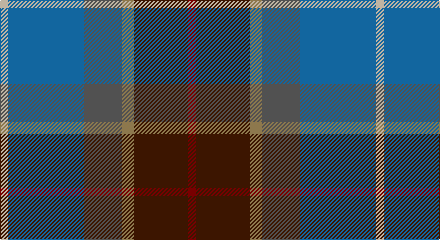

This page is one **sett** — a single exact thread-count. It belongs to the [tartan](/setts/r4do27lo6n19b38lb4/)
(the same proportion at any scale), whose colour order is pattern [RBYBBW](/stripes/rbybbw/).

Sourced from tartans-authority.  It is a [6 stripe tartan](/stripes/stripes6/).

Original link http://www.tartansauthority.com/tartan-ferret/display/8636/

## Register references

External register numbers recorded for this tartan.

- Scottish Register of Tartans: [8636](https://www.tartanregister.gov.uk/tartanDetails?ref=8636)
- Scottish Tartans Authority (ITI): 8636

## Thread count
LR/8 B76 N38 LT12 DR54 DRa/8

One full sett is **376 threads**.

## Palette

Palette: <strong>Tartan Register</strong> <small style="color:#888">(5 of 6 colours)</small>
<table><thead><tr><th>Colour</th><th>Threads</th><th>Shade</th><th>Base</th><th>OKLCh</th></tr></thead><tbody><tr><td>LR/</td><td style="text-align:right;font-variant-numeric:tabular-nums">8</td><td><code style="background-color:#E8CCB8;">#E8CCB8</code> <small style="color:#888">#E8CCB8</small></td><td>W <code style="background-color:#F7F7F7;">#F7F7F7</code></td><td><small style="color:#888">oklch(86.3% 0.042 57.7)</small></td></tr><tr><td>B</td><td style="text-align:right;font-variant-numeric:tabular-nums">76</td><td><code style="background-color:#1474B4;">#1474B4</code> <small style="color:#888">#1474B4</small></td><td>B <code style="background-color:#2A418A;">#2A418A</code></td><td><small style="color:#888">oklch(54.0% 0.129 245.1)</small></td></tr><tr><td>N</td><td style="text-align:right;font-variant-numeric:tabular-nums">38</td><td><code style="background-color:#5C5C5C;">#5C5C5C</code> <small style="color:#888">#5C5C5C</small></td><td>B <code style="background-color:#2A418A;">#2A418A</code></td><td><small style="color:#888">oklch(47.5% 0.000 89.9)</small></td></tr><tr><td>LT</td><td style="text-align:right;font-variant-numeric:tabular-nums">12</td><td><code style="background-color:#A08858;">#A08858</code> <small style="color:#888">#A08858</small></td><td>Y <code style="background-color:#F2BF00;">#F2BF00</code></td><td><small style="color:#888">oklch(63.7% 0.071 84.0)</small></td></tr><tr><td>DR</td><td style="text-align:right;font-variant-numeric:tabular-nums">54</td><td><code style="background-color:#441800;">#441800</code> <small style="color:#888">#441800</small></td><td>B <code style="background-color:#2A418A;">#2A418A</code></td><td><small style="color:#888">oklch(27.3% 0.076 46.3)</small></td></tr><tr><td>DRa/</td><td style="text-align:right;font-variant-numeric:tabular-nums">8</td><td><code style="background-color:#880000;">#880000</code> <small style="color:#888">#880000</small></td><td>R <code style="background-color:#CC0000;">#CC0000</code></td><td><small style="color:#888">oklch(39.4% 0.162 29.2)</small></td></tr></tbody></table>

# Sample pattern

## Nearest tartans

The nearest existing variants by ΔTartan distance, with this tartan at the top so the swatches line up against it.

ΔTartan

Tartan

Sett

—

<a href="/ttd/edit/#slug=r4do27lo6n19b38lb4~x2">State Seal of Michigan (Fashion)</a> <a class="nn-out" href="/variants/s6/r4do27lo6n19b38lb4~x2/" title="open its dictionary page">↗</a>

0.85

<a href="/ttd/edit/#slug=t15k10dt30o11w3lg5~x2&amp;base=r4do27lo6n19b38lb4~x2">McHale, Barry</a> <a class="nn-out" href="/variants/s6/t15k10dt30o11w3lg5~x2/" title="open its dictionary page">↗</a>

0.92

<a href="/ttd/edit/#slug=r3w2y7n25k8y15dg2~x2&amp;base=r4do27lo6n19b38lb4~x2">Allman-Jones (Personal)</a> <a class="nn-out" href="/variants/s7/r3w2y7n25k8y15dg2~x2/" title="open its dictionary page">↗</a>

0.97

<a href="/ttd/edit/#slug=r3w2o7n25k8o15dg2~x2&amp;base=r4do27lo6n19b38lb4~x2">Allman-Jones (Personal)</a> <a class="nn-out" href="/variants/s7/r3w2o7n25k8o15dg2~x2/" title="open its dictionary page">↗</a>

0.98

<a href="/ttd/edit/#slug=o3db1o11w1k5n14lo3~x4&amp;base=r4do27lo6n19b38lb4~x2">Glen Lyon (Fashion)</a> <a class="nn-out" href="/variants/s7/o3db1o11w1k5n14lo3~x4/" title="open its dictionary page">↗</a>

1.06

<a href="/ttd/edit/#slug=w3dbi17dy16db2dg17ly2~x2&amp;base=r4do27lo6n19b38lb4~x2">Atlantic Ancient Trade Tartan</a> <a class="nn-out" href="/variants/s6/w3dbi17dy16db2dg17ly2~x2/" title="open its dictionary page">↗</a>

1.07

<a href="/ttd/edit/#slug=db30ly3dy11ly3y33r6~x2&amp;base=r4do27lo6n19b38lb4~x2">Balfour</a> <a class="nn-out" href="/variants/s6/db30ly3dy11ly3y33r6~x2/" title="open its dictionary page">↗</a>

1.08

<a href="/ttd/edit/#slug=w3db17o16dbi2dg17ly2~x2&amp;base=r4do27lo6n19b38lb4~x2">Atlantic, Ancient</a> <a class="nn-out" href="/variants/s6/w3db17o16dbi2dg17ly2~x2/" title="open its dictionary page">↗</a>

1.08

<a href="/ttd/edit/#slug=k1ly1db8g10dbi7w1~x2&amp;base=r4do27lo6n19b38lb4~x2">Porteous Family Tartan</a> <a class="nn-out" href="/variants/s6/k1ly1db8g10dbi7w1~x2/" title="open its dictionary page">↗</a>

1.08

<a href="/ttd/edit/#slug=r1o5dt3dti11dt3o5lo1~x8&amp;base=r4do27lo6n19b38lb4~x2">Newmill</a> <a class="nn-out" href="/variants/s7/r1o5dt3dti11dt3o5lo1~x8/" title="open its dictionary page">↗</a>

1.11

<a href="/ttd/edit/#slug=m4db2t7db20k7g10ly4~x2&amp;base=r4do27lo6n19b38lb4~x2">Renfrewshire District Tartan</a> <a class="nn-out" href="/variants/s7/m4db2t7db20k7g10ly4~x2/" title="open its dictionary page">↗</a>

## Neighbour map

Every grey dot is one of 14360 variants placed by the first two principal components of the ΔTartan feature space (44% of its variance). Red is this tartan; blue dots are its nearest — click one to open its page.

<svg viewBox="0 0 640 380" role="img" style="max-width:100%;height:auto;border:1px solid #e0e0e0;border-radius:4px;display:block" xmlns="http://www.w3.org/2000/svg"><image href="/nn/cloud.v1.png" width="640" height="380"/><a href="/variants/s6/t15k10dt30o11w3lg5~x2/"><circle cx="154.3" cy="193.6" r="4" fill="#3465a4"><title>McHale, Barry</title></circle></a><a href="/variants/s7/r3w2y7n25k8y15dg2~x2/"><circle cx="213.8" cy="174.7" r="4" fill="#3465a4"><title>Allman-Jones (Personal)</title></circle></a><a href="/variants/s7/r3w2o7n25k8o15dg2~x2/"><circle cx="205.8" cy="168.8" r="4" fill="#3465a4"><title>Allman-Jones (Personal)</title></circle></a><a href="/variants/s7/o3db1o11w1k5n14lo3~x4/"><circle cx="181.2" cy="164.7" r="4" fill="#3465a4"><title>Glen Lyon (Fashion)</title></circle></a><a href="/variants/s6/w3dbi17dy16db2dg17ly2~x2/"><circle cx="132.5" cy="207.4" r="4" fill="#3465a4"><title>Atlantic Ancient Trade Tartan</title></circle></a><a href="/variants/s6/db30ly3dy11ly3y33r6~x2/"><circle cx="213.9" cy="197.6" r="4" fill="#3465a4"><title>Balfour</title></circle></a><a href="/variants/s6/w3db17o16dbi2dg17ly2~x2/"><circle cx="119.5" cy="198.7" r="4" fill="#3465a4"><title>Atlantic, Ancient</title></circle></a><a href="/variants/s6/k1ly1db8g10dbi7w1~x2/"><circle cx="165.0" cy="202.4" r="4" fill="#3465a4"><title>Porteous Family Tartan</title></circle></a><a href="/variants/s7/r1o5dt3dti11dt3o5lo1~x8/"><circle cx="205.9" cy="209.3" r="4" fill="#3465a4"><title>Newmill</title></circle></a><a href="/variants/s7/m4db2t7db20k7g10ly4~x2/"><circle cx="139.0" cy="184.8" r="4" fill="#3465a4"><title>Renfrewshire District Tartan</title></circle></a><circle cx="173.6" cy="196.3" r="5" fill="#c00000"/></svg>

ID: /variants/s6/r4do27lo6n19b38lb4~x2/
