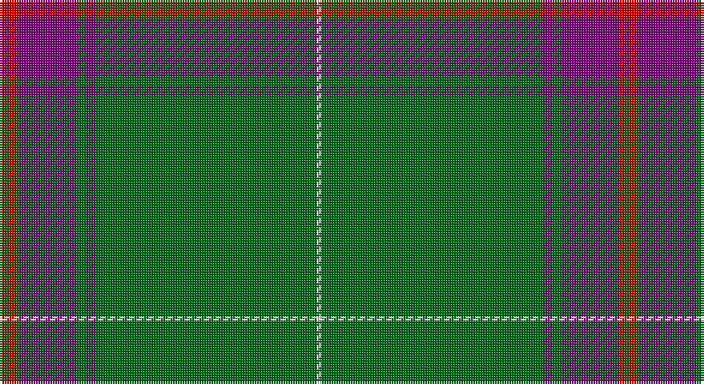

This page is one **sett** — a single exact thread-count. It belongs to the [tartan](/setts/r4dp12g2dp2g46w1/)
(the same proportion at any scale), whose colour order is pattern [RBGBGW](/stripes/rbgbgw/).

Part of the [Kinfauns Castle](/tartans/kinfauns-castle/) tartan — the named design grouping this sett with its other cloths.

Sourced from tartans-authority.  It is a [6 stripe tartan](/stripes/stripes6/).

Original link http://www.tartansauthority.com/tartan-ferret/display/2535/

## Register references

External register numbers recorded for this tartan.

- Scottish Tartans Authority (ITI): 2535

## Thread count
R/8 P24 G4 P4 G92 LN/2

One full sett is **258 threads**.

## Palette

Palette: <strong>Tartan Register</strong>
<table><thead><tr><th>Colour</th><th>Threads</th><th>Shade</th><th>Base</th><th>OKLCh</th></tr></thead><tbody><tr><td>R/</td><td style="text-align:right;font-variant-numeric:tabular-nums">8</td><td><code style="background-color:#C80000;">#C80000</code> <small style="color:#888">#C80000</small></td><td>R <code style="background-color:#CC0000;">#CC0000</code></td><td><small style="color:#888">oklch(52.3% 0.215 29.2)</small></td></tr><tr><td>P</td><td style="text-align:right;font-variant-numeric:tabular-nums">24</td><td><code style="background-color:#780078;">#780078</code> <small style="color:#888">#780078</small></td><td>B <code style="background-color:#2A418A;">#2A418A</code></td><td><small style="color:#888">oklch(40.2% 0.185 328.4)</small></td></tr><tr><td>G</td><td style="text-align:right;font-variant-numeric:tabular-nums">4</td><td><code style="background-color:#006818;">#006818</code> <small style="color:#888">#006818</small></td><td>G <code style="background-color:#006100;">#006100</code></td><td><small style="color:#888">oklch(45.0% 0.142 145.0)</small></td></tr><tr><td>P</td><td style="text-align:right;font-variant-numeric:tabular-nums">4</td><td><code style="background-color:#780078;">#780078</code> <small style="color:#888">#780078</small></td><td>B <code style="background-color:#2A418A;">#2A418A</code></td><td><small style="color:#888">oklch(40.2% 0.185 328.4)</small></td></tr><tr><td>G</td><td style="text-align:right;font-variant-numeric:tabular-nums">92</td><td><code style="background-color:#006818;">#006818</code> <small style="color:#888">#006818</small></td><td>G <code style="background-color:#006100;">#006100</code></td><td><small style="color:#888">oklch(45.0% 0.142 145.0)</small></td></tr><tr><td>LN/</td><td style="text-align:right;font-variant-numeric:tabular-nums">2</td><td><code style="background-color:#E0E0E0;">#E0E0E0</code> <small style="color:#888">#E0E0E0</small></td><td>W <code style="background-color:#F7F7F7;">#F7F7F7</code></td><td><small style="color:#888">oklch(90.7% 0.000 89.9)</small></td></tr></tbody></table>

# Sample pattern

## Compared to the master

This cloth is one sett of its design; the master sett (the exemplar the design is anchored on) is below for comparison.

<figure style="margin:0"><figcaption style="color:#888;font-size:smaller">this sett</figcaption></figure>
<figure style="margin:0"><figcaption style="color:#888;font-size:smaller"><a href="/setts/r4db10dg2db2dg24dp2dg2dp16dg2w1/">master sett →</a></figcaption></figure>

## Nearest tartans

The nearest existing variants by ΔTartan distance, with this tartan at the top so the swatches line up against it.

ΔTartan

Tartan

Sett

—

<a href="/ttd/edit/#slug=r4dp12g2dp2g46w1~x2">Kinfauns Castle (Corporate)</a> <a class="nn-out" href="/variants/s6/r4dp12g2dp2g46w1~x2/" title="open its dictionary page">↗</a>

1.40

<a href="/ttd/edit/#slug=r2dg24k2dg12lo6k1r2~x2&amp;base=r4dp12g2dp2g46w1~x2">Inman (2016)</a> <a class="nn-out" href="/variants/s7/r2dg24k2dg12lo6k1r2~x2/" title="open its dictionary page">↗</a>

1.41

<a href="/ttd/edit/#slug=g53w1r20k1w2r7~x2&amp;base=r4dp12g2dp2g46w1~x2">Masai Shuka 10 (Artefact)</a> <a class="nn-out" href="/variants/s6/g53w1r20k1w2r7~x2/" title="open its dictionary page">↗</a>

1.47

<a href="/ttd/edit/#slug=gi16dg1lg4dg41lg1dg6g2dg2~x2&amp;base=r4dp12g2dp2g46w1~x2">Semper</a> <a class="nn-out" href="/variants/s8/gi16dg1lg4dg41lg1dg6g2dg2~x2/" title="open its dictionary page">↗</a>

1.47

<a href="/ttd/edit/#slug=n140k3w16k3do16k3do16&amp;base=r4dp12g2dp2g46w1~x2">Crail</a> <a class="nn-out" href="/variants/s7/n140k3w16k3do16k3do16/" title="open its dictionary page">↗</a>

1.48

<a href="/ttd/edit/#slug=g50r1ri20k2w1~x2&amp;base=r4dp12g2dp2g46w1~x2">Kenspeckle</a> <a class="nn-out" href="/variants/s5/g50r1ri20k2w1~x2/" title="open its dictionary page">↗</a>

1.48

<a href="/ttd/edit/#slug=r4g3dp3g44dp16g10w2g2dp2~x2&amp;base=r4dp12g2dp2g46w1~x2">Glenfeshie (Personal)</a> <a class="nn-out" href="/variants/s9/r4g3dp3g44dp16g10w2g2dp2~x2/" title="open its dictionary page">↗</a>

1.50

<a href="/ttd/edit/#slug=r5k3r9dg56t4dg2w3&amp;base=r4dp12g2dp2g46w1~x2">MTV</a> <a class="nn-out" href="/variants/s7/r5k3r9dg56t4dg2w3/" title="open its dictionary page">↗</a>

1.51

<a href="/ttd/edit/#slug=dt5ly1g7r1dt45r5ly3dt4ly3~x2&amp;base=r4dp12g2dp2g46w1~x2">Brooks Brothers Signature Corporate Tartan</a> <a class="nn-out" href="/variants/s9/dt5ly1g7r1dt45r5ly3dt4ly3~x2/" title="open its dictionary page">↗</a>

1.51

<a href="/ttd/edit/#slug=g44db11g5t3g4db8g4w1~x2&amp;base=r4dp12g2dp2g46w1~x2">Hastings-Stephenson (Personal)</a> <a class="nn-out" href="/variants/s8/g44db11g5t3g4db8g4w1~x2/" title="open its dictionary page">↗</a>

1.52

<a href="/ttd/edit/#slug=dg60ly16m8t2o3~x2&amp;base=r4dp12g2dp2g46w1~x2">Isle of Raasay</a> <a class="nn-out" href="/variants/s5/dg60ly16m8t2o3~x2/" title="open its dictionary page">↗</a>

## Neighbour map

Every grey dot is one of 14360 variants placed by the first two principal components of the ΔTartan feature space (44% of its variance). Red is this tartan; blue dots are its nearest — click one to open its page.

<svg viewBox="0 0 640 380" role="img" style="max-width:100%;height:auto;border:1px solid #e0e0e0;border-radius:4px;display:block" xmlns="http://www.w3.org/2000/svg"><image href="/nn/cloud.v1.png" width="640" height="380"/><a href="/variants/s7/r2dg24k2dg12lo6k1r2~x2/"><circle cx="471.7" cy="171.9" r="4" fill="#3465a4"><title>Inman (2016)</title></circle></a><a href="/variants/s6/g53w1r20k1w2r7~x2/"><circle cx="461.0" cy="130.0" r="4" fill="#3465a4"><title>Masai Shuka 10 (Artefact)</title></circle></a><a href="/variants/s8/gi16dg1lg4dg41lg1dg6g2dg2~x2/"><circle cx="503.0" cy="153.0" r="4" fill="#3465a4"><title>Semper</title></circle></a><a href="/variants/s7/n140k3w16k3do16k3do16/"><circle cx="501.4" cy="111.6" r="4" fill="#3465a4"><title>Crail</title></circle></a><a href="/variants/s5/g50r1ri20k2w1~x2/"><circle cx="497.8" cy="147.3" r="4" fill="#3465a4"><title>Kenspeckle</title></circle></a><a href="/variants/s9/r4g3dp3g44dp16g10w2g2dp2~x2/"><circle cx="449.0" cy="147.9" r="4" fill="#3465a4"><title>Glenfeshie (Personal)</title></circle></a><a href="/variants/s7/r5k3r9dg56t4dg2w3/"><circle cx="470.0" cy="132.0" r="4" fill="#3465a4"><title>MTV</title></circle></a><a href="/variants/s9/dt5ly1g7r1dt45r5ly3dt4ly3~x2/"><circle cx="507.0" cy="114.0" r="4" fill="#3465a4"><title>Brooks Brothers Signature Corporate Tartan</title></circle></a><a href="/variants/s8/g44db11g5t3g4db8g4w1~x2/"><circle cx="501.6" cy="146.5" r="4" fill="#3465a4"><title>Hastings-Stephenson (Personal)</title></circle></a><a href="/variants/s5/dg60ly16m8t2o3~x2/"><circle cx="424.2" cy="151.7" r="4" fill="#3465a4"><title>Isle of Raasay</title></circle></a><circle cx="517.4" cy="140.8" r="5" fill="#c00000"/></svg>

ID: /variants/s6/r4dp12g2dp2g46w1~x2/
