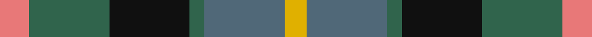
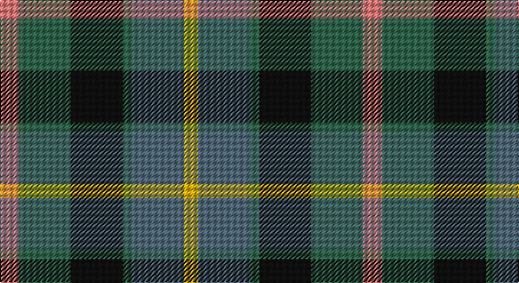

This page is one **sett** — a single exact thread-count. It belongs to the [tartan](/setts/r4g11k11g2n11ly3/)
(the same proportion at any scale), whose colour order is pattern [RGKGBY](/stripes/rgkgby/).

Part of the [Casely](/tartans/casely/) tartan — the named design grouping this sett with its other cloths.

Sourced from tartans-authority.  It is a [6 stripe tartan](/stripes/stripes6/).

Original link http://www.tartansauthority.com/tartan-ferret/display/2146/

## Register references

External register numbers recorded for this tartan.

- Scottish Tartans Authority (ITI): 2146

## Thread count
LR/16 G44 K44 G8 N44 Y/12

One full sett is **308 threads**.

## Palette

Palette: <strong>Tartan Register</strong> <small style="color:#888">(2 of 5 colours)</small>
<table><thead><tr><th>Colour</th><th>Threads</th><th>Shade</th><th>Base</th><th>OKLCh</th></tr></thead><tbody><tr><td>LR/</td><td style="text-align:right;font-variant-numeric:tabular-nums">16</td><td><code style="background-color:#E87878;">#E87878</code> <small style="color:#888">#E87878</small></td><td>R <code style="background-color:#CC0000;">#CC0000</code></td><td><small style="color:#888">oklch(70.0% 0.139 21.2)</small></td></tr><tr><td>G</td><td style="text-align:right;font-variant-numeric:tabular-nums">44</td><td><code style="background-color:#30644C;">#30644C</code> <small style="color:#888">#30644C</small></td><td>G <code style="background-color:#006100;">#006100</code></td><td><small style="color:#888">oklch(46.0% 0.069 161.9)</small></td></tr><tr><td>K</td><td style="text-align:right;font-variant-numeric:tabular-nums">44</td><td><code style="background-color:#101010;">#101010</code> <small style="color:#888">#101010</small></td><td>K <code style="background-color:#000000;">#000000</code></td><td><small style="color:#888">oklch(17.3% 0.000 89.9)</small></td></tr><tr><td>G</td><td style="text-align:right;font-variant-numeric:tabular-nums">8</td><td><code style="background-color:#30644C;">#30644C</code> <small style="color:#888">#30644C</small></td><td>G <code style="background-color:#006100;">#006100</code></td><td><small style="color:#888">oklch(46.0% 0.069 161.9)</small></td></tr><tr><td>N</td><td style="text-align:right;font-variant-numeric:tabular-nums">44</td><td><code style="background-color:#506878;">#506878</code> <small style="color:#888">#506878</small></td><td>B <code style="background-color:#2A418A;">#2A418A</code></td><td><small style="color:#888">oklch(50.4% 0.038 237.7)</small></td></tr><tr><td>Y/</td><td style="text-align:right;font-variant-numeric:tabular-nums">12</td><td><code style="background-color:#E0B000;">#E0B000</code> <small style="color:#888">#E0B000</small></td><td>Y <code style="background-color:#F2BF00;">#F2BF00</code></td><td><small style="color:#888">oklch(77.9% 0.159 88.8)</small></td></tr></tbody></table>

# Sample pattern

## Compared to the master

This cloth is one sett of its design; the master sett (the exemplar the design is anchored on) is below for comparison.

<figure style="margin:0"><figcaption style="color:#888;font-size:smaller">this sett</figcaption></figure>
<figure style="margin:0"><figcaption style="color:#888;font-size:smaller"><a href="/setts/r4g11k11g2n11y3/">master sett →</a></figcaption></figure>

## Nearest tartans

The nearest existing variants by ΔTartan distance, with this tartan at the top so the swatches line up against it.

ΔTartan

Tartan

Sett

—

<a href="/ttd/edit/#slug=r4g11k11g2n11ly3~x4">Casely (Name)</a> <a class="nn-out" href="/variants/s6/r4g11k11g2n11ly3~x4/" title="open its dictionary page">↗</a>

0.71

<a href="/ttd/edit/#slug=g15dg18dt23w4r8~x2&amp;base=r4g11k11g2n11ly3~x4">Friebe (2014)</a> <a class="nn-out" href="/variants/s5/g15dg18dt23w4r8~x2/" title="open its dictionary page">↗</a>

0.87

<a href="/ttd/edit/#slug=g15dg18db23w4r8~x2&amp;base=r4g11k11g2n11ly3~x4">Friebe (2014)</a> <a class="nn-out" href="/variants/s5/g15dg18db23w4r8~x2/" title="open its dictionary page">↗</a>

0.91

<a href="/ttd/edit/#slug=k4g16k14lo3n16r4~x2&amp;base=r4g11k11g2n11ly3~x4">Birse</a> <a class="nn-out" href="/variants/s6/k4g16k14lo3n16r4~x2/" title="open its dictionary page">↗</a>

0.95

<a href="/ttd/edit/#slug=k6t2db12g8r5k2g3~x4&amp;base=r4g11k11g2n11ly3~x4">Cooke (Personal)</a> <a class="nn-out" href="/variants/s7/k6t2db12g8r5k2g3~x4/" title="open its dictionary page">↗</a>

0.96

<a href="/ttd/edit/#slug=dp2g6k2db6k1r2~x4&amp;base=r4g11k11g2n11ly3~x4">MacCaughan, or MacEachain</a> <a class="nn-out" href="/variants/s6/dp2g6k2db6k1r2~x4/" title="open its dictionary page">↗</a>

1.00

<a href="/ttd/edit/#slug=g4n12lo2k10y10lo3y2~x2&amp;base=r4g11k11g2n11ly3~x4">Rothesay</a> <a class="nn-out" href="/variants/s7/g4n12lo2k10y10lo3y2~x2/" title="open its dictionary page">↗</a>

1.02

<a href="/ttd/edit/#slug=dp11y2k10g10lo2~x2&amp;base=r4g11k11g2n11ly3~x4">Selkirk (Name)</a> <a class="nn-out" href="/variants/s5/dp11y2k10g10lo2~x2/" title="open its dictionary page">↗</a>

1.03

<a href="/ttd/edit/#slug=r10db6g24dbi24r6ly3&amp;base=r4g11k11g2n11ly3~x4">Canine All Dogs (Fashion)</a> <a class="nn-out" href="/variants/s6/r10db6g24dbi24r6ly3/" title="open its dictionary page">↗</a>

1.07

<a href="/variants/s8/dp11y2k10g10lo2~x2/">Selkirk (Personal) Original</a>

1.07

<a href="/ttd/edit/#slug=dp11t2k10g10ly3~x2&amp;base=r4g11k11g2n11ly3~x4">Nobiliary Fraternity</a> <a class="nn-out" href="/variants/s5/dp11t2k10g10ly3~x2/" title="open its dictionary page">↗</a>

## Neighbour map

Every grey dot is one of 14360 variants placed by the first two principal components of the ΔTartan feature space (44% of its variance). Red is this tartan; blue dots are its nearest — click one to open its page.

<svg viewBox="0 0 640 380" role="img" style="max-width:100%;height:auto;border:1px solid #e0e0e0;border-radius:4px;display:block" xmlns="http://www.w3.org/2000/svg"><image href="/nn/cloud.v1.png" width="640" height="380"/><a href="/variants/s5/g15dg18dt23w4r8~x2/"><circle cx="104.3" cy="262.5" r="4" fill="#3465a4"><title>Friebe (2014)</title></circle></a><a href="/variants/s5/g15dg18db23w4r8~x2/"><circle cx="91.0" cy="251.4" r="4" fill="#3465a4"><title>Friebe (2014)</title></circle></a><a href="/variants/s6/k4g16k14lo3n16r4~x2/"><circle cx="127.3" cy="255.8" r="4" fill="#3465a4"><title>Birse</title></circle></a><a href="/variants/s7/k6t2db12g8r5k2g3~x4/"><circle cx="114.2" cy="236.5" r="4" fill="#3465a4"><title>Cooke (Personal)</title></circle></a><a href="/variants/s6/dp2g6k2db6k1r2~x4/"><circle cx="94.1" cy="227.1" r="4" fill="#3465a4"><title>MacCaughan, or MacEachain</title></circle></a><a href="/variants/s7/g4n12lo2k10y10lo3y2~x2/"><circle cx="104.7" cy="229.8" r="4" fill="#3465a4"><title>Rothesay</title></circle></a><a href="/variants/s5/dp11y2k10g10lo2~x2/"><circle cx="111.6" cy="248.1" r="4" fill="#3465a4"><title>Selkirk (Name)</title></circle></a><a href="/variants/s6/r10db6g24dbi24r6ly3/"><circle cx="141.9" cy="215.2" r="4" fill="#3465a4"><title>Canine All Dogs (Fashion)</title></circle></a><a href="/variants/s8/dp11y2k10g10lo2~x2/"><circle cx="118.9" cy="237.5" r="4" fill="#3465a4"><title>Selkirk (Personal) Original</title></circle></a><a href="/variants/s5/dp11t2k10g10ly3~x2/"><circle cx="87.8" cy="247.3" r="4" fill="#3465a4"><title>Nobiliary Fraternity</title></circle></a><circle cx="98.4" cy="244.4" r="5" fill="#c00000"/></svg>

ID: /variants/s6/r4g11k11g2n11ly3~x4/
