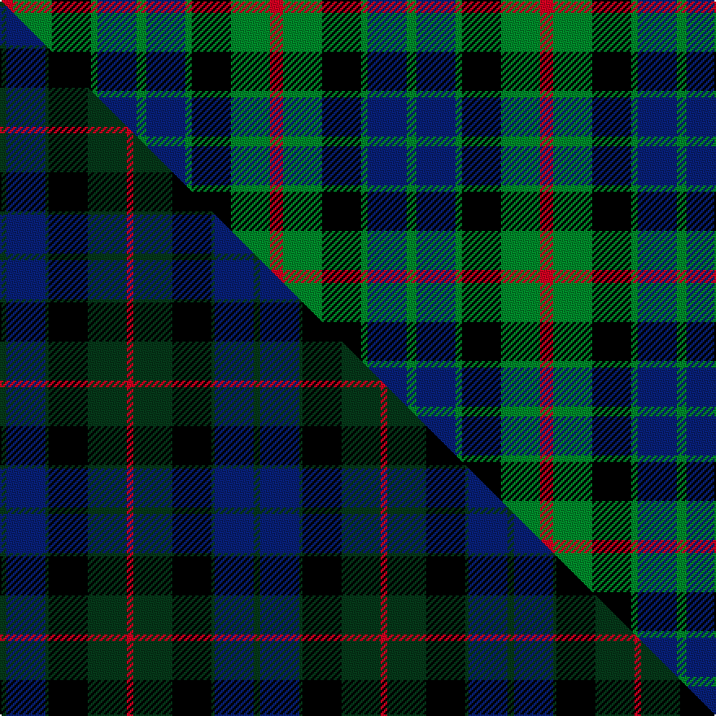

This page is one **sett** — a single exact thread-count. It belongs to the [tartan](/setts/r4g12k12g2db12g3/)
(the same proportion at any scale), whose colour order is pattern [GBGKGR](/stripes/gbgkgr/).

Part of the [Gunn](/tartans/gunn-2/) tartan — the named design grouping this sett with its other cloths.

Sourced from tartans-authority.  It is a [6 stripe tartan](/stripes/stripes6/).

Original link http://www.tartansauthority.com/tartan-ferret/display/708/

## Register references

External register numbers recorded for this tartan.

- Scottish Tartans Authority (ITI): 708

## Thread count
R/8 G24 K24 G4 DB24 G/6

One full sett is **166 threads**.

## Palette
<table><thead><tr><th>Colour</th><th>Shade</th><th>OKLCh</th></tr></thead><tbody><tr><td>DB</td><td><code style="background-color:#082077;">#082077</code> <small style="color:#888">#082077</small></td><td><small style="color:#888">oklch(30.0% 0.149 265.1)</small></td></tr><tr><td>G</td><td><code style="background-color:#008B2A;">#008B2A</code> <small style="color:#888">#008B2A</small></td><td><small style="color:#888">oklch(55.4% 0.170 145.9)</small></td></tr><tr><td>K</td><td><code style="background-color:#000000;">#000000</code> <small style="color:#888">#000000</small></td><td><small style="color:#888">oklch(0.0% 0.000 0.0)</small></td></tr><tr><td>R</td><td><code style="background-color:#D60020;">#D60020</code> <small style="color:#888">#D60020</small></td><td><small style="color:#888">oklch(55.2% 0.224 25.5)</small></td></tr></tbody></table>

# Sample pattern

## Compared to the master

This cloth is one sett of its design; the master sett (the exemplar the design is anchored on) is below for comparison.

Its **ΔTartan distance** from the master is **2.32** — the same measure the nearest-tartans table ranks by (0 is identical; a re-scale of the same cloth is near 0, a recolour or a different proportion further).

<figure class="master-compare" style="margin:0">

this sett
master sett ★

<figcaption style="color:#888;font-size:smaller">One weave of this sett against the <a href="/setts/dg2db12dg1k12dg12r2/">master sett ★</a>, split on the diagonal: a shared proportion runs seamlessly across it with only the shades shifting; a different proportion breaks on it.</figcaption>
</figure>

## Nearest variants

The nearest existing variants by ΔTartan distance, with this cloth at the top so the swatches line up against it.

ΔTartan

Threads

Variant

Sett

—

166

<a href="/variants/s6/r4g12k12g2db12g3~x2/">Gunn - 1810 (Clan)</a>

<a href="/ttd/edit/#slug=y1g6k5g1db5g1~x2&amp;base=r4g12k12g2db12g3~x2" title="compare in the TTD">0.53</a>

72

<a href="/variants/s6/y1g6k5g1db5g1~x2/">MacKay (Bonner)</a>

<a href="/ttd/edit/#slug=k3g14k14g2db14r3&amp;base=r4g12k12g2db12g3~x2" title="compare in the TTD">1.99</a>

94

<a href="/variants/s6/k3g14k14g2db14r3/">Morrison</a>

<a href="/ttd/edit/#slug=k3g14k14g2db14r3~x2&amp;base=r4g12k12g2db12g3~x2" title="compare in the TTD">1.99</a>

188

<a href="/variants/s6/k3g14k14g2db14r3~x2/">Morrison</a>

<a href="/ttd/edit/#slug=k3g14k14g2t14r3~x2&amp;base=r4g12k12g2db12g3~x2" title="compare in the TTD">1.99</a>

188

<a href="/variants/s6/k3g14k14g2t14r3~x2/">Morrison Society</a>

<a href="/ttd/edit/#slug=k3g14k14g2db15y2~x2&amp;base=r4g12k12g2db12g3~x2" title="compare in the TTD">2.01</a>

190

<a href="/variants/s6/k3g14k14g2db15y2~x2/">Glenturret</a>

<a href="/ttd/edit/#slug=k4g19k16w2db15g4~x2&amp;base=r4g12k12g2db12g3~x2" title="compare in the TTD">2.17</a>

224

<a href="/variants/s6/k4g19k16w2db15g4~x2/">Graham of Montrose</a>

<a href="/ttd/edit/#slug=k4g25k24r3db24g4~x2&amp;base=r4g12k12g2db12g3~x2" title="compare in the TTD">2.25</a>

320

<a href="/variants/s6/k4g25k24r3db24g4~x2/">Ferguson of Balquhidder #2</a>

<a href="/ttd/edit/#slug=k6g6r1g6k6db6k1~x2&amp;base=r4g12k12g2db12g3~x2" title="compare in the TTD">2.41</a>

114

<a href="/variants/s7/k6g6r1g6k6db6k1~x2/">MacCallum #2</a>

<a href="/ttd/edit/#slug=g1db6k6g6r1g1~x6&amp;base=r4g12k12g2db12g3~x2" title="compare in the TTD">2.56</a>

240

<a href="/variants/s6/g1db6k6g6r1g1~x6/">Callum Beg (Fashion)</a>

<a href="/ttd/edit/#slug=g18lb2g4k14dp12k3~x2&amp;base=r4g12k12g2db12g3~x2" title="compare in the TTD">2.63</a>

170

<a href="/variants/s6/g18lb2g4k14dp12k3~x2/">Coburg</a>

## Neighbour map

Every grey dot is one of 13620 variants placed by the first two principal components of the ΔTartan feature space (42% of its variance). Red is this tartan; blue dots are its nearest — click one to open its page.

<svg viewBox="0 0 640 380" role="img" style="max-width:100%;height:auto;border:1px solid #e0e0e0;border-radius:4px;display:block" xmlns="http://www.w3.org/2000/svg"><image href="/nn/cloud.v1.png" width="640" height="380"/><a href="/variants/s6/y1g6k5g1db5g1~x2/"><circle cx="157.0" cy="231.3" r="4" fill="#3465a4"><title>MacKay (Bonner)</title></circle></a><a href="/variants/s6/k3g14k14g2db14r3/"><circle cx="126.5" cy="223.0" r="4" fill="#3465a4"><title>Morrison</title></circle></a><a href="/variants/s6/k3g14k14g2db14r3~x2/"><circle cx="126.5" cy="223.0" r="4" fill="#3465a4"><title>Morrison</title></circle></a><a href="/variants/s6/k3g14k14g2t14r3~x2/"><circle cx="119.0" cy="223.7" r="4" fill="#3465a4"><title>Morrison Society</title></circle></a><a href="/variants/s6/k3g14k14g2db15y2~x2/"><circle cx="139.5" cy="219.8" r="4" fill="#3465a4"><title>Glenturret</title></circle></a><a href="/variants/s6/k4g19k16w2db15g4~x2/"><circle cx="149.4" cy="212.0" r="4" fill="#3465a4"><title>Graham of Montrose</title></circle></a><a href="/variants/s6/k4g25k24r3db24g4~x2/"><circle cx="142.7" cy="211.9" r="4" fill="#3465a4"><title>Ferguson of Balquhidder #2</title></circle></a><a href="/variants/s7/k6g6r1g6k6db6k1~x2/"><circle cx="126.5" cy="239.8" r="4" fill="#3465a4"><title>MacCallum #2</title></circle></a><a href="/variants/s6/g1db6k6g6r1g1~x6/"><circle cx="142.5" cy="227.4" r="4" fill="#3465a4"><title>Callum Beg (Fashion)</title></circle></a><a href="/variants/s6/g18lb2g4k14dp12k3~x2/"><circle cx="167.2" cy="212.3" r="4" fill="#3465a4"><title>Coburg</title></circle></a><circle cx="125.7" cy="237.8" r="5" fill="#c00000"/><text x="320" y="376" text-anchor="middle" font-size="11" fill="#999">ground</text><text x="11" y="190" text-anchor="middle" font-size="11" fill="#999" transform="rotate(-90 11 190)">complexity</text></svg>

ID: /variants/s6/r4g12k12g2db12g3~x2/
