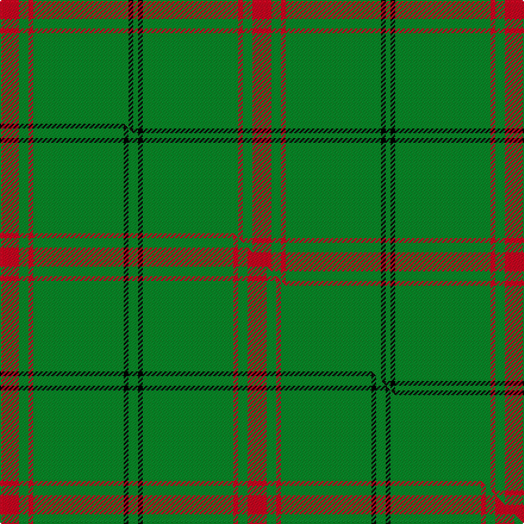

This is one **variant** — a specific cloth: this exact thread count and colourway, with its own
provenance below. It is one weaving of the [sett](/setts/r4g2r1g20k1g1/) (the scale-free proportion — the
same cloth at any scale or shade), whose colour order is pattern [GKGRGR](/stripes/gkgrgr/).

Part of the [Loch Laggan](/tartans/l/lo/loch-laggan/) tartan — the named design grouping this sett with its other cloths.

Sourced from tartans-authority.  It is a [6 stripe tartan](/stripes/stripes6/).

Original link [https://www.tartanregister.gov.uk/tartanDetails.aspx?ref=796](https://www.tartanregister.gov.uk/tartanDetails.aspx?ref=796)

Dataset <small>— provenance for this record, inherited from the source manifest</small>

<dl class="dataset-prov">
<dt>source</dt><dd><a href="/sources/tartans-authority/">Scottish Tartans Authority</a></dd>
<dt>data captured from</dt><dd><a href="https://github.com/thetartan/tartan-database/blob/master/data/tartans-authority/data.csv">https://github.com/thetartan/tartan-database/blob/master/data/tartans-authority/data.csv</a></dd>
<dt>data date</dt><dd>1816 <small>(this record)</small></dd>
<dt>licence</dt><dd><a href="https://creativecommons.org/licenses/by-nc-nd/4.0/">CC BY-NC-ND 4.0</a></dd>
</dl>

Capture chain <small>— the hands this data passed through, oldest first; each capture carries its own licence</small>

<ol class="capture-chain">
<li><a href="https://www.tartansauthority.com/">Scottish Tartans Authority</a> <small>the heritage body's archive — its tartan-ferret record browser is retired (links repaired to the SRT, above)</small></li>
<li><a href="https://github.com/thetartan/tartan-database">thetartan/tartan-database</a> <small>2016-2017</small> · <a href="https://creativecommons.org/licenses/by-nc-nd/4.0/">CC BY-NC-ND 4.0</a> <small>Levko Kravets's frozen compilation — the capture we vendored, and where its CC licence text came from</small></li>
<li>this dictionary <small>captured 2026-06-10 · commit 5bf86c7566</small> <small>each re-capture is a git commit to data/sources</small></li>
</ol>

## Register references

External register numbers recorded for this tartan.

- Scottish Tartans Authority (ITI): 796

## Thread count
R/16 G8 R4 G80 K4 G/4

One full sett is **212 threads**.

## Palette
<table><thead><tr><th>Colour</th><th>Shade</th><th>OKLCh</th></tr></thead><tbody><tr><td>G</td><td><code style="background-color:#008B2A;">#008B2A</code> <small style="color:#888">#008B2A</small></td><td><small style="color:#888">oklch(55.4% 0.170 145.9)</small></td></tr><tr><td>K</td><td><code style="background-color:#000000;">#000000</code> <small style="color:#888">#000000</small></td><td><small style="color:#888">oklch(0.0% 0.000 0.0)</small></td></tr><tr><td>R</td><td><code style="background-color:#D60020;">#D60020</code> <small style="color:#888">#D60020</small></td><td><small style="color:#888">oklch(55.2% 0.224 25.5)</small></td></tr></tbody></table>

# Sample pattern

## Compared to the master

This cloth is one sett of its design; the master sett (the exemplar the design is anchored on) is below for comparison.

Its **ΔTartan distance** from the master is **0.10** — the same measure the nearest-tartans table ranks by (0 is identical; a re-scale of the same cloth is near 0, a recolour or a different proportion further).

<figure class="master-compare" style="margin:0">

this sett
master sett ★

<figcaption style="color:#888;font-size:smaller">One weave of this sett against the <a href="/setts/r4g2r1g19k1g2/">master sett ★</a>, split on the diagonal: a shared proportion runs seamlessly across it with only the shades shifting; a different proportion breaks on it.</figcaption>
</figure>

## Nearest tartan variants

The nearest existing variants by ΔTartan distance, with this cloth at the top so the swatches line up against it.

ΔTartan

Threads

Variant

Sett

—

212

<a href="/variants/s6/r4g2r1g20k1g1~x4/">Loch Laggan (District)</a>

<a href="/ttd/edit/#slug=r4g2r1g19k1g2~x4&amp;base=r4g2r1g20k1g1~x4" title="compare in the TTD">0.10</a>

208

<a href="/variants/s6/r4g2r1g19k1g2~x4/">Loch Laggan</a>

<a href="/ttd/edit/#slug=r19g6r7g101k7g7&amp;base=r4g2r1g20k1g1~x4" title="compare in the TTD">0.27</a>

268

<a href="/variants/s6/r19g6r7g101k7g7/">Loch Laggan District Tartan</a>

<a href="/ttd/edit/#slug=g23r3g7r3g23dp7~x2&amp;base=r4g2r1g20k1g1~x4" title="compare in the TTD">1.02</a>

204

<a href="/variants/s6/g23r3g7r3g23dp7~x2/">Highland Spring (1997)</a>

<a href="/ttd/edit/#slug=r8dg3r4dg44w4~x2&amp;base=r4g2r1g20k1g1~x4" title="compare in the TTD">1.43</a>

228

<a href="/variants/s5/r8dg3r4dg44w4~x2/">Welsh National</a>

<a href="/ttd/edit/#slug=r2g1r1g11w1~x8&amp;base=r4g2r1g20k1g1~x4" title="compare in the TTD">1.52</a>

232

<a href="/variants/s5/r2g1r1g11w1~x8/">Welsh, National</a>

<a href="/ttd/edit/#slug=r2dg1r1dg10w1~x4&amp;base=r4g2r1g20k1g1~x4" title="compare in the TTD">1.59</a>

108

<a href="/variants/s5/r2dg1r1dg10w1~x4/">Welsh National District Tartan</a>

<a href="/ttd/edit/#slug=g24r4g3k14g5r2g10~x2&amp;base=r4g2r1g20k1g1~x4" title="compare in the TTD">1.90</a>

180

<a href="/variants/s7/g24r4g3k14g5r2g10~x2/">Northcroft (Personal)</a>

<a href="/ttd/edit/#slug=g30t8g5lb4g5r2~x4~t2405244-lb3203246&amp;base=r4g2r1g20k1g1~x4" title="compare in the TTD">1.95</a>

304

<a href="/variants/s6/g30t8g5lb4g5r2~x4~t2405244-lb3203246/">Annapolis Valley</a>

<a href="/ttd/edit/#slug=g3r16g4k6g28r1g3~x2&amp;base=r4g2r1g20k1g1~x4" title="compare in the TTD">1.96</a>

232

<a href="/variants/s7/g3r16g4k6g28r1g3~x2/">Maxwell, hunting</a>

<a href="/ttd/edit/#slug=g3dr16g4k6g28dr2g3~x2&amp;base=r4g2r1g20k1g1~x4" title="compare in the TTD">1.99</a>

236

<a href="/variants/s7/g3dr16g4k6g28dr2g3~x2/">Maxwell Htg (Clan)</a>

## Neighbour map

Every grey dot is one of 13621 variants placed by the first two principal components of the ΔTartan feature space (42% of its variance). Red is this tartan; blue dots are its nearest — click one to open its page. The map is a flat projection of a many-dimensional space — [how to read it](/posts/neighbourhood-maps/).

<svg viewBox="0 0 640 380" role="img" style="max-width:100%;height:auto;border:1px solid #e0e0e0;border-radius:4px;display:block" xmlns="http://www.w3.org/2000/svg"><image href="/nn/cloud.v1.png" width="640" height="380"/><a href="/variants/s6/r4g2r1g19k1g2~x4/"><circle cx="557.5" cy="147.1" r="4" fill="#3465a4"><title>Loch Laggan</title></circle></a><a href="/variants/s6/r19g6r7g101k7g7/"><circle cx="499.6" cy="162.5" r="4" fill="#3465a4"><title>Loch Laggan District Tartan</title></circle></a><a href="/variants/s6/g23r3g7r3g23dp7~x2/"><circle cx="506.6" cy="255.6" r="4" fill="#3465a4"><title>Highland Spring (1997)</title></circle></a><a href="/variants/s5/r8dg3r4dg44w4~x2/"><circle cx="542.5" cy="173.6" r="4" fill="#3465a4"><title>Welsh National</title></circle></a><a href="/variants/s5/r2g1r1g11w1~x8/"><circle cx="492.4" cy="211.8" r="4" fill="#3465a4"><title>Welsh, National</title></circle></a><a href="/variants/s5/r2dg1r1dg10w1~x4/"><circle cx="448.7" cy="201.5" r="4" fill="#3465a4"><title>Welsh National District Tartan</title></circle></a><a href="/variants/s7/g24r4g3k14g5r2g10~x2/"><circle cx="341.1" cy="195.0" r="4" fill="#3465a4"><title>Northcroft (Personal)</title></circle></a><a href="/variants/s6/g30t8g5lb4g5r2~x4~t2405244-lb3203246/"><circle cx="523.7" cy="217.0" r="4" fill="#3465a4"><title>Annapolis Valley</title></circle></a><a href="/variants/s7/g3r16g4k6g28r1g3~x2/"><circle cx="369.0" cy="150.2" r="4" fill="#3465a4"><title>Maxwell, hunting</title></circle></a><a href="/variants/s7/g3dr16g4k6g28dr2g3~x2/"><circle cx="349.8" cy="184.0" r="4" fill="#3465a4"><title>Maxwell Htg (Clan)</title></circle></a><circle cx="529.2" cy="158.7" r="5" fill="#c00000"/><text x="320" y="376" text-anchor="middle" font-size="11" fill="#999">ground</text><text x="11" y="190" text-anchor="middle" font-size="11" fill="#999" transform="rotate(-90 11 190)">complexity</text></svg>

ID: /variants/s6/r4g2r1g20k1g1~x4/
