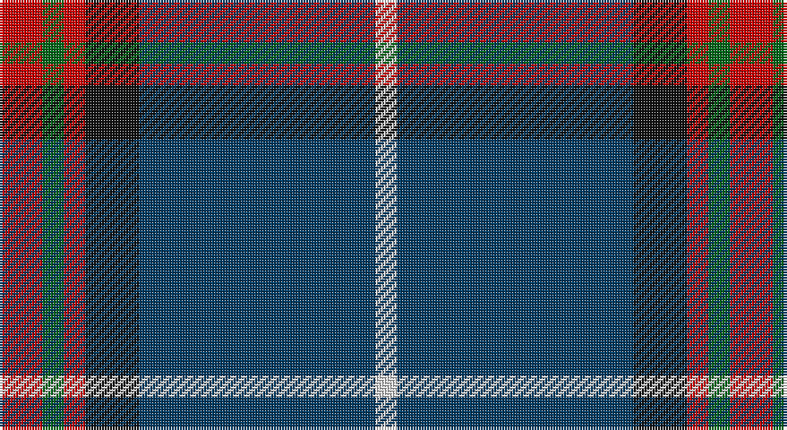

This page is one **sett** — a single exact thread-count. It belongs to the [tartan](/setts/r4g2r2k5dt22w2/)
(the same proportion at any scale), whose colour order is pattern [RGRKBW](/stripes/rgrkbw/).

Sourced from register-of-tartans.  It is a [6 stripe tartan](/stripes/stripes6/).

Original link https://www.tartanregister.gov.uk/tartanDetails.aspx?ref=3485

2 attestations — the source records this cloth was collapsed from (oldest owns this page)

<ul>
<li>01/01/2006 — Reese (Personal) (register-of-tartans, <a href="https://www.tartanregister.gov.uk/tartanDetails.aspx?ref=3485">record</a>)</li>
<li>pre 2006 — Reese (Personal) (tartans-authority, <a href="http://www.tartansauthority.com/tartan-ferret/display/6915/">record</a>)</li>
</ul>

## Register references

External register numbers recorded for this tartan.

- Scottish Register of Tartans: [3485](https://www.tartanregister.gov.uk/tartanDetails.aspx?ref=3485)
- Scottish Tartans Authority (ITI): 6915

## Thread count
R/16 G8 R8 K20 DB88 LN/8

One full sett is **272 threads**.

## Palette

Palette: <strong>Tartan Register</strong>
<table><thead><tr><th>Colour</th><th>Threads</th><th>Shade</th><th>Base</th><th>OKLCh</th></tr></thead><tbody><tr><td>R/</td><td style="text-align:right;font-variant-numeric:tabular-nums">16</td><td><code style="background-color:#C80000;">#C80000</code> <small style="color:#888">#C80000</small></td><td>R <code style="background-color:#CC0000;">#CC0000</code></td><td><small style="color:#888">oklch(52.3% 0.215 29.2)</small></td></tr><tr><td>G</td><td style="text-align:right;font-variant-numeric:tabular-nums">8</td><td><code style="background-color:#006818;">#006818</code> <small style="color:#888">#006818</small></td><td>G <code style="background-color:#006100;">#006100</code></td><td><small style="color:#888">oklch(45.0% 0.142 145.0)</small></td></tr><tr><td>R</td><td style="text-align:right;font-variant-numeric:tabular-nums">8</td><td><code style="background-color:#C80000;">#C80000</code> <small style="color:#888">#C80000</small></td><td>R <code style="background-color:#CC0000;">#CC0000</code></td><td><small style="color:#888">oklch(52.3% 0.215 29.2)</small></td></tr><tr><td>K</td><td style="text-align:right;font-variant-numeric:tabular-nums">20</td><td><code style="background-color:#101010;">#101010</code> <small style="color:#888">#101010</small></td><td>K <code style="background-color:#000000;">#000000</code></td><td><small style="color:#888">oklch(17.3% 0.000 89.9)</small></td></tr><tr><td>DB</td><td style="text-align:right;font-variant-numeric:tabular-nums">88</td><td><code style="background-color:#003C64;">#003C64</code> <small style="color:#888">#003C64</small></td><td>B <code style="background-color:#2A418A;">#2A418A</code></td><td><small style="color:#888">oklch(34.5% 0.089 246.0)</small></td></tr><tr><td>LN/</td><td style="text-align:right;font-variant-numeric:tabular-nums">8</td><td><code style="background-color:#E0E0E0;">#E0E0E0</code> <small style="color:#888">#E0E0E0</small></td><td>W <code style="background-color:#F7F7F7;">#F7F7F7</code></td><td><small style="color:#888">oklch(90.7% 0.000 89.9)</small></td></tr></tbody></table>

# Sample pattern

## Nearest tartans

The nearest existing variants by ΔTartan distance, with this tartan at the top so the swatches line up against it.

ΔTartan

Tartan

Sett

—

<a href="/ttd/edit/#slug=r4g2r2k5dt22w2~x4">Reese (Personal)</a> <a class="nn-out" href="/variants/s6/r4g2r2k5dt22w2~x4/" title="open its dictionary page">↗</a>

0.97

<a href="/ttd/edit/#slug=r4db24w2g13db2k3~x4&amp;base=r4g2r2k5dt22w2~x4">Vance (Family Association)</a> <a class="nn-out" href="/variants/s6/r4db24w2g13db2k3~x4/" title="open its dictionary page">↗</a>

1.04

<a href="/ttd/edit/#slug=k2db22g4k7lo2k2w2db2~x2&amp;base=r4g2r2k5dt22w2~x4">Glasgow, University of</a> <a class="nn-out" href="/variants/s8/k2db22g4k7lo2k2w2db2~x2/" title="open its dictionary page">↗</a>

1.14

<a href="/ttd/edit/#slug=n10k7lt2lb2k27b7lt2b7~x2&amp;base=r4g2r2k5dt22w2~x4">Croy, Jake (Personal)</a> <a class="nn-out" href="/variants/s8/n10k7lt2lb2k27b7lt2b7~x2/" title="open its dictionary page">↗</a>

1.15

<a href="/ttd/edit/#slug=r12lo6k88db45k6db6ly6&amp;base=r4g2r2k5dt22w2~x4">City of Rome Pipe Band (Corporate)</a> <a class="nn-out" href="/variants/s7/r12lo6k88db45k6db6ly6/" title="open its dictionary page">↗</a>

1.18

<a href="/ttd/edit/#slug=db8w2k8g12r2db3r2db24r2~x2&amp;base=r4g2r2k5dt22w2~x4">Burt #2 (Name)</a> <a class="nn-out" href="/variants/s9/db8w2k8g12r2db3r2db24r2~x2/" title="open its dictionary page">↗</a>

1.23

<a href="/ttd/edit/#slug=p5g8k5db32w2r2~x2&amp;base=r4g2r2k5dt22w2~x4">Marion (Personal)</a> <a class="nn-out" href="/variants/s6/p5g8k5db32w2r2~x2/" title="open its dictionary page">↗</a>

1.23

<a href="/ttd/edit/#slug=db1lo1db13loi3y3loi3r1loi1~x4&amp;base=r4g2r2k5dt22w2~x4">Glen Moray</a> <a class="nn-out" href="/variants/s8/db1lo1db13loi3y3loi3r1loi1~x4/" title="open its dictionary page">↗</a>

1.25

<a href="/ttd/edit/#slug=o11dbi1o3db1dbi9r1~x4&amp;base=r4g2r2k5dt22w2~x4">Dege, of Saville Row</a> <a class="nn-out" href="/variants/s6/o11dbi1o3db1dbi9r1~x4/" title="open its dictionary page">↗</a>

1.27

<a href="/ttd/edit/#slug=db20dy1db1dy1dg8k1w3~x2&amp;base=r4g2r2k5dt22w2~x4">Chestico</a> <a class="nn-out" href="/variants/s7/db20dy1db1dy1dg8k1w3~x2/" title="open its dictionary page">↗</a>

1.29

<a href="/ttd/edit/#slug=k2db22g4k7y2k2w2db2~x2&amp;base=r4g2r2k5dt22w2~x4">Glasgow, University of</a> <a class="nn-out" href="/variants/s8/k2db22g4k7y2k2w2db2~x2/" title="open its dictionary page">↗</a>

## Neighbour map

Every grey dot is one of 14360 variants placed by the first two principal components of the ΔTartan feature space (44% of its variance). Red is this tartan; blue dots are its nearest — click one to open its page.

<svg viewBox="0 0 640 380" role="img" style="max-width:100%;height:auto;border:1px solid #e0e0e0;border-radius:4px;display:block" xmlns="http://www.w3.org/2000/svg"><image href="/nn/cloud.v1.png" width="640" height="380"/><a href="/variants/s6/r4db24w2g13db2k3~x4/"><circle cx="276.8" cy="179.4" r="4" fill="#3465a4"><title>Vance (Family Association)</title></circle></a><a href="/variants/s8/k2db22g4k7lo2k2w2db2~x2/"><circle cx="302.8" cy="167.0" r="4" fill="#3465a4"><title>Glasgow, University of</title></circle></a><a href="/variants/s8/n10k7lt2lb2k27b7lt2b7~x2/"><circle cx="266.5" cy="169.9" r="4" fill="#3465a4"><title>Croy, Jake (Personal)</title></circle></a><a href="/variants/s7/r12lo6k88db45k6db6ly6/"><circle cx="336.3" cy="167.9" r="4" fill="#3465a4"><title>City of Rome Pipe Band (Corporate)</title></circle></a><a href="/variants/s9/db8w2k8g12r2db3r2db24r2~x2/"><circle cx="287.6" cy="172.4" r="4" fill="#3465a4"><title>Burt #2 (Name)</title></circle></a><a href="/variants/s6/p5g8k5db32w2r2~x2/"><circle cx="318.0" cy="153.2" r="4" fill="#3465a4"><title>Marion (Personal)</title></circle></a><a href="/variants/s8/db1lo1db13loi3y3loi3r1loi1~x4/"><circle cx="306.1" cy="157.9" r="4" fill="#3465a4"><title>Glen Moray</title></circle></a><a href="/variants/s6/o11dbi1o3db1dbi9r1~x4/"><circle cx="328.7" cy="209.2" r="4" fill="#3465a4"><title>Dege, of Saville Row</title></circle></a><a href="/variants/s7/db20dy1db1dy1dg8k1w3~x2/"><circle cx="352.6" cy="145.2" r="4" fill="#3465a4"><title>Chestico</title></circle></a><a href="/variants/s8/k2db22g4k7y2k2w2db2~x2/"><circle cx="275.8" cy="155.3" r="4" fill="#3465a4"><title>Glasgow, University of</title></circle></a><circle cx="321.8" cy="177.6" r="5" fill="#c00000"/></svg>

ID: /variants/s6/r4g2r2k5dt22w2~x4/
