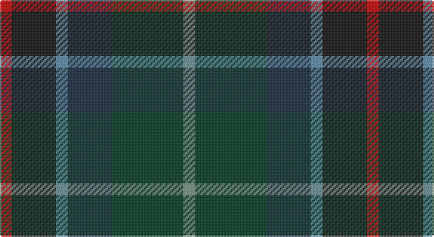

This page is one **sett** — a single exact thread-count. It belongs to the [tartan](/setts/r4k15t4dt15dg24y4/)
(the same proportion at any scale), whose colour order is pattern [GGBBKR](/stripes/ggbbkr/).

Part of the [Haughfoot](/tartans/haughfoot/) tartan — the named design grouping this sett with its other cloths.

Sourced from tartans-authority.  It is a [6 stripe tartan](/stripes/stripes6/).

Original link http://www.tartansauthority.com/tartan-ferret/display/5819/

## Register references

External register numbers recorded for this tartan.

- Scottish Tartans Authority (ITI): 5819

## Thread count
R/8 K30 B8 DN30 DG48 LG/8

One full sett is **248 threads**.

## Palette

Palette: <strong>Tartan Register</strong>
<table><thead><tr><th>Colour</th><th>Threads</th><th>Shade</th><th>Base</th><th>OKLCh</th></tr></thead><tbody><tr><td>R/</td><td style="text-align:right;font-variant-numeric:tabular-nums">8</td><td><code style="background-color:#C80000;">#C80000</code> <small style="color:#888">#C80000</small></td><td>R <code style="background-color:#CC0000;">#CC0000</code></td><td><small style="color:#888">oklch(52.3% 0.215 29.2)</small></td></tr><tr><td>K</td><td style="text-align:right;font-variant-numeric:tabular-nums">30</td><td><code style="background-color:#101010;">#101010</code> <small style="color:#888">#101010</small></td><td>K <code style="background-color:#000000;">#000000</code></td><td><small style="color:#888">oklch(17.3% 0.000 89.9)</small></td></tr><tr><td>B</td><td style="text-align:right;font-variant-numeric:tabular-nums">8</td><td><code style="background-color:#5C8CA8;">#5C8CA8</code> <small style="color:#888">#5C8CA8</small></td><td>B <code style="background-color:#2A418A;">#2A418A</code></td><td><small style="color:#888">oklch(61.7% 0.067 235.0)</small></td></tr><tr><td>DN</td><td style="text-align:right;font-variant-numeric:tabular-nums">30</td><td><code style="background-color:#14283C;">#14283C</code> <small style="color:#888">#14283C</small></td><td>B <code style="background-color:#2A418A;">#2A418A</code></td><td><small style="color:#888">oklch(27.1% 0.046 249.9)</small></td></tr><tr><td>DG</td><td style="text-align:right;font-variant-numeric:tabular-nums">48</td><td><code style="background-color:#003820;">#003820</code> <small style="color:#888">#003820</small></td><td>G <code style="background-color:#006100;">#006100</code></td><td><small style="color:#888">oklch(30.0% 0.070 158.3)</small></td></tr><tr><td>LG/</td><td style="text-align:right;font-variant-numeric:tabular-nums">8</td><td><code style="background-color:#789484;">#789484</code> <small style="color:#888">#789484</small></td><td>G <code style="background-color:#006100;">#006100</code></td><td><small style="color:#888">oklch(64.0% 0.040 160.0)</small></td></tr></tbody></table>

# Sample pattern

## Compared to the master

This cloth is one sett of its design; the master sett (the exemplar the design is anchored on) is below for comparison.

<figure style="margin:0"><figcaption style="color:#888;font-size:smaller">this sett</figcaption></figure>
<figure style="margin:0"><figcaption style="color:#888;font-size:smaller"><a href="/setts/k15t4dt15dg24y4dg24dt15t4k15r4/">master sett →</a></figcaption></figure>

## Nearest tartans

The nearest existing variants by ΔTartan distance, with this tartan at the top so the swatches line up against it.

ΔTartan

Tartan

Sett

—

<a href="/ttd/edit/#slug=r4k15t4dt15dg24y4~x2">Haughfoot (Commemorative)</a> <a class="nn-out" href="/variants/s6/r4k15t4dt15dg24y4~x2/" title="open its dictionary page">↗</a>

1.20

<a href="/ttd/edit/#slug=n15k10dt30dy11w3lg5~x2&amp;base=r4k15t4dt15dg24y4~x2">McHale, Barry Name Tartan</a> <a class="nn-out" href="/variants/s6/n15k10dt30dy11w3lg5~x2/" title="open its dictionary page">↗</a>

1.22

<a href="/ttd/edit/#slug=ly4dg17k10dt3k3dt17r3dt3~x2&amp;base=r4k15t4dt15dg24y4~x2">Royal Highland Society (Corporate)</a> <a class="nn-out" href="/variants/s8/ly4dg17k10dt3k3dt17r3dt3~x2/" title="open its dictionary page">↗</a>

1.26

<a href="/ttd/edit/#slug=lb4dg17k10dt3k3dt17r3dt3~x2&amp;base=r4k15t4dt15dg24y4~x2">Royal Highland</a> <a class="nn-out" href="/variants/s8/lb4dg17k10dt3k3dt17r3dt3~x2/" title="open its dictionary page">↗</a>

1.31

<a href="/ttd/edit/#slug=dg3dt22dr10o5dg21r6dt3~x2&amp;base=r4k15t4dt15dg24y4~x2">Swankie</a> <a class="nn-out" href="/variants/s7/dg3dt22dr10o5dg21r6dt3~x2/" title="open its dictionary page">↗</a>

1.32

<a href="/ttd/edit/#slug=lb3db17do16dt2dg17lo2~x2&amp;base=r4k15t4dt15dg24y4~x2">Ancient Atlantic (Fashion)</a> <a class="nn-out" href="/variants/s6/lb3db17do16dt2dg17lo2~x2/" title="open its dictionary page">↗</a>

1.33

<a href="/ttd/edit/#slug=k26n10dt19r6ly2db9~x2&amp;base=r4k15t4dt15dg24y4~x2">Meeson Hunting</a> <a class="nn-out" href="/variants/s6/k26n10dt19r6ly2db9~x2/" title="open its dictionary page">↗</a>

1.36

<a href="/ttd/edit/#slug=r3db12k12dg12b2dg12w3~x2&amp;base=r4k15t4dt15dg24y4~x2">Game Fair</a> <a class="nn-out" href="/variants/s7/r3db12k12dg12b2dg12w3~x2/" title="open its dictionary page">↗</a>

1.37

<a href="/ttd/edit/#slug=r4g11k11g2n11y3~x4&amp;base=r4k15t4dt15dg24y4~x2">Casely</a> <a class="nn-out" href="/variants/s6/r4g11k11g2n11y3~x4/" title="open its dictionary page">↗</a>

1.43

<a href="/ttd/edit/#slug=k15t4dt15dg24y4dg24dt15t4k15r4~x2&amp;base=r4k15t4dt15dg24y4~x2">Haughfoot</a> <a class="nn-out" href="/variants/s10/k15t4dt15dg24y4dg24dt15t4k15r4~x2/" title="open its dictionary page">↗</a>

1.45

<a href="/ttd/edit/#slug=dp2dg6k2db6k1r2~x4&amp;base=r4k15t4dt15dg24y4~x2">MacCaughan or MacEachain (Personal)</a> <a class="nn-out" href="/variants/s6/dp2dg6k2db6k1r2~x4/" title="open its dictionary page">↗</a>

## Neighbour map

Every grey dot is one of 14360 variants placed by the first two principal components of the ΔTartan feature space (44% of its variance). Red is this tartan; blue dots are its nearest — click one to open its page.

<svg viewBox="0 0 640 380" role="img" style="max-width:100%;height:auto;border:1px solid #e0e0e0;border-radius:4px;display:block" xmlns="http://www.w3.org/2000/svg"><image href="/nn/cloud.v1.png" width="640" height="380"/><a href="/variants/s6/n15k10dt30dy11w3lg5~x2/"><circle cx="192.6" cy="220.6" r="4" fill="#3465a4"><title>McHale, Barry Name Tartan</title></circle></a><a href="/variants/s8/ly4dg17k10dt3k3dt17r3dt3~x2/"><circle cx="197.7" cy="246.0" r="4" fill="#3465a4"><title>Royal Highland Society (Corporate)</title></circle></a><a href="/variants/s8/lb4dg17k10dt3k3dt17r3dt3~x2/"><circle cx="189.0" cy="241.6" r="4" fill="#3465a4"><title>Royal Highland</title></circle></a><a href="/variants/s7/dg3dt22dr10o5dg21r6dt3~x2/"><circle cx="217.5" cy="249.3" r="4" fill="#3465a4"><title>Swankie</title></circle></a><a href="/variants/s6/lb3db17do16dt2dg17lo2~x2/"><circle cx="143.4" cy="214.7" r="4" fill="#3465a4"><title>Ancient Atlantic (Fashion)</title></circle></a><a href="/variants/s6/k26n10dt19r6ly2db9~x2/"><circle cx="181.3" cy="215.3" r="4" fill="#3465a4"><title>Meeson Hunting</title></circle></a><a href="/variants/s7/r3db12k12dg12b2dg12w3~x2/"><circle cx="149.9" cy="237.5" r="4" fill="#3465a4"><title>Game Fair</title></circle></a><a href="/variants/s6/r4g11k11g2n11y3~x4/"><circle cx="133.1" cy="264.8" r="4" fill="#3465a4"><title>Casely</title></circle></a><a href="/variants/s10/k15t4dt15dg24y4dg24dt15t4k15r4~x2/"><circle cx="179.1" cy="248.1" r="4" fill="#3465a4"><title>Haughfoot</title></circle></a><a href="/variants/s6/dp2dg6k2db6k1r2~x4/"><circle cx="165.7" cy="265.0" r="4" fill="#3465a4"><title>MacCaughan or MacEachain (Personal)</title></circle></a><circle cx="157.9" cy="245.8" r="5" fill="#c00000"/></svg>

ID: /variants/s6/r4k15t4dt15dg24y4~x2/
