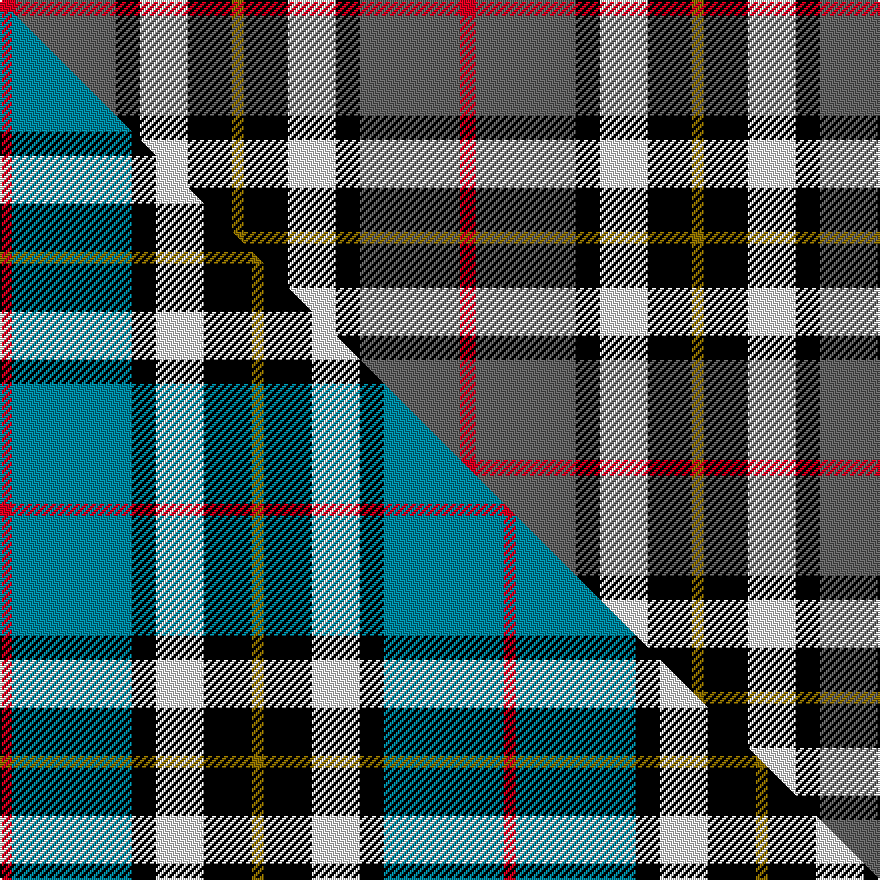

This page is one **sett** — a single exact thread-count. It belongs to the [tartan](/setts/r4n25k6w12k11y3/)
(the same proportion at any scale), whose colour order is pattern [GKWKBR](/stripes/gkwkbr/).

Part of the [Thomson Dress](/tartans/thomson-dress/) tartan — the named design grouping this sett with its other cloths.

Sourced from tartans-authority.  It is a [6 stripe tartan](/stripes/stripes6/).

Original link http://www.tartansauthority.com/tartan-ferret/display/3121/

2 attestations — the source records this cloth was collapsed from (oldest owns this page)

<ul>
<li>circa 1984 — Thomson Dress (Grey) (Fashion) (tartans-authority, <a href="http://www.tartansauthority.com/tartan-ferret/display/3121/">record</a>)  <em>Designed in the 1980s by Douglas Anderson and Colin Hutcheson as a fashion tartan. Count taken from Kinloch Anderson cloth sample - may need checking.</em></li>
<li>undated — Thomson Dress (Grey) (register-of-tartans, <a href="https://www.tartanregister.gov.uk/tartanDetails.aspx?ref=5279">record</a>)  <em>Designed in the 1980s by Douglas Anderson and Colin Hutcheson as a fashion tartan. Count taken from Kinloch Anderson cloth sample - may need checking.</em></li>
</ul>

## Register references

External register numbers recorded for this tartan.

- Scottish Register of Tartans: [5279](https://www.tartanregister.gov.uk/tartanDetails.aspx?ref=5279)
- Scottish Tartans Authority (ITI): 3121

## Thread count
R/8 N50 K12 W24 K22 Y/6

One full sett is **230 threads**.

## Palette
<table><thead><tr><th>Colour</th><th>Shade</th><th>OKLCh</th></tr></thead><tbody><tr><td>K</td><td><code style="background-color:#000000;">#000000</code> <small style="color:#888">#000000</small></td><td><small style="color:#888">oklch(0.0% 0.000 0.0)</small></td></tr><tr><td>W</td><td><code style="background-color:#F7F7F7;">#F7F7F7</code> <small style="color:#888">#F7F7F7</small></td><td><small style="color:#888">oklch(97.6% 0.000 89.9)</small></td></tr><tr><td>N</td><td><code style="background-color:#636363;">#636363</code> <small style="color:#888">#636363</small></td><td><small style="color:#888">oklch(50.0% 0.000 89.9)</small></td></tr><tr><td>R</td><td><code style="background-color:#D60020;">#D60020</code> <small style="color:#888">#D60020</small></td><td><small style="color:#888">oklch(55.2% 0.224 25.5)</small></td></tr><tr><td>Y</td><td><code style="background-color:#8B6E00;">#8B6E00</code> <small style="color:#888">#8B6E00</small></td><td><small style="color:#888">oklch(55.1% 0.113 90.4)</small></td></tr></tbody></table>

# Sample pattern

## Compared to the master

This cloth is one sett of its design; the master sett (the exemplar the design is anchored on) is below for comparison.

Its **ΔTartan distance** from the master is **1.25** — the same measure the nearest-tartans table ranks by (0 is identical; a re-scale of the same cloth is near 0, a recolour or a different proportion further).

<figure class="master-compare" style="margin:0">

this sett
master sett ★

<figcaption style="color:#888;font-size:smaller">One weave of this sett against the <a href="/setts/r1t10k2w4k4y1/">master sett ★</a>, split on the diagonal: a shared proportion runs seamlessly across it with only the shades shifting; a different proportion breaks on it.</figcaption>
</figure>

## Nearest variants

The nearest existing variants by ΔTartan distance, with this cloth at the top so the swatches line up against it.

ΔTartan

Threads

Variant

Sett

—

230

<a href="/variants/s6/r4n25k6w12k11y3~x2/">Thomson Dress (Grey) (Fashion)</a>

<a href="/ttd/edit/#slug=r2n20k5w10k10r2~x2&amp;base=r4n25k6w12k11y3~x2" title="compare in the TTD">0.61</a>

188

<a href="/variants/s6/r2n20k5w10k10r2~x2/">Thom(p)son, Grey</a>

<a href="/ttd/edit/#slug=dr1n6k1w3k3dr1~x8&amp;base=r4n25k6w12k11y3~x2" title="compare in the TTD">0.65</a>

224

<a href="/variants/s6/dr1n6k1w3k3dr1~x8/">Thompson Grey Dress</a>

<a href="/ttd/edit/#slug=r3n27k6lo13k14r3~x2&amp;base=r4n25k6w12k11y3~x2" title="compare in the TTD">1.50</a>

252

<a href="/variants/s6/r3n27k6lo13k14r3~x2/">Thompson/Thomson/MacTavish special grey</a>

<a href="/ttd/edit/#slug=w6k29o29dp7k3r3~x2~o2500000&amp;base=r4n25k6w12k11y3~x2" title="compare in the TTD">1.63</a>

290

<a href="/variants/s6/w6k29o29dp7k3r3~x2~o2500000/">Jewell of Kernow (Personal)</a>

<a href="/ttd/edit/#slug=r2w12y1k12o12k1~x2&amp;base=r4n25k6w12k11y3~x2" title="compare in the TTD">2.35</a>

154

<a href="/variants/s6/r2w12y1k12o12k1~x2/">Dutch Dress</a>

<a href="/ttd/edit/#slug=r4lb28k6w12k12y3~x2&amp;base=r4n25k6w12k11y3~x2" title="compare in the TTD">2.45</a>

246

<a href="/variants/s6/r4lb28k6w12k12y3~x2/">MacTavish / Thom(p)son, dress</a>

<a href="/ttd/edit/#slug=dr24lb4k4g4w13k2~x4&amp;base=r4n25k6w12k11y3~x2" title="compare in the TTD">2.48</a>

304

<a href="/variants/s6/dr24lb4k4g4w13k2~x4/">Rose White Dress</a>

<a href="/ttd/edit/#slug=r1t10k2w4k4y1~x6&amp;base=r4n25k6w12k11y3~x2" title="compare in the TTD">2.51</a>

252

<a href="/variants/s6/r1t10k2w4k4y1~x6/">Thomson Dress (Blue)</a>

<a href="/ttd/edit/#slug=w2k11y11lb3k1r1~x2&amp;base=r4n25k6w12k11y3~x2" title="compare in the TTD">2.58</a>

110

<a href="/variants/s6/w2k11y11lb3k1r1~x2/">Cornish National Small Set Tartan</a>

<a href="/ttd/edit/#slug=w5k26y26lb7k3r3~x2&amp;base=r4n25k6w12k11y3~x2" title="compare in the TTD">2.58</a>

264

<a href="/variants/s6/w5k26y26lb7k3r3~x2/">Cornish, National</a>

## Neighbour map

Every grey dot is one of 13620 variants placed by the first two principal components of the ΔTartan feature space (42% of its variance). Red is this tartan; blue dots are its nearest — click one to open its page.

<svg viewBox="0 0 640 380" role="img" style="max-width:100%;height:auto;border:1px solid #e0e0e0;border-radius:4px;display:block" xmlns="http://www.w3.org/2000/svg"><image href="/nn/cloud.v1.png" width="640" height="380"/><a href="/variants/s6/r2n20k5w10k10r2~x2/"><circle cx="150.0" cy="189.7" r="4" fill="#3465a4"><title>Thom(p)son, Grey</title></circle></a><a href="/variants/s6/dr1n6k1w3k3dr1~x8/"><circle cx="132.0" cy="218.9" r="4" fill="#3465a4"><title>Thompson Grey Dress</title></circle></a><a href="/variants/s6/r3n27k6lo13k14r3~x2/"><circle cx="158.3" cy="194.8" r="4" fill="#3465a4"><title>Thompson/Thomson/MacTavish special grey</title></circle></a><a href="/variants/s6/w6k29o29dp7k3r3~x2~o2500000/"><circle cx="154.9" cy="166.1" r="4" fill="#3465a4"><title>Jewell of Kernow (Personal)</title></circle></a><a href="/variants/s6/r2w12y1k12o12k1~x2/"><circle cx="105.9" cy="165.3" r="4" fill="#3465a4"><title>Dutch Dress</title></circle></a><a href="/variants/s6/r4lb28k6w12k12y3~x2/"><circle cx="136.7" cy="179.4" r="4" fill="#3465a4"><title>MacTavish / Thom(p)son, dress</title></circle></a><a href="/variants/s6/dr24lb4k4g4w13k2~x4/"><circle cx="176.8" cy="157.9" r="4" fill="#3465a4"><title>Rose White Dress</title></circle></a><a href="/variants/s6/r1t10k2w4k4y1~x6/"><circle cx="156.7" cy="175.2" r="4" fill="#3465a4"><title>Thomson Dress (Blue)</title></circle></a><a href="/variants/s6/w2k11y11lb3k1r1~x2/"><circle cx="158.6" cy="161.3" r="4" fill="#3465a4"><title>Cornish National Small Set Tartan</title></circle></a><a href="/variants/s6/w5k26y26lb7k3r3~x2/"><circle cx="147.2" cy="172.8" r="4" fill="#3465a4"><title>Cornish, National</title></circle></a><circle cx="124.9" cy="189.2" r="5" fill="#c00000"/><text x="320" y="376" text-anchor="middle" font-size="11" fill="#999">ground</text><text x="11" y="190" text-anchor="middle" font-size="11" fill="#999" transform="rotate(-90 11 190)">complexity</text></svg>

ID: /variants/s6/r4n25k6w12k11y3~x2/
