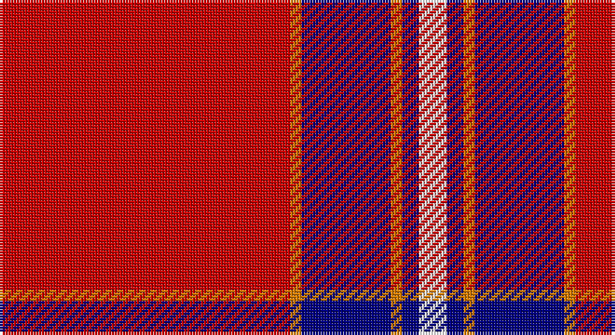

This page is one **sett** — a single exact thread-count. It belongs to the [tartan](/setts/r52lo2db16lo2db3w5/)
(the same proportion at any scale), whose colour order is pattern [RYBYBW](/stripes/rybybw/).

Sourced from register-of-tartans.  It is a [6 stripe tartan](/stripes/stripes6/).

Original link https://www.tartanregister.gov.uk/tartanDetails.aspx?ref=11577

## Register references

External register numbers recorded for this tartan.

- Scottish Register of Tartans: [11577](https://www.tartanregister.gov.uk/tartanDetails.aspx?ref=11577)

## Thread count
R/104 O4 DB32 O4 DB6 W/10

One full sett is **206 threads**.

## Palette

Palette: <strong>Tartan Register</strong> <small style="color:#888">(3 of 4 colours)</small>
<table><thead><tr><th>Colour</th><th>Threads</th><th>Shade</th><th>Base</th><th>OKLCh</th></tr></thead><tbody><tr><td>R/</td><td style="text-align:right;font-variant-numeric:tabular-nums">104</td><td><code style="background-color:#C80000;">#C80000</code> <small style="color:#888">#C80000</small></td><td>R <code style="background-color:#CC0000;">#CC0000</code></td><td><small style="color:#888">oklch(52.3% 0.215 29.2)</small></td></tr><tr><td>O</td><td style="text-align:right;font-variant-numeric:tabular-nums">4</td><td><code style="background-color:#D87C00;">#D87C00</code> <small style="color:#888">#D87C00</small></td><td>Y <code style="background-color:#F2BF00;">#F2BF00</code></td><td><small style="color:#888">oklch(67.3% 0.155 61.8)</small></td></tr><tr><td>DB</td><td style="text-align:right;font-variant-numeric:tabular-nums">32</td><td><code style="background-color:#000080;">#000080</code> <small style="color:#888">#000080</small></td><td>B <code style="background-color:#2A418A;">#2A418A</code></td><td><small style="color:#888">oklch(27.1% 0.188 264.1)</small></td></tr><tr><td>O</td><td style="text-align:right;font-variant-numeric:tabular-nums">4</td><td><code style="background-color:#D87C00;">#D87C00</code> <small style="color:#888">#D87C00</small></td><td>Y <code style="background-color:#F2BF00;">#F2BF00</code></td><td><small style="color:#888">oklch(67.3% 0.155 61.8)</small></td></tr><tr><td>DB</td><td style="text-align:right;font-variant-numeric:tabular-nums">6</td><td><code style="background-color:#000080;">#000080</code> <small style="color:#888">#000080</small></td><td>B <code style="background-color:#2A418A;">#2A418A</code></td><td><small style="color:#888">oklch(27.1% 0.188 264.1)</small></td></tr><tr><td>W/</td><td style="text-align:right;font-variant-numeric:tabular-nums">10</td><td><code style="background-color:#FCFCFC;">#FCFCFC</code> <small style="color:#888">#FCFCFC</small></td><td>W <code style="background-color:#F7F7F7;">#F7F7F7</code></td><td><small style="color:#888">oklch(99.1% 0.000 89.9)</small></td></tr></tbody></table>

# Sample pattern

## Nearest tartans

The nearest existing variants by ΔTartan distance, with this tartan at the top so the swatches line up against it.

ΔTartan

Tartan

Sett

—

<a href="/ttd/edit/#slug=r52lo2db16lo2db3w5~x2">Brock University Alumni Association</a> <a class="nn-out" href="/variants/s6/r52lo2db16lo2db3w5~x2/" title="open its dictionary page">↗</a>

0.96

<a href="/ttd/edit/#slug=r50db14w6db9lo3db4r4~x2&amp;base=r52lo2db16lo2db3w5~x2">Texas Lone Star (Fashion)</a> <a class="nn-out" href="/variants/s7/r50db14w6db9lo3db4r4~x2/" title="open its dictionary page">↗</a>

1.09

<a href="/ttd/edit/#slug=r155lb16k34db48r18ly6r9&amp;base=r52lo2db16lo2db3w5~x2">Solberg-Wormald (Personal)</a> <a class="nn-out" href="/variants/s7/r155lb16k34db48r18ly6r9/" title="open its dictionary page">↗</a>

1.18

<a href="/ttd/edit/#slug=r50db14w6db9ly3db4r4~x2&amp;base=r52lo2db16lo2db3w5~x2">Texas Lone Star</a> <a class="nn-out" href="/variants/s7/r50db14w6db9ly3db4r4~x2/" title="open its dictionary page">↗</a>

1.26

<a href="/ttd/edit/#slug=o49db16k2w3db2w2db3o2~x2&amp;base=r52lo2db16lo2db3w5~x2">Irn Bru (Corporate)</a> <a class="nn-out" href="/variants/s8/o49db16k2w3db2w2db3o2~x2/" title="open its dictionary page">↗</a>

1.28

<a href="/ttd/edit/#slug=r40db8lo8r4lo1r4lr8~x4&amp;base=r52lo2db16lo2db3w5~x2">Wcwm 4907-1</a> <a class="nn-out" href="/variants/s7/r40db8lo8r4lo1r4lr8~x4/" title="open its dictionary page">↗</a>

1.29

<a href="/ttd/edit/#slug=r48k12o7k5w3~x2&amp;base=r52lo2db16lo2db3w5~x2">Turner (Personal)</a> <a class="nn-out" href="/variants/s5/r48k12o7k5w3~x2/" title="open its dictionary page">↗</a>

1.34

<a href="/ttd/edit/#slug=r12y6k1y2k1y1k6r24w2~x4&amp;base=r52lo2db16lo2db3w5~x2">Stuart of Bute</a> <a class="nn-out" href="/variants/s9/r12y6k1y2k1y1k6r24w2~x4/" title="open its dictionary page">↗</a>

1.35

<a href="/ttd/edit/#slug=r11w1r32k8db6k1db16k1~x2&amp;base=r52lo2db16lo2db3w5~x2">Ostermeier (2015)</a> <a class="nn-out" href="/variants/s8/r11w1r32k8db6k1db16k1~x2/" title="open its dictionary page">↗</a>

1.36

<a href="/ttd/edit/#slug=k4r4ly2r41k4r4k12w2~x2&amp;base=r52lo2db16lo2db3w5~x2">Aberdeen Football Club (2002)</a> <a class="nn-out" href="/variants/s8/k4r4ly2r41k4r4k12w2~x2/" title="open its dictionary page">↗</a>

1.36

<a href="/ttd/edit/#slug=m8w4m50k12m4k15mi5~x2&amp;base=r52lo2db16lo2db3w5~x2">Instakilt, Pink (Fashion)</a> <a class="nn-out" href="/variants/s7/m8w4m50k12m4k15mi5~x2/" title="open its dictionary page">↗</a>

## Neighbour map

Every grey dot is one of 14360 variants placed by the first two principal components of the ΔTartan feature space (44% of its variance). Red is this tartan; blue dots are its nearest — click one to open its page.

<svg viewBox="0 0 640 380" role="img" style="max-width:100%;height:auto;border:1px solid #e0e0e0;border-radius:4px;display:block" xmlns="http://www.w3.org/2000/svg"><image href="/nn/cloud.v1.png" width="640" height="380"/><a href="/variants/s7/r50db14w6db9lo3db4r4~x2/"><circle cx="371.1" cy="139.4" r="4" fill="#3465a4"><title>Texas Lone Star (Fashion)</title></circle></a><a href="/variants/s7/r155lb16k34db48r18ly6r9/"><circle cx="381.1" cy="111.2" r="4" fill="#3465a4"><title>Solberg-Wormald (Personal)</title></circle></a><a href="/variants/s7/r50db14w6db9ly3db4r4~x2/"><circle cx="348.6" cy="124.0" r="4" fill="#3465a4"><title>Texas Lone Star</title></circle></a><a href="/variants/s8/o49db16k2w3db2w2db3o2~x2/"><circle cx="418.0" cy="99.1" r="4" fill="#3465a4"><title>Irn Bru (Corporate)</title></circle></a><a href="/variants/s7/r40db8lo8r4lo1r4lr8~x4/"><circle cx="442.7" cy="123.8" r="4" fill="#3465a4"><title>Wcwm 4907-1</title></circle></a><a href="/variants/s5/r48k12o7k5w3~x2/"><circle cx="393.7" cy="161.5" r="4" fill="#3465a4"><title>Turner (Personal)</title></circle></a><a href="/variants/s9/r12y6k1y2k1y1k6r24w2~x4/"><circle cx="412.3" cy="120.6" r="4" fill="#3465a4"><title>Stuart of Bute</title></circle></a><a href="/variants/s8/r11w1r32k8db6k1db16k1~x2/"><circle cx="351.3" cy="114.3" r="4" fill="#3465a4"><title>Ostermeier (2015)</title></circle></a><a href="/variants/s8/k4r4ly2r41k4r4k12w2~x2/"><circle cx="433.9" cy="116.1" r="4" fill="#3465a4"><title>Aberdeen Football Club (2002)</title></circle></a><a href="/variants/s7/m8w4m50k12m4k15mi5~x2/"><circle cx="364.5" cy="154.3" r="4" fill="#3465a4"><title>Instakilt, Pink (Fashion)</title></circle></a><circle cx="419.0" cy="119.9" r="5" fill="#c00000"/></svg>

ID: /variants/s6/r52lo2db16lo2db3w5~x2/
