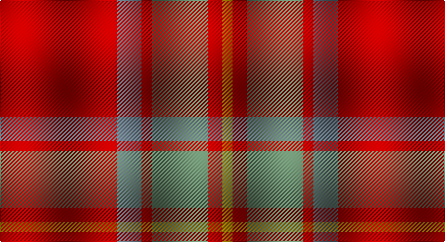

This page is one **sett** — a single exact thread-count. It belongs to the [tartan](/setts/r58n12r5y28r7lo5/)
(the same proportion at any scale), whose colour order is pattern [RBRGRY](/stripes/rbrgry/).

Sourced from tartans-authority.  It is a [6 stripe tartan](/stripes/stripes6/).

Original link http://www.tartansauthority.com/tartan-ferret/display/8123/

## Register references

External register numbers recorded for this tartan.

- Scottish Register of Tartans: [8123](https://www.tartanregister.gov.uk/tartanDetails?ref=8123)
- Scottish Tartans Authority (ITI): 8123

## Thread count
R/116 B24 R10 N56 R14 DY/10

One full sett is **334 threads**.

## Palette

Palette: <strong>Tartan Register</strong> <small style="color:#888">(1 of 4 colours)</small>
<table><thead><tr><th>Colour</th><th>Threads</th><th>Shade</th><th>Base</th><th>OKLCh</th></tr></thead><tbody><tr><td>R/</td><td style="text-align:right;font-variant-numeric:tabular-nums">116</td><td><code style="background-color:#B40000;">#B40000</code> <small style="color:#888">#B40000</small></td><td>R <code style="background-color:#CC0000;">#CC0000</code></td><td><small style="color:#888">oklch(48.3% 0.198 29.2)</small></td></tr><tr><td>B</td><td style="text-align:right;font-variant-numeric:tabular-nums">24</td><td><code style="background-color:#647480;">#647480</code> <small style="color:#888">#647480</small></td><td>B <code style="background-color:#2A418A;">#2A418A</code></td><td><small style="color:#888">oklch(55.0% 0.027 240.4)</small></td></tr><tr><td>R</td><td style="text-align:right;font-variant-numeric:tabular-nums">10</td><td><code style="background-color:#B40000;">#B40000</code> <small style="color:#888">#B40000</small></td><td>R <code style="background-color:#CC0000;">#CC0000</code></td><td><small style="color:#888">oklch(48.3% 0.198 29.2)</small></td></tr><tr><td>N</td><td style="text-align:right;font-variant-numeric:tabular-nums">56</td><td><code style="background-color:#648468;">#648468</code> <small style="color:#888">#648468</small></td><td>G <code style="background-color:#006100;">#006100</code></td><td><small style="color:#888">oklch(58.1% 0.056 148.2)</small></td></tr><tr><td>R</td><td style="text-align:right;font-variant-numeric:tabular-nums">14</td><td><code style="background-color:#B40000;">#B40000</code> <small style="color:#888">#B40000</small></td><td>R <code style="background-color:#CC0000;">#CC0000</code></td><td><small style="color:#888">oklch(48.3% 0.198 29.2)</small></td></tr><tr><td>DY/</td><td style="text-align:right;font-variant-numeric:tabular-nums">10</td><td><code style="background-color:#BC8C00;">#BC8C00</code> <small style="color:#888">#BC8C00</small></td><td>Y <code style="background-color:#F2BF00;">#F2BF00</code></td><td><small style="color:#888">oklch(66.8% 0.137 84.1)</small></td></tr></tbody></table>

# Sample pattern

## Nearest tartans

The nearest existing variants by ΔTartan distance, with this tartan at the top so the swatches line up against it.

ΔTartan

Tartan

Sett

—

<a href="/ttd/edit/#slug=r58n12r5y28r7lo5~x2">Cairn O'Mount (Personal)</a> <a class="nn-out" href="/variants/s6/r58n12r5y28r7lo5~x2/" title="open its dictionary page">↗</a>

1.17

<a href="/ttd/edit/#slug=r12n2lr1n2r3dg8r3n1~x2&amp;base=r58n12r5y28r7lo5~x2">Chisholm</a> <a class="nn-out" href="/variants/s8/r12n2lr1n2r3dg8r3n1~x2/" title="open its dictionary page">↗</a>

1.17

<a href="/ttd/edit/#slug=r12n2lr1n2r3dg8r3n1&amp;base=r58n12r5y28r7lo5~x2">Chisholm</a> <a class="nn-out" href="/variants/s8/r12n2lr1n2r3dg8r3n1/" title="open its dictionary page">↗</a>

1.33

<a href="/ttd/edit/#slug=r37o9r3g9o3~x2&amp;base=r58n12r5y28r7lo5~x2">Glen Shee</a> <a class="nn-out" href="/variants/s5/r37o9r3g9o3~x2/" title="open its dictionary page">↗</a>

1.39

<a href="/ttd/edit/#slug=r3o28do5o5do33o5do5o28lo3~x2&amp;base=r58n12r5y28r7lo5~x2">MacIver of Strathendry Htg (Personal</a> <a class="nn-out" href="/variants/s9/r3o28do5o5do33o5do5o28lo3~x2/" title="open its dictionary page">↗</a>

1.46

<a href="/ttd/edit/#slug=r29g2r2g2r6lo21~x4&amp;base=r58n12r5y28r7lo5~x2">Maguire, Black (Name)</a> <a class="nn-out" href="/variants/s6/r29g2r2g2r6lo21~x4/" title="open its dictionary page">↗</a>

1.47

<a href="/ttd/edit/#slug=m37dy9m3g9dy3~x2&amp;base=r58n12r5y28r7lo5~x2">Glen Shee Trade Tartan</a> <a class="nn-out" href="/variants/s5/m37dy9m3g9dy3~x2/" title="open its dictionary page">↗</a>

1.57

<a href="/ttd/edit/#slug=db2r22dy11y2dy11db2~x2&amp;base=r58n12r5y28r7lo5~x2">Cetoloni</a> <a class="nn-out" href="/variants/s6/db2r22dy11y2dy11db2~x2/" title="open its dictionary page">↗</a>

1.69

<a href="/ttd/edit/#slug=r30y3db5y21r3y21db2~x2&amp;base=r58n12r5y28r7lo5~x2">Scottish Piping Soc. of London (Corp</a> <a class="nn-out" href="/variants/s7/r30y3db5y21r3y21db2~x2/" title="open its dictionary page">↗</a>

1.71

<a href="/ttd/edit/#slug=r3y19ly3y19r3y3r21t3~x2&amp;base=r58n12r5y28r7lo5~x2">Burnett of Powis (Personal)</a> <a class="nn-out" href="/variants/s8/r3y19ly3y19r3y3r21t3~x2/" title="open its dictionary page">↗</a>

1.80

<a href="/ttd/edit/#slug=r12g1r1o8r2o1r1db3r1o1r12g1r1g4~x2&amp;base=r58n12r5y28r7lo5~x2">MacColl</a> <a class="nn-out" href="/variants/s14/r12g1r1o8r2o1r1db3r1o1r12g1r1g4~x2/" title="open its dictionary page">↗</a>

## Neighbour map

Every grey dot is one of 14360 variants placed by the first two principal components of the ΔTartan feature space (44% of its variance). Red is this tartan; blue dots are its nearest — click one to open its page.

<svg viewBox="0 0 640 380" role="img" style="max-width:100%;height:auto;border:1px solid #e0e0e0;border-radius:4px;display:block" xmlns="http://www.w3.org/2000/svg"><image href="/nn/cloud.v1.png" width="640" height="380"/><a href="/variants/s8/r12n2lr1n2r3dg8r3n1~x2/"><circle cx="376.4" cy="207.5" r="4" fill="#3465a4"><title>Chisholm</title></circle></a><a href="/variants/s8/r12n2lr1n2r3dg8r3n1/"><circle cx="376.4" cy="207.5" r="4" fill="#3465a4"><title>Chisholm</title></circle></a><a href="/variants/s5/r37o9r3g9o3~x2/"><circle cx="487.3" cy="240.2" r="4" fill="#3465a4"><title>Glen Shee</title></circle></a><a href="/variants/s9/r3o28do5o5do33o5do5o28lo3~x2/"><circle cx="419.9" cy="217.7" r="4" fill="#3465a4"><title>MacIver of Strathendry Htg (Personal</title></circle></a><a href="/variants/s6/r29g2r2g2r6lo21~x4/"><circle cx="452.8" cy="206.5" r="4" fill="#3465a4"><title>Maguire, Black (Name)</title></circle></a><a href="/variants/s5/m37dy9m3g9dy3~x2/"><circle cx="494.1" cy="241.8" r="4" fill="#3465a4"><title>Glen Shee Trade Tartan</title></circle></a><a href="/variants/s6/db2r22dy11y2dy11db2~x2/"><circle cx="353.6" cy="233.6" r="4" fill="#3465a4"><title>Cetoloni</title></circle></a><a href="/variants/s7/r30y3db5y21r3y21db2~x2/"><circle cx="389.5" cy="219.5" r="4" fill="#3465a4"><title>Scottish Piping Soc. of London (Corp</title></circle></a><a href="/variants/s8/r3y19ly3y19r3y3r21t3~x2/"><circle cx="351.4" cy="226.0" r="4" fill="#3465a4"><title>Burnett of Powis (Personal)</title></circle></a><a href="/variants/s14/r12g1r1o8r2o1r1db3r1o1r12g1r1g4~x2/"><circle cx="412.0" cy="166.5" r="4" fill="#3465a4"><title>MacColl</title></circle></a><circle cx="426.8" cy="215.9" r="5" fill="#c00000"/></svg>

ID: /variants/s6/r58n12r5y28r7lo5~x2/
