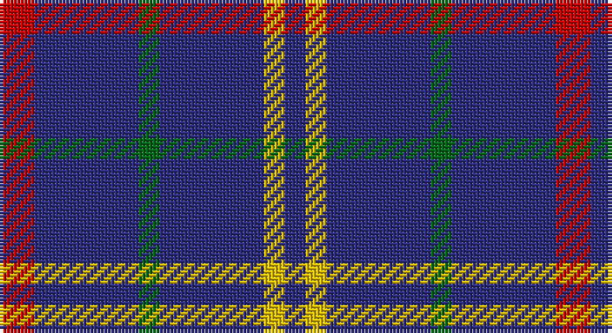

This page is one **sett** — a single exact thread-count. It belongs to the [tartan](/setts/r5db15g3db15ly3db3/)
(the same proportion at any scale), whose colour order is pattern [BYBGBR](/stripes/bybgbr/).

Sourced from register-of-tartans.  It is a [6 stripe tartan](/stripes/stripes6/).

Original link https://www.tartanregister.gov.uk/tartanDetails.aspx?ref=22

2 attestations — the source records this cloth was collapsed from (oldest owns this page)

<ul>
<li>01/01/2003 — Abertay University (Estimated threadcount) (register-of-tartans, <a href="https://www.tartanregister.gov.uk/tartanDetails.aspx?ref=22">record</a>)</li>
<li>pre 2003 — Abertay University (Corporate) (tartans-authority, <a href="http://www.tartansauthority.com/tartan-ferret/display/5990/">record</a>)</li>
</ul>

## Register references

External register numbers recorded for this tartan.

- Scottish Register of Tartans: [22](https://www.tartanregister.gov.uk/tartanDetails.aspx?ref=22)
- Scottish Tartans Authority (ITI): 5990

## Thread count
R/10 DB30 G6 DB30 Y6 DB/6

One full sett is **160 threads**.

## Palette

Palette: <strong>Tartan Register</strong>
<table><thead><tr><th>Colour</th><th>Threads</th><th>Shade</th><th>Base</th><th>OKLCh</th></tr></thead><tbody><tr><td>R/</td><td style="text-align:right;font-variant-numeric:tabular-nums">10</td><td><code style="background-color:#C80000;">#C80000</code> <small style="color:#888">#C80000</small></td><td>R <code style="background-color:#CC0000;">#CC0000</code></td><td><small style="color:#888">oklch(52.3% 0.215 29.2)</small></td></tr><tr><td>DB</td><td style="text-align:right;font-variant-numeric:tabular-nums">30</td><td><code style="background-color:#2C2C80;">#2C2C80</code> <small style="color:#888">#2C2C80</small></td><td>B <code style="background-color:#2A418A;">#2A418A</code></td><td><small style="color:#888">oklch(35.0% 0.138 276.6)</small></td></tr><tr><td>G</td><td style="text-align:right;font-variant-numeric:tabular-nums">6</td><td><code style="background-color:#006818;">#006818</code> <small style="color:#888">#006818</small></td><td>G <code style="background-color:#006100;">#006100</code></td><td><small style="color:#888">oklch(45.0% 0.142 145.0)</small></td></tr><tr><td>DB</td><td style="text-align:right;font-variant-numeric:tabular-nums">30</td><td><code style="background-color:#2C2C80;">#2C2C80</code> <small style="color:#888">#2C2C80</small></td><td>B <code style="background-color:#2A418A;">#2A418A</code></td><td><small style="color:#888">oklch(35.0% 0.138 276.6)</small></td></tr><tr><td>Y</td><td style="text-align:right;font-variant-numeric:tabular-nums">6</td><td><code style="background-color:#E8C000;">#E8C000</code> <small style="color:#888">#E8C000</small></td><td>Y <code style="background-color:#F2BF00;">#F2BF00</code></td><td><small style="color:#888">oklch(81.9% 0.168 93.7)</small></td></tr><tr><td>DB/</td><td style="text-align:right;font-variant-numeric:tabular-nums">6</td><td><code style="background-color:#2C2C80;">#2C2C80</code> <small style="color:#888">#2C2C80</small></td><td>B <code style="background-color:#2A418A;">#2A418A</code></td><td><small style="color:#888">oklch(35.0% 0.138 276.6)</small></td></tr></tbody></table>

# Sample pattern

## Nearest tartans

The nearest existing variants by ΔTartan distance, with this tartan at the top so the swatches line up against it.

ΔTartan

Tartan

Sett

—

<a href="/ttd/edit/#slug=r5db15g3db15ly3db3~x2">Abertay University (Estimated threadcount)</a> <a class="nn-out" href="/variants/s6/r5db15g3db15ly3db3~x2/" title="open its dictionary page">↗</a>

1.36

<a href="/ttd/edit/#slug=db24w4db24lo4r5k4~x2&amp;base=r5db15g3db15ly3db3~x2">de Grussa (Personal)</a> <a class="nn-out" href="/variants/s6/db24w4db24lo4r5k4~x2/" title="open its dictionary page">↗</a>

1.42

<a href="/ttd/edit/#slug=db14m3db14dy6db14w4db14ly3~x2&amp;base=r5db15g3db15ly3db3~x2">Columba of Iona (School)</a> <a class="nn-out" href="/variants/s8/db14m3db14dy6db14w4db14ly3~x2/" title="open its dictionary page">↗</a>

1.49

<a href="/ttd/edit/#slug=w1db8r3db2r1db2r3db8lo1~x4&amp;base=r5db15g3db15ly3db3~x2">Louisville Fire &amp; Rescue P&amp;D</a> <a class="nn-out" href="/variants/s9/w1db8r3db2r1db2r3db8lo1~x4/" title="open its dictionary page">↗</a>

1.50

<a href="/ttd/edit/#slug=db24w4db24ly4r5k4~x2&amp;base=r5db15g3db15ly3db3~x2">De Grussa</a> <a class="nn-out" href="/variants/s6/db24w4db24ly4r5k4~x2/" title="open its dictionary page">↗</a>

1.53

<a href="/ttd/edit/#slug=db65k9db21ly8db21w8db35r35&amp;base=r5db15g3db15ly3db3~x2">Maud, Mary</a> <a class="nn-out" href="/variants/s8/db65k9db21ly8db21w8db35r35/" title="open its dictionary page">↗</a>

1.58

<a href="/ttd/edit/#slug=db9k9db9k9db42w5~x2&amp;base=r5db15g3db15ly3db3~x2">Dollar Academy (1930s) (Corporate)</a> <a class="nn-out" href="/variants/s6/db9k9db9k9db42w5~x2/" title="open its dictionary page">↗</a>

1.78

<a href="/ttd/edit/#slug=db35lr8db21lr13db6lo4~x2&amp;base=r5db15g3db15ly3db3~x2">Ochterlonie</a> <a class="nn-out" href="/variants/s6/db35lr8db21lr13db6lo4~x2/" title="open its dictionary page">↗</a>

1.78

<a href="/ttd/edit/#slug=dp30m5dp5t4dp4g12~x2&amp;base=r5db15g3db15ly3db3~x2">International Festival of Authors</a> <a class="nn-out" href="/variants/s6/dp30m5dp5t4dp4g12~x2/" title="open its dictionary page">↗</a>

1.79

<a href="/ttd/edit/#slug=db9k9db9k9db42lb5~x2&amp;base=r5db15g3db15ly3db3~x2">Dollar Academy</a> <a class="nn-out" href="/variants/s6/db9k9db9k9db42lb5~x2/" title="open its dictionary page">↗</a>

1.87

<a href="/variants/s6/db60ly6db11r25~x2/">South Australian Pipes &amp; Drums (Corp</a>

## Neighbour map

Every grey dot is one of 14360 variants placed by the first two principal components of the ΔTartan feature space (44% of its variance). Red is this tartan; blue dots are its nearest — click one to open its page.

<svg viewBox="0 0 640 380" role="img" style="max-width:100%;height:auto;border:1px solid #e0e0e0;border-radius:4px;display:block" xmlns="http://www.w3.org/2000/svg"><image href="/nn/cloud.v1.png" width="640" height="380"/><a href="/variants/s6/db24w4db24lo4r5k4~x2/"><circle cx="376.5" cy="221.6" r="4" fill="#3465a4"><title>de Grussa (Personal)</title></circle></a><a href="/variants/s8/db14m3db14dy6db14w4db14ly3~x2/"><circle cx="375.6" cy="251.9" r="4" fill="#3465a4"><title>Columba of Iona (School)</title></circle></a><a href="/variants/s9/w1db8r3db2r1db2r3db8lo1~x4/"><circle cx="381.4" cy="208.2" r="4" fill="#3465a4"><title>Louisville Fire &amp; Rescue P&amp;D</title></circle></a><a href="/variants/s6/db24w4db24ly4r5k4~x2/"><circle cx="359.3" cy="214.5" r="4" fill="#3465a4"><title>De Grussa</title></circle></a><a href="/variants/s8/db65k9db21ly8db21w8db35r35/"><circle cx="349.3" cy="204.7" r="4" fill="#3465a4"><title>Maud, Mary</title></circle></a><a href="/variants/s6/db9k9db9k9db42w5~x2/"><circle cx="447.9" cy="250.6" r="4" fill="#3465a4"><title>Dollar Academy (1930s) (Corporate)</title></circle></a><a href="/variants/s6/db35lr8db21lr13db6lo4~x2/"><circle cx="387.2" cy="240.0" r="4" fill="#3465a4"><title>Ochterlonie</title></circle></a><a href="/variants/s6/dp30m5dp5t4dp4g12~x2/"><circle cx="348.3" cy="211.4" r="4" fill="#3465a4"><title>International Festival of Authors</title></circle></a><a href="/variants/s6/db9k9db9k9db42lb5~x2/"><circle cx="463.7" cy="258.6" r="4" fill="#3465a4"><title>Dollar Academy</title></circle></a><a href="/variants/s6/db60ly6db11r25~x2/"><circle cx="409.5" cy="215.7" r="4" fill="#3465a4"><title>South Australian Pipes &amp; Drums (Corp</title></circle></a><circle cx="400.8" cy="256.2" r="5" fill="#c00000"/></svg>

ID: /variants/s6/r5db15g3db15ly3db3~x2/
