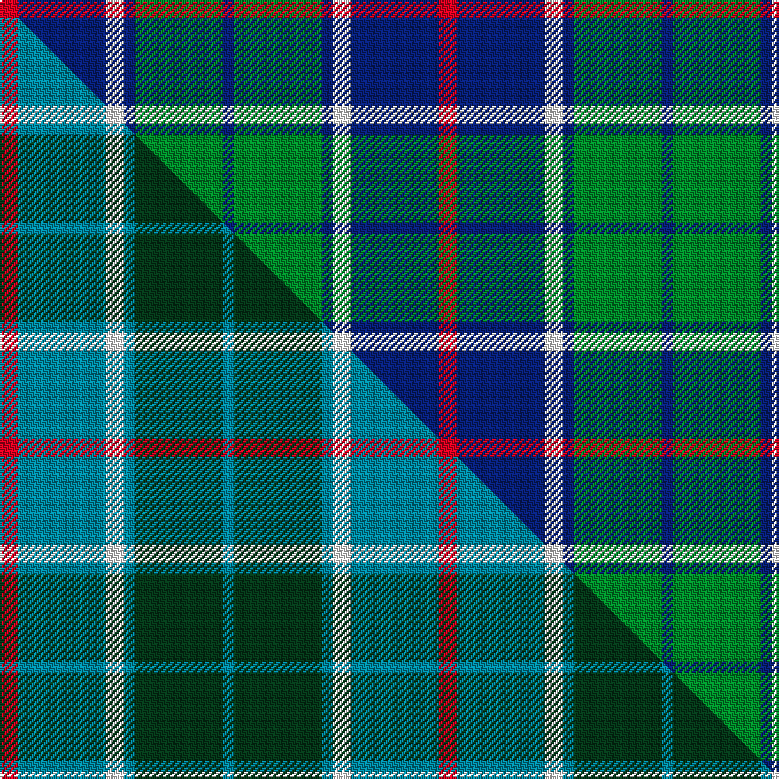

This is one **variant** — a specific cloth: this exact thread count and colourway, with its own
provenance below. It is one weaving of the [sett](/tartans/t/th/thayer-usa/) (the scale-free proportion — the
same cloth at any scale or shade), whose colour order is pattern [BGBWBR](/stripes/bgbwbr/).

Part of the [Thayer USA](/tartans/t/th/thayer-usa/) tartan — the named design grouping this sett with its other cloths.

Sourced from tartans-authority.  It is a [6 stripe tartan](/stripes/stripes6/).

Original link <code>http://www.tartansauthority.com/tartan-ferret/display/10150/</code> — retired · [Internet Archive copy](https://web.archive.org/web/*/http://www.tartansauthority.com/tartan-ferret/display/10150/*)

Dataset <small>— provenance for this record, inherited from the source manifest</small>

<dl class="dataset-prov">
<dt>source</dt><dd><a href="/sources/tartans-authority/">Scottish Tartans Authority</a></dd>
<dt>data captured from</dt><dd><a href="https://github.com/thetartan/tartan-database/blob/master/data/tartans-authority/data.csv">https://github.com/thetartan/tartan-database/blob/master/data/tartans-authority/data.csv</a></dd>
<dt>data date</dt><dd>pre 2010 <small>(this record)</small></dd>
<dt>licence</dt><dd><a href="https://creativecommons.org/licenses/by-nc-nd/4.0/">CC BY-NC-ND 4.0</a></dd>
</dl>

Capture chain <small>— the hands this data passed through, oldest first; each capture carries its own licence</small>

<ol class="capture-chain">
<li><a href="https://www.tartansauthority.com/">Scottish Tartans Authority</a> <small>the heritage body’s archive — its tartan-ferret record browser is retired; dead record links are shown unlinked, with an Internet Archive copy (ITI numbers are not SRT references)</small></li>
<li><a href="https://github.com/thetartan/tartan-database">thetartan/tartan-database</a> <small>2016-2017</small> · <a href="https://creativecommons.org/licenses/by-nc-nd/4.0/">CC BY-NC-ND 4.0</a> <small>Levko Kravets's frozen compilation — the capture we vendored, and where its CC licence text came from</small></li>
<li>this dictionary <small>captured 2026-06-10 · commit 5bf86c7566</small> <small>each re-capture is a git commit to data/sources</small></li>
</ol>

## Register references

External register numbers recorded for this tartan.

- Scottish Register of Tartans: [10150](https://www.tartanregister.gov.uk/tartanDetails?ref=10150)
- Scottish Tartans Authority (ITI): 10150

## Thread count
R/10 DB50 W10 DB6 G50 DB/6

One full sett is **248 threads**.

## Palette
<table><thead><tr><th>Colour</th><th>Shade</th><th>OKLCh</th></tr></thead><tbody><tr><td>DB</td><td><code style="background-color:#082077;">#082077</code> <small style="color:#888">#082077</small></td><td><small style="color:#888">oklch(30.0% 0.149 265.1)</small></td></tr><tr><td>G</td><td><code style="background-color:#008B2A;">#008B2A</code> <small style="color:#888">#008B2A</small></td><td><small style="color:#888">oklch(55.4% 0.170 145.9)</small></td></tr><tr><td>W</td><td><code style="background-color:#F7F7F7;">#F7F7F7</code> <small style="color:#888">#F7F7F7</small></td><td><small style="color:#888">oklch(97.6% 0.000 89.9)</small></td></tr><tr><td>R</td><td><code style="background-color:#D60020;">#D60020</code> <small style="color:#888">#D60020</small></td><td><small style="color:#888">oklch(55.2% 0.224 25.5)</small></td></tr></tbody></table>

# Sample pattern

## Compared to the master

This cloth is one sett of its design; the master sett (the exemplar the design is anchored on) is below for comparison.

Its **ΔTartan distance** from the master is **0.23** — the same measure the nearest-tartans table ranks by (0 is identical; a re-scale of the same cloth is near 0, a recolour or a different proportion further).

<figure class="master-compare" style="margin:0">

this sett
master sett ★

<figcaption style="color:#888;font-size:smaller">One weave of this sett against the <a href="/setts/r5t25w5t3dg25t3/">master sett ★</a>, split on the diagonal: a shared proportion runs seamlessly across it with only the shades shifting; a different proportion breaks on it.</figcaption>
</figure>

## Nearest tartan variants

The nearest existing variants by ΔTartan distance, with this cloth at the top so the swatches line up against it.

ΔTartan

Threads

Variant

Sett

—

248

<a href="/variants/s6/r5db25w5db3g25db3~x2/">Thayer USA (Name)</a>

<a href="/ttd/edit/#slug=r5t25w5t3dg25t3~x2&amp;base=r5db25w5db3g25db3~x2" title="compare in the TTD">0.23</a>

248

<a href="/variants/s6/r5t25w5t3dg25t3~x2/">Thayer USA</a>

<a href="/ttd/edit/#slug=r3t25k16t3g25t3~x2~g5813165&amp;base=r5db25w5db3g25db3~x2" title="compare in the TTD">0.41</a>

288

<a href="/variants/s6/r3t25k16t3g25t3~x2~g5813165/">Flower of Scotland</a>

<a href="/ttd/edit/#slug=db3g28db3k16db28r3&amp;base=r5db25w5db3g25db3~x2" title="compare in the TTD">0.42</a>

156

<a href="/variants/s6/db3g28db3k16db28r3/">Flower of Scotland</a>

<a href="/ttd/edit/#slug=r1t7k4t1dg7t1~x4&amp;base=r5db25w5db3g25db3~x2" title="compare in the TTD">0.48</a>

160

<a href="/variants/s6/r1t7k4t1dg7t1~x4/">Flower of Scotland Commemorative Tartan</a>

<a href="/ttd/edit/#slug=r1t7k4t1dg7t1~x2&amp;base=r5db25w5db3g25db3~x2" title="compare in the TTD">0.48</a>

80

<a href="/variants/s6/r1t7k4t1dg7t1~x2/">Flower of Scotland MINI Tartan</a>

<a href="/ttd/edit/#slug=g11dy4w1db10dr1db2~x4&amp;base=r5db25w5db3g25db3~x2" title="compare in the TTD">1.38</a>

180

<a href="/variants/s6/g11dy4w1db10dr1db2~x4/">Ayrshire</a>

<a href="/ttd/edit/#slug=db9r3db1g9r3db1~x2&amp;base=r5db25w5db3g25db3~x2" title="compare in the TTD">1.47</a>

84

<a href="/variants/s6/db9r3db1g9r3db1~x2/">Logan #5</a>

<a href="/ttd/edit/#slug=db3dg21db3o21db35w3~x2&amp;base=r5db25w5db3g25db3~x2" title="compare in the TTD">1.51</a>

332

<a href="/variants/s6/db3dg21db3o21db35w3~x2/">Donnolly</a>

<a href="/ttd/edit/#slug=w4g28db18r4db18y3~x2&amp;base=r5db25w5db3g25db3~x2" title="compare in the TTD">1.71</a>

286

<a href="/variants/s6/w4g28db18r4db18y3~x2/">Inglis Family Tartan</a>

<a href="/ttd/edit/#slug=lr4g24db10r3db12lo4~x2&amp;base=r5db25w5db3g25db3~x2" title="compare in the TTD">1.86</a>

212

<a href="/variants/s6/lr4g24db10r3db12lo4~x2/">Inglis (Name)</a>

## Neighbour map

Every grey dot is one of 13662 variants placed by the first two principal components of the ΔTartan feature space (42% of its variance). Red is this tartan; blue dots are its nearest — click one to open its page. The map is a flat projection of a many-dimensional space — [how to read it](/posts/neighbourhood-maps/).

<svg viewBox="0 0 640 380" role="img" style="max-width:100%;height:auto;border:1px solid #e0e0e0;border-radius:4px;display:block" xmlns="http://www.w3.org/2000/svg"><image href="/nn/cloud.v1.png" width="640" height="380"/><a href="/variants/s6/r5t25w5t3dg25t3~x2/"><circle cx="268.5" cy="224.3" r="4" fill="#3465a4"><title>Thayer USA</title></circle></a><a href="/variants/s6/r3t25k16t3g25t3~x2~g5813165/"><circle cx="186.3" cy="216.1" r="4" fill="#3465a4"><title>Flower of Scotland</title></circle></a><a href="/variants/s6/db3g28db3k16db28r3/"><circle cx="197.2" cy="204.6" r="4" fill="#3465a4"><title>Flower of Scotland</title></circle></a><a href="/variants/s6/r1t7k4t1dg7t1~x4/"><circle cx="192.9" cy="223.5" r="4" fill="#3465a4"><title>Flower of Scotland Commemorative Tartan</title></circle></a><a href="/variants/s6/r1t7k4t1dg7t1~x2/"><circle cx="192.9" cy="223.5" r="4" fill="#3465a4"><title>Flower of Scotland MINI Tartan</title></circle></a><a href="/variants/s6/g11dy4w1db10dr1db2~x4/"><circle cx="246.7" cy="218.4" r="4" fill="#3465a4"><title>Ayrshire</title></circle></a><a href="/variants/s6/db9r3db1g9r3db1~x2/"><circle cx="251.9" cy="237.4" r="4" fill="#3465a4"><title>Logan #5</title></circle></a><a href="/variants/s6/db3dg21db3o21db35w3~x2/"><circle cx="285.8" cy="215.9" r="4" fill="#3465a4"><title>Donnolly</title></circle></a><a href="/variants/s6/w4g28db18r4db18y3~x2/"><circle cx="235.7" cy="214.4" r="4" fill="#3465a4"><title>Inglis Family Tartan</title></circle></a><a href="/variants/s6/lr4g24db10r3db12lo4~x2/"><circle cx="201.4" cy="219.6" r="4" fill="#3465a4"><title>Inglis (Name)</title></circle></a><circle cx="247.8" cy="216.5" r="5" fill="#c00000"/><text x="320" y="376" text-anchor="middle" font-size="11" fill="#999">ground</text><text x="11" y="190" text-anchor="middle" font-size="11" fill="#999" transform="rotate(-90 11 190)">complexity</text></svg>

ID: /variants/s6/r5db25w5db3g25db3~x2/
