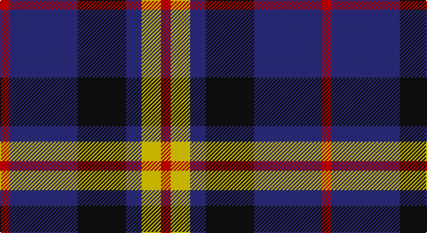

This page is one **sett** — a single exact thread-count. It belongs to the [tartan](/setts/r5db35k25db8ly10r5/)
(the same proportion at any scale), whose colour order is pattern [RBKBYR](/stripes/rbkbyr/).

Sourced from tartans-authority.  It is a [6 stripe tartan](/stripes/stripes6/).

Original link http://www.tartansauthority.com/tartan-ferret/display/8584/

## Register references

External register numbers recorded for this tartan.

- Scottish Register of Tartans: [8584](https://www.tartanregister.gov.uk/tartanDetails?ref=8584)
- Scottish Tartans Authority (ITI): 8584

## Thread count
R/10 DB70 K50 DB16 Y20 R/10

One full sett is **332 threads**.

## Palette

Palette: <strong>Tartan Register</strong>
<table><thead><tr><th>Colour</th><th>Threads</th><th>Shade</th><th>Base</th><th>OKLCh</th></tr></thead><tbody><tr><td>R/</td><td style="text-align:right;font-variant-numeric:tabular-nums">10</td><td><code style="background-color:#C80000;">#C80000</code> <small style="color:#888">#C80000</small></td><td>R <code style="background-color:#CC0000;">#CC0000</code></td><td><small style="color:#888">oklch(52.3% 0.215 29.2)</small></td></tr><tr><td>DB</td><td style="text-align:right;font-variant-numeric:tabular-nums">70</td><td><code style="background-color:#2C2C80;">#2C2C80</code> <small style="color:#888">#2C2C80</small></td><td>B <code style="background-color:#2A418A;">#2A418A</code></td><td><small style="color:#888">oklch(35.0% 0.138 276.6)</small></td></tr><tr><td>K</td><td style="text-align:right;font-variant-numeric:tabular-nums">50</td><td><code style="background-color:#101010;">#101010</code> <small style="color:#888">#101010</small></td><td>K <code style="background-color:#000000;">#000000</code></td><td><small style="color:#888">oklch(17.3% 0.000 89.9)</small></td></tr><tr><td>DB</td><td style="text-align:right;font-variant-numeric:tabular-nums">16</td><td><code style="background-color:#2C2C80;">#2C2C80</code> <small style="color:#888">#2C2C80</small></td><td>B <code style="background-color:#2A418A;">#2A418A</code></td><td><small style="color:#888">oklch(35.0% 0.138 276.6)</small></td></tr><tr><td>Y</td><td style="text-align:right;font-variant-numeric:tabular-nums">20</td><td><code style="background-color:#FCCC00;">#FCCC00</code> <small style="color:#888">#FCCC00</small></td><td>Y <code style="background-color:#F2BF00;">#F2BF00</code></td><td><small style="color:#888">oklch(86.2% 0.176 91.5)</small></td></tr><tr><td>R/</td><td style="text-align:right;font-variant-numeric:tabular-nums">10</td><td><code style="background-color:#C80000;">#C80000</code> <small style="color:#888">#C80000</small></td><td>R <code style="background-color:#CC0000;">#CC0000</code></td><td><small style="color:#888">oklch(52.3% 0.215 29.2)</small></td></tr></tbody></table>

# Sample pattern

## Nearest tartans

The nearest existing variants by ΔTartan distance, with this tartan at the top so the swatches line up against it.

ΔTartan

Tartan

Sett

—

<a href="/ttd/edit/#slug=r5db35k25db8ly10r5~x2">University of Notre Dame</a> <a class="nn-out" href="/variants/s6/r5db35k25db8ly10r5~x2/" title="open its dictionary page">↗</a>

0.66

<a href="/ttd/edit/#slug=r12db3g5db16ly2g2~x2&amp;base=r5db35k25db8ly10r5~x2">Dunbog Primary (School)</a> <a class="nn-out" href="/variants/s6/r12db3g5db16ly2g2~x2/" title="open its dictionary page">↗</a>

0.78

<a href="/ttd/edit/#slug=db2ly1db7w1k7w2~x6&amp;base=r5db35k25db8ly10r5~x2">Hawick Rugby Club (Corporate)</a> <a class="nn-out" href="/variants/s6/db2ly1db7w1k7w2~x6/" title="open its dictionary page">↗</a>

1.05

<a href="/ttd/edit/#slug=db5k1g1k1r3k1~x4&amp;base=r5db35k25db8ly10r5~x2">Clerk</a> <a class="nn-out" href="/variants/s6/db5k1g1k1r3k1~x4/" title="open its dictionary page">↗</a>

1.09

<a href="/ttd/edit/#slug=db9k7o5r1o5k1o2~x4&amp;base=r5db35k25db8ly10r5~x2">Greyhound Grenadiers (Corporate)</a> <a class="nn-out" href="/variants/s7/db9k7o5r1o5k1o2~x4/" title="open its dictionary page">↗</a>

1.09

<a href="/ttd/edit/#slug=r2b13dr3b3dr16lb2~x4&amp;base=r5db35k25db8ly10r5~x2">MacArthur-Fox Blue (Personal)</a> <a class="nn-out" href="/variants/s6/r2b13dr3b3dr16lb2~x4/" title="open its dictionary page">↗</a>

1.14

<a href="/ttd/edit/#slug=db3r2g5r8db12w3~x2&amp;base=r5db35k25db8ly10r5~x2">Edinburgh Bus Company (Corporate)</a> <a class="nn-out" href="/variants/s6/db3r2g5r8db12w3~x2/" title="open its dictionary page">↗</a>

1.15

<a href="/ttd/edit/#slug=r8k18r6k18b27k2w3~x2&amp;base=r5db35k25db8ly10r5~x2">MacKean (Personal)</a> <a class="nn-out" href="/variants/s7/r8k18r6k18b27k2w3~x2/" title="open its dictionary page">↗</a>

1.16

<a href="/ttd/edit/#slug=k3dg3k3b16k3r3k3~x2&amp;base=r5db35k25db8ly10r5~x2">Eglinton</a> <a class="nn-out" href="/variants/s7/k3dg3k3b16k3r3k3~x2/" title="open its dictionary page">↗</a>

1.16

<a href="/ttd/edit/#slug=k3dg3k3b16k3r3k3&amp;base=r5db35k25db8ly10r5~x2">Eglinton</a> <a class="nn-out" href="/variants/s7/k3dg3k3b16k3r3k3/" title="open its dictionary page">↗</a>

1.21

<a href="/ttd/edit/#slug=db31t4db6k19r20ly4~x2&amp;base=r5db35k25db8ly10r5~x2">Fife (McGill)</a> <a class="nn-out" href="/variants/s6/db31t4db6k19r20ly4~x2/" title="open its dictionary page">↗</a>

## Neighbour map

Every grey dot is one of 14360 variants placed by the first two principal components of the ΔTartan feature space (44% of its variance). Red is this tartan; blue dots are its nearest — click one to open its page.

<svg viewBox="0 0 640 380" role="img" style="max-width:100%;height:auto;border:1px solid #e0e0e0;border-radius:4px;display:block" xmlns="http://www.w3.org/2000/svg"><image href="/nn/cloud.v1.png" width="640" height="380"/><a href="/variants/s6/r12db3g5db16ly2g2~x2/"><circle cx="223.3" cy="210.7" r="4" fill="#3465a4"><title>Dunbog Primary (School)</title></circle></a><a href="/variants/s6/db2ly1db7w1k7w2~x6/"><circle cx="196.8" cy="218.7" r="4" fill="#3465a4"><title>Hawick Rugby Club (Corporate)</title></circle></a><a href="/variants/s6/db5k1g1k1r3k1~x4/"><circle cx="172.1" cy="234.5" r="4" fill="#3465a4"><title>Clerk</title></circle></a><a href="/variants/s7/db9k7o5r1o5k1o2~x4/"><circle cx="185.3" cy="222.0" r="4" fill="#3465a4"><title>Greyhound Grenadiers (Corporate)</title></circle></a><a href="/variants/s6/r2b13dr3b3dr16lb2~x4/"><circle cx="278.6" cy="217.5" r="4" fill="#3465a4"><title>MacArthur-Fox Blue (Personal)</title></circle></a><a href="/variants/s6/db3r2g5r8db12w3~x2/"><circle cx="181.6" cy="231.2" r="4" fill="#3465a4"><title>Edinburgh Bus Company (Corporate)</title></circle></a><a href="/variants/s7/r8k18r6k18b27k2w3~x2/"><circle cx="229.8" cy="195.6" r="4" fill="#3465a4"><title>MacKean (Personal)</title></circle></a><a href="/variants/s7/k3dg3k3b16k3r3k3~x2/"><circle cx="212.0" cy="216.3" r="4" fill="#3465a4"><title>Eglinton</title></circle></a><a href="/variants/s7/k3dg3k3b16k3r3k3/"><circle cx="212.0" cy="216.3" r="4" fill="#3465a4"><title>Eglinton</title></circle></a><a href="/variants/s6/db31t4db6k19r20ly4~x2/"><circle cx="188.2" cy="210.2" r="4" fill="#3465a4"><title>Fife (McGill)</title></circle></a><circle cx="220.4" cy="222.4" r="5" fill="#c00000"/></svg>

ID: /variants/s6/r5db35k25db8ly10r5~x2/
