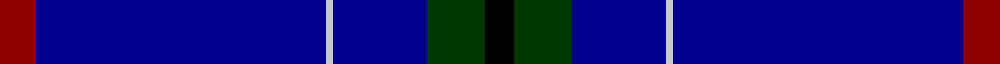
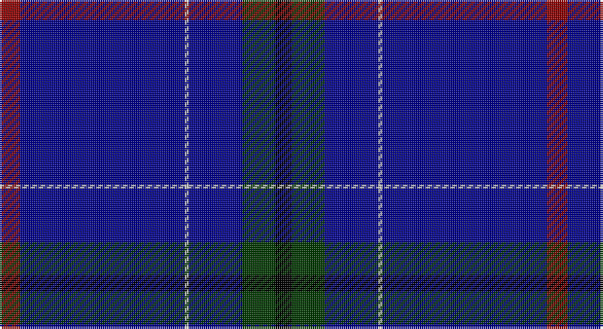

This page is one **sett** — a single exact thread-count. It belongs to the [tartan](/setts/r5db40lb1db13dg8k4/)
(the same proportion at any scale), whose colour order is pattern [KGBWBR](/stripes/kgbwbr/).

Sourced from register-of-tartans.  It is a [6 stripe tartan](/stripes/stripes6/).

Original link https://www.tartanregister.gov.uk/tartanDetails.aspx?ref=2196

## Also known as

This cloth is also recorded under:

- London Scottish Rugby Club

## Register references

External register numbers recorded for this tartan.

- Scottish Register of Tartans: [2196](https://www.tartanregister.gov.uk/tartanDetails.aspx?ref=2196)
- Scottish Tartans Authority (ITI): 4154

## Thread count
DR/10 DB80 N2 DB26 G16 K/8

One full sett is **266 threads**.

## Palette

Palette: <strong>Tartan Register</strong> <small style="color:#888">(3 of 5 colours)</small>
<table><thead><tr><th>Colour</th><th>Threads</th><th>Shade</th><th>Base</th><th>OKLCh</th></tr></thead><tbody><tr><td>DR/</td><td style="text-align:right;font-variant-numeric:tabular-nums">10</td><td><code style="background-color:#8C0000;">#8C0000</code> <small style="color:#888">#8C0000</small></td><td>R <code style="background-color:#CC0000;">#CC0000</code></td><td><small style="color:#888">oklch(40.2% 0.165 29.2)</small></td></tr><tr><td>DB</td><td style="text-align:right;font-variant-numeric:tabular-nums">80</td><td><code style="background-color:#00008C;">#00008C</code> <small style="color:#888">#00008C</small></td><td>B <code style="background-color:#2A418A;">#2A418A</code></td><td><small style="color:#888">oklch(28.9% 0.200 264.1)</small></td></tr><tr><td>N</td><td style="text-align:right;font-variant-numeric:tabular-nums">2</td><td><code style="background-color:#C8C8C8;">#C8C8C8</code> <small style="color:#888">#C8C8C8</small></td><td>W <code style="background-color:#F7F7F7;">#F7F7F7</code></td><td><small style="color:#888">oklch(83.3% 0.000 89.9)</small></td></tr><tr><td>DB</td><td style="text-align:right;font-variant-numeric:tabular-nums">26</td><td><code style="background-color:#00008C;">#00008C</code> <small style="color:#888">#00008C</small></td><td>B <code style="background-color:#2A418A;">#2A418A</code></td><td><small style="color:#888">oklch(28.9% 0.200 264.1)</small></td></tr><tr><td>G</td><td style="text-align:right;font-variant-numeric:tabular-nums">16</td><td><code style="background-color:#003800;">#003800</code> <small style="color:#888">#003800</small></td><td>G <code style="background-color:#006100;">#006100</code></td><td><small style="color:#888">oklch(29.5% 0.100 142.5)</small></td></tr><tr><td>K/</td><td style="text-align:right;font-variant-numeric:tabular-nums">8</td><td><code style="background-color:#000000;">#000000</code> <small style="color:#888">#000000</small></td><td>K <code style="background-color:#000000;">#000000</code></td><td><small style="color:#888">oklch(0.0% 0.000 0.0)</small></td></tr></tbody></table>

# Sample pattern

## Nearest tartans

The nearest existing variants by ΔTartan distance, with this tartan at the top so the swatches line up against it.

ΔTartan

Tartan

Sett

—

<a href="/ttd/edit/#slug=r5db40lb1db13dg8k4~x2">London Caledonian Rugby Club</a> <a class="nn-out" href="/variants/s6/r5db40lb1db13dg8k4~x2/" title="open its dictionary page">↗</a>

1.53

<a href="/ttd/edit/#slug=db32lb1db1lo2db1r1db4dg16~x4&amp;base=r5db40lb1db13dg8k4~x2">Royal Agricultural Winter Fair</a> <a class="nn-out" href="/variants/s8/db32lb1db1lo2db1r1db4dg16~x4/" title="open its dictionary page">↗</a>

1.58

<a href="/ttd/edit/#slug=db128r8t41n4t4n4&amp;base=r5db40lb1db13dg8k4~x2">French Freemasons' Pride (Fashion)</a> <a class="nn-out" href="/variants/s6/db128r8t41n4t4n4/" title="open its dictionary page">↗</a>

1.68

<a href="/ttd/edit/#slug=db100y10k5y10r8&amp;base=r5db40lb1db13dg8k4~x2">Waugh</a> <a class="nn-out" href="/variants/s5/db100y10k5y10r8/" title="open its dictionary page">↗</a>

1.68

<a href="/ttd/edit/#slug=db73g16db10r8db10k4db10w2&amp;base=r5db40lb1db13dg8k4~x2">Scotch Whisky, Heritage</a> <a class="nn-out" href="/variants/s8/db73g16db10r8db10k4db10w2/" title="open its dictionary page">↗</a>

1.77

<a href="/ttd/edit/#slug=db73g16db10r8db10k4db10w2~x2&amp;base=r5db40lb1db13dg8k4~x2">Scotch Whisky Heritage Centre</a> <a class="nn-out" href="/variants/s8/db73g16db10r8db10k4db10w2~x2/" title="open its dictionary page">↗</a>

1.78

<a href="/ttd/edit/#slug=db128r8g41n4g4n4&amp;base=r5db40lb1db13dg8k4~x2">French Freemasons' Pride</a> <a class="nn-out" href="/variants/s6/db128r8g41n4g4n4/" title="open its dictionary page">↗</a>

1.79

<a href="/ttd/edit/#slug=db100t10k5t10r8&amp;base=r5db40lb1db13dg8k4~x2">Waugh (Name)</a> <a class="nn-out" href="/variants/s5/db100t10k5t10r8/" title="open its dictionary page">↗</a>

1.80

<a href="/ttd/edit/#slug=g5w1r5k5db43r1~x2&amp;base=r5db40lb1db13dg8k4~x2">Michael (John) (Personal)</a> <a class="nn-out" href="/variants/s6/g5w1r5k5db43r1~x2/" title="open its dictionary page">↗</a>

1.84

<a href="/ttd/edit/#slug=db29dbi2db1dbi1db1dbi1t8lo1~x4&amp;base=r5db40lb1db13dg8k4~x2">Marist School, The</a> <a class="nn-out" href="/variants/s8/db29dbi2db1dbi1db1dbi1t8lo1~x4/" title="open its dictionary page">↗</a>

1.85

<a href="/ttd/edit/#slug=k5db15k5b1k35m1k2~x4&amp;base=r5db40lb1db13dg8k4~x2">Gibson, Robert (Personal)</a> <a class="nn-out" href="/variants/s7/k5db15k5b1k35m1k2~x4/" title="open its dictionary page">↗</a>

## Neighbour map

Every grey dot is one of 14360 variants placed by the first two principal components of the ΔTartan feature space (44% of its variance). Red is this tartan; blue dots are its nearest — click one to open its page.

<svg viewBox="0 0 640 380" role="img" style="max-width:100%;height:auto;border:1px solid #e0e0e0;border-radius:4px;display:block" xmlns="http://www.w3.org/2000/svg"><image href="/nn/cloud.v1.png" width="640" height="380"/><a href="/variants/s8/db32lb1db1lo2db1r1db4dg16~x4/"><circle cx="449.5" cy="140.3" r="4" fill="#3465a4"><title>Royal Agricultural Winter Fair</title></circle></a><a href="/variants/s6/db128r8t41n4t4n4/"><circle cx="480.5" cy="159.3" r="4" fill="#3465a4"><title>French Freemasons' Pride (Fashion)</title></circle></a><a href="/variants/s5/db100y10k5y10r8/"><circle cx="500.7" cy="185.1" r="4" fill="#3465a4"><title>Waugh</title></circle></a><a href="/variants/s8/db73g16db10r8db10k4db10w2/"><circle cx="503.2" cy="132.5" r="4" fill="#3465a4"><title>Scotch Whisky, Heritage</title></circle></a><a href="/variants/s8/db73g16db10r8db10k4db10w2~x2/"><circle cx="540.4" cy="142.6" r="4" fill="#3465a4"><title>Scotch Whisky Heritage Centre</title></circle></a><a href="/variants/s6/db128r8g41n4g4n4/"><circle cx="455.1" cy="151.2" r="4" fill="#3465a4"><title>French Freemasons' Pride</title></circle></a><a href="/variants/s5/db100t10k5t10r8/"><circle cx="511.7" cy="184.0" r="4" fill="#3465a4"><title>Waugh (Name)</title></circle></a><a href="/variants/s6/g5w1r5k5db43r1~x2/"><circle cx="503.9" cy="129.8" r="4" fill="#3465a4"><title>Michael (John) (Personal)</title></circle></a><a href="/variants/s8/db29dbi2db1dbi1db1dbi1t8lo1~x4/"><circle cx="501.9" cy="144.4" r="4" fill="#3465a4"><title>Marist School, The</title></circle></a><a href="/variants/s7/k5db15k5b1k35m1k2~x4/"><circle cx="524.4" cy="167.8" r="4" fill="#3465a4"><title>Gibson, Robert (Personal)</title></circle></a><circle cx="502.1" cy="164.4" r="5" fill="#c00000"/></svg>

ID: /variants/s6/r5db40lb1db13dg8k4~x2/
