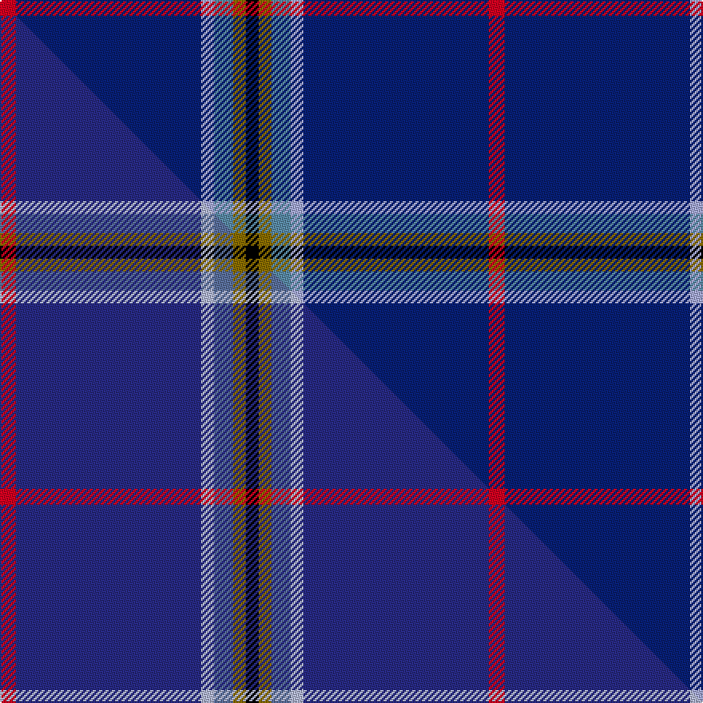

This page is one **sett** — a single exact thread-count. It belongs to the [tartan](/setts/r5db58lb4t6y4k4/)
(the same proportion at any scale), whose colour order is pattern [KGBWBR](/stripes/kgbwbr/).

Part of the [Kendle](/tartans/kendle/) tartan — the named design grouping this sett with its other cloths.

Sourced from tartans-authority.  It is a [6 stripe tartan](/stripes/stripes6/).

Original link http://www.tartansauthority.com/tartan-ferret/display/10932/

## Register references

External register numbers recorded for this tartan.

- Scottish Register of Tartans: [10932](https://www.tartanregister.gov.uk/tartanDetails?ref=10932)
- Scottish Tartans Authority (ITI): 10932

## Thread count
R/10 DB116 LB8 T12 Y8 K/8

One full sett is **306 threads**.

## Palette
<table><thead><tr><th>Colour</th><th>Shade</th><th>OKLCh</th></tr></thead><tbody><tr><td>T</td><td><code style="background-color:#5C8CA8;">#5C8CA8</code> <small style="color:#888">#5C8CA8</small></td><td><small style="color:#888">oklch(61.7% 0.067 235.0)</small></td></tr><tr><td>DB</td><td><code style="background-color:#082077;">#082077</code> <small style="color:#888">#082077</small></td><td><small style="color:#888">oklch(30.0% 0.149 265.1)</small></td></tr><tr><td>K</td><td><code style="background-color:#000000;">#000000</code> <small style="color:#888">#000000</small></td><td><small style="color:#888">oklch(0.0% 0.000 0.0)</small></td></tr><tr><td>LB</td><td><code style="background-color:#A8ACE8;">#A8ACE8</code> <small style="color:#888">#A8ACE8</small></td><td><small style="color:#888">oklch(76.3% 0.086 281.2)</small></td></tr><tr><td>R</td><td><code style="background-color:#D60020;">#D60020</code> <small style="color:#888">#D60020</small></td><td><small style="color:#888">oklch(55.2% 0.224 25.5)</small></td></tr><tr><td>Y</td><td><code style="background-color:#8B6E00;">#8B6E00</code> <small style="color:#888">#8B6E00</small></td><td><small style="color:#888">oklch(55.1% 0.113 90.4)</small></td></tr></tbody></table>

# Sample pattern

## Compared to the master

This cloth is one sett of its design; the master sett (the exemplar the design is anchored on) is below for comparison.

Its **ΔTartan distance** from the master is **0.59** — the same measure the nearest-tartans table ranks by (0 is identical; a re-scale of the same cloth is near 0, a recolour or a different proportion further).

<figure class="master-compare" style="margin:0">

this sett
master sett ★

<figcaption style="color:#888;font-size:smaller">One weave of this sett against the <a href="/setts/r5db58lb4n6y4k4/">master sett ★</a>, split on the diagonal: a shared proportion runs seamlessly across it with only the shades shifting; a different proportion breaks on it.</figcaption>
</figure>

## Nearest variants

The nearest existing variants by ΔTartan distance, with this cloth at the top so the swatches line up against it.

ΔTartan

Threads

Variant

Sett

—

306

<a href="/variants/s6/r5db58lb4t6y4k4~x2~lb3103284-t2503227/">Kendle (2013)</a>

<a href="/ttd/edit/#slug=r5db58lb4n6y4k4~x2~db1406275-n2203265&amp;base=r5db58lb4t6y4k4~x2~lb3103284-t2503227" title="compare in the TTD">0.00</a>

306

<a href="/variants/s6/r5db58lb4n6y4k4~x2~db1406275-n2203265/">Kendle (2013)</a>

<a href="/ttd/edit/#slug=ki61w4k11db5dr5~x2~ki0604259&amp;base=r5db58lb4t6y4k4~x2~lb3103284-t2503227" title="compare in the TTD">1.05</a>

212

<a href="/variants/s5/ki61w4k11db5dr5~x2~ki0604259/">Edinburgh Crystal</a>

<a href="/ttd/edit/#slug=db46k6g9dy9r4&amp;base=r5db58lb4t6y4k4~x2~lb3103284-t2503227" title="compare in the TTD">1.19</a>

98

<a href="/variants/s5/db46k6g9dy9r4/">Ayllu Thuban</a>

<a href="/ttd/edit/#slug=b5g8k5db32w2r2~x2&amp;base=r5db58lb4t6y4k4~x2~lb3103284-t2503227" title="compare in the TTD">1.42</a>

202

<a href="/variants/s6/b5g8k5db32w2r2~x2/">Marion (Personal)</a>

<a href="/ttd/edit/#slug=db19r2w2r2k2~x4&amp;base=r5db58lb4t6y4k4~x2~lb3103284-t2503227" title="compare in the TTD">1.58</a>

132

<a href="/variants/s5/db19r2w2r2k2~x4/">Laing of Archiestown</a>

<a href="/ttd/edit/#slug=w2dp2db25r3y3g1~x4&amp;base=r5db58lb4t6y4k4~x2~lb3103284-t2503227" title="compare in the TTD">1.65</a>

276

<a href="/variants/s6/w2dp2db25r3y3g1~x4/">Pool, Robert David (Personal)</a>

<a href="/ttd/edit/#slug=db26lb6g1r1w2~x2&amp;base=r5db58lb4t6y4k4~x2~lb3103284-t2503227" title="compare in the TTD">1.69</a>

88

<a href="/variants/s5/db26lb6g1r1w2~x2/">Special Air Service</a>

<a href="/ttd/edit/#slug=g5w1r5k5db43r1~x2&amp;base=r5db58lb4t6y4k4~x2~lb3103284-t2503227" title="compare in the TTD">1.75</a>

228

<a href="/variants/s6/g5w1r5k5db43r1~x2/">Michael (John) (Personal)</a>

<a href="/ttd/edit/#slug=db68lb7db16k16ly4~x2&amp;base=r5db58lb4t6y4k4~x2~lb3103284-t2503227" title="compare in the TTD">1.86</a>

300

<a href="/variants/s5/db68lb7db16k16ly4~x2/">Burnetts &amp; Struth</a>

<a href="/ttd/edit/#slug=db12lb1k2db1r1~x8&amp;base=r5db58lb4t6y4k4~x2~lb3103284-t2503227" title="compare in the TTD">1.87</a>

168

<a href="/variants/s5/db12lb1k2db1r1~x8/">Lochcarron (1985)</a>

## Neighbour map

Every grey dot is one of 13620 variants placed by the first two principal components of the ΔTartan feature space (42% of its variance). Red is this tartan; blue dots are its nearest — click one to open its page.

<svg viewBox="0 0 640 380" role="img" style="max-width:100%;height:auto;border:1px solid #e0e0e0;border-radius:4px;display:block" xmlns="http://www.w3.org/2000/svg"><image href="/nn/cloud.v1.png" width="640" height="380"/><a href="/variants/s6/r5db58lb4n6y4k4~x2~db1406275-n2203265/"><circle cx="411.7" cy="119.1" r="4" fill="#3465a4"><title>Kendle (2013)</title></circle></a><a href="/variants/s5/ki61w4k11db5dr5~x2~ki0604259/"><circle cx="417.4" cy="150.0" r="4" fill="#3465a4"><title>Edinburgh Crystal</title></circle></a><a href="/variants/s5/db46k6g9dy9r4/"><circle cx="337.7" cy="176.9" r="4" fill="#3465a4"><title>Ayllu Thuban</title></circle></a><a href="/variants/s6/b5g8k5db32w2r2~x2/"><circle cx="279.2" cy="129.1" r="4" fill="#3465a4"><title>Marion (Personal)</title></circle></a><a href="/variants/s5/db19r2w2r2k2~x4/"><circle cx="374.8" cy="164.6" r="4" fill="#3465a4"><title>Laing of Archiestown</title></circle></a><a href="/variants/s6/w2dp2db25r3y3g1~x4/"><circle cx="403.7" cy="109.5" r="4" fill="#3465a4"><title>Pool, Robert David (Personal)</title></circle></a><a href="/variants/s5/db26lb6g1r1w2~x2/"><circle cx="428.8" cy="129.3" r="4" fill="#3465a4"><title>Special Air Service</title></circle></a><a href="/variants/s6/g5w1r5k5db43r1~x2/"><circle cx="437.8" cy="85.7" r="4" fill="#3465a4"><title>Michael (John) (Personal)</title></circle></a><a href="/variants/s5/db68lb7db16k16ly4~x2/"><circle cx="445.5" cy="167.6" r="4" fill="#3465a4"><title>Burnetts &amp; Struth</title></circle></a><a href="/variants/s5/db12lb1k2db1r1~x8/"><circle cx="459.8" cy="167.4" r="4" fill="#3465a4"><title>Lochcarron (1985)</title></circle></a><circle cx="395.1" cy="115.9" r="5" fill="#c00000"/><text x="320" y="376" text-anchor="middle" font-size="11" fill="#999">ground</text><text x="11" y="190" text-anchor="middle" font-size="11" fill="#999" transform="rotate(-90 11 190)">complexity</text></svg>

ID: /variants/s6/r5db58lb4t6y4k4~x2~lb3103284-t2503227/
