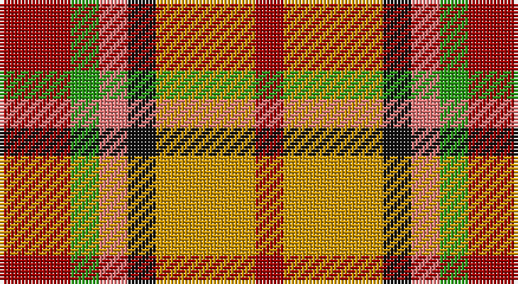

This page is one **sett** — a single exact thread-count. It belongs to the [tartan](/setts/r5g2ri2k2lo7r2/)
(the same proportion at any scale), whose colour order is pattern [RGRKYR](/stripes/rgrkyr/).

Sourced from register-of-tartans.  It is a [6 stripe tartan](/stripes/stripes6/).

Original link https://www.tartanregister.gov.uk/tartanDetails.aspx?ref=4458

2 attestations — the source records this cloth was collapsed from (oldest owns this page)

<ul>
<li>01/01/1991 — Victoria, City of (British Columbia) (register-of-tartans, <a href="https://www.tartanregister.gov.uk/tartanDetails.aspx?ref=4458">record</a>)</li>
<li>1991 — Victoria, City of (Fashion) (tartans-authority, <a href="http://www.tartansauthority.com/tartan-ferret/display/4344/">record</a>)</li>
</ul>

## Register references

External register numbers recorded for this tartan.

- Scottish Register of Tartans: [4458](https://www.tartanregister.gov.uk/tartanDetails.aspx?ref=4458)
- Scottish Tartans Authority (ITI): 4344

## Thread count
DRa/20 G8 LR8 K8 DY28 DRa/8

One full sett is **132 threads**.

## Palette

Palette: <strong>Tartan Register</strong> <small style="color:#888">(6 of 7 colours)</small>
<table><thead><tr><th>Colour</th><th>Threads</th><th>Shade</th><th>Base</th><th>OKLCh</th></tr></thead><tbody><tr><td>DRa/</td><td style="text-align:right;font-variant-numeric:tabular-nums">20</td><td><code style="background-color:#A00000;">#A00000</code> <small style="color:#888">#A00000</small></td><td>R <code style="background-color:#CC0000;">#CC0000</code></td><td><small style="color:#888">oklch(44.3% 0.182 29.2)</small></td></tr><tr><td>G</td><td style="text-align:right;font-variant-numeric:tabular-nums">8</td><td><code style="background-color:#289C18;">#289C18</code> <small style="color:#888">#289C18</small></td><td>G <code style="background-color:#006100;">#006100</code></td><td><small style="color:#888">oklch(60.6% 0.191 141.6)</small></td></tr><tr><td>LR</td><td style="text-align:right;font-variant-numeric:tabular-nums">8</td><td><code style="background-color:#E87878;">#E87878</code> <small style="color:#888">#E87878</small></td><td>R <code style="background-color:#CC0000;">#CC0000</code></td><td><small style="color:#888">oklch(70.0% 0.139 21.2)</small></td></tr><tr><td>K</td><td style="text-align:right;font-variant-numeric:tabular-nums">8</td><td><code style="background-color:#101010;">#101010</code> <small style="color:#888">#101010</small></td><td>K <code style="background-color:#000000;">#000000</code></td><td><small style="color:#888">oklch(17.3% 0.000 89.9)</small></td></tr><tr><td>DY</td><td style="text-align:right;font-variant-numeric:tabular-nums">28</td><td><code style="background-color:#D09800;">#D09800</code> <small style="color:#888">#D09800</small></td><td>Y <code style="background-color:#F2BF00;">#F2BF00</code></td><td><small style="color:#888">oklch(71.4% 0.147 82.1)</small></td></tr><tr><td>DRa/</td><td style="text-align:right;font-variant-numeric:tabular-nums">8</td><td><code style="background-color:#A00000;">#A00000</code> <small style="color:#888">#A00000</small></td><td>R <code style="background-color:#CC0000;">#CC0000</code></td><td><small style="color:#888">oklch(44.3% 0.182 29.2)</small></td></tr></tbody></table>

# Sample pattern

## Nearest tartans

The nearest existing variants by ΔTartan distance, with this tartan at the top so the swatches line up against it.

ΔTartan

Tartan

Sett

—

<a href="/ttd/edit/#slug=r5g2ri2k2lo7r2~x4">Victoria, City of (British Columbia)</a> <a class="nn-out" href="/variants/s6/r5g2ri2k2lo7r2~x4/" title="open its dictionary page">↗</a>

1.35

<a href="/ttd/edit/#slug=g9ly2g9w5r9t2r9t2~x2&amp;base=r5g2ri2k2lo7r2~x4">Blackie</a> <a class="nn-out" href="/variants/s8/g9ly2g9w5r9t2r9t2~x2/" title="open its dictionary page">↗</a>

1.41

<a href="/ttd/edit/#slug=r2ly1r5k4g5w1~x4&amp;base=r5g2ri2k2lo7r2~x4">Aboyne II (Fashion)</a> <a class="nn-out" href="/variants/s6/r2ly1r5k4g5w1~x4/" title="open its dictionary page">↗</a>

1.60

<a href="/ttd/edit/#slug=g2lo9do6r3do2r3do2r10w2~x4&amp;base=r5g2ri2k2lo7r2~x4">Tinkler (Corporate)</a> <a class="nn-out" href="/variants/s9/g2lo9do6r3do2r3do2r10w2~x4/" title="open its dictionary page">↗</a>

1.66

<a href="/ttd/edit/#slug=r8dy33ly33k33r8db8ly33db8r8&amp;base=r5g2ri2k2lo7r2~x4">Jardine of Castlemilk</a> <a class="nn-out" href="/variants/s9/r8dy33ly33k33r8db8ly33db8r8/" title="open its dictionary page">↗</a>

1.70

<a href="/ttd/edit/#slug=g2ly9dy6o3dy2o3dy2o10w2~x4&amp;base=r5g2ri2k2lo7r2~x4">Tinkler, Andrew (Stobart Group)</a> <a class="nn-out" href="/variants/s9/g2ly9dy6o3dy2o3dy2o10w2~x4/" title="open its dictionary page">↗</a>

1.72

<a href="/ttd/edit/#slug=ly12y4n4ly4n4r4n15y15r15ly8~x2&amp;base=r5g2ri2k2lo7r2~x4">Glasgows, Miles Better</a> <a class="nn-out" href="/variants/s10/ly12y4n4ly4n4r4n15y15r15ly8~x2/" title="open its dictionary page">↗</a>

1.77

<a href="/ttd/edit/#slug=r6k2g12lo8r5k2g3~x4&amp;base=r5g2ri2k2lo7r2~x4">Londonderry</a> <a class="nn-out" href="/variants/s7/r6k2g12lo8r5k2g3~x4/" title="open its dictionary page">↗</a>

1.78

<a href="/ttd/edit/#slug=w1r5dy5ly1~x4&amp;base=r5g2ri2k2lo7r2~x4">Manx Mannin Plaid</a> <a class="nn-out" href="/variants/s4/w1r5dy5ly1~x4/" title="open its dictionary page">↗</a>

1.79

<a href="/ttd/edit/#slug=r5db12lyi11n21ly5~x2&amp;base=r5g2ri2k2lo7r2~x4">Inspiration</a> <a class="nn-out" href="/variants/s5/r5db12lyi11n21ly5~x2/" title="open its dictionary page">↗</a>

1.83

<a href="/ttd/edit/#slug=r8o33ly33k33r8db8ly33db8r8&amp;base=r5g2ri2k2lo7r2~x4">Jardine, of Castlemilk</a> <a class="nn-out" href="/variants/s9/r8o33ly33k33r8db8ly33db8r8/" title="open its dictionary page">↗</a>

## Neighbour map

Every grey dot is one of 14360 variants placed by the first two principal components of the ΔTartan feature space (44% of its variance). Red is this tartan; blue dots are its nearest — click one to open its page.

<svg viewBox="0 0 640 380" role="img" style="max-width:100%;height:auto;border:1px solid #e0e0e0;border-radius:4px;display:block" xmlns="http://www.w3.org/2000/svg"><image href="/nn/cloud.v1.png" width="640" height="380"/><a href="/variants/s8/g9ly2g9w5r9t2r9t2~x2/"><circle cx="114.2" cy="219.4" r="4" fill="#3465a4"><title>Blackie</title></circle></a><a href="/variants/s6/r2ly1r5k4g5w1~x4/"><circle cx="112.9" cy="222.9" r="4" fill="#3465a4"><title>Aboyne II (Fashion)</title></circle></a><a href="/variants/s9/g2lo9do6r3do2r3do2r10w2~x4/"><circle cx="159.0" cy="206.4" r="4" fill="#3465a4"><title>Tinkler (Corporate)</title></circle></a><a href="/variants/s9/r8dy33ly33k33r8db8ly33db8r8/"><circle cx="77.7" cy="196.8" r="4" fill="#3465a4"><title>Jardine of Castlemilk</title></circle></a><a href="/variants/s9/g2ly9dy6o3dy2o3dy2o10w2~x4/"><circle cx="163.0" cy="211.6" r="4" fill="#3465a4"><title>Tinkler, Andrew (Stobart Group)</title></circle></a><a href="/variants/s10/ly12y4n4ly4n4r4n15y15r15ly8~x2/"><circle cx="91.0" cy="235.3" r="4" fill="#3465a4"><title>Glasgows, Miles Better</title></circle></a><a href="/variants/s7/r6k2g12lo8r5k2g3~x4/"><circle cx="148.3" cy="225.5" r="4" fill="#3465a4"><title>Londonderry</title></circle></a><a href="/variants/s4/w1r5dy5ly1~x4/"><circle cx="209.4" cy="248.1" r="4" fill="#3465a4"><title>Manx Mannin Plaid</title></circle></a><a href="/variants/s5/r5db12lyi11n21ly5~x2/"><circle cx="94.6" cy="241.3" r="4" fill="#3465a4"><title>Inspiration</title></circle></a><a href="/variants/s9/r8o33ly33k33r8db8ly33db8r8/"><circle cx="70.8" cy="193.3" r="4" fill="#3465a4"><title>Jardine, of Castlemilk</title></circle></a><circle cx="107.7" cy="236.3" r="5" fill="#c00000"/></svg>

ID: /variants/s6/r5g2ri2k2lo7r2~x4/
