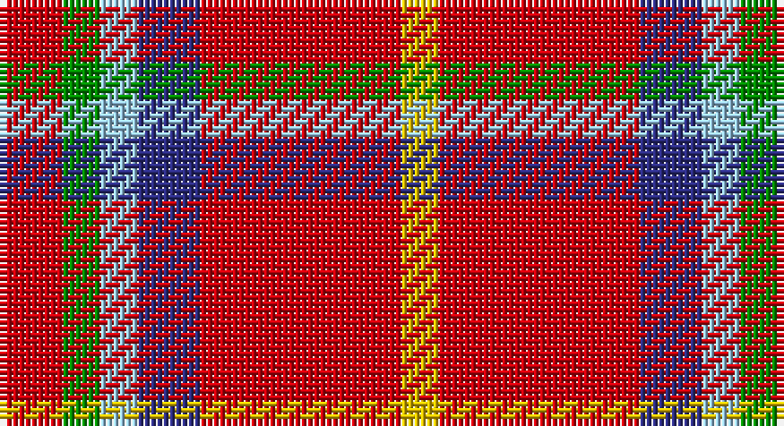

This page is one **sett** — a single exact thread-count. It belongs to the [tartan](/setts/r5g3lb3db5r16ly3/)
(the same proportion at any scale), whose colour order is pattern [RGWBRY](/stripes/rgwbry/).

Part of the [McCartney](/tartans/mccartney/) tartan — the named design grouping this sett with its other cloths.

Sourced from register-of-tartans.  It is a [6 stripe tartan](/stripes/stripes6/).

Original link https://www.tartanregister.gov.uk/tartanDetails.aspx?ref=11229

2 attestations — the source records this cloth was collapsed from (oldest owns this page)

<ul>
<li>30/01/2015 — McCartney (2015) (register-of-tartans, <a href="https://www.tartanregister.gov.uk/tartanDetails.aspx?ref=11229">record</a>)</li>
<li>2015 — McCartney (2015) (tartans-authority, <a href="http://www.tartansauthority.com/tartan-ferret/display/11229/">record</a>)</li>
</ul>

## Register references

External register numbers recorded for this tartan.

- Scottish Register of Tartans: [11229](https://www.tartanregister.gov.uk/tartanDetails?ref=11229)
- Scottish Tartans Authority (ITI): 11229

## Thread count
R/10 G6 LB6 DB10 R32 Y/6

One full sett is **124 threads**.

## Palette

Palette: <strong>Tartan Register</strong> <small style="color:#888">(4 of 5 colours)</small>
<table><thead><tr><th>Colour</th><th>Threads</th><th>Shade</th><th>Base</th><th>OKLCh</th></tr></thead><tbody><tr><td>R/</td><td style="text-align:right;font-variant-numeric:tabular-nums">10</td><td><code style="background-color:#C8000C;">#C8000C</code> <small style="color:#888">#C8000C</small></td><td>R <code style="background-color:#CC0000;">#CC0000</code></td><td><small style="color:#888">oklch(52.3% 0.214 28.1)</small></td></tr><tr><td>G</td><td style="text-align:right;font-variant-numeric:tabular-nums">6</td><td><code style="background-color:#008B00;">#008B00</code> <small style="color:#888">#008B00</small></td><td>G <code style="background-color:#006100;">#006100</code></td><td><small style="color:#888">oklch(55.2% 0.188 142.5)</small></td></tr><tr><td>LB</td><td style="text-align:right;font-variant-numeric:tabular-nums">6</td><td><code style="background-color:#98C8E8;">#98C8E8</code> <small style="color:#888">#98C8E8</small></td><td>W <code style="background-color:#F7F7F7;">#F7F7F7</code></td><td><small style="color:#888">oklch(81.0% 0.068 237.9)</small></td></tr><tr><td>DB</td><td style="text-align:right;font-variant-numeric:tabular-nums">10</td><td><code style="background-color:#2C2C80;">#2C2C80</code> <small style="color:#888">#2C2C80</small></td><td>B <code style="background-color:#2A418A;">#2A418A</code></td><td><small style="color:#888">oklch(35.0% 0.138 276.6)</small></td></tr><tr><td>R</td><td style="text-align:right;font-variant-numeric:tabular-nums">32</td><td><code style="background-color:#C8000C;">#C8000C</code> <small style="color:#888">#C8000C</small></td><td>R <code style="background-color:#CC0000;">#CC0000</code></td><td><small style="color:#888">oklch(52.3% 0.214 28.1)</small></td></tr><tr><td>Y/</td><td style="text-align:right;font-variant-numeric:tabular-nums">6</td><td><code style="background-color:#E8C000;">#E8C000</code> <small style="color:#888">#E8C000</small></td><td>Y <code style="background-color:#F2BF00;">#F2BF00</code></td><td><small style="color:#888">oklch(81.9% 0.168 93.7)</small></td></tr></tbody></table>

# Sample pattern

## Compared to the master

This cloth is one sett of its design; the master sett (the exemplar the design is anchored on) is below for comparison.

<figure style="margin:0"><figcaption style="color:#888;font-size:smaller">this sett</figcaption></figure>
<figure style="margin:0"><figcaption style="color:#888;font-size:smaller"><a href="/setts/dp4dg2dp24dg8dt2r2dt2ly2dt10dp2w3/">master sett →</a></figcaption></figure>

## Nearest tartans

The nearest existing variants by ΔTartan distance, with this tartan at the top so the swatches line up against it.

ΔTartan

Tartan

Sett

—

<a href="/ttd/edit/#slug=r5g3lb3db5r16ly3~x2">McCartney (2015)</a> <a class="nn-out" href="/variants/s6/r5g3lb3db5r16ly3~x2/" title="open its dictionary page">↗</a>

0.99

<a href="/ttd/edit/#slug=r20k5g5r5w5lr3g3~x4&amp;base=r5g3lb3db5r16ly3~x2">Mangles, Peter and Annette Family/Personal Tartan</a> <a class="nn-out" href="/variants/s7/r20k5g5r5w5lr3g3~x4/" title="open its dictionary page">↗</a>

1.02

<a href="/ttd/edit/#slug=r20k5dg5r5w5o3dg3~x4&amp;base=r5g3lb3db5r16ly3~x2">Mangles, Peter and Annette (Personal</a> <a class="nn-out" href="/variants/s7/r20k5dg5r5w5o3dg3~x4/" title="open its dictionary page">↗</a>

1.14

<a href="/ttd/edit/#slug=r20k5g5r5w5n3g3~x4&amp;base=r5g3lb3db5r16ly3~x2">Mangles, Peter and Annette (Personal)</a> <a class="nn-out" href="/variants/s7/r20k5g5r5w5n3g3~x4/" title="open its dictionary page">↗</a>

1.26

<a href="/ttd/edit/#slug=dg4lb4k2r15ly4~x4&amp;base=r5g3lb3db5r16ly3~x2">Benedict (Personal)</a> <a class="nn-out" href="/variants/s5/dg4lb4k2r15ly4~x4/" title="open its dictionary page">↗</a>

1.28

<a href="/ttd/edit/#slug=g4lb4k2r15ly4~x4&amp;base=r5g3lb3db5r16ly3~x2">Benedict (Personal)</a> <a class="nn-out" href="/variants/s5/g4lb4k2r15ly4~x4/" title="open its dictionary page">↗</a>

1.40

<a href="/ttd/edit/#slug=r10dg4ri1w1t1~x2&amp;base=r5g3lb3db5r16ly3~x2">Staves (Personal)</a> <a class="nn-out" href="/variants/s5/r10dg4ri1w1t1~x2/" title="open its dictionary page">↗</a>

1.41

<a href="/ttd/edit/#slug=r10dg4ri1w1t1~x6&amp;base=r5g3lb3db5r16ly3~x2">Staves (Personal)</a> <a class="nn-out" href="/variants/s5/r10dg4ri1w1t1~x6/" title="open its dictionary page">↗</a>

1.42

<a href="/ttd/edit/#slug=oi6ly3oi20o20oi3o3lb6~x2&amp;base=r5g3lb3db5r16ly3~x2">Banff</a> <a class="nn-out" href="/variants/s7/oi6ly3oi20o20oi3o3lb6~x2/" title="open its dictionary page">↗</a>

1.53

<a href="/ttd/edit/#slug=r34w4t7ly10t7r18~x2&amp;base=r5g3lb3db5r16ly3~x2">Ploysongsang, Edward Thiravej (Pers</a> <a class="nn-out" href="/variants/s6/r34w4t7ly10t7r18~x2/" title="open its dictionary page">↗</a>

1.55

<a href="/ttd/edit/#slug=r7db2k2ly1k2r2k1w1~x2&amp;base=r5g3lb3db5r16ly3~x2">Royal Stuart/Stewart</a> <a class="nn-out" href="/variants/s8/r7db2k2ly1k2r2k1w1~x2/" title="open its dictionary page">↗</a>

## Neighbour map

Every grey dot is one of 14360 variants placed by the first two principal components of the ΔTartan feature space (44% of its variance). Red is this tartan; blue dots are its nearest — click one to open its page.

<svg viewBox="0 0 640 380" role="img" style="max-width:100%;height:auto;border:1px solid #e0e0e0;border-radius:4px;display:block" xmlns="http://www.w3.org/2000/svg"><image href="/nn/cloud.v1.png" width="640" height="380"/><a href="/variants/s7/r20k5g5r5w5lr3g3~x4/"><circle cx="226.6" cy="172.3" r="4" fill="#3465a4"><title>Mangles, Peter and Annette Family/Personal Tartan</title></circle></a><a href="/variants/s7/r20k5dg5r5w5o3dg3~x4/"><circle cx="229.8" cy="176.1" r="4" fill="#3465a4"><title>Mangles, Peter and Annette (Personal</title></circle></a><a href="/variants/s7/r20k5g5r5w5n3g3~x4/"><circle cx="221.3" cy="171.3" r="4" fill="#3465a4"><title>Mangles, Peter and Annette (Personal)</title></circle></a><a href="/variants/s5/dg4lb4k2r15ly4~x4/"><circle cx="225.6" cy="190.1" r="4" fill="#3465a4"><title>Benedict (Personal)</title></circle></a><a href="/variants/s5/g4lb4k2r15ly4~x4/"><circle cx="231.0" cy="192.7" r="4" fill="#3465a4"><title>Benedict (Personal)</title></circle></a><a href="/variants/s5/r10dg4ri1w1t1~x2/"><circle cx="326.2" cy="174.8" r="4" fill="#3465a4"><title>Staves (Personal)</title></circle></a><a href="/variants/s5/r10dg4ri1w1t1~x6/"><circle cx="327.1" cy="175.2" r="4" fill="#3465a4"><title>Staves (Personal)</title></circle></a><a href="/variants/s7/oi6ly3oi20o20oi3o3lb6~x2/"><circle cx="247.2" cy="200.1" r="4" fill="#3465a4"><title>Banff</title></circle></a><a href="/variants/s6/r34w4t7ly10t7r18~x2/"><circle cx="351.9" cy="201.1" r="4" fill="#3465a4"><title>Ploysongsang, Edward Thiravej (Pers</title></circle></a><a href="/variants/s8/r7db2k2ly1k2r2k1w1~x2/"><circle cx="207.3" cy="169.5" r="4" fill="#3465a4"><title>Royal Stuart/Stewart</title></circle></a><circle cx="270.7" cy="199.9" r="5" fill="#c00000"/></svg>

ID: /variants/s6/r5g3lb3db5r16ly3~x2/
