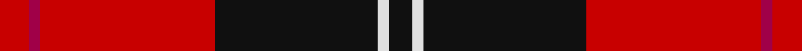
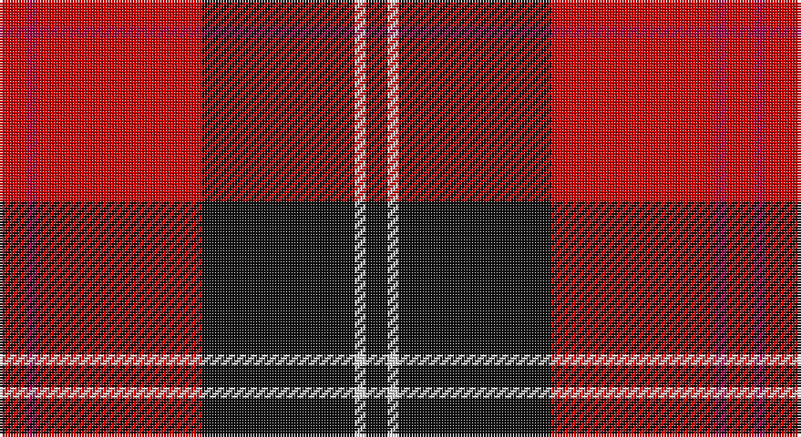

This page is one **sett** — a single exact thread-count. It belongs to the [tartan](/setts/r5m2r30k28w2k4/)
(the same proportion at any scale), whose colour order is pattern [KWKRRR](/stripes/kwkrrr/).

Part of the [Ramsay](/tartans/ramsay/) tartan — the named design grouping this sett with its other cloths.

Sourced from house-of-tartan.  It is a [6 stripe tartan](/stripes/stripes6/).

Original link http://www.house-of-tartan.scotland.net/house/TartanViewjs.asp?colr=Def&tnam=1238

## Provenance

Earliest known date: 1842 Ramsay was one of the names adopted by members of the Clan MacGregor when their own was proscribed. It is not surprising then that an early MacGregor sett was used as a basis for the Ramsay tartan. It is possible that the tartan was in existance long before the earliest recorded date given.

## Also known as

This cloth is also recorded under:

- Ramsay Blue
- Ramsay Blue New Blue
- Ramsay Red
- Ramsay, Red

## Thread count
Ra/10 R4 Ra60 K56 LN4 K/8

One full sett is **266 threads**.

## Palette

Palette: <strong>Tartan Register</strong>
<table><thead><tr><th>Colour</th><th>Threads</th><th>Shade</th><th>Base</th><th>OKLCh</th></tr></thead><tbody><tr><td>Ra/</td><td style="text-align:right;font-variant-numeric:tabular-nums">10</td><td><code style="background-color:#C80000;">#C80000</code> <small style="color:#888">#C80000</small></td><td>R <code style="background-color:#CC0000;">#CC0000</code></td><td><small style="color:#888">oklch(52.3% 0.215 29.2)</small></td></tr><tr><td>R</td><td style="text-align:right;font-variant-numeric:tabular-nums">4</td><td><code style="background-color:#A00048;">#A00048</code> <small style="color:#888">#A00048</small></td><td>R <code style="background-color:#CC0000;">#CC0000</code></td><td><small style="color:#888">oklch(45.4% 0.182 5.3)</small></td></tr><tr><td>Ra</td><td style="text-align:right;font-variant-numeric:tabular-nums">60</td><td><code style="background-color:#C80000;">#C80000</code> <small style="color:#888">#C80000</small></td><td>R <code style="background-color:#CC0000;">#CC0000</code></td><td><small style="color:#888">oklch(52.3% 0.215 29.2)</small></td></tr><tr><td>K</td><td style="text-align:right;font-variant-numeric:tabular-nums">56</td><td><code style="background-color:#101010;">#101010</code> <small style="color:#888">#101010</small></td><td>K <code style="background-color:#000000;">#000000</code></td><td><small style="color:#888">oklch(17.3% 0.000 89.9)</small></td></tr><tr><td>LN</td><td style="text-align:right;font-variant-numeric:tabular-nums">4</td><td><code style="background-color:#E0E0E0;">#E0E0E0</code> <small style="color:#888">#E0E0E0</small></td><td>W <code style="background-color:#F7F7F7;">#F7F7F7</code></td><td><small style="color:#888">oklch(90.7% 0.000 89.9)</small></td></tr><tr><td>K/</td><td style="text-align:right;font-variant-numeric:tabular-nums">8</td><td><code style="background-color:#101010;">#101010</code> <small style="color:#888">#101010</small></td><td>K <code style="background-color:#000000;">#000000</code></td><td><small style="color:#888">oklch(17.3% 0.000 89.9)</small></td></tr></tbody></table>

# Sample pattern

## Compared to the master

This cloth is one sett of its design; the master sett (the exemplar the design is anchored on) is below for comparison.

<figure style="margin:0"><figcaption style="color:#888;font-size:smaller">this sett</figcaption></figure>
<figure style="margin:0"><figcaption style="color:#888;font-size:smaller"><a href="/setts/g1r7g7n2r1dg15lb1/">master sett →</a></figcaption></figure>

## Nearest tartans

The nearest existing variants by ΔTartan distance, with this tartan at the top so the swatches line up against it.

ΔTartan

Tartan

Sett

—

<a href="/ttd/edit/#slug=r5m2r30k28w2k4~x2">Ramsay Red Clan Tartan</a> <a class="nn-out" href="/variants/s6/r5m2r30k28w2k4~x2/" title="open its dictionary page">↗</a>

0.85

<a href="/ttd/edit/#slug=db1r12k6ly1k6db1~x4&amp;base=r5m2r30k28w2k4~x2">Cetoloni (Personal)</a> <a class="nn-out" href="/variants/s6/db1r12k6ly1k6db1~x4/" title="open its dictionary page">↗</a>

0.95

<a href="/ttd/edit/#slug=k4r26k4w2k13ly4~x2&amp;base=r5m2r30k28w2k4~x2">Dunbar #2</a> <a class="nn-out" href="/variants/s6/k4r26k4w2k13ly4~x2/" title="open its dictionary page">↗</a>

0.99

<a href="/ttd/edit/#slug=k4r33k24w3k4r3~x2&amp;base=r5m2r30k28w2k4~x2">Monmouth College</a> <a class="nn-out" href="/variants/s6/k4r33k24w3k4r3~x2/" title="open its dictionary page">↗</a>

1.06

<a href="/ttd/edit/#slug=k3r2k30r28k2r2w3~x2&amp;base=r5m2r30k28w2k4~x2">Cunningham #2</a> <a class="nn-out" href="/variants/s7/k3r2k30r28k2r2w3~x2/" title="open its dictionary page">↗</a>

1.06

<a href="/ttd/edit/#slug=k2r16k8ly1k8r2~x4&amp;base=r5m2r30k28w2k4~x2">Brodie (Clan)</a> <a class="nn-out" href="/variants/s6/k2r16k8ly1k8r2~x4/" title="open its dictionary page">↗</a>

1.09

<a href="/ttd/edit/#slug=r6k3r29k23w4k7ly3~x2&amp;base=r5m2r30k28w2k4~x2">MacPherson Red Cluny</a> <a class="nn-out" href="/variants/s7/r6k3r29k23w4k7ly3~x2/" title="open its dictionary page">↗</a>

1.11

<a href="/ttd/edit/#slug=k4w1k28r30dp1r3~x2&amp;base=r5m2r30k28w2k4~x2">Ramsay (Red)</a> <a class="nn-out" href="/variants/s6/k4w1k28r30dp1r3~x2/" title="open its dictionary page">↗</a>

1.13

<a href="/ttd/edit/#slug=db3k32r27w2~x2&amp;base=r5m2r30k28w2k4~x2">Templar Grand Priory USA</a> <a class="nn-out" href="/variants/s4/db3k32r27w2~x2/" title="open its dictionary page">↗</a>

1.16

<a href="/ttd/edit/#slug=r2k3ly1k3r2db8r16k1~x4&amp;base=r5m2r30k28w2k4~x2">Leslie Red (VS) (Clan)</a> <a class="nn-out" href="/variants/s8/r2k3ly1k3r2db8r16k1~x4/" title="open its dictionary page">↗</a>

1.17

<a href="/ttd/edit/#slug=k16r2k2r12w1~x2&amp;base=r5m2r30k28w2k4~x2">MacIver</a> <a class="nn-out" href="/variants/s5/k16r2k2r12w1~x2/" title="open its dictionary page">↗</a>

## Neighbour map

Every grey dot is one of 14360 variants placed by the first two principal components of the ΔTartan feature space (44% of its variance). Red is this tartan; blue dots are its nearest — click one to open its page.

<svg viewBox="0 0 640 380" role="img" style="max-width:100%;height:auto;border:1px solid #e0e0e0;border-radius:4px;display:block" xmlns="http://www.w3.org/2000/svg"><image href="/nn/cloud.v1.png" width="640" height="380"/><a href="/variants/s6/db1r12k6ly1k6db1~x4/"><circle cx="272.6" cy="188.5" r="4" fill="#3465a4"><title>Cetoloni (Personal)</title></circle></a><a href="/variants/s6/k4r26k4w2k13ly4~x2/"><circle cx="280.3" cy="166.4" r="4" fill="#3465a4"><title>Dunbar #2</title></circle></a><a href="/variants/s6/k4r33k24w3k4r3~x2/"><circle cx="334.4" cy="194.5" r="4" fill="#3465a4"><title>Monmouth College</title></circle></a><a href="/variants/s7/k3r2k30r28k2r2w3~x2/"><circle cx="349.9" cy="167.6" r="4" fill="#3465a4"><title>Cunningham #2</title></circle></a><a href="/variants/s6/k2r16k8ly1k8r2~x4/"><circle cx="340.2" cy="199.5" r="4" fill="#3465a4"><title>Brodie (Clan)</title></circle></a><a href="/variants/s7/r6k3r29k23w4k7ly3~x2/"><circle cx="260.4" cy="175.4" r="4" fill="#3465a4"><title>MacPherson Red Cluny</title></circle></a><a href="/variants/s6/k4w1k28r30dp1r3~x2/"><circle cx="366.7" cy="141.2" r="4" fill="#3465a4"><title>Ramsay (Red)</title></circle></a><a href="/variants/s4/db3k32r27w2~x2/"><circle cx="314.7" cy="200.5" r="4" fill="#3465a4"><title>Templar Grand Priory USA</title></circle></a><a href="/variants/s8/r2k3ly1k3r2db8r16k1~x4/"><circle cx="332.2" cy="151.6" r="4" fill="#3465a4"><title>Leslie Red (VS) (Clan)</title></circle></a><a href="/variants/s5/k16r2k2r12w1~x2/"><circle cx="359.3" cy="196.1" r="4" fill="#3465a4"><title>MacIver</title></circle></a><circle cx="324.6" cy="169.5" r="5" fill="#c00000"/></svg>

ID: /variants/s6/r5m2r30k28w2k4~x2/
