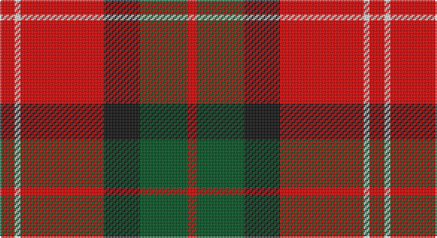

This page is one **sett** — a single exact thread-count. It belongs to the [tartan](/setts/r5w2r28k12dg16r3/)
(the same proportion at any scale), whose colour order is pattern [RGKRWR](/stripes/rgkrwr/).

Part of the [MacKintosh](/tartans/mackintosh/) tartan — the named design grouping this sett with its other cloths.

Sourced from register-of-tartans.  It is a [6 stripe tartan](/stripes/stripes6/).

Original link https://www.tartanregister.gov.uk/tartanDetails.aspx?ref=2562

## Also known as

This cloth is also recorded under:

- MacKintosh #4
- MacKintosh #5
- MacKintosh #6
- MacKintosh #8
- MacKintosh 4
- MacKintosh 7
- MacKintosh Plaid
- MacKintosh, Arisaid
- MacKintosh, Plaid
- MacKintosh, Red
- MacKintosh, Red Clan/Family
- Mackintosh #7

## Register references

External register numbers recorded for this tartan.

- Scottish Register of Tartans: [2562](https://www.tartanregister.gov.uk/tartanDetails.aspx?ref=2562)
- Scottish Tartans World Register: 1476

## Thread count
R/10 LN4 R56 K24 G32 R/6

One full sett is **248 threads**.

## Palette

Palette: <strong>Tartan Register</strong>
<table><thead><tr><th>Colour</th><th>Threads</th><th>Shade</th><th>Base</th><th>OKLCh</th></tr></thead><tbody><tr><td>R/</td><td style="text-align:right;font-variant-numeric:tabular-nums">10</td><td><code style="background-color:#DC0000;">#DC0000</code> <small style="color:#888">#DC0000</small></td><td>R <code style="background-color:#CC0000;">#CC0000</code></td><td><small style="color:#888">oklch(56.2% 0.230 29.2)</small></td></tr><tr><td>LN</td><td style="text-align:right;font-variant-numeric:tabular-nums">4</td><td><code style="background-color:#E0E0E0;">#E0E0E0</code> <small style="color:#888">#E0E0E0</small></td><td>W <code style="background-color:#F7F7F7;">#F7F7F7</code></td><td><small style="color:#888">oklch(90.7% 0.000 89.9)</small></td></tr><tr><td>R</td><td style="text-align:right;font-variant-numeric:tabular-nums">56</td><td><code style="background-color:#DC0000;">#DC0000</code> <small style="color:#888">#DC0000</small></td><td>R <code style="background-color:#CC0000;">#CC0000</code></td><td><small style="color:#888">oklch(56.2% 0.230 29.2)</small></td></tr><tr><td>K</td><td style="text-align:right;font-variant-numeric:tabular-nums">24</td><td><code style="background-color:#101010;">#101010</code> <small style="color:#888">#101010</small></td><td>K <code style="background-color:#000000;">#000000</code></td><td><small style="color:#888">oklch(17.3% 0.000 89.9)</small></td></tr><tr><td>G</td><td style="text-align:right;font-variant-numeric:tabular-nums">32</td><td><code style="background-color:#005020;">#005020</code> <small style="color:#888">#005020</small></td><td>G <code style="background-color:#006100;">#006100</code></td><td><small style="color:#888">oklch(37.7% 0.105 149.6)</small></td></tr><tr><td>R/</td><td style="text-align:right;font-variant-numeric:tabular-nums">6</td><td><code style="background-color:#DC0000;">#DC0000</code> <small style="color:#888">#DC0000</small></td><td>R <code style="background-color:#CC0000;">#CC0000</code></td><td><small style="color:#888">oklch(56.2% 0.230 29.2)</small></td></tr></tbody></table>

# Sample pattern

## Compared to the master

This cloth is one sett of its design; the master sett (the exemplar the design is anchored on) is below for comparison.

<figure style="margin:0"><figcaption style="color:#888;font-size:smaller">this sett</figcaption></figure>
<figure style="margin:0"><figcaption style="color:#888;font-size:smaller"><a href="/setts/r16db6r2dg6r2db1/">master sett →</a></figcaption></figure>

## Nearest tartans

The nearest existing variants by ΔTartan distance, with this tartan at the top so the swatches line up against it.

ΔTartan

Tartan

Sett

—

<a href="/ttd/edit/#slug=r5w2r28k12dg16r3~x2">MacKintosh #4</a> <a class="nn-out" href="/variants/s6/r5w2r28k12dg16r3~x2/" title="open its dictionary page">↗</a>

0.70

<a href="/ttd/edit/#slug=r36lt9k12g17r10k3r10~x2&amp;base=r5w2r28k12dg16r3~x2">MacDuff #6</a> <a class="nn-out" href="/variants/s7/r36lt9k12g17r10k3r10~x2/" title="open its dictionary page">↗</a>

0.76

<a href="/ttd/edit/#slug=r33k8dr12g12r8dr2r8~x2&amp;base=r5w2r28k12dg16r3~x2">Tipperary</a> <a class="nn-out" href="/variants/s7/r33k8dr12g12r8dr2r8~x2/" title="open its dictionary page">↗</a>

0.77

<a href="/ttd/edit/#slug=r5w2r28k12g16r3~x2&amp;base=r5w2r28k12dg16r3~x2">MacKintosh 6</a> <a class="nn-out" href="/variants/s6/r5w2r28k12g16r3~x2/" title="open its dictionary page">↗</a>

0.80

<a href="/ttd/edit/#slug=r4k2r24k6db6dg16r3~x2&amp;base=r5w2r28k12dg16r3~x2">MacDuff #4</a> <a class="nn-out" href="/variants/s7/r4k2r24k6db6dg16r3~x2/" title="open its dictionary page">↗</a>

0.82

<a href="/ttd/edit/#slug=k2r16dg6r3dg8lb1&amp;base=r5w2r28k12dg16r3~x2">MacAulay</a> <a class="nn-out" href="/variants/s6/k2r16dg6r3dg8lb1/" title="open its dictionary page">↗</a>

0.86

<a href="/ttd/edit/#slug=r36db9k12g17r10k3r10~x2&amp;base=r5w2r28k12dg16r3~x2">MacDuff - 1819 (Clan)</a> <a class="nn-out" href="/variants/s7/r36db9k12g17r10k3r10~x2/" title="open its dictionary page">↗</a>

0.89

<a href="/ttd/edit/#slug=r2db10r2g10r25w2~x2&amp;base=r5w2r28k12dg16r3~x2">Grant of Lurg</a> <a class="nn-out" href="/variants/s6/r2db10r2g10r25w2~x2/" title="open its dictionary page">↗</a>

0.91

<a href="/ttd/edit/#slug=k4r26k4w2k13ly4~x2&amp;base=r5w2r28k12dg16r3~x2">Dunbar #2</a> <a class="nn-out" href="/variants/s6/k4r26k4w2k13ly4~x2/" title="open its dictionary page">↗</a>

0.97

<a href="/ttd/edit/#slug=r4k2r24k6db6g16r3~x2&amp;base=r5w2r28k12dg16r3~x2">MacDuff</a> <a class="nn-out" href="/variants/s7/r4k2r24k6db6g16r3~x2/" title="open its dictionary page">↗</a>

0.98

<a href="/ttd/edit/#slug=r1db6r1dg6r12lb1&amp;base=r5w2r28k12dg16r3~x2">Fraser VS</a> <a class="nn-out" href="/variants/s6/r1db6r1dg6r12lb1/" title="open its dictionary page">↗</a>

## Neighbour map

Every grey dot is one of 14360 variants placed by the first two principal components of the ΔTartan feature space (44% of its variance). Red is this tartan; blue dots are its nearest — click one to open its page.

<svg viewBox="0 0 640 380" role="img" style="max-width:100%;height:auto;border:1px solid #e0e0e0;border-radius:4px;display:block" xmlns="http://www.w3.org/2000/svg"><image href="/nn/cloud.v1.png" width="640" height="380"/><a href="/variants/s7/r36lt9k12g17r10k3r10~x2/"><circle cx="291.5" cy="190.9" r="4" fill="#3465a4"><title>MacDuff #6</title></circle></a><a href="/variants/s7/r33k8dr12g12r8dr2r8~x2/"><circle cx="327.9" cy="178.7" r="4" fill="#3465a4"><title>Tipperary</title></circle></a><a href="/variants/s6/r5w2r28k12g16r3~x2/"><circle cx="282.9" cy="178.5" r="4" fill="#3465a4"><title>MacKintosh 6</title></circle></a><a href="/variants/s7/r4k2r24k6db6dg16r3~x2/"><circle cx="278.1" cy="183.7" r="4" fill="#3465a4"><title>MacDuff #4</title></circle></a><a href="/variants/s6/k2r16dg6r3dg8lb1/"><circle cx="321.2" cy="184.3" r="4" fill="#3465a4"><title>MacAulay</title></circle></a><a href="/variants/s7/r36db9k12g17r10k3r10~x2/"><circle cx="308.8" cy="200.4" r="4" fill="#3465a4"><title>MacDuff - 1819 (Clan)</title></circle></a><a href="/variants/s6/r2db10r2g10r25w2~x2/"><circle cx="327.2" cy="179.7" r="4" fill="#3465a4"><title>Grant of Lurg</title></circle></a><a href="/variants/s6/k4r26k4w2k13ly4~x2/"><circle cx="280.3" cy="166.4" r="4" fill="#3465a4"><title>Dunbar #2</title></circle></a><a href="/variants/s7/r4k2r24k6db6g16r3~x2/"><circle cx="260.4" cy="179.1" r="4" fill="#3465a4"><title>MacDuff</title></circle></a><a href="/variants/s6/r1db6r1dg6r12lb1/"><circle cx="280.6" cy="185.4" r="4" fill="#3465a4"><title>Fraser VS</title></circle></a><circle cx="300.2" cy="181.9" r="5" fill="#c00000"/></svg>

ID: /variants/s6/r5w2r28k12dg16r3~x2/
