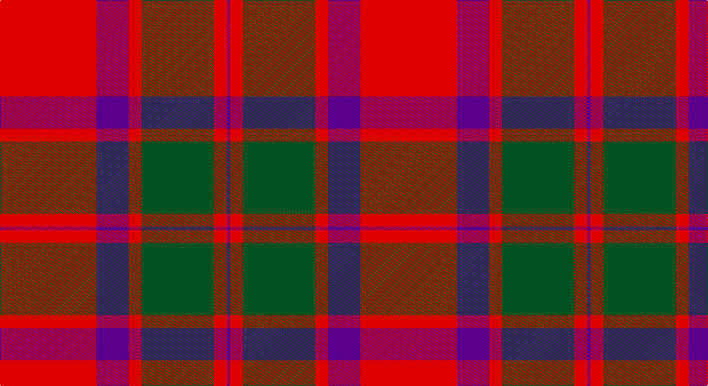

This page is one **sett** — a single exact thread-count. It belongs to the [tartan](/setts/r60dp20r8dg45r8dp2/)
(the same proportion at any scale), whose colour order is pattern [BRGRBR](/stripes/brgrbr/).

Sourced from register-of-tartans.  It is a [6 stripe tartan](/stripes/stripes6/).

Original link https://www.tartanregister.gov.uk/tartanDetails.aspx?ref=470

## Register references

External register numbers recorded for this tartan.

- Scottish Register of Tartans: [470](https://www.tartanregister.gov.uk/tartanDetails.aspx?ref=470)
- Scottish Tartans World Register: 526

## Thread count
R/120 P40 R16 G90 R16 P/4

One full sett is **448 threads**.

## Palette

Palette: <strong>Tartan Register</strong>
<table><thead><tr><th>Colour</th><th>Threads</th><th>Shade</th><th>Base</th><th>OKLCh</th></tr></thead><tbody><tr><td>R/</td><td style="text-align:right;font-variant-numeric:tabular-nums">120</td><td><code style="background-color:#DC0000;">#DC0000</code> <small style="color:#888">#DC0000</small></td><td>R <code style="background-color:#CC0000;">#CC0000</code></td><td><small style="color:#888">oklch(56.2% 0.230 29.2)</small></td></tr><tr><td>P</td><td style="text-align:right;font-variant-numeric:tabular-nums">40</td><td><code style="background-color:#5A008C;">#5A008C</code> <small style="color:#888">#5A008C</small></td><td>B <code style="background-color:#2A418A;">#2A418A</code></td><td><small style="color:#888">oklch(37.0% 0.191 306.3)</small></td></tr><tr><td>R</td><td style="text-align:right;font-variant-numeric:tabular-nums">16</td><td><code style="background-color:#DC0000;">#DC0000</code> <small style="color:#888">#DC0000</small></td><td>R <code style="background-color:#CC0000;">#CC0000</code></td><td><small style="color:#888">oklch(56.2% 0.230 29.2)</small></td></tr><tr><td>G</td><td style="text-align:right;font-variant-numeric:tabular-nums">90</td><td><code style="background-color:#005020;">#005020</code> <small style="color:#888">#005020</small></td><td>G <code style="background-color:#006100;">#006100</code></td><td><small style="color:#888">oklch(37.7% 0.105 149.6)</small></td></tr><tr><td>R</td><td style="text-align:right;font-variant-numeric:tabular-nums">16</td><td><code style="background-color:#DC0000;">#DC0000</code> <small style="color:#888">#DC0000</small></td><td>R <code style="background-color:#CC0000;">#CC0000</code></td><td><small style="color:#888">oklch(56.2% 0.230 29.2)</small></td></tr><tr><td>P/</td><td style="text-align:right;font-variant-numeric:tabular-nums">4</td><td><code style="background-color:#5A008C;">#5A008C</code> <small style="color:#888">#5A008C</small></td><td>B <code style="background-color:#2A418A;">#2A418A</code></td><td><small style="color:#888">oklch(37.0% 0.191 306.3)</small></td></tr></tbody></table>

# Sample pattern

## Nearest tartans

The nearest existing variants by ΔTartan distance, with this tartan at the top so the swatches line up against it.

ΔTartan

Tartan

Sett

—

<a href="/ttd/edit/#slug=r60dp20r8dg45r8dp2~x2">Caledonian</a> <a class="nn-out" href="/variants/s6/r60dp20r8dg45r8dp2~x2/" title="open its dictionary page">↗</a>

0.63

<a href="/ttd/edit/#slug=r60dp20r8g45r8dp2&amp;base=r60dp20r8dg45r8dp2~x2">Caledonian - 1819 (Fashion?)</a> <a class="nn-out" href="/variants/s6/r60dp20r8g45r8dp2/" title="open its dictionary page">↗</a>

0.73

<a href="/ttd/edit/#slug=r60dp20r8g45r8dp2~x2&amp;base=r60dp20r8dg45r8dp2~x2">Caledonian District Tartan</a> <a class="nn-out" href="/variants/s6/r60dp20r8g45r8dp2~x2/" title="open its dictionary page">↗</a>

0.75

<a href="/ttd/edit/#slug=r60p20r8g45r8p2~x2&amp;base=r60dp20r8dg45r8dp2~x2">Caledonian</a> <a class="nn-out" href="/variants/s6/r60p20r8g45r8p2~x2/" title="open its dictionary page">↗</a>

0.83

<a href="/ttd/edit/#slug=r70db20r10g40r10db3&amp;base=r60dp20r8dg45r8dp2~x2">MacKintosh</a> <a class="nn-out" href="/variants/s6/r70db20r10g40r10db3/" title="open its dictionary page">↗</a>

0.93

<a href="/ttd/edit/#slug=r2dg20r2db8r36dg1~x2&amp;base=r60dp20r8dg45r8dp2~x2">Robertson</a> <a class="nn-out" href="/variants/s6/r2dg20r2db8r36dg1~x2/" title="open its dictionary page">↗</a>

0.94

<a href="/ttd/edit/#slug=r5g20r25db1r25db20r5db1~x4&amp;base=r60dp20r8dg45r8dp2~x2">Franklin Museum Unidentified 2</a> <a class="nn-out" href="/variants/s8/r5g20r25db1r25db20r5db1~x4/" title="open its dictionary page">↗</a>

0.95

<a href="/ttd/edit/#slug=r68db18r9dg34r9db3~x2&amp;base=r60dp20r8dg45r8dp2~x2">MacKintosh #2</a> <a class="nn-out" href="/variants/s6/r68db18r9dg34r9db3~x2/" title="open its dictionary page">↗</a>

1.01

<a href="/ttd/edit/#slug=r24db6r3dg12r4db1&amp;base=r60dp20r8dg45r8dp2~x2">MacKintosh</a> <a class="nn-out" href="/variants/s6/r24db6r3dg12r4db1/" title="open its dictionary page">↗</a>

1.05

<a href="/ttd/edit/#slug=r2db12r2g12r24w1~x2&amp;base=r60dp20r8dg45r8dp2~x2">Fraser (1745)</a> <a class="nn-out" href="/variants/s6/r2db12r2g12r24w1~x2/" title="open its dictionary page">↗</a>

1.06

<a href="/ttd/edit/#slug=r22db5r2dg11r3db1&amp;base=r60dp20r8dg45r8dp2~x2">MacKintosh D</a> <a class="nn-out" href="/variants/s6/r22db5r2dg11r3db1/" title="open its dictionary page">↗</a>

## Neighbour map

Every grey dot is one of 14360 variants placed by the first two principal components of the ΔTartan feature space (44% of its variance). Red is this tartan; blue dots are its nearest — click one to open its page.

<svg viewBox="0 0 640 380" role="img" style="max-width:100%;height:auto;border:1px solid #e0e0e0;border-radius:4px;display:block" xmlns="http://www.w3.org/2000/svg"><image href="/nn/cloud.v1.png" width="640" height="380"/><a href="/variants/s6/r60dp20r8g45r8dp2/"><circle cx="377.7" cy="179.5" r="4" fill="#3465a4"><title>Caledonian - 1819 (Fashion?)</title></circle></a><a href="/variants/s6/r60dp20r8g45r8dp2~x2/"><circle cx="386.4" cy="182.0" r="4" fill="#3465a4"><title>Caledonian District Tartan</title></circle></a><a href="/variants/s6/r60p20r8g45r8p2~x2/"><circle cx="378.9" cy="179.0" r="4" fill="#3465a4"><title>Caledonian</title></circle></a><a href="/variants/s6/r70db20r10g40r10db3/"><circle cx="400.1" cy="188.2" r="4" fill="#3465a4"><title>MacKintosh</title></circle></a><a href="/variants/s6/r2dg20r2db8r36dg1~x2/"><circle cx="423.6" cy="154.3" r="4" fill="#3465a4"><title>Robertson</title></circle></a><a href="/variants/s8/r5g20r25db1r25db20r5db1~x4/"><circle cx="380.1" cy="181.1" r="4" fill="#3465a4"><title>Franklin Museum Unidentified 2</title></circle></a><a href="/variants/s6/r68db18r9dg34r9db3~x2/"><circle cx="411.4" cy="181.0" r="4" fill="#3465a4"><title>MacKintosh #2</title></circle></a><a href="/variants/s6/r24db6r3dg12r4db1/"><circle cx="409.8" cy="179.2" r="4" fill="#3465a4"><title>MacKintosh</title></circle></a><a href="/variants/s6/r2db12r2g12r24w1~x2/"><circle cx="332.4" cy="163.8" r="4" fill="#3465a4"><title>Fraser (1745)</title></circle></a><a href="/variants/s6/r22db5r2dg11r3db1/"><circle cx="407.5" cy="178.0" r="4" fill="#3465a4"><title>MacKintosh D</title></circle></a><circle cx="369.2" cy="172.4" r="5" fill="#c00000"/></svg>

ID: /variants/s6/r60dp20r8dg45r8dp2~x2/
