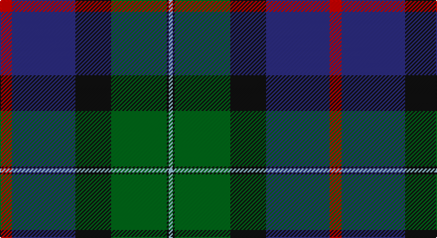

This page is one **sett** — a single exact thread-count. It belongs to the [tartan](/setts/r6db32k18g28k1lb2/)
(the same proportion at any scale), whose colour order is pattern [RBKGKW](/stripes/rbkgkw/).

Part of the [Naysmith](/tartans/naysmith/) tartan — the named design grouping this sett with its other cloths.

Sourced from tartans-authority.  It is a [6 stripe tartan](/stripes/stripes6/).

Original link http://www.tartansauthority.com/tartan-ferret/display/8222/

## Also known as

This cloth is also recorded under:

- Naysmith, William A
- Naysmith, William S

## Register references

External register numbers recorded for this tartan.

- Scottish Tartans Authority (ITI): 8222

## Thread count
R/12 DB64 K36 G56 K2 LB/4

One full sett is **332 threads**.

## Palette

Palette: <strong>Tartan Register</strong>
<table><thead><tr><th>Colour</th><th>Threads</th><th>Shade</th><th>Base</th><th>OKLCh</th></tr></thead><tbody><tr><td>R/</td><td style="text-align:right;font-variant-numeric:tabular-nums">12</td><td><code style="background-color:#C80000;">#C80000</code> <small style="color:#888">#C80000</small></td><td>R <code style="background-color:#CC0000;">#CC0000</code></td><td><small style="color:#888">oklch(52.3% 0.215 29.2)</small></td></tr><tr><td>DB</td><td style="text-align:right;font-variant-numeric:tabular-nums">64</td><td><code style="background-color:#2C2C80;">#2C2C80</code> <small style="color:#888">#2C2C80</small></td><td>B <code style="background-color:#2A418A;">#2A418A</code></td><td><small style="color:#888">oklch(35.0% 0.138 276.6)</small></td></tr><tr><td>K</td><td style="text-align:right;font-variant-numeric:tabular-nums">36</td><td><code style="background-color:#101010;">#101010</code> <small style="color:#888">#101010</small></td><td>K <code style="background-color:#000000;">#000000</code></td><td><small style="color:#888">oklch(17.3% 0.000 89.9)</small></td></tr><tr><td>G</td><td style="text-align:right;font-variant-numeric:tabular-nums">56</td><td><code style="background-color:#006818;">#006818</code> <small style="color:#888">#006818</small></td><td>G <code style="background-color:#006100;">#006100</code></td><td><small style="color:#888">oklch(45.0% 0.142 145.0)</small></td></tr><tr><td>K</td><td style="text-align:right;font-variant-numeric:tabular-nums">2</td><td><code style="background-color:#101010;">#101010</code> <small style="color:#888">#101010</small></td><td>K <code style="background-color:#000000;">#000000</code></td><td><small style="color:#888">oklch(17.3% 0.000 89.9)</small></td></tr><tr><td>LB/</td><td style="text-align:right;font-variant-numeric:tabular-nums">4</td><td><code style="background-color:#98C8E8;">#98C8E8</code> <small style="color:#888">#98C8E8</small></td><td>W <code style="background-color:#F7F7F7;">#F7F7F7</code></td><td><small style="color:#888">oklch(81.0% 0.068 237.9)</small></td></tr></tbody></table>

# Sample pattern

## Compared to the master

This cloth is one sett of its design; the master sett (the exemplar the design is anchored on) is below for comparison.

<figure style="margin:0"><figcaption style="color:#888;font-size:smaller">this sett</figcaption></figure>
<figure style="margin:0"><figcaption style="color:#888;font-size:smaller"><a href="/setts/lb4r2db14k4lb4k3lb3k2r2lbi2/">master sett →</a></figcaption></figure>

## Nearest tartans

The nearest existing variants by ΔTartan distance, with this tartan at the top so the swatches line up against it.

ΔTartan

Tartan

Sett

—

<a href="/ttd/edit/#slug=r6db32k18g28k1lb2~x2">Naysmith (Name)</a> <a class="nn-out" href="/variants/s6/r6db32k18g28k1lb2~x2/" title="open its dictionary page">↗</a>

1.00

<a href="/ttd/edit/#slug=db4k2db16w1k8dg24r4~x2&amp;base=r6db32k18g28k1lb2~x2">Colquhoun</a> <a class="nn-out" href="/variants/s7/db4k2db16w1k8dg24r4~x2/" title="open its dictionary page">↗</a>

1.00

<a href="/ttd/edit/#slug=t3db18k20g20k1ly3~x2&amp;base=r6db32k18g28k1lb2~x2">Smith, Sir William (?)</a> <a class="nn-out" href="/variants/s6/t3db18k20g20k1ly3~x2/" title="open its dictionary page">↗</a>

1.01

<a href="/ttd/edit/#slug=db28ly1db2k26g24k1g2r3~x2&amp;base=r6db32k18g28k1lb2~x2">Ogilvie of Inverarity - 1842 (V.S.)</a> <a class="nn-out" href="/variants/s8/db28ly1db2k26g24k1g2r3~x2/" title="open its dictionary page">↗</a>

1.08

<a href="/ttd/edit/#slug=ly2k4ly1dg16k14db23k4r1~x2&amp;base=r6db32k18g28k1lb2~x2">Thomas of Craigie (Personal)</a> <a class="nn-out" href="/variants/s8/ly2k4ly1dg16k14db23k4r1~x2/" title="open its dictionary page">↗</a>

1.11

<a href="/ttd/edit/#slug=k6dbi3g28w1db28dbi2w3~x2&amp;base=r6db32k18g28k1lb2~x2">Weisfeld (Name)</a> <a class="nn-out" href="/variants/s7/k6dbi3g28w1db28dbi2w3~x2/" title="open its dictionary page">↗</a>

1.11

<a href="/ttd/edit/#slug=lo4db24g3k21g23k1~x2&amp;base=r6db32k18g28k1lb2~x2">Glenturret Distillery</a> <a class="nn-out" href="/variants/s6/lo4db24g3k21g23k1~x2/" title="open its dictionary page">↗</a>

1.15

<a href="/ttd/edit/#slug=db18k10g6r4g6k1w2~x2&amp;base=r6db32k18g28k1lb2~x2">Ferguson - 1830 of Atholl (Clan)</a> <a class="nn-out" href="/variants/s7/db18k10g6r4g6k1w2~x2/" title="open its dictionary page">↗</a>

1.16

<a href="/ttd/edit/#slug=dy2g12k10r1db16r2~x2&amp;base=r6db32k18g28k1lb2~x2">MacWilliam Clan Tartan</a> <a class="nn-out" href="/variants/s6/dy2g12k10r1db16r2~x2/" title="open its dictionary page">↗</a>

1.21

<a href="/ttd/edit/#slug=o3ri18k2dg18k24r1~x2&amp;base=r6db32k18g28k1lb2~x2">205 (Scottish) Field Hospital (Mil.)</a> <a class="nn-out" href="/variants/s6/o3ri18k2dg18k24r1~x2/" title="open its dictionary page">↗</a>

1.22

<a href="/ttd/edit/#slug=db4k2db16lr1k8dg24r4~x2&amp;base=r6db32k18g28k1lb2~x2">Colqhoun VS</a> <a class="nn-out" href="/variants/s7/db4k2db16lr1k8dg24r4~x2/" title="open its dictionary page">↗</a>

## Neighbour map

Every grey dot is one of 14360 variants placed by the first two principal components of the ΔTartan feature space (44% of its variance). Red is this tartan; blue dots are its nearest — click one to open its page.

<svg viewBox="0 0 640 380" role="img" style="max-width:100%;height:auto;border:1px solid #e0e0e0;border-radius:4px;display:block" xmlns="http://www.w3.org/2000/svg"><image href="/nn/cloud.v1.png" width="640" height="380"/><a href="/variants/s7/db4k2db16w1k8dg24r4~x2/"><circle cx="265.3" cy="175.7" r="4" fill="#3465a4"><title>Colquhoun</title></circle></a><a href="/variants/s6/t3db18k20g20k1ly3~x2/"><circle cx="179.8" cy="185.0" r="4" fill="#3465a4"><title>Smith, Sir William (?)</title></circle></a><a href="/variants/s8/db28ly1db2k26g24k1g2r3~x2/"><circle cx="245.6" cy="149.9" r="4" fill="#3465a4"><title>Ogilvie of Inverarity - 1842 (V.S.)</title></circle></a><a href="/variants/s8/ly2k4ly1dg16k14db23k4r1~x2/"><circle cx="235.1" cy="166.6" r="4" fill="#3465a4"><title>Thomas of Craigie (Personal)</title></circle></a><a href="/variants/s7/k6dbi3g28w1db28dbi2w3~x2/"><circle cx="268.6" cy="152.5" r="4" fill="#3465a4"><title>Weisfeld (Name)</title></circle></a><a href="/variants/s6/lo4db24g3k21g23k1~x2/"><circle cx="226.0" cy="199.4" r="4" fill="#3465a4"><title>Glenturret Distillery</title></circle></a><a href="/variants/s7/db18k10g6r4g6k1w2~x2/"><circle cx="189.4" cy="176.6" r="4" fill="#3465a4"><title>Ferguson - 1830 of Atholl (Clan)</title></circle></a><a href="/variants/s6/dy2g12k10r1db16r2~x2/"><circle cx="214.2" cy="201.6" r="4" fill="#3465a4"><title>MacWilliam Clan Tartan</title></circle></a><a href="/variants/s6/o3ri18k2dg18k24r1~x2/"><circle cx="247.0" cy="180.4" r="4" fill="#3465a4"><title>205 (Scottish) Field Hospital (Mil.)</title></circle></a><a href="/variants/s7/db4k2db16lr1k8dg24r4~x2/"><circle cx="248.6" cy="171.9" r="4" fill="#3465a4"><title>Colqhoun VS</title></circle></a><circle cx="234.1" cy="167.9" r="5" fill="#c00000"/></svg>

ID: /variants/s6/r6db32k18g28k1lb2~x2/
