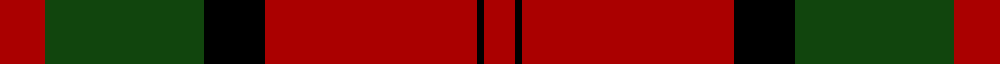
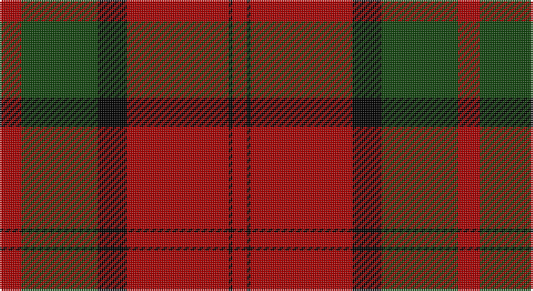

This page is one **sett** — a single exact thread-count. It belongs to the [tartan](/setts/r6dg21k8r28k1r4/)
(the same proportion at any scale), whose colour order is pattern [RGKRKR](/stripes/rgkrkr/).

Part of the [Dunbar](/tartans/dunbar/) tartan — the named design grouping this sett with its other cloths.

Sourced from weddslist.  It is a [6 stripe tartan](/stripes/stripes6/).

Original link http://www.weddslist.com/cgi-bin/tartans/pg.pl?source=tinsel

## Also known as

This cloth is also recorded under:

- Dunbar #2
- Dunbar Ancient
- Dunbar Plaid
- Dunbar, Plaid

2 attestations — the source records this cloth was collapsed from (oldest owns this page)

<ul>
<li>undated — Dunbar (weddslist, <a href="http://www.weddslist.com/cgi-bin/tartans/pg.pl?source=tinsel">record</a>)</li>
<li>undated — Dunbar (weddslist, <a href="http://www.weddslist.com/cgi-bin/tartans/pg.pl?source=x">record</a>)</li>
</ul>

## Thread count
DR/12 DG42 K16 DR56 K2 DR/8

One full sett is **252 threads**.

## Palette

Palette: <strong>Ingles Buchan</strong> <small style="color:#888">(1 of 3 colours)</small>
<table><thead><tr><th>Colour</th><th>Threads</th><th>Shade</th><th>Base</th><th>OKLCh</th></tr></thead><tbody><tr><td>DR/</td><td style="text-align:right;font-variant-numeric:tabular-nums">12</td><td><code style="background-color:#AA0000;">#AA0000</code> <small style="color:#888">#AA0000</small></td><td>R <code style="background-color:#CC0000;">#CC0000</code></td><td><small style="color:#888">oklch(46.3% 0.190 29.2)</small></td></tr><tr><td>DG</td><td style="text-align:right;font-variant-numeric:tabular-nums">42</td><td><code style="background-color:#11450D;">#11450D</code> <small style="color:#888">#11450D</small></td><td>G <code style="background-color:#006100;">#006100</code></td><td><small style="color:#888">oklch(34.4% 0.101 142.1)</small></td></tr><tr><td>K</td><td style="text-align:right;font-variant-numeric:tabular-nums">16</td><td><code style="background-color:#000000;">#000000</code> <small style="color:#888">#000000</small></td><td>K <code style="background-color:#000000;">#000000</code></td><td><small style="color:#888">oklch(0.0% 0.000 0.0)</small></td></tr><tr><td>DR</td><td style="text-align:right;font-variant-numeric:tabular-nums">56</td><td><code style="background-color:#AA0000;">#AA0000</code> <small style="color:#888">#AA0000</small></td><td>R <code style="background-color:#CC0000;">#CC0000</code></td><td><small style="color:#888">oklch(46.3% 0.190 29.2)</small></td></tr><tr><td>K</td><td style="text-align:right;font-variant-numeric:tabular-nums">2</td><td><code style="background-color:#000000;">#000000</code> <small style="color:#888">#000000</small></td><td>K <code style="background-color:#000000;">#000000</code></td><td><small style="color:#888">oklch(0.0% 0.000 0.0)</small></td></tr><tr><td>DR/</td><td style="text-align:right;font-variant-numeric:tabular-nums">8</td><td><code style="background-color:#AA0000;">#AA0000</code> <small style="color:#888">#AA0000</small></td><td>R <code style="background-color:#CC0000;">#CC0000</code></td><td><small style="color:#888">oklch(46.3% 0.190 29.2)</small></td></tr></tbody></table>

# Sample pattern

## Compared to the master

This cloth is one sett of its design; the master sett (the exemplar the design is anchored on) is below for comparison.

<figure style="margin:0"><figcaption style="color:#888;font-size:smaller">this sett</figcaption></figure>
<figure style="margin:0"><figcaption style="color:#888;font-size:smaller"><a href="/setts/r28k4w2k13/">master sett →</a></figcaption></figure>

## Nearest tartans

The nearest existing variants by ΔTartan distance, with this tartan at the top so the swatches line up against it.

ΔTartan

Tartan

Sett

—

<a href="/ttd/edit/#slug=r6dg21k8r28k1r4~x2">Dunbar</a> <a class="nn-out" href="/variants/s6/r6dg21k8r28k1r4~x2/" title="open its dictionary page">↗</a>

0.64

<a href="/ttd/edit/#slug=r6dg21k8r28dg1r4~x2&amp;base=r6dg21k8r28k1r4~x2">Dunbar</a> <a class="nn-out" href="/variants/s6/r6dg21k8r28dg1r4~x2/" title="open its dictionary page">↗</a>

1.03

<a href="/ttd/edit/#slug=r60dp20r8g45r8dp2&amp;base=r6dg21k8r28k1r4~x2">Caledonian - 1819 (Fashion?)</a> <a class="nn-out" href="/variants/s6/r60dp20r8g45r8dp2/" title="open its dictionary page">↗</a>

1.03

<a href="/ttd/edit/#slug=dg16k57r36k2r4dg2&amp;base=r6dg21k8r28k1r4~x2">Rosser of Wales</a> <a class="nn-out" href="/variants/s6/dg16k57r36k2r4dg2/" title="open its dictionary page">↗</a>

1.04

<a href="/ttd/edit/#slug=r6g21k8r28k1r4~x2&amp;base=r6dg21k8r28k1r4~x2">Dunbar</a> <a class="nn-out" href="/variants/s6/r6g21k8r28k1r4~x2/" title="open its dictionary page">↗</a>

1.06

<a href="/ttd/edit/#slug=r16k57r36k2r4r2&amp;base=r6dg21k8r28k1r4~x2">Rosser (Welsh Name)</a> <a class="nn-out" href="/variants/s6/r16k57r36k2r4r2/" title="open its dictionary page">↗</a>

1.08

<a href="/ttd/edit/#slug=r24db6r3dg12r4db1~x2&amp;base=r6dg21k8r28k1r4~x2">MacKintosh</a> <a class="nn-out" href="/variants/s6/r24db6r3dg12r4db1~x2/" title="open its dictionary page">↗</a>

1.08

<a href="/ttd/edit/#slug=r24db6r3dg12r4db1&amp;base=r6dg21k8r28k1r4~x2">MacKintosh</a> <a class="nn-out" href="/variants/s6/r24db6r3dg12r4db1/" title="open its dictionary page">↗</a>

1.12

<a href="/ttd/edit/#slug=r22db5r2dg11r3db1&amp;base=r6dg21k8r28k1r4~x2">MacKintosh D</a> <a class="nn-out" href="/variants/s6/r22db5r2dg11r3db1/" title="open its dictionary page">↗</a>

1.13

<a href="/ttd/edit/#slug=r22db5r2dg11r3db1~x2&amp;base=r6dg21k8r28k1r4~x2">MacKintosh D</a> <a class="nn-out" href="/variants/s6/r22db5r2dg11r3db1~x2/" title="open its dictionary page">↗</a>

1.21

<a href="/ttd/edit/#slug=r25k7r3g13y1k2~x4&amp;base=r6dg21k8r28k1r4~x2">MacPhail</a> <a class="nn-out" href="/variants/s6/r25k7r3g13y1k2~x4/" title="open its dictionary page">↗</a>

## Neighbour map

Every grey dot is one of 14360 variants placed by the first two principal components of the ΔTartan feature space (44% of its variance). Red is this tartan; blue dots are its nearest — click one to open its page.

<svg viewBox="0 0 640 380" role="img" style="max-width:100%;height:auto;border:1px solid #e0e0e0;border-radius:4px;display:block" xmlns="http://www.w3.org/2000/svg"><image href="/nn/cloud.v1.png" width="640" height="380"/><a href="/variants/s6/r6dg21k8r28dg1r4~x2/"><circle cx="365.4" cy="175.9" r="4" fill="#3465a4"><title>Dunbar</title></circle></a><a href="/variants/s6/r60dp20r8g45r8dp2/"><circle cx="377.7" cy="179.5" r="4" fill="#3465a4"><title>Caledonian - 1819 (Fashion?)</title></circle></a><a href="/variants/s6/dg16k57r36k2r4dg2/"><circle cx="358.3" cy="173.6" r="4" fill="#3465a4"><title>Rosser of Wales</title></circle></a><a href="/variants/s6/r6g21k8r28k1r4~x2/"><circle cx="353.7" cy="171.9" r="4" fill="#3465a4"><title>Dunbar</title></circle></a><a href="/variants/s6/r16k57r36k2r4r2/"><circle cx="361.6" cy="167.0" r="4" fill="#3465a4"><title>Rosser (Welsh Name)</title></circle></a><a href="/variants/s6/r24db6r3dg12r4db1~x2/"><circle cx="429.5" cy="193.3" r="4" fill="#3465a4"><title>MacKintosh</title></circle></a><a href="/variants/s6/r24db6r3dg12r4db1/"><circle cx="409.8" cy="179.2" r="4" fill="#3465a4"><title>MacKintosh</title></circle></a><a href="/variants/s6/r22db5r2dg11r3db1/"><circle cx="407.5" cy="178.0" r="4" fill="#3465a4"><title>MacKintosh D</title></circle></a><a href="/variants/s6/r22db5r2dg11r3db1~x2/"><circle cx="427.4" cy="192.1" r="4" fill="#3465a4"><title>MacKintosh D</title></circle></a><a href="/variants/s6/r25k7r3g13y1k2~x4/"><circle cx="350.5" cy="158.7" r="4" fill="#3465a4"><title>MacPhail</title></circle></a><circle cx="377.3" cy="186.3" r="5" fill="#c00000"/></svg>

ID: /variants/s6/r6dg21k8r28k1r4~x2/
