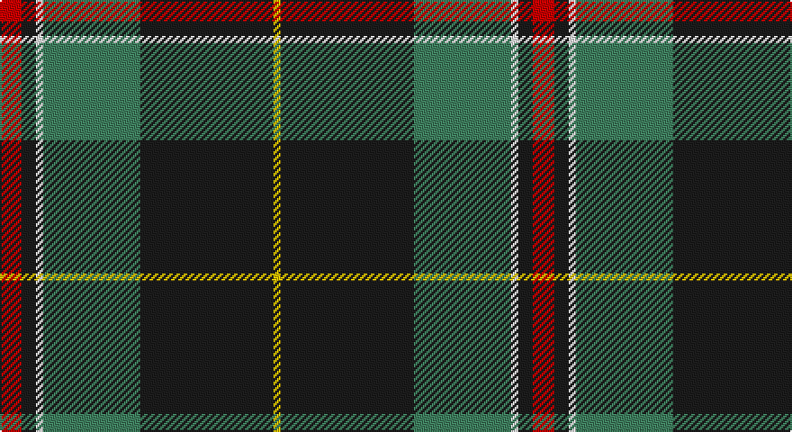

This page is one **sett** — a single exact thread-count. It belongs to the [tartan](/setts/r6dt4w2g27dt37ly2/)
(the same proportion at any scale), whose colour order is pattern [RBWGBY](/stripes/rbwgby/).

Part of the [Highlands of Durham](/tartans/highlands-of-durham/) tartan — the named design grouping this sett with its other cloths.

Sourced from tartans-authority.  It is a [6 stripe tartan](/stripes/stripes6/).

Original link http://www.tartansauthority.com/tartan-ferret/display/6189/

## Also known as

This cloth is also recorded under:

- Highlands of Durham #2

## Register references

External register numbers recorded for this tartan.

- Scottish Tartans Authority (ITI): 6189

## Thread count
R/12 K8 W4 G54 K74 Y/4

One full sett is **296 threads**.

## Palette

Palette: <strong>Tartan Register</strong>
<table><thead><tr><th>Colour</th><th>Threads</th><th>Shade</th><th>Base</th><th>OKLCh</th></tr></thead><tbody><tr><td>R/</td><td style="text-align:right;font-variant-numeric:tabular-nums">12</td><td><code style="background-color:#C80000;">#C80000</code> <small style="color:#888">#C80000</small></td><td>R <code style="background-color:#CC0000;">#CC0000</code></td><td><small style="color:#888">oklch(52.3% 0.215 29.2)</small></td></tr><tr><td>K</td><td style="text-align:right;font-variant-numeric:tabular-nums">8</td><td><code style="background-color:#1C1C1C;">#1C1C1C</code> <small style="color:#888">#1C1C1C</small></td><td>B <code style="background-color:#2A418A;">#2A418A</code></td><td><small style="color:#888">oklch(22.6% 0.000 89.9)</small></td></tr><tr><td>W</td><td style="text-align:right;font-variant-numeric:tabular-nums">4</td><td><code style="background-color:#FCFCFC;">#FCFCFC</code> <small style="color:#888">#FCFCFC</small></td><td>W <code style="background-color:#F7F7F7;">#F7F7F7</code></td><td><small style="color:#888">oklch(99.1% 0.000 89.9)</small></td></tr><tr><td>G</td><td style="text-align:right;font-variant-numeric:tabular-nums">54</td><td><code style="background-color:#408060;">#408060</code> <small style="color:#888">#408060</small></td><td>G <code style="background-color:#006100;">#006100</code></td><td><small style="color:#888">oklch(54.8% 0.084 160.1)</small></td></tr><tr><td>K</td><td style="text-align:right;font-variant-numeric:tabular-nums">74</td><td><code style="background-color:#1C1C1C;">#1C1C1C</code> <small style="color:#888">#1C1C1C</small></td><td>B <code style="background-color:#2A418A;">#2A418A</code></td><td><small style="color:#888">oklch(22.6% 0.000 89.9)</small></td></tr><tr><td>Y/</td><td style="text-align:right;font-variant-numeric:tabular-nums">4</td><td><code style="background-color:#E8C000;">#E8C000</code> <small style="color:#888">#E8C000</small></td><td>Y <code style="background-color:#F2BF00;">#F2BF00</code></td><td><small style="color:#888">oklch(81.9% 0.168 93.7)</small></td></tr></tbody></table>

# Sample pattern

## Compared to the master

This cloth is one sett of its design; the master sett (the exemplar the design is anchored on) is below for comparison.

<figure style="margin:0"><figcaption style="color:#888;font-size:smaller">this sett</figcaption></figure>
<figure style="margin:0"><figcaption style="color:#888;font-size:smaller"><a href="/setts/dt37g27w2dt4r6dt4w2g27dt37ly2/">master sett →</a></figcaption></figure>

## Nearest tartans

The nearest existing variants by ΔTartan distance, with this tartan at the top so the swatches line up against it.

ΔTartan

Tartan

Sett

—

<a href="/ttd/edit/#slug=r6dt4w2g27dt37ly2~x2">Highlands of Durham (Corporate)</a> <a class="nn-out" href="/variants/s6/r6dt4w2g27dt37ly2~x2/" title="open its dictionary page">↗</a>

0.84

<a href="/ttd/edit/#slug=k2r1ly1g8k15g2dp1~x2&amp;base=r6dt4w2g27dt37ly2~x2">Coalfields Regeneration Trust, The</a> <a class="nn-out" href="/variants/s7/k2r1ly1g8k15g2dp1~x2/" title="open its dictionary page">↗</a>

0.87

<a href="/ttd/edit/#slug=r3g14k2p2g14k36ly3~x2&amp;base=r6dt4w2g27dt37ly2~x2">Vipont (Yellow line)</a> <a class="nn-out" href="/variants/s7/r3g14k2p2g14k36ly3~x2/" title="open its dictionary page">↗</a>

0.88

<a href="/ttd/edit/#slug=k17dg48ly4r10lb12dg4&amp;base=r6dt4w2g27dt37ly2~x2">Asheville Firefighters, The</a> <a class="nn-out" href="/variants/s6/k17dg48ly4r10lb12dg4/" title="open its dictionary page">↗</a>

0.90

<a href="/ttd/edit/#slug=dg30db6r2db2ly2db15w2~x2&amp;base=r6dt4w2g27dt37ly2~x2">Hydesville Tower (Corporate)</a> <a class="nn-out" href="/variants/s7/dg30db6r2db2ly2db15w2~x2/" title="open its dictionary page">↗</a>

0.92

<a href="/ttd/edit/#slug=k2r1ly1y8k15y2dp1~x4&amp;base=r6dt4w2g27dt37ly2~x2">Coalfields Regeneration Trust, The</a> <a class="nn-out" href="/variants/s7/k2r1ly1y8k15y2dp1~x4/" title="open its dictionary page">↗</a>

0.95

<a href="/ttd/edit/#slug=n6dp4n2w2n25k26ly4~x2&amp;base=r6dt4w2g27dt37ly2~x2">New York State Troopers</a> <a class="nn-out" href="/variants/s7/n6dp4n2w2n25k26ly4~x2/" title="open its dictionary page">↗</a>

0.98

<a href="/ttd/edit/#slug=dy30ly5b10k10w2k2~x2&amp;base=r6dt4w2g27dt37ly2~x2">Bryan Wedding (Personal)</a> <a class="nn-out" href="/variants/s6/dy30ly5b10k10w2k2~x2/" title="open its dictionary page">↗</a>

1.07

<a href="/ttd/edit/#slug=b9w2dg30o6r2o2r2o6~x2&amp;base=r6dt4w2g27dt37ly2~x2">Ware/Warr (Name)</a> <a class="nn-out" href="/variants/s8/b9w2dg30o6r2o2r2o6~x2/" title="open its dictionary page">↗</a>

1.08

<a href="/ttd/edit/#slug=lo8k50o15dg6o6db3o6lo2~x2&amp;base=r6dt4w2g27dt37ly2~x2">Royal College of G.P.s (Corporate)</a> <a class="nn-out" href="/variants/s8/lo8k50o15dg6o6db3o6lo2~x2/" title="open its dictionary page">↗</a>

1.09

<a href="/ttd/edit/#slug=dy30ly5t10k10w2k2~x2&amp;base=r6dt4w2g27dt37ly2~x2">Bryan Wedding (Personal)</a> <a class="nn-out" href="/variants/s6/dy30ly5t10k10w2k2~x2/" title="open its dictionary page">↗</a>

## Neighbour map

Every grey dot is one of 14360 variants placed by the first two principal components of the ΔTartan feature space (44% of its variance). Red is this tartan; blue dots are its nearest — click one to open its page.

<svg viewBox="0 0 640 380" role="img" style="max-width:100%;height:auto;border:1px solid #e0e0e0;border-radius:4px;display:block" xmlns="http://www.w3.org/2000/svg"><image href="/nn/cloud.v1.png" width="640" height="380"/><a href="/variants/s7/k2r1ly1g8k15g2dp1~x2/"><circle cx="319.6" cy="158.0" r="4" fill="#3465a4"><title>Coalfields Regeneration Trust, The</title></circle></a><a href="/variants/s7/r3g14k2p2g14k36ly3~x2/"><circle cx="303.4" cy="161.5" r="4" fill="#3465a4"><title>Vipont (Yellow line)</title></circle></a><a href="/variants/s6/k17dg48ly4r10lb12dg4/"><circle cx="261.5" cy="178.8" r="4" fill="#3465a4"><title>Asheville Firefighters, The</title></circle></a><a href="/variants/s7/dg30db6r2db2ly2db15w2~x2/"><circle cx="306.8" cy="164.6" r="4" fill="#3465a4"><title>Hydesville Tower (Corporate)</title></circle></a><a href="/variants/s7/k2r1ly1y8k15y2dp1~x4/"><circle cx="310.0" cy="150.1" r="4" fill="#3465a4"><title>Coalfields Regeneration Trust, The</title></circle></a><a href="/variants/s7/n6dp4n2w2n25k26ly4~x2/"><circle cx="257.6" cy="167.8" r="4" fill="#3465a4"><title>New York State Troopers</title></circle></a><a href="/variants/s6/dy30ly5b10k10w2k2~x2/"><circle cx="267.3" cy="172.5" r="4" fill="#3465a4"><title>Bryan Wedding (Personal)</title></circle></a><a href="/variants/s8/b9w2dg30o6r2o2r2o6~x2/"><circle cx="276.6" cy="145.4" r="4" fill="#3465a4"><title>Ware/Warr (Name)</title></circle></a><a href="/variants/s8/lo8k50o15dg6o6db3o6lo2~x2/"><circle cx="296.7" cy="121.8" r="4" fill="#3465a4"><title>Royal College of G.P.s (Corporate)</title></circle></a><a href="/variants/s6/dy30ly5t10k10w2k2~x2/"><circle cx="251.9" cy="162.2" r="4" fill="#3465a4"><title>Bryan Wedding (Personal)</title></circle></a><circle cx="301.0" cy="159.8" r="5" fill="#c00000"/></svg>

ID: /variants/s6/r6dt4w2g27dt37ly2~x2/
