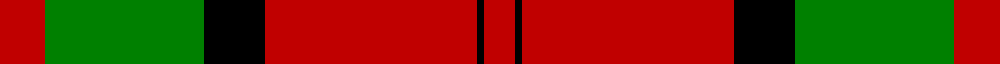
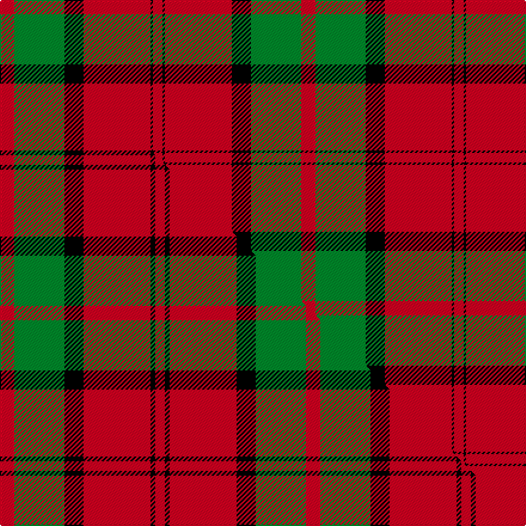

This is one **variant** — a specific cloth: this exact thread count and colourway, with its own
provenance below. It is one weaving of the [sett](/tartans/d/du/dunbar-4/) (the scale-free proportion — the
same cloth at any scale or shade), whose colour order is pattern [RGKRKR](/stripes/rgkrkr/).

Part of the [Dunbar](/tartans/d/du/dunbar-4/) tartan — the named design grouping this sett with its other cloths.

Sourced from house-of-tartan.  It is a [6 stripe tartan](/stripes/stripes6/).

Original link [http://www.house-of-tartan.scotland.net/house/TartanViewjs.asp?colr=Def&tnam=1472](http://www.house-of-tartan.scotland.net/house/TartanViewjs.asp?colr=Def&tnam=1472)

## Provenance

Earliest known date: 1842 The sett for this Lowland family first appeared in the Vestiarium Scoticum. There is also a Dunbar district tartan woven by Wilson's of Bannockburn around 1850. It is not possible to say whether Wilson's pattern was intended as a district or a family sett. The Chief of the Dunbars, Sir Jean Dunbar of Mochrum, once a jockey, lives in Florida, U.S.A.

4 attestations — the source records this cloth was collapsed from (oldest owns this page)

<ul>
<li>1842 — Dunbar Family Tartan (house-of-tartan, <a href="http://www.house-of-tartan.scotland.net/house/TartanViewjs.asp?colr=Def&tnam=1472">record</a>) </li>
<li>undated — Dunbar (weddslist, <a href="http://www.weddslist.com/cgi-bin/tartans/pg.pl?source=sts">record</a>) </li>
<li>undated — Dunbar (weddslist, <a href="http://www.weddslist.com/cgi-bin/tartans/pg.pl?source=tinsel">record</a>) </li>
<li>undated — Dunbar (weddslist, <a href="http://www.weddslist.com/cgi-bin/tartans/pg.pl?source=x">record</a>) </li>
</ul>

Dataset <small>— provenance for this record, inherited from the source manifest</small>

<dl class="dataset-prov">
<dt>source</dt><dd><a href="/sources/house-of-tartan/">House of Tartan</a></dd>
<dt>data captured from</dt><dd><a href="https://github.com/thetartan/tartan-database/blob/master/data/house-of-tartan/data.csv">https://github.com/thetartan/tartan-database/blob/master/data/house-of-tartan/data.csv</a></dd>
<dt>data date</dt><dd>1842 <small>(this record)</small></dd>
<dt>licence</dt><dd><a href="https://creativecommons.org/licenses/by-nc-nd/4.0/">CC BY-NC-ND 4.0</a></dd>
</dl>

Capture chain <small>— the hands this data passed through, oldest first; each capture carries its own licence</small>

<ol class="capture-chain">
<li><a href="http://www.house-of-tartan.scotland.net/">House of Tartan</a> <small>the weaver/retailer's database — the site is now offline; the URL is kept as the ultimate source's identity</small></li>
<li><a href="https://github.com/thetartan/tartan-database">thetartan/tartan-database</a> <small>2016-2017</small> · <a href="https://creativecommons.org/licenses/by-nc-nd/4.0/">CC BY-NC-ND 4.0</a> <small>Levko Kravets's frozen compilation — the capture we vendored, and where its CC licence text came from</small></li>
<li>this dictionary <small>captured 2026-06-10 · commit 5bf86c7566</small> <small>each re-capture is a git commit to data/sources</small></li>
</ol>

## Thread count
R/12 G42 K16 R56 K2 R/8

One full sett is **252 threads**.

## Palette
<table><thead><tr><th>Colour</th><th>Shade</th><th>OKLCh</th></tr></thead><tbody><tr><td>G</td><td><code style="background-color:#008B2A;">#008B2A</code> <small style="color:#888">#008B2A</small></td><td><small style="color:#888">oklch(55.4% 0.170 145.9)</small></td></tr><tr><td>K</td><td><code style="background-color:#000000;">#000000</code> <small style="color:#888">#000000</small></td><td><small style="color:#888">oklch(0.0% 0.000 0.0)</small></td></tr><tr><td>R</td><td><code style="background-color:#D60020;">#D60020</code> <small style="color:#888">#D60020</small></td><td><small style="color:#888">oklch(55.2% 0.224 25.5)</small></td></tr></tbody></table>

# Sample pattern

## Compared to the master

This cloth is one sett of its design; the master sett (the exemplar the design is anchored on) is below for comparison.

Its **ΔTartan distance** from the master is **0.49** — the same measure the nearest-tartans table ranks by (0 is identical; a re-scale of the same cloth is near 0, a recolour or a different proportion further).

<figure class="master-compare" style="margin:0">

this sett
master sett ★

<figcaption style="color:#888;font-size:smaller">One weave of this sett against the <a href="/setts/r6g21k8r28k2r4/">master sett ★</a>, split on the diagonal: a shared proportion runs seamlessly across it with only the shades shifting; a different proportion breaks on it.</figcaption>
</figure>

## Nearest tartan variants

The nearest existing variants by ΔTartan distance, with this cloth at the top so the swatches line up against it.

ΔTartan

Threads

Variant

Sett

—

252

<a href="/variants/s6/r6g21k8r28k1r4~x2/">Dunbar Family Tartan</a>

<a href="/ttd/edit/#slug=r6g21k8r28k2r4~x2&amp;base=r6g21k8r28k1r4~x2" title="compare in the TTD">0.49</a>

256

<a href="/variants/s6/r6g21k8r28k2r4~x2/">Dunbar</a>

<a href="/ttd/edit/#slug=r10g24k10r28lb3r6~x2&amp;base=r6g21k8r28k1r4~x2" title="compare in the TTD">0.85</a>

292

<a href="/variants/s6/r10g24k10r28lb3r6~x2/">Nisbet</a>

<a href="/ttd/edit/#slug=r4k2r24k6db6g16r3~x2&amp;base=r6g21k8r28k1r4~x2" title="compare in the TTD">0.87</a>

230

<a href="/variants/s7/r4k2r24k6db6g16r3~x2/">MacDuff #4</a>

<a href="/ttd/edit/#slug=r5w2r28k12g16r3~x2&amp;base=r6g21k8r28k1r4~x2" title="compare in the TTD">0.91</a>

248

<a href="/variants/s6/r5w2r28k12g16r3~x2/">Nisbet Family Tartan</a>

<a href="/ttd/edit/#slug=r6g21k8r28g1r4~x2&amp;base=r6g21k8r28k1r4~x2" title="compare in the TTD">1.02</a>

252

<a href="/variants/s6/r6g21k8r28g1r4~x2/">Dunbar</a>

<a href="/ttd/edit/#slug=r52k32g22r16y3r16&amp;base=r6g21k8r28k1r4~x2" title="compare in the TTD">1.34</a>

214

<a href="/variants/s6/r52k32g22r16y3r16/">Sturrock</a>

<a href="/ttd/edit/#slug=k2r4w1r10g12r2w2~x4&amp;base=r6g21k8r28k1r4~x2" title="compare in the TTD">1.58</a>

248

<a href="/variants/s7/k2r4w1r10g12r2w2~x4/">Starr (1978) (Name)</a>

<a href="/ttd/edit/#slug=r22db5r2g11r3db1&amp;base=r6g21k8r28k1r4~x2" title="compare in the TTD">1.64</a>

65

<a href="/variants/s6/r22db5r2g11r3db1/">MacKintosh D</a>

<a href="/ttd/edit/#slug=r22db5r2g11r3db1~x2&amp;base=r6g21k8r28k1r4~x2" title="compare in the TTD">1.64</a>

130

<a href="/variants/s6/r22db5r2g11r3db1~x2/">MacKintosh Clan Tartan</a>

<a href="/ttd/edit/#slug=r68db18r9g34r9db3~x2&amp;base=r6g21k8r28k1r4~x2" title="compare in the TTD">1.65</a>

422

<a href="/variants/s6/r68db18r9g34r9db3~x2/">MacKintosh #2</a>

## Neighbour map

Every grey dot is one of 13656 variants placed by the first two principal components of the ΔTartan feature space (42% of its variance). Red is this tartan; blue dots are its nearest — click one to open its page. The map is a flat projection of a many-dimensional space — [how to read it](/posts/neighbourhood-maps/).

<svg viewBox="0 0 640 380" role="img" style="max-width:100%;height:auto;border:1px solid #e0e0e0;border-radius:4px;display:block" xmlns="http://www.w3.org/2000/svg"><image href="/nn/cloud.v1.png" width="640" height="380"/><a href="/variants/s6/r6g21k8r28k2r4~x2/"><circle cx="290.7" cy="182.8" r="4" fill="#3465a4"><title>Dunbar</title></circle></a><a href="/variants/s6/r10g24k10r28lb3r6~x2/"><circle cx="246.8" cy="201.1" r="4" fill="#3465a4"><title>Nisbet</title></circle></a><a href="/variants/s7/r4k2r24k6db6g16r3~x2/"><circle cx="233.1" cy="167.4" r="4" fill="#3465a4"><title>MacDuff #4</title></circle></a><a href="/variants/s6/r5w2r28k12g16r3~x2/"><circle cx="257.3" cy="168.3" r="4" fill="#3465a4"><title>Nisbet Family Tartan</title></circle></a><a href="/variants/s6/r6g21k8r28g1r4~x2/"><circle cx="327.0" cy="157.5" r="4" fill="#3465a4"><title>Dunbar</title></circle></a><a href="/variants/s6/r52k32g22r16y3r16/"><circle cx="281.4" cy="172.4" r="4" fill="#3465a4"><title>Sturrock</title></circle></a><a href="/variants/s7/k2r4w1r10g12r2w2~x4/"><circle cx="239.0" cy="173.4" r="4" fill="#3465a4"><title>Starr (1978) (Name)</title></circle></a><a href="/variants/s6/r22db5r2g11r3db1/"><circle cx="407.4" cy="177.6" r="4" fill="#3465a4"><title>MacKintosh D</title></circle></a><a href="/variants/s6/r22db5r2g11r3db1~x2/"><circle cx="407.4" cy="177.6" r="4" fill="#3465a4"><title>MacKintosh Clan Tartan</title></circle></a><a href="/variants/s6/r68db18r9g34r9db3~x2/"><circle cx="400.9" cy="180.1" r="4" fill="#3465a4"><title>MacKintosh #2</title></circle></a><circle cx="321.4" cy="155.6" r="5" fill="#c00000"/><text x="320" y="376" text-anchor="middle" font-size="11" fill="#999">ground</text><text x="11" y="190" text-anchor="middle" font-size="11" fill="#999" transform="rotate(-90 11 190)">complexity</text></svg>

ID: /variants/s6/r6g21k8r28k1r4~x2/
