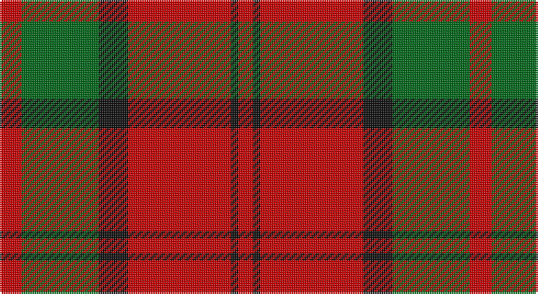

This page is one **sett** — a single exact thread-count. It belongs to the [tartan](/setts/r6g21k8r28k2r4/)
(the same proportion at any scale), whose colour order is pattern [RGKRKR](/stripes/rgkrkr/).

Part of the [Dunbar](/tartans/dunbar/) tartan — the named design grouping this sett with its other cloths.

Sourced from register-of-tartans.  It is a [6 stripe tartan](/stripes/stripes6/).

Original link https://www.tartanregister.gov.uk/tartanDetails.aspx?ref=1014

## Also known as

This cloth is also recorded under:

- Dunbar #2
- Dunbar Ancient
- Dunbar Plaid
- Dunbar, Plaid

2 attestations — the source records this cloth was collapsed from (oldest owns this page)

<ul>
<li>01/01/1842 — Dunbar (register-of-tartans, <a href="https://www.tartanregister.gov.uk/tartanDetails.aspx?ref=1014">record</a>)</li>
<li>1842 — Dunbar (Clan) (tartans-authority, <a href="http://www.tartansauthority.com/tartan-ferret/display/1472/">record</a>)</li>
</ul>

## Register references

External register numbers recorded for this tartan.

- Scottish Register of Tartans: [1014](https://www.tartanregister.gov.uk/tartanDetails.aspx?ref=1014)
- Scottish Tartans Authority (ITI): 1472
- Scottish Tartans World Register: 1472

## Thread count
R/12 G42 K16 R56 K4 R/8

One full sett is **256 threads**.

## Palette

Palette: <strong>Tartan Register</strong>
<table><thead><tr><th>Colour</th><th>Threads</th><th>Shade</th><th>Base</th><th>OKLCh</th></tr></thead><tbody><tr><td>R/</td><td style="text-align:right;font-variant-numeric:tabular-nums">12</td><td><code style="background-color:#C80000;">#C80000</code> <small style="color:#888">#C80000</small></td><td>R <code style="background-color:#CC0000;">#CC0000</code></td><td><small style="color:#888">oklch(52.3% 0.215 29.2)</small></td></tr><tr><td>G</td><td style="text-align:right;font-variant-numeric:tabular-nums">42</td><td><code style="background-color:#006818;">#006818</code> <small style="color:#888">#006818</small></td><td>G <code style="background-color:#006100;">#006100</code></td><td><small style="color:#888">oklch(45.0% 0.142 145.0)</small></td></tr><tr><td>K</td><td style="text-align:right;font-variant-numeric:tabular-nums">16</td><td><code style="background-color:#101010;">#101010</code> <small style="color:#888">#101010</small></td><td>K <code style="background-color:#000000;">#000000</code></td><td><small style="color:#888">oklch(17.3% 0.000 89.9)</small></td></tr><tr><td>R</td><td style="text-align:right;font-variant-numeric:tabular-nums">56</td><td><code style="background-color:#C80000;">#C80000</code> <small style="color:#888">#C80000</small></td><td>R <code style="background-color:#CC0000;">#CC0000</code></td><td><small style="color:#888">oklch(52.3% 0.215 29.2)</small></td></tr><tr><td>K</td><td style="text-align:right;font-variant-numeric:tabular-nums">4</td><td><code style="background-color:#101010;">#101010</code> <small style="color:#888">#101010</small></td><td>K <code style="background-color:#000000;">#000000</code></td><td><small style="color:#888">oklch(17.3% 0.000 89.9)</small></td></tr><tr><td>R/</td><td style="text-align:right;font-variant-numeric:tabular-nums">8</td><td><code style="background-color:#C80000;">#C80000</code> <small style="color:#888">#C80000</small></td><td>R <code style="background-color:#CC0000;">#CC0000</code></td><td><small style="color:#888">oklch(52.3% 0.215 29.2)</small></td></tr></tbody></table>

# Sample pattern

## Compared to the master

This cloth is one sett of its design; the master sett (the exemplar the design is anchored on) is below for comparison.

<figure style="margin:0"><figcaption style="color:#888;font-size:smaller">this sett</figcaption></figure>
<figure style="margin:0"><figcaption style="color:#888;font-size:smaller"><a href="/setts/r28k4w2k13/">master sett →</a></figcaption></figure>

## Nearest tartans

The nearest existing variants by ΔTartan distance, with this tartan at the top so the swatches line up against it.

ΔTartan

Tartan

Sett

—

<a href="/ttd/edit/#slug=r6g21k8r28k2r4~x2">Dunbar</a> <a class="nn-out" href="/variants/s6/r6g21k8r28k2r4~x2/" title="open its dictionary page">↗</a>

0.89

<a href="/ttd/edit/#slug=r1dg6r1dg6r15ly1~x2&amp;base=r6g21k8r28k2r4~x2">Cameron Clan D</a> <a class="nn-out" href="/variants/s6/r1dg6r1dg6r15ly1~x2/" title="open its dictionary page">↗</a>

0.90

<a href="/ttd/edit/#slug=dg16r5dg2r18k2~x2&amp;base=r6g21k8r28k2r4~x2">MacDonald Lord of the Isles #2</a> <a class="nn-out" href="/variants/s5/dg16r5dg2r18k2~x2/" title="open its dictionary page">↗</a>

0.91

<a href="/ttd/edit/#slug=r1r14g7db7r1~x4&amp;base=r6g21k8r28k2r4~x2">Hugh Fraser of Boblainy</a> <a class="nn-out" href="/variants/s5/r1r14g7db7r1~x4/" title="open its dictionary page">↗</a>

0.93

<a href="/ttd/edit/#slug=dg8r2dg9r16w1~x2&amp;base=r6g21k8r28k2r4~x2">MacGregor of Balquhidder</a> <a class="nn-out" href="/variants/s5/dg8r2dg9r16w1~x2/" title="open its dictionary page">↗</a>

0.97

<a href="/ttd/edit/#slug=db2r25g10r2db10r2~x2&amp;base=r6g21k8r28k2r4~x2">Grant of Lurg</a> <a class="nn-out" href="/variants/s6/db2r25g10r2db10r2~x2/" title="open its dictionary page">↗</a>

0.99

<a href="/ttd/edit/#slug=dg7r3dg1r9k1~x2&amp;base=r6g21k8r28k2r4~x2">MacDonald of Sleat</a> <a class="nn-out" href="/variants/s5/dg7r3dg1r9k1~x2/" title="open its dictionary page">↗</a>

0.99

<a href="/ttd/edit/#slug=k2r16dg6r3dg8lb1&amp;base=r6g21k8r28k2r4~x2">MacAulay</a> <a class="nn-out" href="/variants/s6/k2r16dg6r3dg8lb1/" title="open its dictionary page">↗</a>

0.99

<a href="/ttd/edit/#slug=r2db1r16db4r1g10r1~x4&amp;base=r6g21k8r28k2r4~x2">Robertson - 1988 (Corporate)</a> <a class="nn-out" href="/variants/s7/r2db1r16db4r1g10r1~x4/" title="open its dictionary page">↗</a>

1.00

<a href="/ttd/edit/#slug=k2r16g6r3g8w1~x4&amp;base=r6g21k8r28k2r4~x2">MacAulay (Clan)</a> <a class="nn-out" href="/variants/s6/k2r16g6r3g8w1~x4/" title="open its dictionary page">↗</a>

1.01

<a href="/ttd/edit/#slug=k2r16g6r3g8lb1~x2&amp;base=r6g21k8r28k2r4~x2">MacAulay</a> <a class="nn-out" href="/variants/s6/k2r16g6r3g8lb1~x2/" title="open its dictionary page">↗</a>

## Neighbour map

Every grey dot is one of 14360 variants placed by the first two principal components of the ΔTartan feature space (44% of its variance). Red is this tartan; blue dots are its nearest — click one to open its page.

<svg viewBox="0 0 640 380" role="img" style="max-width:100%;height:auto;border:1px solid #e0e0e0;border-radius:4px;display:block" xmlns="http://www.w3.org/2000/svg"><image href="/nn/cloud.v1.png" width="640" height="380"/><a href="/variants/s6/r1dg6r1dg6r15ly1~x2/"><circle cx="393.3" cy="195.9" r="4" fill="#3465a4"><title>Cameron Clan D</title></circle></a><a href="/variants/s5/dg16r5dg2r18k2~x2/"><circle cx="342.1" cy="233.7" r="4" fill="#3465a4"><title>MacDonald Lord of the Isles #2</title></circle></a><a href="/variants/s5/r1r14g7db7r1~x4/"><circle cx="340.7" cy="223.6" r="4" fill="#3465a4"><title>Hugh Fraser of Boblainy</title></circle></a><a href="/variants/s5/dg8r2dg9r16w1~x2/"><circle cx="345.6" cy="217.9" r="4" fill="#3465a4"><title>MacGregor of Balquhidder</title></circle></a><a href="/variants/s6/db2r25g10r2db10r2~x2/"><circle cx="369.4" cy="207.4" r="4" fill="#3465a4"><title>Grant of Lurg</title></circle></a><a href="/variants/s5/dg7r3dg1r9k1~x2/"><circle cx="353.6" cy="237.9" r="4" fill="#3465a4"><title>MacDonald of Sleat</title></circle></a><a href="/variants/s6/k2r16dg6r3dg8lb1/"><circle cx="321.2" cy="184.3" r="4" fill="#3465a4"><title>MacAulay</title></circle></a><a href="/variants/s7/r2db1r16db4r1g10r1~x4/"><circle cx="374.6" cy="178.0" r="4" fill="#3465a4"><title>Robertson - 1988 (Corporate)</title></circle></a><a href="/variants/s6/k2r16g6r3g8w1~x4/"><circle cx="330.6" cy="188.3" r="4" fill="#3465a4"><title>MacAulay (Clan)</title></circle></a><a href="/variants/s6/k2r16g6r3g8lb1~x2/"><circle cx="334.7" cy="190.4" r="4" fill="#3465a4"><title>MacAulay</title></circle></a><circle cx="344.5" cy="208.5" r="5" fill="#c00000"/></svg>

ID: /variants/s6/r6g21k8r28k2r4~x2/
