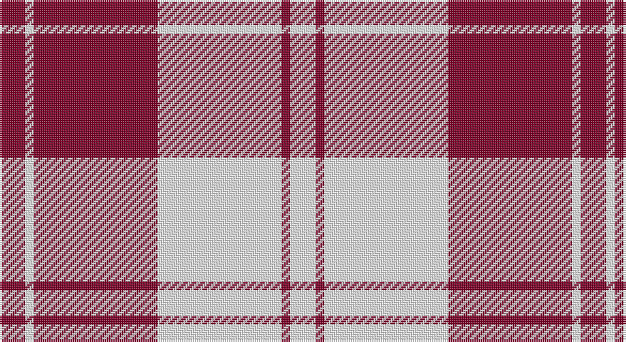

This page is one **sett** — a single exact thread-count. It belongs to the [tartan](/setts/r6w2r29w29r2w6/)
(the same proportion at any scale), whose colour order is pattern [RWRWRW](/stripes/rwrwrw/).

Part of the [Erskine](/tartans/erskine/) tartan — the named design grouping this sett with its other cloths.

Sourced from tartans-authority.  It is a [6 stripe tartan](/stripes/stripes6/).

Original link http://www.tartansauthority.com/tartan-ferret/display/6535/

## Provenance

Earliest known date: 1992 One of a number of dress tartans produced by Hugh Macpherson, a kiltmaker in Edinburgh, intended for dancing and other informal occassions. The 'dress' version of clan tartan is usually created by substituting white for one of the 'ground' colours.

## Also known as

This cloth is also recorded under:

- Erskine Blue
- Erskine Green
- Erskine Hunting
- Erskine Purple
- Erskine Red Dress
- Erskine Royal Blue Dress
- Erskine,
- Erskine, Black & Red
- Erskine, Blue
- Erskine, Burgundy
- Erskine, Green
- Erskine, Grey
- Erskine, Purple
- Erskine, dress
- Erskine, hunting
- Royal Scots Fusiliers

4 attestations — the source records this cloth was collapsed from (oldest owns this page)

<ul>
<li>1980 — Erskine, Burgundy (Dance) (tartans-authority, <a href="http://www.tartansauthority.com/tartan-ferret/display/6535/">record</a>)</li>
<li>undated — Erskine (Red) (register-of-tartans, <a href="https://www.tartanregister.gov.uk/tartanDetails.aspx?ref=1123">record</a>)</li>
<li>undated — Erskine, (Red) (weddslist, <a href="http://www.weddslist.com/cgi-bin/tartans/pg.pl?source=sts">record</a>)</li>
<li>undated — Erskine Red Dress Clan Tartan (house-of-tartan, <a href="http://www.house-of-tartan.scotland.net/house/TartanViewjs.asp?colr=Def&tnam=1700">record</a>)</li>
</ul>

## Register references

External register numbers recorded for this tartan.

- Scottish Register of Tartans: [1123](https://www.tartanregister.gov.uk/tartanDetails.aspx?ref=1123)
- Scottish Tartans Authority (ITI): 6535
- Scottish Tartans World Register: 1700

## Thread count
DR/12 W4 DR58 W58 DR4 W/12

One full sett is **272 threads**.

## Palette

Palette: <strong>Tartan Register</strong>
<table><thead><tr><th>Colour</th><th>Threads</th><th>Shade</th><th>Base</th><th>OKLCh</th></tr></thead><tbody><tr><td>DR/</td><td style="text-align:right;font-variant-numeric:tabular-nums">12</td><td><code style="background-color:#800028;">#800028</code> <small style="color:#888">#800028</small></td><td>R <code style="background-color:#CC0000;">#CC0000</code></td><td><small style="color:#888">oklch(38.2% 0.152 14.5)</small></td></tr><tr><td>W</td><td style="text-align:right;font-variant-numeric:tabular-nums">4</td><td><code style="background-color:#FCFCFC;">#FCFCFC</code> <small style="color:#888">#FCFCFC</small></td><td>W <code style="background-color:#F7F7F7;">#F7F7F7</code></td><td><small style="color:#888">oklch(99.1% 0.000 89.9)</small></td></tr><tr><td>DR</td><td style="text-align:right;font-variant-numeric:tabular-nums">58</td><td><code style="background-color:#800028;">#800028</code> <small style="color:#888">#800028</small></td><td>R <code style="background-color:#CC0000;">#CC0000</code></td><td><small style="color:#888">oklch(38.2% 0.152 14.5)</small></td></tr><tr><td>W</td><td style="text-align:right;font-variant-numeric:tabular-nums">58</td><td><code style="background-color:#FCFCFC;">#FCFCFC</code> <small style="color:#888">#FCFCFC</small></td><td>W <code style="background-color:#F7F7F7;">#F7F7F7</code></td><td><small style="color:#888">oklch(99.1% 0.000 89.9)</small></td></tr><tr><td>DR</td><td style="text-align:right;font-variant-numeric:tabular-nums">4</td><td><code style="background-color:#800028;">#800028</code> <small style="color:#888">#800028</small></td><td>R <code style="background-color:#CC0000;">#CC0000</code></td><td><small style="color:#888">oklch(38.2% 0.152 14.5)</small></td></tr><tr><td>W/</td><td style="text-align:right;font-variant-numeric:tabular-nums">12</td><td><code style="background-color:#FCFCFC;">#FCFCFC</code> <small style="color:#888">#FCFCFC</small></td><td>W <code style="background-color:#F7F7F7;">#F7F7F7</code></td><td><small style="color:#888">oklch(99.1% 0.000 89.9)</small></td></tr></tbody></table>

# Sample pattern

## Compared to the master

This cloth is one sett of its design; the master sett (the exemplar the design is anchored on) is below for comparison.

<figure style="margin:0"><figcaption style="color:#888;font-size:smaller">this sett</figcaption></figure>
<figure style="margin:0"><figcaption style="color:#888;font-size:smaller"><a href="/setts/g6r1g24r28g1r4/">master sett →</a></figcaption></figure>

## Nearest tartans

The nearest existing variants by ΔTartan distance, with this tartan at the top so the swatches line up against it.

ΔTartan

Tartan

Sett

—

<a href="/ttd/edit/#slug=r6w2r29w29r2w6~x2">Erskine, Burgundy (Dance)</a> <a class="nn-out" href="/variants/s6/r6w2r29w29r2w6~x2/" title="open its dictionary page">↗</a>

0.57

<a href="/ttd/edit/#slug=r5w2r25w25r2w5~x2&amp;base=r6w2r29w29r2w6~x2">Erskine Dress Burgandy Clan Tartan</a> <a class="nn-out" href="/variants/s6/r5w2r25w25r2w5~x2/" title="open its dictionary page">↗</a>

0.99

<a href="/ttd/edit/#slug=k2w28r13w2r13w2~x2&amp;base=r6w2r29w29r2w6~x2">Buchanan #5</a> <a class="nn-out" href="/variants/s6/k2w28r13w2r13w2~x2/" title="open its dictionary page">↗</a>

1.32

<a href="/ttd/edit/#slug=r2w1r9w9r1w2~x6&amp;base=r6w2r29w29r2w6~x2">Erskine Red &amp; White (Dance)</a> <a class="nn-out" href="/variants/s6/r2w1r9w9r1w2~x6/" title="open its dictionary page">↗</a>

1.45

<a href="/ttd/edit/#slug=dp6w2dp29w29dp2w6~x2&amp;base=r6w2r29w29r2w6~x2">Erskine Purple (Dance) Fashion Tartan</a> <a class="nn-out" href="/variants/s6/dp6w2dp29w29dp2w6~x2/" title="open its dictionary page">↗</a>

1.59

<a href="/ttd/edit/#slug=dp2w1dp9w9dp1w2~x6&amp;base=r6w2r29w29r2w6~x2">Erskine Purple (Dance)</a> <a class="nn-out" href="/variants/s6/dp2w1dp9w9dp1w2~x6/" title="open its dictionary page">↗</a>

1.73

<a href="/ttd/edit/#slug=k1r1w1r15w15r1w1k1~x4&amp;base=r6w2r29w29r2w6~x2">Bundy, Dress Red (Personal Dance)</a> <a class="nn-out" href="/variants/s8/k1r1w1r15w15r1w1k1~x4/" title="open its dictionary page">↗</a>

1.75

<a href="/ttd/edit/#slug=lb45r2g9lb2r30~x2&amp;base=r6w2r29w29r2w6~x2">Malaysian Unknown (Artefact)</a> <a class="nn-out" href="/variants/s5/lb45r2g9lb2r30~x2/" title="open its dictionary page">↗</a>

1.77

<a href="/ttd/edit/#slug=w18r9w1r1w2r1w1r9db3r4~x4&amp;base=r6w2r29w29r2w6~x2">Swiss Red</a> <a class="nn-out" href="/variants/s10/w18r9w1r1w2r1w1r9db3r4~x4/" title="open its dictionary page">↗</a>

1.80

<a href="/ttd/edit/#slug=r8ri3r28w32ri3w4~x2&amp;base=r6w2r29w29r2w6~x2">Ailsa, Red V2 (Dance)</a> <a class="nn-out" href="/variants/s6/r8ri3r28w32ri3w4~x2/" title="open its dictionary page">↗</a>

1.81

<a href="/ttd/edit/#slug=w8r14w8r14w35k4~x2&amp;base=r6w2r29w29r2w6~x2">Clayton Dress (Dance)</a> <a class="nn-out" href="/variants/s6/w8r14w8r14w35k4~x2/" title="open its dictionary page">↗</a>

## Neighbour map

Every grey dot is one of 14360 variants placed by the first two principal components of the ΔTartan feature space (44% of its variance). Red is this tartan; blue dots are its nearest — click one to open its page.

<svg viewBox="0 0 640 380" role="img" style="max-width:100%;height:auto;border:1px solid #e0e0e0;border-radius:4px;display:block" xmlns="http://www.w3.org/2000/svg"><image href="/nn/cloud.v1.png" width="640" height="380"/><a href="/variants/s6/r5w2r25w25r2w5~x2/"><circle cx="340.0" cy="192.9" r="4" fill="#3465a4"><title>Erskine Dress Burgandy Clan Tartan</title></circle></a><a href="/variants/s6/k2w28r13w2r13w2~x2/"><circle cx="321.5" cy="171.3" r="4" fill="#3465a4"><title>Buchanan #5</title></circle></a><a href="/variants/s6/r2w1r9w9r1w2~x6/"><circle cx="320.0" cy="198.8" r="4" fill="#3465a4"><title>Erskine Red &amp; White (Dance)</title></circle></a><a href="/variants/s6/dp6w2dp29w29dp2w6~x2/"><circle cx="340.2" cy="187.5" r="4" fill="#3465a4"><title>Erskine Purple (Dance) Fashion Tartan</title></circle></a><a href="/variants/s6/dp2w1dp9w9dp1w2~x6/"><circle cx="308.5" cy="204.4" r="4" fill="#3465a4"><title>Erskine Purple (Dance)</title></circle></a><a href="/variants/s8/k1r1w1r15w15r1w1k1~x4/"><circle cx="322.1" cy="129.7" r="4" fill="#3465a4"><title>Bundy, Dress Red (Personal Dance)</title></circle></a><a href="/variants/s5/lb45r2g9lb2r30~x2/"><circle cx="334.3" cy="164.6" r="4" fill="#3465a4"><title>Malaysian Unknown (Artefact)</title></circle></a><a href="/variants/s10/w18r9w1r1w2r1w1r9db3r4~x4/"><circle cx="318.2" cy="131.4" r="4" fill="#3465a4"><title>Swiss Red</title></circle></a><a href="/variants/s6/r8ri3r28w32ri3w4~x2/"><circle cx="291.5" cy="179.9" r="4" fill="#3465a4"><title>Ailsa, Red V2 (Dance)</title></circle></a><a href="/variants/s6/w8r14w8r14w35k4~x2/"><circle cx="301.9" cy="199.1" r="4" fill="#3465a4"><title>Clayton Dress (Dance)</title></circle></a><circle cx="331.1" cy="179.4" r="5" fill="#c00000"/></svg>

ID: /variants/s6/r6w2r29w29r2w6~x2/
