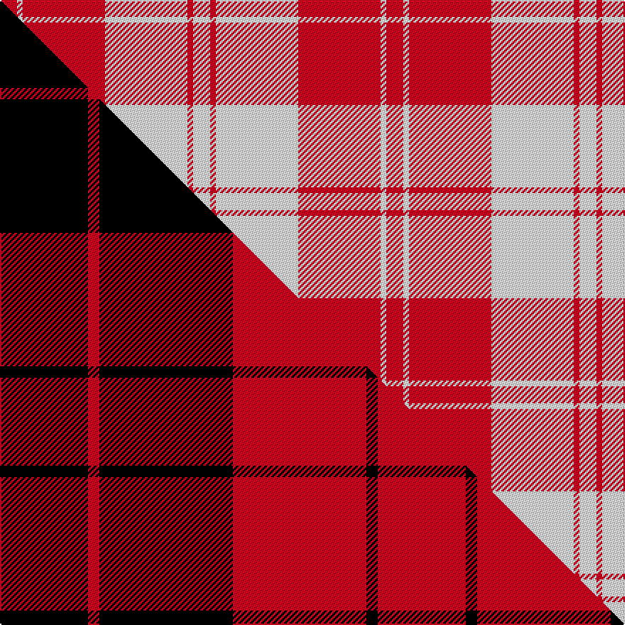

This is one **variant** — a specific cloth: this exact thread count and colourway, with its own
provenance below. It is one weaving of the [sett](/setts/r6w2r29w29r2w6/) (the scale-free proportion — the
same cloth at any scale or shade), whose colour order is pattern [RWRWRW](/stripes/rwrwrw/).

Part of the [Erskine](/tartans/erskine-6/) tartan — the named design grouping this sett with its other cloths.

Sourced from tartans-authority.  It is a [6 stripe tartan](/stripes/stripes6/).

Original link [https://www.tartanregister.gov.uk/tartanDetails.aspx?ref=6535](https://www.tartanregister.gov.uk/tartanDetails.aspx?ref=6535)

## Provenance

Earliest known date: 1992 One of a number of dress tartans produced by Hugh Macpherson, a kiltmaker in Edinburgh, intended for dancing and other informal occassions. The 'dress' version of clan tartan is usually created by substituting white for one of the 'ground' colours.

4 attestations — the source records this cloth was collapsed from (oldest owns this page)

<ul>
<li>1980 — Erskine, Burgundy (Dance) (tartans-authority, <a href="https://www.tartanregister.gov.uk/tartanDetails.aspx?ref=6535">record</a>)  <em>A dancers' tartan now woven by D C Dalgliesh of Selkirk.</em></li>
<li>1992 — Erskine Red Dress Clan Tartan (house-of-tartan, <a href="http://www.house-of-tartan.scotland.net/house/TartanViewjs.asp?colr=Def&tnam=1700">record</a>) </li>
<li>undated — Erskine (Red) (register-of-tartans, <a href="https://www.tartanregister.gov.uk/tartanDetails.aspx?ref=1123">record</a>)  <em>One of a number of dress tartans produced by Hugh Macpherson, a kiltmaker in Edinburgh, intended for dancing and other informal ocassions. The 'dress' version of clan tartan is usually created by substituting white for one of the 'ground' colours.</em></li>
<li>undated — Erskine, (Red) (weddslist, <a href="http://www.weddslist.com/cgi-bin/tartans/pg.pl?source=sts">record</a>) </li>
</ul>

Dataset <small>— provenance for this record, inherited from the source manifest</small>

<dl class="dataset-prov">
<dt>source</dt><dd><a href="/sources/tartans-authority/">Scottish Tartans Authority</a></dd>
<dt>data captured from</dt><dd><a href="https://github.com/thetartan/tartan-database/blob/master/data/tartans-authority/data.csv">https://github.com/thetartan/tartan-database/blob/master/data/tartans-authority/data.csv</a></dd>
<dt>data date</dt><dd>1980 <small>(this record)</small></dd>
<dt>licence</dt><dd><a href="https://creativecommons.org/licenses/by-nc-nd/4.0/">CC BY-NC-ND 4.0</a></dd>
</dl>

Capture chain <small>— the hands this data passed through, oldest first; each capture carries its own licence</small>

<ol class="capture-chain">
<li><a href="https://www.tartansauthority.com/">Scottish Tartans Authority</a> <small>the heritage body's archive — its tartan-ferret record browser is retired (links repaired to the SRT, above)</small></li>
<li><a href="https://github.com/thetartan/tartan-database">thetartan/tartan-database</a> <small>2016-2017</small> · <a href="https://creativecommons.org/licenses/by-nc-nd/4.0/">CC BY-NC-ND 4.0</a> <small>Levko Kravets's frozen compilation — the capture we vendored, and where its CC licence text came from</small></li>
<li>this dictionary <small>captured 2026-06-10 · commit 5bf86c7566</small> <small>each re-capture is a git commit to data/sources</small></li>
</ol>

## Register references

External register numbers recorded for this tartan.

- Scottish Register of Tartans: [1123](https://www.tartanregister.gov.uk/tartanDetails.aspx?ref=1123)
- Scottish Tartans Authority (ITI): 6535
- Scottish Tartans World Register: 1700

## Thread count
R/12 W4 R58 W58 R4 W/12

One full sett is **272 threads**.

## Palette
<table><thead><tr><th>Colour</th><th>Shade</th><th>OKLCh</th></tr></thead><tbody><tr><td>R</td><td><code style="background-color:#D60020;">#D60020</code> <small style="color:#888">#D60020</small></td><td><small style="color:#888">oklch(55.2% 0.224 25.5)</small></td></tr><tr><td>W</td><td><code style="background-color:#F7F7F7;">#F7F7F7</code> <small style="color:#888">#F7F7F7</small></td><td><small style="color:#888">oklch(97.6% 0.000 89.9)</small></td></tr></tbody></table>

# Sample pattern

## Compared to the master

This cloth is one sett of its design; the master sett (the exemplar the design is anchored on) is below for comparison.

Its **ΔTartan distance** from the master is **0.69** — the same measure the nearest-tartans table ranks by (0 is identical; a re-scale of the same cloth is near 0, a recolour or a different proportion further).

<figure class="master-compare" style="margin:0">

this sett
master sett ★

<figcaption style="color:#888;font-size:smaller">One weave of this sett against the <a href="/setts/k31r4k47r47k4r31/">master sett ★</a>, split on the diagonal: a shared proportion runs seamlessly across it with only the shades shifting; a different proportion breaks on it.</figcaption>
</figure>

## Nearest tartan variants

The nearest existing variants by ΔTartan distance, with this cloth at the top so the swatches line up against it.

ΔTartan

Threads

Variant

Sett

—

272

<a href="/variants/s6/r6w2r29w29r2w6~x2/">Erskine, Burgundy (Dance)</a>

<a href="/ttd/edit/#slug=r2w1r9w9r1w2~x6&amp;base=r6w2r29w29r2w6~x2" title="compare in the TTD">0.40</a>

264

<a href="/variants/s6/r2w1r9w9r1w2~x6/">Erskine Red &amp; White (Dance)</a>

<a href="/ttd/edit/#slug=w6ly1r4w1db4ly1r8w1r2~x2&amp;base=r6w2r29w29r2w6~x2" title="compare in the TTD">1.77</a>

96

<a href="/variants/s9/w6ly1r4w1db4ly1r8w1r2~x2/">Unidentified #41</a>

<a href="/ttd/edit/#slug=w5dp3w26r20w3r8y3~x2&amp;base=r6w2r29w29r2w6~x2" title="compare in the TTD">1.96</a>

256

<a href="/variants/s7/w5dp3w26r20w3r8y3~x2/">MacPherson Dress Red (Dance)</a>

<a href="/ttd/edit/#slug=n56w30n8r10n3r20&amp;base=r6w2r29w29r2w6~x2" title="compare in the TTD">2.00</a>

178

<a href="/variants/s6/n56w30n8r10n3r20/">Walsh, Michael Edward (Personal)</a>

<a href="/ttd/edit/#slug=w80lb1r14lb9r24w2r4~x2&amp;base=r6w2r29w29r2w6~x2" title="compare in the TTD">2.35</a>

368

<a href="/variants/s7/w80lb1r14lb9r24w2r4~x2/">Unidentified Fisherwife's Plaid</a>

<a href="/ttd/edit/#slug=r2g2w2r23w2g2w23g2r2w2~x2&amp;base=r6w2r29w29r2w6~x2" title="compare in the TTD">2.57</a>

240

<a href="/variants/s10/r2g2w2r23w2g2w23g2r2w2~x2/">Hose Artifact Tartan</a>

<a href="/ttd/edit/#slug=r4w35r31w4~x2&amp;base=r6w2r29w29r2w6~x2" title="compare in the TTD">2.66</a>

280

<a href="/variants/s4/r4w35r31w4~x2/">Lewis, Red (Dance)</a>

<a href="/ttd/edit/#slug=r8dr3r28w32dr3w4~x2&amp;base=r6w2r29w29r2w6~x2" title="compare in the TTD">2.81</a>

288

<a href="/variants/s6/r8dr3r28w32dr3w4~x2/">Ailsa, Red V2 (Dance)</a>

<a href="/ttd/edit/#slug=r8dr3r28w32dr3w4~x2~r2108022&amp;base=r6w2r29w29r2w6~x2" title="compare in the TTD">2.90</a>

288

<a href="/variants/s6/r8dr3r28w32dr3w4~x2~r2108022/">Ailsa Red</a>

<a href="/ttd/edit/#slug=r8dp2r24dp5w25o2w8~x2&amp;base=r6w2r29w29r2w6~x2" title="compare in the TTD">2.92</a>

264

<a href="/variants/s7/r8dp2r24dp5w25o2w8~x2/">Lennox, dress</a>

## Neighbour map

Every grey dot is one of 13621 variants placed by the first two principal components of the ΔTartan feature space (42% of its variance). Red is this tartan; blue dots are its nearest — click one to open its page.

<svg viewBox="0 0 640 380" role="img" style="max-width:100%;height:auto;border:1px solid #e0e0e0;border-radius:4px;display:block" xmlns="http://www.w3.org/2000/svg"><image href="/nn/cloud.v1.png" width="640" height="380"/><a href="/variants/s6/r2w1r9w9r1w2~x6/"><circle cx="351.4" cy="234.6" r="4" fill="#3465a4"><title>Erskine Red &amp; White (Dance)</title></circle></a><a href="/variants/s9/w6ly1r4w1db4ly1r8w1r2~x2/"><circle cx="235.7" cy="200.2" r="4" fill="#3465a4"><title>Unidentified #41</title></circle></a><a href="/variants/s7/w5dp3w26r20w3r8y3~x2/"><circle cx="273.3" cy="196.7" r="4" fill="#3465a4"><title>MacPherson Dress Red (Dance)</title></circle></a><a href="/variants/s6/n56w30n8r10n3r20/"><circle cx="328.4" cy="201.5" r="4" fill="#3465a4"><title>Walsh, Michael Edward (Personal)</title></circle></a><a href="/variants/s7/w80lb1r14lb9r24w2r4~x2/"><circle cx="441.0" cy="126.7" r="4" fill="#3465a4"><title>Unidentified Fisherwife's Plaid</title></circle></a><a href="/variants/s10/r2g2w2r23w2g2w23g2r2w2~x2/"><circle cx="303.3" cy="158.7" r="4" fill="#3465a4"><title>Hose Artifact Tartan</title></circle></a><a href="/variants/s4/r4w35r31w4~x2/"><circle cx="361.2" cy="260.1" r="4" fill="#3465a4"><title>Lewis, Red (Dance)</title></circle></a><a href="/variants/s6/r8dr3r28w32dr3w4~x2/"><circle cx="293.7" cy="204.8" r="4" fill="#3465a4"><title>Ailsa, Red V2 (Dance)</title></circle></a><a href="/variants/s6/r8dr3r28w32dr3w4~x2~r2108022/"><circle cx="291.4" cy="204.4" r="4" fill="#3465a4"><title>Ailsa Red</title></circle></a><a href="/variants/s7/r8dp2r24dp5w25o2w8~x2/"><circle cx="254.7" cy="185.7" r="4" fill="#3465a4"><title>Lennox, dress</title></circle></a><circle cx="370.6" cy="211.2" r="5" fill="#c00000"/><text x="320" y="376" text-anchor="middle" font-size="11" fill="#999">ground</text><text x="11" y="190" text-anchor="middle" font-size="11" fill="#999" transform="rotate(-90 11 190)">complexity</text></svg>

ID: /variants/s6/r6w2r29w29r2w6~x2/
