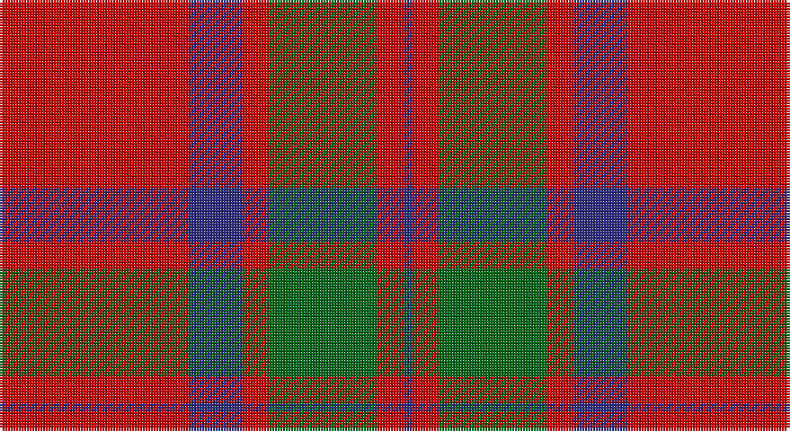

This page is one **sett** — a single exact thread-count. It belongs to the [tartan](/setts/r70db20r10g40r10db3/)
(the same proportion at any scale), whose colour order is pattern [BRGRBR](/stripes/brgrbr/).

Part of the [MacKintosh](/tartans/mackintosh/) tartan — the named design grouping this sett with its other cloths.

Sourced from register-of-tartans.  It is a [6 stripe tartan](/stripes/stripes6/).

Original link https://www.tartanregister.gov.uk/tartanDetails.aspx?ref=2559

## Also known as

This cloth is also recorded under:

- MacKintosh #4
- MacKintosh #5
- MacKintosh #6
- MacKintosh #8
- MacKintosh 4
- MacKintosh 7
- MacKintosh Plaid
- MacKintosh, Arisaid
- MacKintosh, Plaid
- MacKintosh, Red
- MacKintosh, Red Clan/Family
- Mackintosh #7

2 attestations — the source records this cloth was collapsed from (oldest owns this page)

<ul>
<li>01/01/1819 — MacKintosh (register-of-tartans, <a href="https://www.tartanregister.gov.uk/tartanDetails.aspx?ref=2559">record</a>)</li>
<li>1819 — MacKintosh - 1819 (Clan) (tartans-authority, <a href="http://www.tartansauthority.com/tartan-ferret/display/521/">record</a>)</li>
</ul>

## Register references

External register numbers recorded for this tartan.

- Scottish Register of Tartans: [2559](https://www.tartanregister.gov.uk/tartanDetails.aspx?ref=2559)
- Scottish Tartans Authority (ITI): 521
- Scottish Tartans World Register: 521

## Thread count
R/70 DB20 R10 G40 R10 DB/3

One full sett is **233 threads**.

## Palette

Palette: <strong>Tartan Register</strong>
<table><thead><tr><th>Colour</th><th>Threads</th><th>Shade</th><th>Base</th><th>OKLCh</th></tr></thead><tbody><tr><td>R/</td><td style="text-align:right;font-variant-numeric:tabular-nums">70</td><td><code style="background-color:#C80000;">#C80000</code> <small style="color:#888">#C80000</small></td><td>R <code style="background-color:#CC0000;">#CC0000</code></td><td><small style="color:#888">oklch(52.3% 0.215 29.2)</small></td></tr><tr><td>DB</td><td style="text-align:right;font-variant-numeric:tabular-nums">20</td><td><code style="background-color:#2C2C80;">#2C2C80</code> <small style="color:#888">#2C2C80</small></td><td>B <code style="background-color:#2A418A;">#2A418A</code></td><td><small style="color:#888">oklch(35.0% 0.138 276.6)</small></td></tr><tr><td>R</td><td style="text-align:right;font-variant-numeric:tabular-nums">10</td><td><code style="background-color:#C80000;">#C80000</code> <small style="color:#888">#C80000</small></td><td>R <code style="background-color:#CC0000;">#CC0000</code></td><td><small style="color:#888">oklch(52.3% 0.215 29.2)</small></td></tr><tr><td>G</td><td style="text-align:right;font-variant-numeric:tabular-nums">40</td><td><code style="background-color:#006818;">#006818</code> <small style="color:#888">#006818</small></td><td>G <code style="background-color:#006100;">#006100</code></td><td><small style="color:#888">oklch(45.0% 0.142 145.0)</small></td></tr><tr><td>R</td><td style="text-align:right;font-variant-numeric:tabular-nums">10</td><td><code style="background-color:#C80000;">#C80000</code> <small style="color:#888">#C80000</small></td><td>R <code style="background-color:#CC0000;">#CC0000</code></td><td><small style="color:#888">oklch(52.3% 0.215 29.2)</small></td></tr><tr><td>DB/</td><td style="text-align:right;font-variant-numeric:tabular-nums">3</td><td><code style="background-color:#2C2C80;">#2C2C80</code> <small style="color:#888">#2C2C80</small></td><td>B <code style="background-color:#2A418A;">#2A418A</code></td><td><small style="color:#888">oklch(35.0% 0.138 276.6)</small></td></tr></tbody></table>

# Sample pattern

## Compared to the master

This cloth is one sett of its design; the master sett (the exemplar the design is anchored on) is below for comparison.

<figure style="margin:0"><figcaption style="color:#888;font-size:smaller">this sett</figcaption></figure>
<figure style="margin:0"><figcaption style="color:#888;font-size:smaller"><a href="/setts/r16db6r2dg6r2db1/">master sett →</a></figcaption></figure>

## Nearest tartans

The nearest existing variants by ΔTartan distance, with this tartan at the top so the swatches line up against it.

ΔTartan

Tartan

Sett

—

<a href="/ttd/edit/#slug=r70db20r10g40r10db3">MacKintosh</a> <a class="nn-out" href="/variants/s6/r70db20r10g40r10db3/" title="open its dictionary page">↗</a>

0.39

<a href="/ttd/edit/#slug=r68db18r9g34r9db3~x2&amp;base=r70db20r10g40r10db3">MacKintosh 3</a> <a class="nn-out" href="/variants/s6/r68db18r9g34r9db3~x2/" title="open its dictionary page">↗</a>

0.52

<a href="/ttd/edit/#slug=r68db18r9dg34r9db3~x2&amp;base=r70db20r10g40r10db3">MacKintosh #2</a> <a class="nn-out" href="/variants/s6/r68db18r9dg34r9db3~x2/" title="open its dictionary page">↗</a>

0.53

<a href="/ttd/edit/#slug=r22db5r2g11r3db1~x2&amp;base=r70db20r10g40r10db3">MacKintosh 1</a> <a class="nn-out" href="/variants/s6/r22db5r2g11r3db1~x2/" title="open its dictionary page">↗</a>

0.63

<a href="/ttd/edit/#slug=r16db6r2g6r2db1~x2&amp;base=r70db20r10g40r10db3">MacKintosh, Plaid</a> <a class="nn-out" href="/variants/s6/r16db6r2g6r2db1~x2/" title="open its dictionary page">↗</a>

0.70

<a href="/ttd/edit/#slug=r60dp20r8g45r8dp2&amp;base=r70db20r10g40r10db3">Caledonian - 1819 (Fashion?)</a> <a class="nn-out" href="/variants/s6/r60dp20r8g45r8dp2/" title="open its dictionary page">↗</a>

0.72

<a href="/ttd/edit/#slug=r60p20r8g45r8p2~x2&amp;base=r70db20r10g40r10db3">Caledonian</a> <a class="nn-out" href="/variants/s6/r60p20r8g45r8p2~x2/" title="open its dictionary page">↗</a>

0.72

<a href="/ttd/edit/#slug=r60dp20r8g45r8dp2~x2&amp;base=r70db20r10g40r10db3">Caledonian District Tartan</a> <a class="nn-out" href="/variants/s6/r60dp20r8g45r8dp2~x2/" title="open its dictionary page">↗</a>

0.73

<a href="/ttd/edit/#slug=r24db6r3dg12r4db1&amp;base=r70db20r10g40r10db3">MacKintosh</a> <a class="nn-out" href="/variants/s6/r24db6r3dg12r4db1/" title="open its dictionary page">↗</a>

0.74

<a href="/ttd/edit/#slug=r22db5r2dg11r3db1&amp;base=r70db20r10g40r10db3">MacKintosh D</a> <a class="nn-out" href="/variants/s6/r22db5r2dg11r3db1/" title="open its dictionary page">↗</a>

0.77

<a href="/ttd/edit/#slug=r16db6r2dg6r2db1~x2&amp;base=r70db20r10g40r10db3">MacKintosh Plaid</a> <a class="nn-out" href="/variants/s6/r16db6r2dg6r2db1~x2/" title="open its dictionary page">↗</a>

## Neighbour map

Every grey dot is one of 14360 variants placed by the first two principal components of the ΔTartan feature space (44% of its variance). Red is this tartan; blue dots are its nearest — click one to open its page.

<svg viewBox="0 0 640 380" role="img" style="max-width:100%;height:auto;border:1px solid #e0e0e0;border-radius:4px;display:block" xmlns="http://www.w3.org/2000/svg"><image href="/nn/cloud.v1.png" width="640" height="380"/><a href="/variants/s6/r68db18r9g34r9db3~x2/"><circle cx="417.9" cy="188.3" r="4" fill="#3465a4"><title>MacKintosh 3</title></circle></a><a href="/variants/s6/r68db18r9dg34r9db3~x2/"><circle cx="411.4" cy="181.0" r="4" fill="#3465a4"><title>MacKintosh #2</title></circle></a><a href="/variants/s6/r22db5r2g11r3db1~x2/"><circle cx="423.8" cy="185.6" r="4" fill="#3465a4"><title>MacKintosh 1</title></circle></a><a href="/variants/s6/r16db6r2g6r2db1~x2/"><circle cx="401.6" cy="202.3" r="4" fill="#3465a4"><title>MacKintosh, Plaid</title></circle></a><a href="/variants/s6/r60dp20r8g45r8dp2/"><circle cx="377.7" cy="179.5" r="4" fill="#3465a4"><title>Caledonian - 1819 (Fashion?)</title></circle></a><a href="/variants/s6/r60p20r8g45r8p2~x2/"><circle cx="378.9" cy="179.0" r="4" fill="#3465a4"><title>Caledonian</title></circle></a><a href="/variants/s6/r60dp20r8g45r8dp2~x2/"><circle cx="386.4" cy="182.0" r="4" fill="#3465a4"><title>Caledonian District Tartan</title></circle></a><a href="/variants/s6/r24db6r3dg12r4db1/"><circle cx="409.8" cy="179.2" r="4" fill="#3465a4"><title>MacKintosh</title></circle></a><a href="/variants/s6/r22db5r2dg11r3db1/"><circle cx="407.5" cy="178.0" r="4" fill="#3465a4"><title>MacKintosh D</title></circle></a><a href="/variants/s6/r16db6r2dg6r2db1~x2/"><circle cx="401.8" cy="200.5" r="4" fill="#3465a4"><title>MacKintosh Plaid</title></circle></a><circle cx="400.1" cy="188.2" r="5" fill="#c00000"/></svg>

ID: /variants/s6/r70db20r10g40r10db3/
