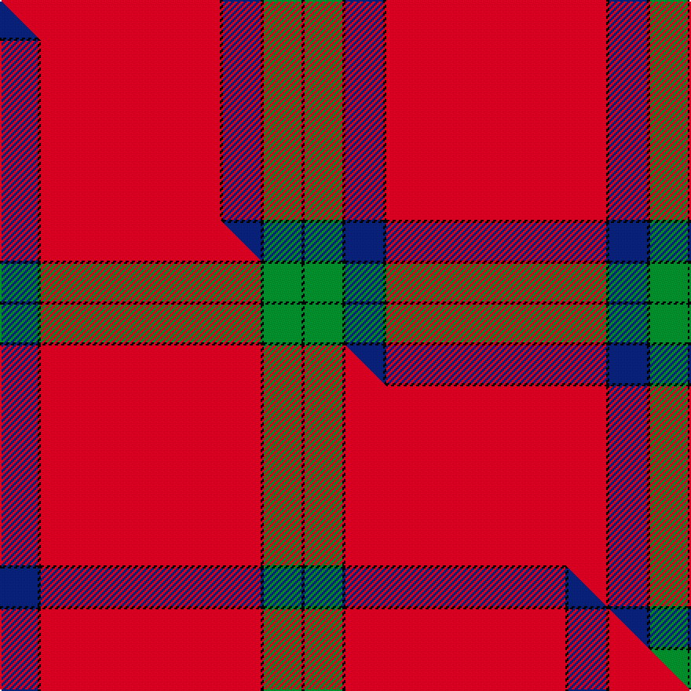

This is one **variant** — a specific cloth: this exact thread count and colourway, with its own
provenance below. It is one weaving of the [sett](/setts/r70k1db12k1g12k1/) (the scale-free proportion — the
same cloth at any scale or shade), whose colour order is pattern [KGKBKR](/stripes/kgkbkr/).

Part of the [Lawers Estate](/tartans/lawers-estate/) tartan — the named design grouping this sett with its other cloths.

Sourced from tartans-authority.  It is a [6 stripe tartan](/stripes/stripes6/).

Original link [https://www.tartanregister.gov.uk/tartanDetails.aspx?ref=5398](https://www.tartanregister.gov.uk/tartanDetails.aspx?ref=5398)

## Provenance

Earliest known date: 1992 From a kilt worn by Mr Gibbons, owner of Lawers Estate near Comrie. Mr Gibbons said that the tartan had been specially woven by the London Kiltmakers based on a historic pattern associated with the estate. Details from Peter E MacDonald. The pattern is asymmetric and uses two thread black stripes to delineate the colours.

2 attestations — the source records this cloth was collapsed from (oldest owns this page)

<ul>
<li>1992 — Lawers Estate (Corporate) (tartans-authority, <a href="https://www.tartanregister.gov.uk/tartanDetails.aspx?ref=5398">record</a>)  <em>Asymmetric. Details from Peter MacDonald. From a kilt worn by Mr Gibbons, owner of Lawers Estate near Comrie. Mr Gibbons said that the tartan had been specially woven by the London Kiltmakers based on an historic pattern associated with the estate. Details are unconfirmed. The pattern is asymmetric and uses two thread black stripes to delineate the colours.</em></li>
<li>1992 — Lawers Estate Corporate Tartan (house-of-tartan, <a href="http://www.house-of-tartan.scotland.net/house/TartanViewjs.asp?colr=Def&tnam=5398">record</a>) </li>
</ul>

Dataset <small>— provenance for this record, inherited from the source manifest</small>

<dl class="dataset-prov">
<dt>source</dt><dd><a href="/sources/tartans-authority/">Scottish Tartans Authority</a></dd>
<dt>data captured from</dt><dd><a href="https://github.com/thetartan/tartan-database/blob/master/data/tartans-authority/data.csv">https://github.com/thetartan/tartan-database/blob/master/data/tartans-authority/data.csv</a></dd>
<dt>data date</dt><dd>1992 <small>(this record)</small></dd>
<dt>licence</dt><dd><a href="https://creativecommons.org/licenses/by-nc-nd/4.0/">CC BY-NC-ND 4.0</a></dd>
</dl>

Capture chain <small>— the hands this data passed through, oldest first; each capture carries its own licence</small>

<ol class="capture-chain">
<li><a href="https://www.tartansauthority.com/">Scottish Tartans Authority</a> <small>the heritage body's archive — its tartan-ferret record browser is retired (links repaired to the SRT, above)</small></li>
<li><a href="https://github.com/thetartan/tartan-database">thetartan/tartan-database</a> <small>2016-2017</small> · <a href="https://creativecommons.org/licenses/by-nc-nd/4.0/">CC BY-NC-ND 4.0</a> <small>Levko Kravets's frozen compilation — the capture we vendored, and where its CC licence text came from</small></li>
<li>this dictionary <small>captured 2026-06-10 · commit 5bf86c7566</small> <small>each re-capture is a git commit to data/sources</small></li>
</ol>

## Register references

External register numbers recorded for this tartan.

- Scottish Tartans Authority (ITI): 5398

## Thread count
R/140 K2 DB24 K2 G24 K/2

One full sett is **246 threads**.

## Palette
<table><thead><tr><th>Colour</th><th>Shade</th><th>OKLCh</th></tr></thead><tbody><tr><td>DB</td><td><code style="background-color:#082077;">#082077</code> <small style="color:#888">#082077</small></td><td><small style="color:#888">oklch(30.0% 0.149 265.1)</small></td></tr><tr><td>G</td><td><code style="background-color:#008B2A;">#008B2A</code> <small style="color:#888">#008B2A</small></td><td><small style="color:#888">oklch(55.4% 0.170 145.9)</small></td></tr><tr><td>K</td><td><code style="background-color:#000000;">#000000</code> <small style="color:#888">#000000</small></td><td><small style="color:#888">oklch(0.0% 0.000 0.0)</small></td></tr><tr><td>R</td><td><code style="background-color:#D60020;">#D60020</code> <small style="color:#888">#D60020</small></td><td><small style="color:#888">oklch(55.2% 0.224 25.5)</small></td></tr></tbody></table>

# Sample pattern

## Compared to the master

This cloth is one sett of its design; the master sett (the exemplar the design is anchored on) is below for comparison.

Its **ΔTartan distance** from the master is **0.00** — the same measure the nearest-tartans table ranks by (0 is identical; a re-scale of the same cloth is near 0, a recolour or a different proportion further).

<figure class="master-compare" style="margin:0">

this sett
master sett ★

<figcaption style="color:#888;font-size:smaller">One weave of this sett against the <a href="/setts/db12k1r70k1g12k1/">master sett ★</a>, split on the diagonal: a shared proportion runs seamlessly across it with only the shades shifting; a different proportion breaks on it.</figcaption>
</figure>

## Nearest tartan variants

The nearest existing variants by ΔTartan distance, with this cloth at the top so the swatches line up against it.

ΔTartan

Threads

Variant

Sett

—

246

<a href="/variants/s6/r70k1db12k1g12k1~x2/">Lawers Estate (Corporate)</a>

<a href="/ttd/edit/#slug=db12k1r70k1g12k1~x2&amp;base=r70k1db12k1g12k1~x2" title="compare in the TTD">0.00</a>

362

<a href="/variants/s6/db12k1r70k1g12k1~x2/">Lawers Estate</a>

<a href="/ttd/edit/#slug=r32g8w4y1&amp;base=r70k1db12k1g12k1~x2" title="compare in the TTD">1.50</a>

57

<a href="/variants/s4/r32g8w4y1/">MacLaine of Lochbuie</a>

<a href="/ttd/edit/#slug=r32dg8lb4y1~x2&amp;base=r70k1db12k1g12k1~x2" title="compare in the TTD">1.50</a>

114

<a href="/variants/s4/r32dg8lb4y1~x2/">MacLaine of Lochbuie (Coburn)</a>

<a href="/ttd/edit/#slug=dr90lr1k2lb10k5r2lr2lb2~x2&amp;base=r70k1db12k1g12k1~x2" title="compare in the TTD">1.51</a>

272

<a href="/variants/s8/dr90lr1k2lb10k5r2lr2lb2~x2/">Lock in Northumberland (Name)</a>

<a href="/ttd/edit/#slug=lb5k1w11k1r42k1~x2&amp;base=r70k1db12k1g12k1~x2" title="compare in the TTD">1.64</a>

232

<a href="/variants/s6/lb5k1w11k1r42k1~x2/">Davet (2014)</a>

<a href="/ttd/edit/#slug=db3w2k2r62db2k2y2w2~x2&amp;base=r70k1db12k1g12k1~x2" title="compare in the TTD">1.74</a>

298

<a href="/variants/s8/db3w2k2r62db2k2y2w2~x2/">Singer Sewing Machine Company</a>

<a href="/ttd/edit/#slug=g4r52k20dy9g2y1~x2&amp;base=r70k1db12k1g12k1~x2" title="compare in the TTD">1.90</a>

342

<a href="/variants/s6/g4r52k20dy9g2y1~x2/">Jack, John (Fife) (Personal)</a>

<a href="/ttd/edit/#slug=r70k2y1dg18r10k4lb4w1~x2&amp;base=r70k1db12k1g12k1~x2" title="compare in the TTD">1.90</a>

298

<a href="/variants/s8/r70k2y1dg18r10k4lb4w1~x2/">MacIngust</a>

<a href="/ttd/edit/#slug=r70t1r2g12k2g1k10w1~x2&amp;base=r70k1db12k1g12k1~x2" title="compare in the TTD">2.10</a>

254

<a href="/variants/s8/r70t1r2g12k2g1k10w1~x2/">Zamzam (Personal)</a>

<a href="/ttd/edit/#slug=y8k2r23k1r17k1g4w3~x2&amp;base=r70k1db12k1g12k1~x2" title="compare in the TTD">2.20</a>

214

<a href="/variants/s8/y8k2r23k1r17k1g4w3~x2/">Hoa Sen</a>

## Neighbour map

Every grey dot is one of 13621 variants placed by the first two principal components of the ΔTartan feature space (42% of its variance). Red is this tartan; blue dots are its nearest — click one to open its page.

<svg viewBox="0 0 640 380" role="img" style="max-width:100%;height:auto;border:1px solid #e0e0e0;border-radius:4px;display:block" xmlns="http://www.w3.org/2000/svg"><image href="/nn/cloud.v1.png" width="640" height="380"/><a href="/variants/s6/db12k1r70k1g12k1~x2/"><circle cx="480.0" cy="80.9" r="4" fill="#3465a4"><title>Lawers Estate</title></circle></a><a href="/variants/s4/r32g8w4y1/"><circle cx="485.6" cy="159.0" r="4" fill="#3465a4"><title>MacLaine of Lochbuie</title></circle></a><a href="/variants/s4/r32dg8lb4y1~x2/"><circle cx="495.4" cy="159.9" r="4" fill="#3465a4"><title>MacLaine of Lochbuie (Coburn)</title></circle></a><a href="/variants/s8/dr90lr1k2lb10k5r2lr2lb2~x2/"><circle cx="515.6" cy="39.0" r="4" fill="#3465a4"><title>Lock in Northumberland (Name)</title></circle></a><a href="/variants/s6/lb5k1w11k1r42k1~x2/"><circle cx="422.7" cy="83.3" r="4" fill="#3465a4"><title>Davet (2014)</title></circle></a><a href="/variants/s8/db3w2k2r62db2k2y2w2~x2/"><circle cx="517.6" cy="47.3" r="4" fill="#3465a4"><title>Singer Sewing Machine Company</title></circle></a><a href="/variants/s6/g4r52k20dy9g2y1~x2/"><circle cx="331.5" cy="77.0" r="4" fill="#3465a4"><title>Jack, John (Fife) (Personal)</title></circle></a><a href="/variants/s8/r70k2y1dg18r10k4lb4w1~x2/"><circle cx="443.4" cy="37.2" r="4" fill="#3465a4"><title>MacIngust</title></circle></a><a href="/variants/s8/r70t1r2g12k2g1k10w1~x2/"><circle cx="451.8" cy="40.0" r="4" fill="#3465a4"><title>Zamzam (Personal)</title></circle></a><a href="/variants/s8/y8k2r23k1r17k1g4w3~x2/"><circle cx="371.3" cy="111.3" r="4" fill="#3465a4"><title>Hoa Sen</title></circle></a><circle cx="480.0" cy="80.9" r="5" fill="#c00000"/><text x="320" y="376" text-anchor="middle" font-size="11" fill="#999">ground</text><text x="11" y="190" text-anchor="middle" font-size="11" fill="#999" transform="rotate(-90 11 190)">complexity</text></svg>

ID: /variants/s6/r70k1db12k1g12k1~x2/
