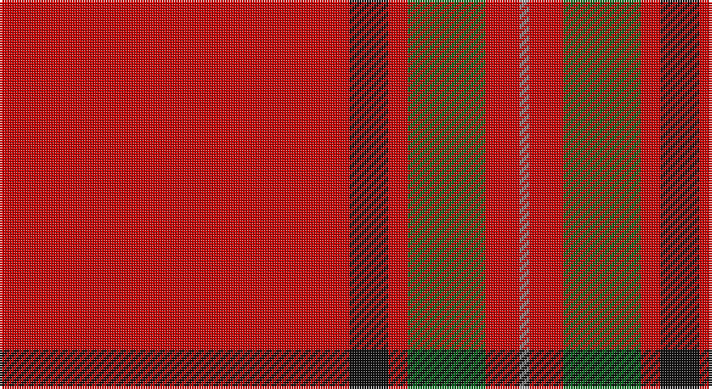

This page is one **sett** — a single exact thread-count. It belongs to the [tartan](/setts/r72k8r4g16r7o2/)
(the same proportion at any scale), whose colour order is pattern [RKRGRR](/stripes/rkrgrr/).

Sourced from tartans-authority.  It is a [6 stripe tartan](/stripes/stripes6/).

Original link http://www.tartansauthority.com/tartan-ferret/display/7608/

## Register references

External register numbers recorded for this tartan.

- Scottish Tartans Authority (ITI): 7608

## Thread count
R/144 K16 R8 G32 R14 N/4

One full sett is **288 threads**.

## Palette

Palette: <strong>Tartan Register</strong>
<table><thead><tr><th>Colour</th><th>Threads</th><th>Shade</th><th>Base</th><th>OKLCh</th></tr></thead><tbody><tr><td>R/</td><td style="text-align:right;font-variant-numeric:tabular-nums">144</td><td><code style="background-color:#C80000;">#C80000</code> <small style="color:#888">#C80000</small></td><td>R <code style="background-color:#CC0000;">#CC0000</code></td><td><small style="color:#888">oklch(52.3% 0.215 29.2)</small></td></tr><tr><td>K</td><td style="text-align:right;font-variant-numeric:tabular-nums">16</td><td><code style="background-color:#101010;">#101010</code> <small style="color:#888">#101010</small></td><td>K <code style="background-color:#000000;">#000000</code></td><td><small style="color:#888">oklch(17.3% 0.000 89.9)</small></td></tr><tr><td>R</td><td style="text-align:right;font-variant-numeric:tabular-nums">8</td><td><code style="background-color:#C80000;">#C80000</code> <small style="color:#888">#C80000</small></td><td>R <code style="background-color:#CC0000;">#CC0000</code></td><td><small style="color:#888">oklch(52.3% 0.215 29.2)</small></td></tr><tr><td>G</td><td style="text-align:right;font-variant-numeric:tabular-nums">32</td><td><code style="background-color:#006818;">#006818</code> <small style="color:#888">#006818</small></td><td>G <code style="background-color:#006100;">#006100</code></td><td><small style="color:#888">oklch(45.0% 0.142 145.0)</small></td></tr><tr><td>R</td><td style="text-align:right;font-variant-numeric:tabular-nums">14</td><td><code style="background-color:#C80000;">#C80000</code> <small style="color:#888">#C80000</small></td><td>R <code style="background-color:#CC0000;">#CC0000</code></td><td><small style="color:#888">oklch(52.3% 0.215 29.2)</small></td></tr><tr><td>N/</td><td style="text-align:right;font-variant-numeric:tabular-nums">4</td><td><code style="background-color:#888888;">#888888</code> <small style="color:#888">#888888</small></td><td>R <code style="background-color:#CC0000;">#CC0000</code></td><td><small style="color:#888">oklch(62.7% 0.000 89.9)</small></td></tr></tbody></table>

# Sample pattern

## Nearest tartans

The nearest existing variants by ΔTartan distance, with this tartan at the top so the swatches line up against it.

ΔTartan

Tartan

Sett

—

<a href="/ttd/edit/#slug=r72k8r4g16r7o2~x2">MacAndrew Dress (Name)</a> <a class="nn-out" href="/variants/s6/r72k8r4g16r7o2~x2/" title="open its dictionary page">↗</a>

0.98

<a href="/ttd/edit/#slug=r114g10w3g16ly3g3ly3r28~x2&amp;base=r72k8r4g16r7o2~x2">Duke of Sussex (Earl of Inverness)</a> <a class="nn-out" href="/variants/s8/r114g10w3g16ly3g3ly3r28~x2/" title="open its dictionary page">↗</a>

1.11

<a href="/ttd/edit/#slug=r65w2r3ri4dg11r3dg3r11&amp;base=r72k8r4g16r7o2~x2">Gudbrandsdalen, Rondastakken</a> <a class="nn-out" href="/variants/s8/r65w2r3ri4dg11r3dg3r11/" title="open its dictionary page">↗</a>

1.23

<a href="/ttd/edit/#slug=r65w1r6k8g8r6k3r11~x2&amp;base=r72k8r4g16r7o2~x2">Gudbrandsdalen, Rondastakken #2</a> <a class="nn-out" href="/variants/s8/r65w1r6k8g8r6k3r11~x2/" title="open its dictionary page">↗</a>

1.23

<a href="/ttd/edit/#slug=r51lr2k11lo3r11lo3r11g3~x2&amp;base=r72k8r4g16r7o2~x2">Hackston (Green stripe) (Portrait)</a> <a class="nn-out" href="/variants/s8/r51lr2k11lo3r11lo3r11g3~x2/" title="open its dictionary page">↗</a>

1.26

<a href="/ttd/edit/#slug=r42db4ly1db6dg1db1dg1r12~x2&amp;base=r72k8r4g16r7o2~x2">Inverness Earl of</a> <a class="nn-out" href="/variants/s8/r42db4ly1db6dg1db1dg1r12~x2/" title="open its dictionary page">↗</a>

1.26

<a href="/ttd/edit/#slug=r65w2r3ri4g11r3g3r11~x2&amp;base=r72k8r4g16r7o2~x2">Gudbrandsdalen, Rondastakken</a> <a class="nn-out" href="/variants/s8/r65w2r3ri4g11r3g3r11~x2/" title="open its dictionary page">↗</a>

1.26

<a href="/ttd/edit/#slug=r36db3w1db6g1k1g1r9~x2&amp;base=r72k8r4g16r7o2~x2">Inverness</a> <a class="nn-out" href="/variants/s8/r36db3w1db6g1k1g1r9~x2/" title="open its dictionary page">↗</a>

1.27

<a href="/ttd/edit/#slug=r42db4ly1db6g1db1g1r12~x2&amp;base=r72k8r4g16r7o2~x2">Inverness, Earl of</a> <a class="nn-out" href="/variants/s8/r42db4ly1db6g1db1g1r12~x2/" title="open its dictionary page">↗</a>

1.30

<a href="/ttd/edit/#slug=r65dg16r4dp4r4w5~x2&amp;base=r72k8r4g16r7o2~x2">Howard, Vincent (Personal)</a> <a class="nn-out" href="/variants/s6/r65dg16r4dp4r4w5~x2/" title="open its dictionary page">↗</a>

1.30

<a href="/ttd/edit/#slug=r39g6r2g3w1~x2&amp;base=r72k8r4g16r7o2~x2">MacGregor</a> <a class="nn-out" href="/variants/s5/r39g6r2g3w1~x2/" title="open its dictionary page">↗</a>

## Neighbour map

Every grey dot is one of 14360 variants placed by the first two principal components of the ΔTartan feature space (44% of its variance). Red is this tartan; blue dots are its nearest — click one to open its page.

<svg viewBox="0 0 640 380" role="img" style="max-width:100%;height:auto;border:1px solid #e0e0e0;border-radius:4px;display:block" xmlns="http://www.w3.org/2000/svg"><image href="/nn/cloud.v1.png" width="640" height="380"/><a href="/variants/s8/r114g10w3g16ly3g3ly3r28~x2/"><circle cx="599.5" cy="109.3" r="4" fill="#3465a4"><title>Duke of Sussex (Earl of Inverness)</title></circle></a><a href="/variants/s8/r65w2r3ri4dg11r3dg3r11/"><circle cx="611.8" cy="119.8" r="4" fill="#3465a4"><title>Gudbrandsdalen, Rondastakken</title></circle></a><a href="/variants/s8/r65w1r6k8g8r6k3r11~x2/"><circle cx="614.9" cy="101.1" r="4" fill="#3465a4"><title>Gudbrandsdalen, Rondastakken #2</title></circle></a><a href="/variants/s8/r51lr2k11lo3r11lo3r11g3~x2/"><circle cx="521.1" cy="115.2" r="4" fill="#3465a4"><title>Hackston (Green stripe) (Portrait)</title></circle></a><a href="/variants/s8/r42db4ly1db6dg1db1dg1r12~x2/"><circle cx="605.6" cy="102.8" r="4" fill="#3465a4"><title>Inverness Earl of</title></circle></a><a href="/variants/s8/r65w2r3ri4g11r3g3r11~x2/"><circle cx="619.0" cy="121.8" r="4" fill="#3465a4"><title>Gudbrandsdalen, Rondastakken</title></circle></a><a href="/variants/s8/r36db3w1db6g1k1g1r9~x2/"><circle cx="561.3" cy="96.4" r="4" fill="#3465a4"><title>Inverness</title></circle></a><a href="/variants/s8/r42db4ly1db6g1db1g1r12~x2/"><circle cx="621.3" cy="115.7" r="4" fill="#3465a4"><title>Inverness, Earl of</title></circle></a><a href="/variants/s6/r65dg16r4dp4r4w5~x2/"><circle cx="506.9" cy="152.1" r="4" fill="#3465a4"><title>Howard, Vincent (Personal)</title></circle></a><a href="/variants/s5/r39g6r2g3w1~x2/"><circle cx="626.0" cy="154.6" r="4" fill="#3465a4"><title>MacGregor</title></circle></a><circle cx="561.8" cy="132.8" r="5" fill="#c00000"/></svg>

ID: /variants/s6/r72k8r4g16r7o2~x2/
