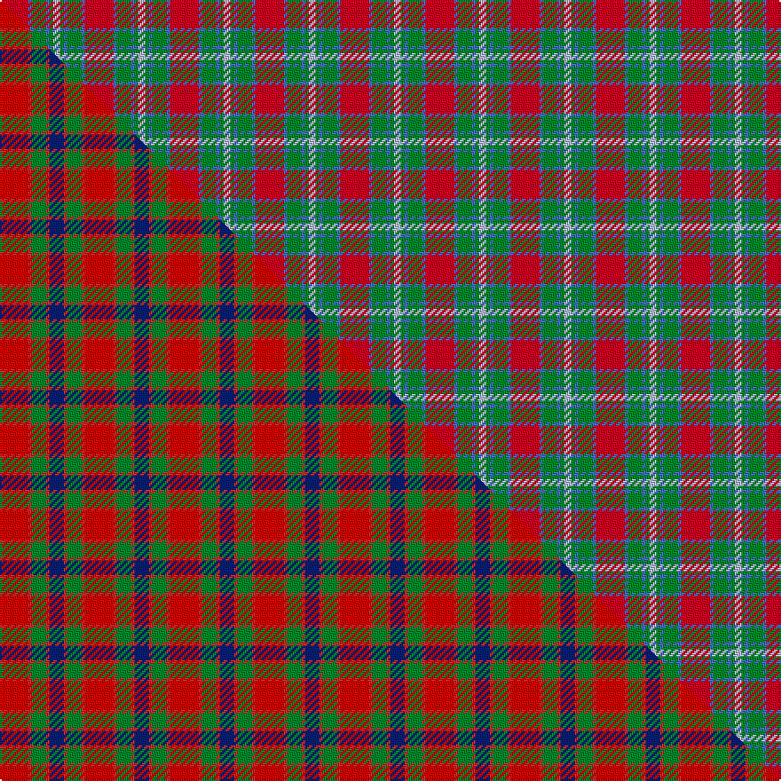

This is one **variant** — a specific cloth: this exact thread count and colourway, with its own
provenance below. It is one weaving of the [sett](/tartans/m/mo/moray-of-abercairney-3/) (the scale-free proportion — the
same cloth at any scale or shade), whose colour order is pattern [RBGBGW](/stripes/rbgbgw/).

Part of the [Moray of Abercairney](/tartans/m/mo/moray-of-abercairney-3/) tartan — the named design grouping this sett with its other cloths.

Sourced from weddslist.  It is a [6 stripe tartan](/stripes/stripes6/).

Original link [http://www.weddslist.com/cgi-bin/tartans/pg.pl?source=sts](http://www.weddslist.com/cgi-bin/tartans/pg.pl?source=sts)

Dataset <small>— provenance for this record, inherited from the source manifest</small>

<dl class="dataset-prov">
<dt>source</dt><dd><a href="/sources/weddslist/">Weddslist</a></dd>
<dt>data captured from</dt><dd><a href="https://github.com/thetartan/tartan-database/blob/master/data/weddslist/data.csv">https://github.com/thetartan/tartan-database/blob/master/data/weddslist/data.csv</a></dd>
<dt>data date</dt><dd>2016-11-17 <small>(dataset default)</small></dd>
<dt>licence</dt><dd><a href="https://creativecommons.org/licenses/by-nc-nd/4.0/">CC BY-NC-ND 4.0</a></dd>
</dl>

Capture chain <small>— the hands this data passed through, oldest first; each capture carries its own licence</small>

<ol class="capture-chain">
<li><a href="https://www.weddslist.com/tartans/">Weddslist</a> <small>the living privately compiled reference</small></li>
<li><a href="https://github.com/thetartan/tartan-database">thetartan/tartan-database</a> <small>2016-2017</small> · <a href="https://creativecommons.org/licenses/by-nc-nd/4.0/">CC BY-NC-ND 4.0</a> <small>Levko Kravets's frozen compilation — the capture we vendored, and where its CC licence text came from</small></li>
<li>this dictionary <small>captured 2026-06-10 · commit 5bf86c7566</small> <small>each re-capture is a git commit to data/sources</small></li>
</ol>

## Thread count
R/16 B2 G8 B2 G2 LB/4

One full sett is **48 threads**.

## Palette
<table><thead><tr><th>Colour</th><th>Shade</th><th>OKLCh</th></tr></thead><tbody><tr><td>LB</td><td><code style="background-color:#B5BBDE;">#B5BBDE</code> <small style="color:#888">#B5BBDE</small></td><td><small style="color:#888">oklch(79.9% 0.050 277.6)</small></td></tr><tr><td>G</td><td><code style="background-color:#008B2A;">#008B2A</code> <small style="color:#888">#008B2A</small></td><td><small style="color:#888">oklch(55.4% 0.170 145.9)</small></td></tr><tr><td>B</td><td><code style="background-color:#466CC8;">#466CC8</code> <small style="color:#888">#466CC8</small></td><td><small style="color:#888">oklch(55.1% 0.149 265.0)</small></td></tr><tr><td>R</td><td><code style="background-color:#D60020;">#D60020</code> <small style="color:#888">#D60020</small></td><td><small style="color:#888">oklch(55.2% 0.224 25.5)</small></td></tr></tbody></table>

# Sample pattern

## Compared to the master

This cloth is one sett of its design; the master sett (the exemplar the design is anchored on) is below for comparison.

Its **ΔTartan distance** from the master is **2.58** — the same measure the nearest-tartans table ranks by (0 is identical; a re-scale of the same cloth is near 0, a recolour or a different proportion further).

<figure class="master-compare" style="margin:0">

this sett
master sett ★

<figcaption style="color:#888;font-size:smaller">One weave of this sett against the <a href="/setts/ri8r1g4r1db4/">master sett ★</a>, split on the diagonal: a shared proportion runs seamlessly across it with only the shades shifting; a different proportion breaks on it.</figcaption>
</figure>

## Nearest tartan variants

The nearest existing variants by ΔTartan distance, with this cloth at the top so the swatches line up against it.

ΔTartan

Threads

Variant

Sett

—

48

<a href="/variants/s6/r8b1g4b1g1lb2~x2/">Moray of Abercairney</a>

<a href="/ttd/edit/#slug=db1r12g6y1g6db1~x4&amp;base=r8b1g4b1g1lb2~x2" title="compare in the TTD">1.59</a>

208

<a href="/variants/s6/db1r12g6y1g6db1~x4/">Cetoloni (Personal)</a>

<a href="/ttd/edit/#slug=db8y4r30dg30lo3dg4~x2&amp;base=r8b1g4b1g1lb2~x2" title="compare in the TTD">1.73</a>

292

<a href="/variants/s6/db8y4r30dg30lo3dg4~x2/">Hutcheson (Name)</a>

<a href="/ttd/edit/#slug=y2dg17g4r15dg1~x2&amp;base=r8b1g4b1g1lb2~x2" title="compare in the TTD">1.80</a>

150

<a href="/variants/s5/y2dg17g4r15dg1~x2/">Christmas</a>

<a href="/ttd/edit/#slug=ly2dg17g4r15dg1~x2&amp;base=r8b1g4b1g1lb2~x2" title="compare in the TTD">1.80</a>

150

<a href="/variants/s5/ly2dg17g4r15dg1~x2/">Christmas (Fashion)</a>

<a href="/ttd/edit/#slug=r32lb5g17r4g5w2~x2&amp;base=r8b1g4b1g1lb2~x2" title="compare in the TTD">1.82</a>

192

<a href="/variants/s6/r32lb5g17r4g5w2~x2/">Wilson's, No 5</a>

<a href="/ttd/edit/#slug=r8b1g4b1db4~x2&amp;base=r8b1g4b1g1lb2~x2" title="compare in the TTD">1.83</a>

48

<a href="/variants/s5/r8b1g4b1db4~x2/">Moray of Abercairney</a>

<a href="/ttd/edit/#slug=dt12w2dt13dg3g2r24g3~x2&amp;base=r8b1g4b1g1lb2~x2" title="compare in the TTD">1.93</a>

206

<a href="/variants/s7/dt12w2dt13dg3g2r24g3~x2/">Wellmont Foundation (Corporate)</a>

<a href="/ttd/edit/#slug=db1r14g7db7r1~x4&amp;base=r8b1g4b1g1lb2~x2" title="compare in the TTD">2.11</a>

232

<a href="/variants/s5/db1r14g7db7r1~x4/">Fraser of Boblainy, Hugh (Personal)</a>

<a href="/ttd/edit/#slug=r9db1g2db5w1~x12&amp;base=r8b1g4b1g1lb2~x2" title="compare in the TTD">2.14</a>

312

<a href="/variants/s5/r9db1g2db5w1~x12/">McIntosh, Georgina (Personal)</a>

<a href="/ttd/edit/#slug=db8r8dg17w3r35db10dg15w3~x2&amp;base=r8b1g4b1g1lb2~x2" title="compare in the TTD">2.19</a>

374

<a href="/variants/s8/db8r8dg17w3r35db10dg15w3~x2/">James of Glencarr (Personal)</a>

## Neighbour map

Every grey dot is one of 13662 variants placed by the first two principal components of the ΔTartan feature space (42% of its variance). Red is this tartan; blue dots are its nearest — click one to open its page. The map is a flat projection of a many-dimensional space — [how to read it](/posts/neighbourhood-maps/).

<svg viewBox="0 0 640 380" role="img" style="max-width:100%;height:auto;border:1px solid #e0e0e0;border-radius:4px;display:block" xmlns="http://www.w3.org/2000/svg"><image href="/nn/cloud.v1.png" width="640" height="380"/><a href="/variants/s6/db1r12g6y1g6db1~x4/"><circle cx="300.1" cy="207.7" r="4" fill="#3465a4"><title>Cetoloni (Personal)</title></circle></a><a href="/variants/s6/db8y4r30dg30lo3dg4~x2/"><circle cx="247.9" cy="194.3" r="4" fill="#3465a4"><title>Hutcheson (Name)</title></circle></a><a href="/variants/s5/y2dg17g4r15dg1~x2/"><circle cx="309.0" cy="201.9" r="4" fill="#3465a4"><title>Christmas</title></circle></a><a href="/variants/s5/ly2dg17g4r15dg1~x2/"><circle cx="295.3" cy="197.5" r="4" fill="#3465a4"><title>Christmas (Fashion)</title></circle></a><a href="/variants/s6/r32lb5g17r4g5w2~x2/"><circle cx="355.8" cy="183.9" r="4" fill="#3465a4"><title>Wilson's, No 5</title></circle></a><a href="/variants/s5/r8b1g4b1db4~x2/"><circle cx="236.5" cy="239.9" r="4" fill="#3465a4"><title>Moray of Abercairney</title></circle></a><a href="/variants/s7/dt12w2dt13dg3g2r24g3~x2/"><circle cx="242.8" cy="178.8" r="4" fill="#3465a4"><title>Wellmont Foundation (Corporate)</title></circle></a><a href="/variants/s5/db1r14g7db7r1~x4/"><circle cx="309.9" cy="218.4" r="4" fill="#3465a4"><title>Fraser of Boblainy, Hugh (Personal)</title></circle></a><a href="/variants/s5/r9db1g2db5w1~x12/"><circle cx="273.7" cy="212.7" r="4" fill="#3465a4"><title>McIntosh, Georgina (Personal)</title></circle></a><a href="/variants/s8/db8r8dg17w3r35db10dg15w3~x2/"><circle cx="230.3" cy="193.7" r="4" fill="#3465a4"><title>James of Glencarr (Personal)</title></circle></a><circle cx="277.0" cy="221.8" r="5" fill="#c00000"/><text x="320" y="376" text-anchor="middle" font-size="11" fill="#999">ground</text><text x="11" y="190" text-anchor="middle" font-size="11" fill="#999" transform="rotate(-90 11 190)">complexity</text></svg>

ID: /variants/s6/r8b1g4b1g1lb2~x2/
