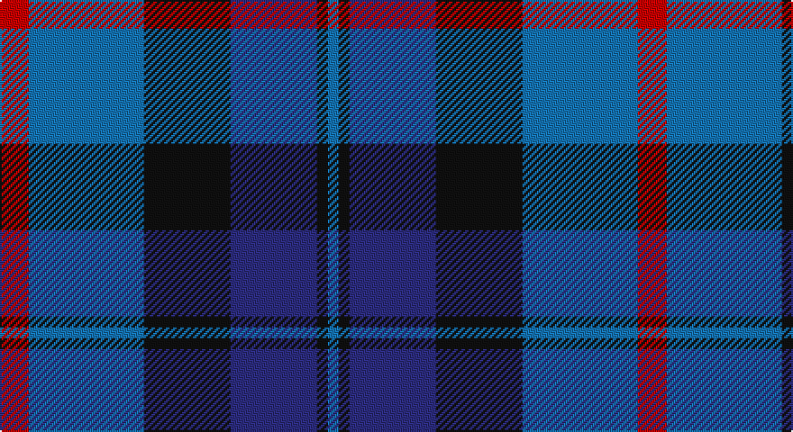

This page is one **sett** — a single exact thread-count. It belongs to the [tartan](/setts/r8b32k24db24k3b3/)
(the same proportion at any scale), whose colour order is pattern [BKBKBR](/stripes/bkbkbr/).

Part of the [MacCorquodale](/tartans/maccorquodale/) tartan — the named design grouping this sett with its other cloths.

Sourced from register-of-tartans.  It is a [6 stripe tartan](/stripes/stripes6/).

Original link https://www.tartanregister.gov.uk/tartanDetails.aspx?ref=5218

## Also known as

This cloth is also recorded under:

- MacCorquodale #2

## Register references

External register numbers recorded for this tartan.

- Scottish Register of Tartans: [5218](https://www.tartanregister.gov.uk/tartanDetails.aspx?ref=5218)
- Scottish Tartans Authority (ITI): 3335

## Thread count
R/16 B64 K48 DB48 K6 B/6

One full sett is **354 threads**.

## Palette

Palette: <strong>Tartan Register</strong>
<table><thead><tr><th>Colour</th><th>Threads</th><th>Shade</th><th>Base</th><th>OKLCh</th></tr></thead><tbody><tr><td>R/</td><td style="text-align:right;font-variant-numeric:tabular-nums">16</td><td><code style="background-color:#C80000;">#C80000</code> <small style="color:#888">#C80000</small></td><td>R <code style="background-color:#CC0000;">#CC0000</code></td><td><small style="color:#888">oklch(52.3% 0.215 29.2)</small></td></tr><tr><td>B</td><td style="text-align:right;font-variant-numeric:tabular-nums">64</td><td><code style="background-color:#1474B4;">#1474B4</code> <small style="color:#888">#1474B4</small></td><td>B <code style="background-color:#2A418A;">#2A418A</code></td><td><small style="color:#888">oklch(54.0% 0.129 245.1)</small></td></tr><tr><td>K</td><td style="text-align:right;font-variant-numeric:tabular-nums">48</td><td><code style="background-color:#101010;">#101010</code> <small style="color:#888">#101010</small></td><td>K <code style="background-color:#000000;">#000000</code></td><td><small style="color:#888">oklch(17.3% 0.000 89.9)</small></td></tr><tr><td>DB</td><td style="text-align:right;font-variant-numeric:tabular-nums">48</td><td><code style="background-color:#2C2C80;">#2C2C80</code> <small style="color:#888">#2C2C80</small></td><td>B <code style="background-color:#2A418A;">#2A418A</code></td><td><small style="color:#888">oklch(35.0% 0.138 276.6)</small></td></tr><tr><td>K</td><td style="text-align:right;font-variant-numeric:tabular-nums">6</td><td><code style="background-color:#101010;">#101010</code> <small style="color:#888">#101010</small></td><td>K <code style="background-color:#000000;">#000000</code></td><td><small style="color:#888">oklch(17.3% 0.000 89.9)</small></td></tr><tr><td>B/</td><td style="text-align:right;font-variant-numeric:tabular-nums">6</td><td><code style="background-color:#1474B4;">#1474B4</code> <small style="color:#888">#1474B4</small></td><td>B <code style="background-color:#2A418A;">#2A418A</code></td><td><small style="color:#888">oklch(54.0% 0.129 245.1)</small></td></tr></tbody></table>

# Sample pattern

## Compared to the master

This cloth is one sett of its design; the master sett (the exemplar the design is anchored on) is below for comparison.

<figure style="margin:0"><figcaption style="color:#888;font-size:smaller">this sett</figcaption></figure>
<figure style="margin:0"><figcaption style="color:#888;font-size:smaller"><a href="/setts/r7k4t28k24ti24k4t4/">master sett →</a></figcaption></figure>

## Nearest tartans

The nearest existing variants by ΔTartan distance, with this tartan at the top so the swatches line up against it.

ΔTartan

Tartan

Sett

—

<a href="/ttd/edit/#slug=r8b32k24db24k3b3~x2">MacCorquodale #2</a> <a class="nn-out" href="/variants/s6/r8b32k24db24k3b3~x2/" title="open its dictionary page">↗</a>

0.85

<a href="/ttd/edit/#slug=n6k6n21k16db36ly4&amp;base=r8b32k24db24k3b3~x2">Bareback (Corporate)</a> <a class="nn-out" href="/variants/s6/n6k6n21k16db36ly4/" title="open its dictionary page">↗</a>

0.98

<a href="/variants/s7/ki3db24t3k25t22ki3t3~x2/">Strathclyde blue</a>

0.98

<a href="/ttd/edit/#slug=b11k1b3k5dp9lo1~x2&amp;base=r8b32k24db24k3b3~x2">Joker Fancy Tartan</a> <a class="nn-out" href="/variants/s6/b11k1b3k5dp9lo1~x2/" title="open its dictionary page">↗</a>

1.02

<a href="/variants/s7/k3db24t3ki25t22k3t3~x2/">Strathclyde blue</a>

1.07

<a href="/ttd/edit/#slug=dp3k1dp8k6dg8k1w2~x2&amp;base=r8b32k24db24k3b3~x2">Baillie (Highland Society)</a> <a class="nn-out" href="/variants/s7/dp3k1dp8k6dg8k1w2~x2/" title="open its dictionary page">↗</a>

1.08

<a href="/ttd/edit/#slug=db25k3db7k15b25k2b2w4~x2&amp;base=r8b32k24db24k3b3~x2">Sabema</a> <a class="nn-out" href="/variants/s8/db25k3db7k15b25k2b2w4~x2/" title="open its dictionary page">↗</a>

1.13

<a href="/ttd/edit/#slug=db9k7o5r1o5k1o2~x4&amp;base=r8b32k24db24k3b3~x2">Greyhound Grenadiers (Corporate)</a> <a class="nn-out" href="/variants/s7/db9k7o5r1o5k1o2~x4/" title="open its dictionary page">↗</a>

1.19

<a href="/ttd/edit/#slug=db23dp2g11dp24lb3~x2&amp;base=r8b32k24db24k3b3~x2">Scottish Open Squash (Corporate)</a> <a class="nn-out" href="/variants/s5/db23dp2g11dp24lb3~x2/" title="open its dictionary page">↗</a>

1.22

<a href="/ttd/edit/#slug=m5g20k13db42k13g20ly5~x2&amp;base=r8b32k24db24k3b3~x2">Newmill</a> <a class="nn-out" href="/variants/s7/m5g20k13db42k13g20ly5~x2/" title="open its dictionary page">↗</a>

1.22

<a href="/ttd/edit/#slug=k3dg17ly2k18dp17dg3~x2&amp;base=r8b32k24db24k3b3~x2">Wilson's No.100</a> <a class="nn-out" href="/variants/s6/k3dg17ly2k18dp17dg3~x2/" title="open its dictionary page">↗</a>

## Neighbour map

Every grey dot is one of 14360 variants placed by the first two principal components of the ΔTartan feature space (44% of its variance). Red is this tartan; blue dots are its nearest — click one to open its page.

<svg viewBox="0 0 640 380" role="img" style="max-width:100%;height:auto;border:1px solid #e0e0e0;border-radius:4px;display:block" xmlns="http://www.w3.org/2000/svg"><image href="/nn/cloud.v1.png" width="640" height="380"/><a href="/variants/s6/n6k6n21k16db36ly4/"><circle cx="233.0" cy="241.5" r="4" fill="#3465a4"><title>Bareback (Corporate)</title></circle></a><a href="/variants/s7/ki3db24t3k25t22ki3t3~x2/"><circle cx="182.1" cy="222.7" r="4" fill="#3465a4"><title>Strathclyde blue</title></circle></a><a href="/variants/s6/b11k1b3k5dp9lo1~x2/"><circle cx="263.6" cy="229.4" r="4" fill="#3465a4"><title>Joker Fancy Tartan</title></circle></a><a href="/variants/s7/k3db24t3ki25t22k3t3~x2/"><circle cx="174.8" cy="217.7" r="4" fill="#3465a4"><title>Strathclyde blue</title></circle></a><a href="/variants/s7/dp3k1dp8k6dg8k1w2~x2/"><circle cx="177.0" cy="227.0" r="4" fill="#3465a4"><title>Baillie (Highland Society)</title></circle></a><a href="/variants/s8/db25k3db7k15b25k2b2w4~x2/"><circle cx="215.5" cy="195.5" r="4" fill="#3465a4"><title>Sabema</title></circle></a><a href="/variants/s7/db9k7o5r1o5k1o2~x4/"><circle cx="185.3" cy="222.0" r="4" fill="#3465a4"><title>Greyhound Grenadiers (Corporate)</title></circle></a><a href="/variants/s5/db23dp2g11dp24lb3~x2/"><circle cx="258.6" cy="240.6" r="4" fill="#3465a4"><title>Scottish Open Squash (Corporate)</title></circle></a><a href="/variants/s7/m5g20k13db42k13g20ly5~x2/"><circle cx="163.1" cy="221.8" r="4" fill="#3465a4"><title>Newmill</title></circle></a><a href="/variants/s6/k3dg17ly2k18dp17dg3~x2/"><circle cx="204.3" cy="240.5" r="4" fill="#3465a4"><title>Wilson's No.100</title></circle></a><circle cx="200.8" cy="229.8" r="5" fill="#c00000"/></svg>

ID: /variants/s6/r8b32k24db24k3b3~x2/
