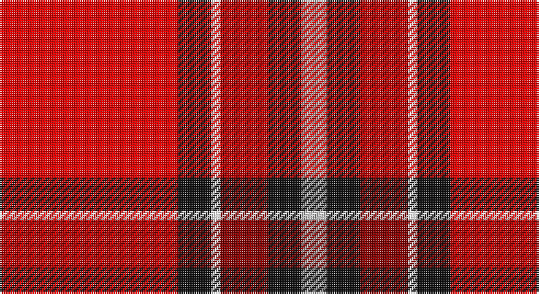

This page is one **sett** — a single exact thread-count. It belongs to the [tartan](/setts/r97k18w5ri26k18lr14/)
(the same proportion at any scale), whose colour order is pattern [RKWRKY](/stripes/rkwrky/).

Sourced from register-of-tartans.  It is a [6 stripe tartan](/stripes/stripes6/).

Original link https://www.tartanregister.gov.uk/tartanDetails.aspx?ref=11312

## Register references

External register numbers recorded for this tartan.

- Scottish Register of Tartans: [11312](https://www.tartanregister.gov.uk/tartanDetails.aspx?ref=11312)

## Thread count
R/97 K18 W5 DR26 K18 N/14

One full sett is **245 threads**.

## Palette

Palette: <strong>Tartan Register</strong>
<table><thead><tr><th>Colour</th><th>Threads</th><th>Shade</th><th>Base</th><th>OKLCh</th></tr></thead><tbody><tr><td>R/</td><td style="text-align:right;font-variant-numeric:tabular-nums">97</td><td><code style="background-color:#FF0000;">#FF0000</code> <small style="color:#888">#FF0000</small></td><td>R <code style="background-color:#CC0000;">#CC0000</code></td><td><small style="color:#888">oklch(62.8% 0.258 29.2)</small></td></tr><tr><td>K</td><td style="text-align:right;font-variant-numeric:tabular-nums">18</td><td><code style="background-color:#101010;">#101010</code> <small style="color:#888">#101010</small></td><td>K <code style="background-color:#000000;">#000000</code></td><td><small style="color:#888">oklch(17.3% 0.000 89.9)</small></td></tr><tr><td>W</td><td style="text-align:right;font-variant-numeric:tabular-nums">5</td><td><code style="background-color:#FFFFFF;">#FFFFFF</code> <small style="color:#888">#FFFFFF</small></td><td>W <code style="background-color:#F7F7F7;">#F7F7F7</code></td><td><small style="color:#888">oklch(100.0% 0.000 89.9)</small></td></tr><tr><td>DR</td><td style="text-align:right;font-variant-numeric:tabular-nums">26</td><td><code style="background-color:#880000;">#880000</code> <small style="color:#888">#880000</small></td><td>R <code style="background-color:#CC0000;">#CC0000</code></td><td><small style="color:#888">oklch(39.4% 0.162 29.2)</small></td></tr><tr><td>K</td><td style="text-align:right;font-variant-numeric:tabular-nums">18</td><td><code style="background-color:#101010;">#101010</code> <small style="color:#888">#101010</small></td><td>K <code style="background-color:#000000;">#000000</code></td><td><small style="color:#888">oklch(17.3% 0.000 89.9)</small></td></tr><tr><td>N/</td><td style="text-align:right;font-variant-numeric:tabular-nums">14</td><td><code style="background-color:#B0B0B0;">#B0B0B0</code> <small style="color:#888">#B0B0B0</small></td><td>Y <code style="background-color:#F2BF00;">#F2BF00</code></td><td><small style="color:#888">oklch(75.7% 0.000 89.9)</small></td></tr></tbody></table>

# Sample pattern

## Nearest tartans

The nearest existing variants by ΔTartan distance, with this tartan at the top so the swatches line up against it.

ΔTartan

Tartan

Sett

—

<a href="/ttd/edit/#slug=r97k18w5ri26k18lr14">Bradley University</a> <a class="nn-out" href="/variants/s6/r97k18w5ri26k18lr14/" title="open its dictionary page">↗</a>

1.48

<a href="/ttd/edit/#slug=k6r20w2ri9w3lb2~x2&amp;base=r97k18w5ri26k18lr14">Thermos Un-named (aretefact)</a> <a class="nn-out" href="/variants/s6/k6r20w2ri9w3lb2~x2/" title="open its dictionary page">↗</a>

1.50

<a href="/ttd/edit/#slug=r3ly6k2ly2k2ly2k3ri20lb1ri3~x4&amp;base=r97k18w5ri26k18lr14">Motherwell F.C. Fir Park Dress (Spor</a> <a class="nn-out" href="/variants/s10/r3ly6k2ly2k2ly2k3ri20lb1ri3~x4/" title="open its dictionary page">↗</a>

1.51

<a href="/ttd/edit/#slug=r28dg4k4dg4k4t6ly1~x2&amp;base=r97k18w5ri26k18lr14">Livingstone MacLay MacLeay</a> <a class="nn-out" href="/variants/s7/r28dg4k4dg4k4t6ly1~x2/" title="open its dictionary page">↗</a>

1.52

<a href="/ttd/edit/#slug=r62db8w20k3g4~x2&amp;base=r97k18w5ri26k18lr14">Nicolson Dress (Clan)</a> <a class="nn-out" href="/variants/s5/r62db8w20k3g4~x2/" title="open its dictionary page">↗</a>

1.52

<a href="/variants/s10/r24lri2lr7lri3ki2k4ki2lri1r4lri1~x2/">VeMMA Corporate Tartan</a>

1.56

<a href="/ttd/edit/#slug=ri38k12rii15r4rii15k2w4~x2&amp;base=r97k18w5ri26k18lr14">Ferguson's Promise (Commemorative)</a> <a class="nn-out" href="/variants/s7/ri38k12rii15r4rii15k2w4~x2/" title="open its dictionary page">↗</a>

1.59

<a href="/ttd/edit/#slug=k4r32db9ri6db2ri3db2ri12lb3&amp;base=r97k18w5ri26k18lr14">Rose VS</a> <a class="nn-out" href="/variants/s9/k4r32db9ri6db2ri3db2ri12lb3/" title="open its dictionary page">↗</a>

1.60

<a href="/ttd/edit/#slug=r50k25g10o5ly2~x2&amp;base=r97k18w5ri26k18lr14">MacGleish Formal (Personal)</a> <a class="nn-out" href="/variants/s5/r50k25g10o5ly2~x2/" title="open its dictionary page">↗</a>

1.61

<a href="/ttd/edit/#slug=r27y4k4y4k4t6lo1~x4&amp;base=r97k18w5ri26k18lr14">MacLeay</a> <a class="nn-out" href="/variants/s7/r27y4k4y4k4t6lo1~x4/" title="open its dictionary page">↗</a>

1.63

<a href="/ttd/edit/#slug=r50ly8k2w2k2ly8k22r3~x2&amp;base=r97k18w5ri26k18lr14">FIRES Center of Excelence</a> <a class="nn-out" href="/variants/s8/r50ly8k2w2k2ly8k22r3~x2/" title="open its dictionary page">↗</a>

## Neighbour map

Every grey dot is one of 14360 variants placed by the first two principal components of the ΔTartan feature space (44% of its variance). Red is this tartan; blue dots are its nearest — click one to open its page.

<svg viewBox="0 0 640 380" role="img" style="max-width:100%;height:auto;border:1px solid #e0e0e0;border-radius:4px;display:block" xmlns="http://www.w3.org/2000/svg"><image href="/nn/cloud.v1.png" width="640" height="380"/><a href="/variants/s6/k6r20w2ri9w3lb2~x2/"><circle cx="225.6" cy="163.0" r="4" fill="#3465a4"><title>Thermos Un-named (aretefact)</title></circle></a><a href="/variants/s10/r3ly6k2ly2k2ly2k3ri20lb1ri3~x4/"><circle cx="284.8" cy="96.6" r="4" fill="#3465a4"><title>Motherwell F.C. Fir Park Dress (Spor</title></circle></a><a href="/variants/s7/r28dg4k4dg4k4t6ly1~x2/"><circle cx="323.9" cy="110.5" r="4" fill="#3465a4"><title>Livingstone MacLay MacLeay</title></circle></a><a href="/variants/s5/r62db8w20k3g4~x2/"><circle cx="374.0" cy="127.5" r="4" fill="#3465a4"><title>Nicolson Dress (Clan)</title></circle></a><a href="/variants/s10/r24lri2lr7lri3ki2k4ki2lri1r4lri1~x2/"><circle cx="306.0" cy="74.1" r="4" fill="#3465a4"><title>VeMMA Corporate Tartan</title></circle></a><a href="/variants/s7/ri38k12rii15r4rii15k2w4~x2/"><circle cx="234.2" cy="139.7" r="4" fill="#3465a4"><title>Ferguson's Promise (Commemorative)</title></circle></a><a href="/variants/s9/k4r32db9ri6db2ri3db2ri12lb3/"><circle cx="237.4" cy="114.0" r="4" fill="#3465a4"><title>Rose VS</title></circle></a><a href="/variants/s5/r50k25g10o5ly2~x2/"><circle cx="321.1" cy="146.9" r="4" fill="#3465a4"><title>MacGleish Formal (Personal)</title></circle></a><a href="/variants/s7/r27y4k4y4k4t6lo1~x4/"><circle cx="324.3" cy="117.2" r="4" fill="#3465a4"><title>MacLeay</title></circle></a><a href="/variants/s8/r50ly8k2w2k2ly8k22r3~x2/"><circle cx="336.0" cy="107.6" r="4" fill="#3465a4"><title>FIRES Center of Excelence</title></circle></a><circle cx="297.3" cy="122.9" r="5" fill="#c00000"/></svg>

ID: /variants/s6/r97k18w5ri26k18lr14/
