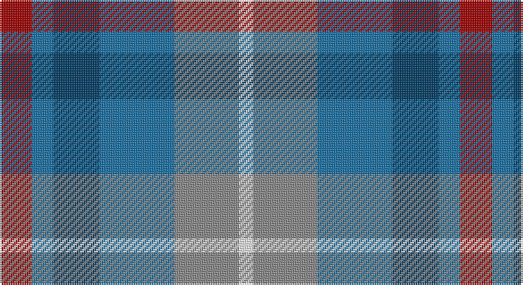

This page is one **sett** — a single exact thread-count. It belongs to the [tartan](/setts/r9b6dt13b21o18w4/)
(the same proportion at any scale), whose colour order is pattern [RBBBRW](/stripes/rbbbrw/).

Part of the [Fox-Eves Wedding](/tartans/fox-eves-wedding/) tartan — the named design grouping this sett with its other cloths.

Sourced from tartans-authority.  It is a [6 stripe tartan](/stripes/stripes6/).

Original link http://www.tartansauthority.com/tartan-ferret/display/11083/

## Register references

External register numbers recorded for this tartan.

- Scottish Register of Tartans: [11083](https://www.tartanregister.gov.uk/tartanDetails?ref=11083)
- Scottish Tartans Authority (ITI): 11083

## Thread count
DR/18 B12 DB26 B42 N36 W/8

One full sett is **258 threads**.

## Palette

Palette: <strong>Tartan Register</strong>
<table><thead><tr><th>Colour</th><th>Threads</th><th>Shade</th><th>Base</th><th>OKLCh</th></tr></thead><tbody><tr><td>DR/</td><td style="text-align:right;font-variant-numeric:tabular-nums">18</td><td><code style="background-color:#A00000;">#A00000</code> <small style="color:#888">#A00000</small></td><td>R <code style="background-color:#CC0000;">#CC0000</code></td><td><small style="color:#888">oklch(44.3% 0.182 29.2)</small></td></tr><tr><td>B</td><td style="text-align:right;font-variant-numeric:tabular-nums">12</td><td><code style="background-color:#1870A4;">#1870A4</code> <small style="color:#888">#1870A4</small></td><td>B <code style="background-color:#2A418A;">#2A418A</code></td><td><small style="color:#888">oklch(52.2% 0.113 241.2)</small></td></tr><tr><td>DB</td><td style="text-align:right;font-variant-numeric:tabular-nums">26</td><td><code style="background-color:#003C64;">#003C64</code> <small style="color:#888">#003C64</small></td><td>B <code style="background-color:#2A418A;">#2A418A</code></td><td><small style="color:#888">oklch(34.5% 0.089 246.0)</small></td></tr><tr><td>B</td><td style="text-align:right;font-variant-numeric:tabular-nums">42</td><td><code style="background-color:#1870A4;">#1870A4</code> <small style="color:#888">#1870A4</small></td><td>B <code style="background-color:#2A418A;">#2A418A</code></td><td><small style="color:#888">oklch(52.2% 0.113 241.2)</small></td></tr><tr><td>N</td><td style="text-align:right;font-variant-numeric:tabular-nums">36</td><td><code style="background-color:#888888;">#888888</code> <small style="color:#888">#888888</small></td><td>R <code style="background-color:#CC0000;">#CC0000</code></td><td><small style="color:#888">oklch(62.7% 0.000 89.9)</small></td></tr><tr><td>W/</td><td style="text-align:right;font-variant-numeric:tabular-nums">8</td><td><code style="background-color:#FCFCFC;">#FCFCFC</code> <small style="color:#888">#FCFCFC</small></td><td>W <code style="background-color:#F7F7F7;">#F7F7F7</code></td><td><small style="color:#888">oklch(99.1% 0.000 89.9)</small></td></tr></tbody></table>

# Sample pattern

## Compared to the master

This cloth is one sett of its design; the master sett (the exemplar the design is anchored on) is below for comparison.

<figure style="margin:0"><figcaption style="color:#888;font-size:smaller">this sett</figcaption></figure>
<figure style="margin:0"><figcaption style="color:#888;font-size:smaller"><a href="/setts/r9dt6db13dt21y18w4/">master sett →</a></figcaption></figure>

## Nearest tartans

The nearest existing variants by ΔTartan distance, with this tartan at the top so the swatches line up against it.

ΔTartan

Tartan

Sett

—

<a href="/ttd/edit/#slug=r9b6dt13b21o18w4~x2">Fox-Eves Wedding (Personal)</a> <a class="nn-out" href="/variants/s6/r9b6dt13b21o18w4~x2/" title="open its dictionary page">↗</a>

1.03

<a href="/ttd/edit/#slug=r9dt6db13dt21y18w4~x2&amp;base=r9b6dt13b21o18w4~x2">Fox-Eves Wedding</a> <a class="nn-out" href="/variants/s6/r9dt6db13dt21y18w4~x2/" title="open its dictionary page">↗</a>

1.15

<a href="/ttd/edit/#slug=n14r4n14t15db13w3~x2&amp;base=r9b6dt13b21o18w4~x2">Blue</a> <a class="nn-out" href="/variants/s6/n14r4n14t15db13w3~x2/" title="open its dictionary page">↗</a>

1.26

<a href="/ttd/edit/#slug=r4b3t11db8b2r4&amp;base=r9b6dt13b21o18w4~x2">St. Edmunds (School)</a> <a class="nn-out" href="/variants/s6/r4b3t11db8b2r4/" title="open its dictionary page">↗</a>

1.30

<a href="/ttd/edit/#slug=w3t2n14o8t14db16n13t2w3~x2&amp;base=r9b6dt13b21o18w4~x2">Caitriot</a> <a class="nn-out" href="/variants/s9/w3t2n14o8t14db16n13t2w3~x2/" title="open its dictionary page">↗</a>

1.40

<a href="/ttd/edit/#slug=g3dp7t11db3dy8w2db3t3~x2&amp;base=r9b6dt13b21o18w4~x2">Scotia Trade Tartan</a> <a class="nn-out" href="/variants/s8/g3dp7t11db3dy8w2db3t3~x2/" title="open its dictionary page">↗</a>

1.41

<a href="/ttd/edit/#slug=r5o20dt13db42dt13o20lo5&amp;base=r9b6dt13b21o18w4~x2">Newmill Corporate Tartan</a> <a class="nn-out" href="/variants/s7/r5o20dt13db42dt13o20lo5/" title="open its dictionary page">↗</a>

1.42

<a href="/ttd/edit/#slug=b2db3k1db3o3g4r1~x8&amp;base=r9b6dt13b21o18w4~x2">New York City</a> <a class="nn-out" href="/variants/s7/b2db3k1db3o3g4r1~x8/" title="open its dictionary page">↗</a>

1.42

<a href="/ttd/edit/#slug=m3g1t6k1g6m4k1lo1~x4&amp;base=r9b6dt13b21o18w4~x2">Orkney District Tartan</a> <a class="nn-out" href="/variants/s8/m3g1t6k1g6m4k1lo1~x4/" title="open its dictionary page">↗</a>

1.45

<a href="/ttd/edit/#slug=g15dg18dt23w4r8~x2&amp;base=r9b6dt13b21o18w4~x2">Friebe (2014)</a> <a class="nn-out" href="/variants/s5/g15dg18dt23w4r8~x2/" title="open its dictionary page">↗</a>

1.47

<a href="/ttd/edit/#slug=b25g25k6dt10r6~x2&amp;base=r9b6dt13b21o18w4~x2">Breon (Personal)</a> <a class="nn-out" href="/variants/s5/b25g25k6dt10r6~x2/" title="open its dictionary page">↗</a>

## Neighbour map

Every grey dot is one of 14360 variants placed by the first two principal components of the ΔTartan feature space (44% of its variance). Red is this tartan; blue dots are its nearest — click one to open its page.

<svg viewBox="0 0 640 380" role="img" style="max-width:100%;height:auto;border:1px solid #e0e0e0;border-radius:4px;display:block" xmlns="http://www.w3.org/2000/svg"><image href="/nn/cloud.v1.png" width="640" height="380"/><a href="/variants/s6/r9dt6db13dt21y18w4~x2/"><circle cx="123.0" cy="255.8" r="4" fill="#3465a4"><title>Fox-Eves Wedding</title></circle></a><a href="/variants/s6/n14r4n14t15db13w3~x2/"><circle cx="148.0" cy="263.3" r="4" fill="#3465a4"><title>Blue</title></circle></a><a href="/variants/s6/r4b3t11db8b2r4/"><circle cx="157.5" cy="262.0" r="4" fill="#3465a4"><title>St. Edmunds (School)</title></circle></a><a href="/variants/s9/w3t2n14o8t14db16n13t2w3~x2/"><circle cx="135.9" cy="205.0" r="4" fill="#3465a4"><title>Caitriot</title></circle></a><a href="/variants/s8/g3dp7t11db3dy8w2db3t3~x2/"><circle cx="86.2" cy="212.3" r="4" fill="#3465a4"><title>Scotia Trade Tartan</title></circle></a><a href="/variants/s7/r5o20dt13db42dt13o20lo5/"><circle cx="177.0" cy="219.4" r="4" fill="#3465a4"><title>Newmill Corporate Tartan</title></circle></a><a href="/variants/s7/b2db3k1db3o3g4r1~x8/"><circle cx="76.6" cy="265.1" r="4" fill="#3465a4"><title>New York City</title></circle></a><a href="/variants/s8/m3g1t6k1g6m4k1lo1~x4/"><circle cx="117.7" cy="213.0" r="4" fill="#3465a4"><title>Orkney District Tartan</title></circle></a><a href="/variants/s5/g15dg18dt23w4r8~x2/"><circle cx="104.3" cy="262.5" r="4" fill="#3465a4"><title>Friebe (2014)</title></circle></a><a href="/variants/s5/b25g25k6dt10r6~x2/"><circle cx="137.3" cy="276.7" r="4" fill="#3465a4"><title>Breon (Personal)</title></circle></a><circle cx="131.5" cy="258.4" r="5" fill="#c00000"/></svg>

ID: /variants/s6/r9b6dt13b21o18w4~x2/
