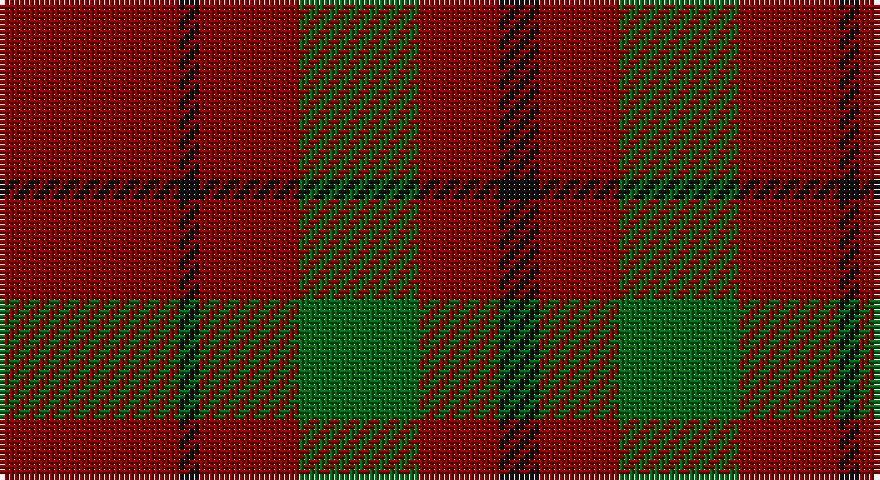

This page is one **sett** — a single exact thread-count. It belongs to the [tartan](/setts/r9k1r5g6r4k2/)
(the same proportion at any scale), whose colour order is pattern [KRGRKR](/stripes/krgrkr/).

Part of the [MacAn of Lurgyvallan](/tartans/macan-of-lurgyvallan/) tartan — the named design grouping this sett with its other cloths.

Sourced from register-of-tartans.  It is a [6 stripe tartan](/stripes/stripes6/).

Original link https://www.tartanregister.gov.uk/tartanDetails.aspx?ref=2277

## Also known as

This cloth is also recorded under:

- Macan of Lurgyvallan
- Macan of Lurgyvallan Portrait
- Macan, of Lurgyvallan

## Register references

External register numbers recorded for this tartan.

- Scottish Register of Tartans: [2277](https://www.tartanregister.gov.uk/tartanDetails.aspx?ref=2277)
- Scottish Tartans Authority (ITI): 1159
- Scottish Tartans World Register: 1159

## Thread count
DR/36 K4 DR20 G24 DR16 K/8

One full sett is **172 threads**.

## Palette

Palette: <strong>Tartan Register</strong>
<table><thead><tr><th>Colour</th><th>Threads</th><th>Shade</th><th>Base</th><th>OKLCh</th></tr></thead><tbody><tr><td>DR/</td><td style="text-align:right;font-variant-numeric:tabular-nums">36</td><td><code style="background-color:#880000;">#880000</code> <small style="color:#888">#880000</small></td><td>R <code style="background-color:#CC0000;">#CC0000</code></td><td><small style="color:#888">oklch(39.4% 0.162 29.2)</small></td></tr><tr><td>K</td><td style="text-align:right;font-variant-numeric:tabular-nums">4</td><td><code style="background-color:#101010;">#101010</code> <small style="color:#888">#101010</small></td><td>K <code style="background-color:#000000;">#000000</code></td><td><small style="color:#888">oklch(17.3% 0.000 89.9)</small></td></tr><tr><td>DR</td><td style="text-align:right;font-variant-numeric:tabular-nums">20</td><td><code style="background-color:#880000;">#880000</code> <small style="color:#888">#880000</small></td><td>R <code style="background-color:#CC0000;">#CC0000</code></td><td><small style="color:#888">oklch(39.4% 0.162 29.2)</small></td></tr><tr><td>G</td><td style="text-align:right;font-variant-numeric:tabular-nums">24</td><td><code style="background-color:#006818;">#006818</code> <small style="color:#888">#006818</small></td><td>G <code style="background-color:#006100;">#006100</code></td><td><small style="color:#888">oklch(45.0% 0.142 145.0)</small></td></tr><tr><td>DR</td><td style="text-align:right;font-variant-numeric:tabular-nums">16</td><td><code style="background-color:#880000;">#880000</code> <small style="color:#888">#880000</small></td><td>R <code style="background-color:#CC0000;">#CC0000</code></td><td><small style="color:#888">oklch(39.4% 0.162 29.2)</small></td></tr><tr><td>K/</td><td style="text-align:right;font-variant-numeric:tabular-nums">8</td><td><code style="background-color:#101010;">#101010</code> <small style="color:#888">#101010</small></td><td>K <code style="background-color:#000000;">#000000</code></td><td><small style="color:#888">oklch(17.3% 0.000 89.9)</small></td></tr></tbody></table>

# Sample pattern

## Compared to the master

This cloth is one sett of its design; the master sett (the exemplar the design is anchored on) is below for comparison.

<figure style="margin:0"><figcaption style="color:#888;font-size:smaller">this sett</figcaption></figure>
<figure style="margin:0"><figcaption style="color:#888;font-size:smaller"><a href="/setts/r16g1r1g1r1g4k1lb1k1ly1k1t6db4t6k1ly1k1lb1k1g4r12g1r1k1/">master sett →</a></figcaption></figure>

## Nearest tartans

The nearest existing variants by ΔTartan distance, with this tartan at the top so the swatches line up against it.

ΔTartan

Tartan

Sett

—

<a href="/ttd/edit/#slug=r9k1r5g6r4k2~x4">MacAn of Lurgyvallan (Hose)</a> <a class="nn-out" href="/variants/s6/r9k1r5g6r4k2~x4/" title="open its dictionary page">↗</a>

1.32

<a href="/ttd/edit/#slug=r8g2r2k1r1g2~x10&amp;base=r9k1r5g6r4k2~x4">Waverley Care Aids Trust (Corporate)</a> <a class="nn-out" href="/variants/s6/r8g2r2k1r1g2~x10/" title="open its dictionary page">↗</a>

1.63

<a href="/ttd/edit/#slug=do12y6do2lo1~x4&amp;base=r9k1r5g6r4k2~x4">Loch Garth</a> <a class="nn-out" href="/variants/s4/do12y6do2lo1~x4/" title="open its dictionary page">↗</a>

1.65

<a href="/variants/s10/r8g2r2k1r1g2~x10/">Waverley Care Aids Trust</a>

1.71

<a href="/ttd/edit/#slug=dg16r5dg2r18k2&amp;base=r9k1r5g6r4k2~x4">MacDonald of Sleat</a> <a class="nn-out" href="/variants/s5/dg16r5dg2r18k2/" title="open its dictionary page">↗</a>

1.75

<a href="/ttd/edit/#slug=r8ly2r15g10r4g10r4~x2&amp;base=r9k1r5g6r4k2~x4">Caspari (Corporate)</a> <a class="nn-out" href="/variants/s7/r8ly2r15g10r4g10r4~x2/" title="open its dictionary page">↗</a>

1.81

<a href="/ttd/edit/#slug=k12r7k1r9~x4&amp;base=r9k1r5g6r4k2~x4">Lendrum (Black &amp; Red) or MacFarlane</a> <a class="nn-out" href="/variants/s4/k12r7k1r9~x4/" title="open its dictionary page">↗</a>

1.82

<a href="/ttd/edit/#slug=r5dg10r5dg10r20dg2r20dp10r5~x2&amp;base=r9k1r5g6r4k2~x4">Murray, Lord George (Plaid)</a> <a class="nn-out" href="/variants/s9/r5dg10r5dg10r20dg2r20dp10r5~x2/" title="open its dictionary page">↗</a>

1.87

<a href="/ttd/edit/#slug=r3dy16dy10r3dy3lb2dy3r3~x2&amp;base=r9k1r5g6r4k2~x4">Scott Htg (Error 2)</a> <a class="nn-out" href="/variants/s8/r3dy16dy10r3dy3lb2dy3r3~x2/" title="open its dictionary page">↗</a>

1.88

<a href="/variants/s4/r10dg4lo1~x8/">Lugo (2013)</a>

1.96

<a href="/ttd/edit/#slug=r2k4r2k4r6k1lo1~x4&amp;base=r9k1r5g6r4k2~x4">MacIan</a> <a class="nn-out" href="/variants/s7/r2k4r2k4r6k1lo1~x4/" title="open its dictionary page">↗</a>

## Neighbour map

Every grey dot is one of 14360 variants placed by the first two principal components of the ΔTartan feature space (44% of its variance). Red is this tartan; blue dots are its nearest — click one to open its page.

<svg viewBox="0 0 640 380" role="img" style="max-width:100%;height:auto;border:1px solid #e0e0e0;border-radius:4px;display:block" xmlns="http://www.w3.org/2000/svg"><image href="/nn/cloud.v1.png" width="640" height="380"/><a href="/variants/s6/r8g2r2k1r1g2~x10/"><circle cx="470.6" cy="254.5" r="4" fill="#3465a4"><title>Waverley Care Aids Trust (Corporate)</title></circle></a><a href="/variants/s4/do12y6do2lo1~x4/"><circle cx="448.4" cy="256.3" r="4" fill="#3465a4"><title>Loch Garth</title></circle></a><a href="/variants/s10/r8g2r2k1r1g2~x10/"><circle cx="415.7" cy="230.1" r="4" fill="#3465a4"><title>Waverley Care Aids Trust</title></circle></a><a href="/variants/s5/dg16r5dg2r18k2/"><circle cx="362.4" cy="250.4" r="4" fill="#3465a4"><title>MacDonald of Sleat</title></circle></a><a href="/variants/s7/r8ly2r15g10r4g10r4~x2/"><circle cx="340.4" cy="257.0" r="4" fill="#3465a4"><title>Caspari (Corporate)</title></circle></a><a href="/variants/s4/k12r7k1r9~x4/"><circle cx="419.8" cy="308.3" r="4" fill="#3465a4"><title>Lendrum (Black &amp; Red) or MacFarlane</title></circle></a><a href="/variants/s9/r5dg10r5dg10r20dg2r20dp10r5~x2/"><circle cx="368.4" cy="224.8" r="4" fill="#3465a4"><title>Murray, Lord George (Plaid)</title></circle></a><a href="/variants/s8/r3dy16dy10r3dy3lb2dy3r3~x2/"><circle cx="510.7" cy="252.6" r="4" fill="#3465a4"><title>Scott Htg (Error 2)</title></circle></a><a href="/variants/s4/r10dg4lo1~x8/"><circle cx="348.8" cy="264.4" r="4" fill="#3465a4"><title>Lugo (2013)</title></circle></a><a href="/variants/s7/r2k4r2k4r6k1lo1~x4/"><circle cx="309.1" cy="273.8" r="4" fill="#3465a4"><title>MacIan</title></circle></a><circle cx="421.0" cy="277.9" r="5" fill="#c00000"/></svg>

ID: /variants/s6/r9k1r5g6r4k2~x4/
