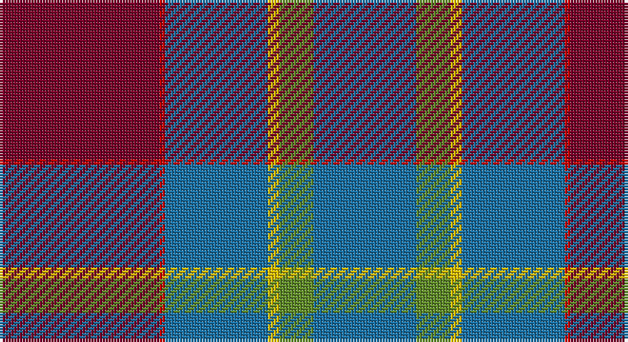

This page is one **sett** — a single exact thread-count. It belongs to the [tartan](/setts/ri28r1b18ly2g6b18/)
(the same proportion at any scale), whose colour order is pattern [BGYBRR](/stripes/bgybrr/).

Sourced from register-of-tartans.  It is a [6 stripe tartan](/stripes/stripes6/).

Original link https://www.tartanregister.gov.uk/tartanDetails.aspx?ref=11221

## Register references

External register numbers recorded for this tartan.

- Scottish Register of Tartans: [11221](https://www.tartanregister.gov.uk/tartanDetails.aspx?ref=11221)

## Thread count
DR/56 R2 B36 Y4 LG12 B/36

One full sett is **200 threads**.

## Palette

Palette: <strong>Tartan Register</strong> <small style="color:#888">(3 of 5 colours)</small>
<table><thead><tr><th>Colour</th><th>Threads</th><th>Shade</th><th>Base</th><th>OKLCh</th></tr></thead><tbody><tr><td>DR/</td><td style="text-align:right;font-variant-numeric:tabular-nums">56</td><td><code style="background-color:#780028;">#780028</code> <small style="color:#888">#780028</small></td><td>R <code style="background-color:#CC0000;">#CC0000</code></td><td><small style="color:#888">oklch(36.5% 0.146 12.8)</small></td></tr><tr><td>R</td><td style="text-align:right;font-variant-numeric:tabular-nums">2</td><td><code style="background-color:#C80000;">#C80000</code> <small style="color:#888">#C80000</small></td><td>R <code style="background-color:#CC0000;">#CC0000</code></td><td><small style="color:#888">oklch(52.3% 0.215 29.2)</small></td></tr><tr><td>B</td><td style="text-align:right;font-variant-numeric:tabular-nums">36</td><td><code style="background-color:#1870A4;">#1870A4</code> <small style="color:#888">#1870A4</small></td><td>B <code style="background-color:#2A418A;">#2A418A</code></td><td><small style="color:#888">oklch(52.2% 0.113 241.2)</small></td></tr><tr><td>Y</td><td style="text-align:right;font-variant-numeric:tabular-nums">4</td><td><code style="background-color:#E8C000;">#E8C000</code> <small style="color:#888">#E8C000</small></td><td>Y <code style="background-color:#F2BF00;">#F2BF00</code></td><td><small style="color:#888">oklch(81.9% 0.168 93.7)</small></td></tr><tr><td>LG</td><td style="text-align:right;font-variant-numeric:tabular-nums">12</td><td><code style="background-color:#608C28;">#608C28</code> <small style="color:#888">#608C28</small></td><td>G <code style="background-color:#006100;">#006100</code></td><td><small style="color:#888">oklch(58.7% 0.137 130.3)</small></td></tr><tr><td>B/</td><td style="text-align:right;font-variant-numeric:tabular-nums">36</td><td><code style="background-color:#1870A4;">#1870A4</code> <small style="color:#888">#1870A4</small></td><td>B <code style="background-color:#2A418A;">#2A418A</code></td><td><small style="color:#888">oklch(52.2% 0.113 241.2)</small></td></tr></tbody></table>

# Sample pattern

## Nearest tartans

The nearest existing variants by ΔTartan distance, with this tartan at the top so the swatches line up against it.

ΔTartan

Tartan

Sett

—

<a href="/ttd/edit/#slug=ri28r1b18ly2g6b18~x2">British Judo Association</a> <a class="nn-out" href="/variants/s6/ri28r1b18ly2g6b18~x2/" title="open its dictionary page">↗</a>

1.17

<a href="/ttd/edit/#slug=db12t6g30db9r8ly1~x2&amp;base=ri28r1b18ly2g6b18~x2">Wright , Anne (Personal)</a> <a class="nn-out" href="/variants/s6/db12t6g30db9r8ly1~x2/" title="open its dictionary page">↗</a>

1.18

<a href="/ttd/edit/#slug=db4r11g11db22ly1g4~x2&amp;base=ri28r1b18ly2g6b18~x2">Harvey</a> <a class="nn-out" href="/variants/s6/db4r11g11db22ly1g4~x2/" title="open its dictionary page">↗</a>

1.23

<a href="/ttd/edit/#slug=dp6ly1dp20db6g19dp2~x4&amp;base=ri28r1b18ly2g6b18~x2">Discover Islay (District)</a> <a class="nn-out" href="/variants/s6/dp6ly1dp20db6g19dp2~x4/" title="open its dictionary page">↗</a>

1.43

<a href="/ttd/edit/#slug=g2n1r29b29n1lo2~x2&amp;base=ri28r1b18ly2g6b18~x2">Reagan</a> <a class="nn-out" href="/variants/s6/g2n1r29b29n1lo2~x2/" title="open its dictionary page">↗</a>

1.44

<a href="/ttd/edit/#slug=do8o4w2o4do1o12dg9do24r4~x2&amp;base=ri28r1b18ly2g6b18~x2">Willsher Wedding (Personal)</a> <a class="nn-out" href="/variants/s9/do8o4w2o4do1o12dg9do24r4~x2/" title="open its dictionary page">↗</a>

1.46

<a href="/ttd/edit/#slug=ri28r1db18ly2g1db18~x2&amp;base=ri28r1b18ly2g6b18~x2">European Judo Union</a> <a class="nn-out" href="/variants/s6/ri28r1db18ly2g1db18~x2/" title="open its dictionary page">↗</a>

1.47

<a href="/ttd/edit/#slug=db3dg1r22k12db28lb3~x2&amp;base=ri28r1b18ly2g6b18~x2">Diaspora</a> <a class="nn-out" href="/variants/s6/db3dg1r22k12db28lb3~x2/" title="open its dictionary page">↗</a>

1.48

<a href="/ttd/edit/#slug=dp3r3dp34g18lo2g18lb2r3~x2&amp;base=ri28r1b18ly2g6b18~x2">Singh</a> <a class="nn-out" href="/variants/s8/dp3r3dp34g18lo2g18lb2r3~x2/" title="open its dictionary page">↗</a>

1.50

<a href="/ttd/edit/#slug=m4g9w2g24db37r3~x2&amp;base=ri28r1b18ly2g6b18~x2">Hardie Clan Tartan</a> <a class="nn-out" href="/variants/s6/m4g9w2g24db37r3~x2/" title="open its dictionary page">↗</a>

1.54

<a href="/ttd/edit/#slug=g14dp11t3k2t3dp11g14ly1~x2&amp;base=ri28r1b18ly2g6b18~x2">Wellington (Wilson 122)</a> <a class="nn-out" href="/variants/s8/g14dp11t3k2t3dp11g14ly1~x2/" title="open its dictionary page">↗</a>

## Neighbour map

Every grey dot is one of 14360 variants placed by the first two principal components of the ΔTartan feature space (44% of its variance). Red is this tartan; blue dots are its nearest — click one to open its page.

<svg viewBox="0 0 640 380" role="img" style="max-width:100%;height:auto;border:1px solid #e0e0e0;border-radius:4px;display:block" xmlns="http://www.w3.org/2000/svg"><image href="/nn/cloud.v1.png" width="640" height="380"/><a href="/variants/s6/db12t6g30db9r8ly1~x2/"><circle cx="288.7" cy="176.3" r="4" fill="#3465a4"><title>Wright , Anne (Personal)</title></circle></a><a href="/variants/s6/db4r11g11db22ly1g4~x2/"><circle cx="298.1" cy="194.8" r="4" fill="#3465a4"><title>Harvey</title></circle></a><a href="/variants/s6/dp6ly1dp20db6g19dp2~x4/"><circle cx="336.7" cy="196.1" r="4" fill="#3465a4"><title>Discover Islay (District)</title></circle></a><a href="/variants/s6/g2n1r29b29n1lo2~x2/"><circle cx="361.9" cy="152.2" r="4" fill="#3465a4"><title>Reagan</title></circle></a><a href="/variants/s9/do8o4w2o4do1o12dg9do24r4~x2/"><circle cx="285.3" cy="157.0" r="4" fill="#3465a4"><title>Willsher Wedding (Personal)</title></circle></a><a href="/variants/s6/ri28r1db18ly2g1db18~x2/"><circle cx="364.3" cy="160.9" r="4" fill="#3465a4"><title>European Judo Union</title></circle></a><a href="/variants/s6/db3dg1r22k12db28lb3~x2/"><circle cx="281.6" cy="166.3" r="4" fill="#3465a4"><title>Diaspora</title></circle></a><a href="/variants/s8/dp3r3dp34g18lo2g18lb2r3~x2/"><circle cx="287.8" cy="155.2" r="4" fill="#3465a4"><title>Singh</title></circle></a><a href="/variants/s6/m4g9w2g24db37r3~x2/"><circle cx="299.0" cy="181.1" r="4" fill="#3465a4"><title>Hardie Clan Tartan</title></circle></a><a href="/variants/s8/g14dp11t3k2t3dp11g14ly1~x2/"><circle cx="245.0" cy="190.1" r="4" fill="#3465a4"><title>Wellington (Wilson 122)</title></circle></a><circle cx="318.1" cy="172.9" r="5" fill="#c00000"/></svg>

ID: /variants/s6/ri28r1b18ly2g6b18~x2/
