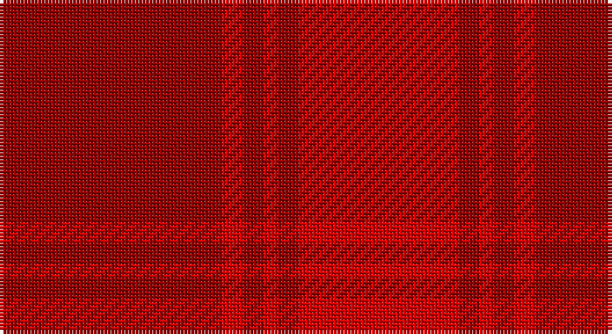

This page is one **sett** — a single exact thread-count. It belongs to the [tartan](/setts/ri32r3ri3r2ri3r23/)
(the same proportion at any scale), whose colour order is pattern [RRRRRR](/stripes/rrrrrr/).

Sourced from register-of-tartans.  It is a [6 stripe tartan](/stripes/stripes6/).

Original link https://www.tartanregister.gov.uk/tartanDetails.aspx?ref=5917

## Also known as

This cloth is also recorded under:

- Samye Sangha #2

3 attestations — the source records this cloth was collapsed from (oldest owns this page)

<ul>
<li>01/07/2006 — Samye Sangha #2 (register-of-tartans, <a href="https://www.tartanregister.gov.uk/tartanDetails.aspx?ref=5917">record</a>)</li>
<li>01/03/2007 — Samye Sangha (register-of-tartans, <a href="https://www.tartanregister.gov.uk/tartanDetails.aspx?ref=5347">record</a>)</li>
<li>March 2007 — Samye Sangha (Corporate) (tartans-authority, <a href="http://www.tartansauthority.com/tartan-ferret/display/7129/">record</a>)</li>
</ul>

## Register references

External register numbers recorded for this tartan.

- Scottish Register of Tartans: [5917](https://www.tartanregister.gov.uk/tartanDetails.aspx?ref=5917)
- Scottish Tartans Authority (ITI): 7129
- Scottish Tartans World Register: 3170

## Thread count
DR/64 R6 DR6 R4 DR6 R/46

One full sett is **154 threads**.

## Palette

Palette: <strong>Tartan Register</strong>
<table><thead><tr><th>Colour</th><th>Threads</th><th>Shade</th><th>Base</th><th>OKLCh</th></tr></thead><tbody><tr><td>DR/</td><td style="text-align:right;font-variant-numeric:tabular-nums">64</td><td><code style="background-color:#960000;">#960000</code> <small style="color:#888">#960000</small></td><td>R <code style="background-color:#CC0000;">#CC0000</code></td><td><small style="color:#888">oklch(42.3% 0.173 29.2)</small></td></tr><tr><td>R</td><td style="text-align:right;font-variant-numeric:tabular-nums">6</td><td><code style="background-color:#DC0000;">#DC0000</code> <small style="color:#888">#DC0000</small></td><td>R <code style="background-color:#CC0000;">#CC0000</code></td><td><small style="color:#888">oklch(56.2% 0.230 29.2)</small></td></tr><tr><td>DR</td><td style="text-align:right;font-variant-numeric:tabular-nums">6</td><td><code style="background-color:#960000;">#960000</code> <small style="color:#888">#960000</small></td><td>R <code style="background-color:#CC0000;">#CC0000</code></td><td><small style="color:#888">oklch(42.3% 0.173 29.2)</small></td></tr><tr><td>R</td><td style="text-align:right;font-variant-numeric:tabular-nums">4</td><td><code style="background-color:#DC0000;">#DC0000</code> <small style="color:#888">#DC0000</small></td><td>R <code style="background-color:#CC0000;">#CC0000</code></td><td><small style="color:#888">oklch(56.2% 0.230 29.2)</small></td></tr><tr><td>DR</td><td style="text-align:right;font-variant-numeric:tabular-nums">6</td><td><code style="background-color:#960000;">#960000</code> <small style="color:#888">#960000</small></td><td>R <code style="background-color:#CC0000;">#CC0000</code></td><td><small style="color:#888">oklch(42.3% 0.173 29.2)</small></td></tr><tr><td>R/</td><td style="text-align:right;font-variant-numeric:tabular-nums">46</td><td><code style="background-color:#DC0000;">#DC0000</code> <small style="color:#888">#DC0000</small></td><td>R <code style="background-color:#CC0000;">#CC0000</code></td><td><small style="color:#888">oklch(56.2% 0.230 29.2)</small></td></tr></tbody></table>

# Sample pattern

## Nearest tartans

The nearest existing variants by ΔTartan distance, with this tartan at the top so the swatches line up against it.

ΔTartan

Tartan

Sett

—

<a href="/ttd/edit/#slug=ri32r3ri3r2ri3r23~x2">Samye Sangha #2</a> <a class="nn-out" href="/variants/s6/ri32r3ri3r2ri3r23~x2/" title="open its dictionary page">↗</a>

2.33

<a href="/ttd/edit/#slug=r23o4r23o32r4~x2&amp;base=ri32r3ri3r2ri3r23~x2">Hamilton, Red (Fashion?)</a> <a class="nn-out" href="/variants/s5/r23o4r23o32r4~x2/" title="open its dictionary page">↗</a>

2.68

<a href="/ttd/edit/#slug=r5n35r46o5~x2&amp;base=ri32r3ri3r2ri3r23~x2">Bryce</a> <a class="nn-out" href="/variants/s4/r5n35r46o5~x2/" title="open its dictionary page">↗</a>

2.70

<a href="/ttd/edit/#slug=r24g2t1g1m24~x4&amp;base=ri32r3ri3r2ri3r23~x2">MacNab (Smith)</a> <a class="nn-out" href="/variants/s5/r24g2t1g1m24~x4/" title="open its dictionary page">↗</a>

2.71

<a href="/ttd/edit/#slug=r24g2t1g1ri24~x2&amp;base=ri32r3ri3r2ri3r23~x2">MacNab 4</a> <a class="nn-out" href="/variants/s5/r24g2t1g1ri24~x2/" title="open its dictionary page">↗</a>

2.71

<a href="/ttd/edit/#slug=r32lo4r32o23r4o23r4o23~x2&amp;base=ri32r3ri3r2ri3r23~x2">Hamilton, Red</a> <a class="nn-out" href="/variants/s8/r32lo4r32o23r4o23r4o23~x2/" title="open its dictionary page">↗</a>

2.95

<a href="/ttd/edit/#slug=g1dr10r10g1~x6&amp;base=ri32r3ri3r2ri3r23~x2">Stirling of Keir (Clan)</a> <a class="nn-out" href="/variants/s4/g1dr10r10g1~x6/" title="open its dictionary page">↗</a>

3.10

<a href="/ttd/edit/#slug=ri3r18rii6ri15r4ri3r4ri7w2~x2&amp;base=ri32r3ri3r2ri3r23~x2">Tune Hotels (Corporate)</a> <a class="nn-out" href="/variants/s9/ri3r18rii6ri15r4ri3r4ri7w2~x2/" title="open its dictionary page">↗</a>

3.19

<a href="/ttd/edit/#slug=r37dy9r3dg9dy3~x2&amp;base=ri32r3ri3r2ri3r23~x2">Glenshee #2</a> <a class="nn-out" href="/variants/s5/r37dy9r3dg9dy3~x2/" title="open its dictionary page">↗</a>

3.35

<a href="/ttd/edit/#slug=r2k1r12ri12t1m2~x4&amp;base=ri32r3ri3r2ri3r23~x2">Grelloch (Fashion)</a> <a class="nn-out" href="/variants/s6/r2k1r12ri12t1m2~x4/" title="open its dictionary page">↗</a>

3.41

<a href="/ttd/edit/#slug=r86g3ri3g6ri85~x2&amp;base=ri32r3ri3r2ri3r23~x2">MacNab 2</a> <a class="nn-out" href="/variants/s5/r86g3ri3g6ri85~x2/" title="open its dictionary page">↗</a>

## Neighbour map

Every grey dot is one of 14360 variants placed by the first two principal components of the ΔTartan feature space (44% of its variance). Red is this tartan; blue dots are its nearest — click one to open its page.

<svg viewBox="0 0 640 380" role="img" style="max-width:100%;height:auto;border:1px solid #e0e0e0;border-radius:4px;display:block" xmlns="http://www.w3.org/2000/svg"><image href="/nn/cloud.v1.png" width="640" height="380"/><a href="/variants/s5/r23o4r23o32r4~x2/"><circle cx="482.9" cy="328.9" r="4" fill="#3465a4"><title>Hamilton, Red (Fashion?)</title></circle></a><a href="/variants/s4/r5n35r46o5~x2/"><circle cx="529.2" cy="338.0" r="4" fill="#3465a4"><title>Bryce</title></circle></a><a href="/variants/s5/r24g2t1g1m24~x4/"><circle cx="474.0" cy="218.4" r="4" fill="#3465a4"><title>MacNab (Smith)</title></circle></a><a href="/variants/s5/r24g2t1g1ri24~x2/"><circle cx="472.0" cy="220.0" r="4" fill="#3465a4"><title>MacNab 4</title></circle></a><a href="/variants/s8/r32lo4r32o23r4o23r4o23~x2/"><circle cx="439.5" cy="297.6" r="4" fill="#3465a4"><title>Hamilton, Red</title></circle></a><a href="/variants/s4/g1dr10r10g1~x6/"><circle cx="453.0" cy="314.9" r="4" fill="#3465a4"><title>Stirling of Keir (Clan)</title></circle></a><a href="/variants/s9/ri3r18rii6ri15r4ri3r4ri7w2~x2/"><circle cx="389.8" cy="248.7" r="4" fill="#3465a4"><title>Tune Hotels (Corporate)</title></circle></a><a href="/variants/s5/r37dy9r3dg9dy3~x2/"><circle cx="525.2" cy="261.8" r="4" fill="#3465a4"><title>Glenshee #2</title></circle></a><a href="/variants/s6/r2k1r12ri12t1m2~x4/"><circle cx="409.2" cy="226.9" r="4" fill="#3465a4"><title>Grelloch (Fashion)</title></circle></a><a href="/variants/s5/r86g3ri3g6ri85~x2/"><circle cx="593.3" cy="272.0" r="4" fill="#3465a4"><title>MacNab 2</title></circle></a><circle cx="600.6" cy="274.6" r="5" fill="#c00000"/></svg>

ID: /variants/s6/ri32r3ri3r2ri3r23~x2/
