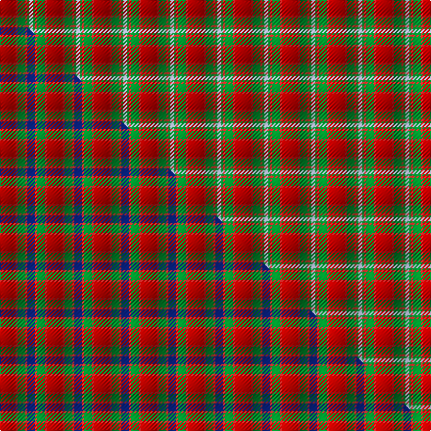

This is one **variant** — a specific cloth: this exact thread count and colourway, with its own
provenance below. It is one weaving of the [sett](/tartans/m/mo/moray-of-abercairney-3/) (the scale-free proportion — the
same cloth at any scale or shade), whose colour order is pattern [RRGRGW](/stripes/rrgrgw/).

Part of the [Moray of Abercairney](/tartans/m/mo/moray-of-abercairney-3/) tartan — the named design grouping this sett with its other cloths.

Sourced from register-of-tartans.  It is a [6 stripe tartan](/stripes/stripes6/).

Original link [https://www.tartanregister.gov.uk/tartanDetails.aspx?ref=3008](https://www.tartanregister.gov.uk/tartanDetails.aspx?ref=3008)

Dataset <small>— provenance for this record, inherited from the source manifest</small>

<dl class="dataset-prov">
<dt>source</dt><dd><a href="/sources/register-of-tartans/">Scottish Register of Tartans</a></dd>
<dt>data captured from</dt><dd><a href="https://github.com/thetartan/tartan-database/blob/master/data/register-of-tartans/data.csv">https://github.com/thetartan/tartan-database/blob/master/data/register-of-tartans/data.csv</a></dd>
<dt>data date</dt><dd>2017-01-06 <small>(dataset default)</small></dd>
<dt>licence</dt><dd><a href="https://www.tartanregister.gov.uk/copyright">Crown copyright</a></dd>
</dl>

Capture chain <small>— the hands this data passed through, oldest first; each capture carries its own licence</small>

<ol class="capture-chain">
<li><a href="https://www.tartanregister.gov.uk/">Scottish Register of Tartans</a> · <a href="https://www.tartanregister.gov.uk/copyright">Crown copyright</a> <small>the living register — still published by National Records of Scotland</small></li>
<li><a href="https://github.com/thetartan/tartan-database">thetartan/tartan-database</a> <small>2016-2017</small> · <a href="https://creativecommons.org/licenses/by-nc-nd/4.0/">CC BY-NC-ND 4.0</a> <small>Levko Kravets's frozen compilation — the capture we vendored, and where its CC licence text came from</small></li>
<li>this dictionary <small>captured 2026-06-10 · commit 5bf86c7566</small> <small>each re-capture is a git commit to data/sources</small></li>
</ol>

## Register references

External register numbers recorded for this tartan.

- Scottish Register of Tartans: [3008](https://www.tartanregister.gov.uk/tartanDetails.aspx?ref=3008)
- Scottish Tartans World Register: 184

## Thread count
Ri/16 R2 G8 R2 G2 LB/4

One full sett is **48 threads**.

## Palette
<table><thead><tr><th>Colour</th><th>Shade</th><th>OKLCh</th></tr></thead><tbody><tr><td>LB</td><td><code style="background-color:#B5BBDE;">#B5BBDE</code> <small style="color:#888">#B5BBDE</small></td><td><small style="color:#888">oklch(79.9% 0.050 277.6)</small></td></tr><tr><td>G</td><td><code style="background-color:#008B2A;">#008B2A</code> <small style="color:#888">#008B2A</small></td><td><small style="color:#888">oklch(55.4% 0.170 145.9)</small></td></tr><tr><td>R</td><td><code style="background-color:#C82828;">#C82828</code> <small style="color:#888">#C82828</small></td><td><small style="color:#888">oklch(54.2% 0.196 26.8)</small></td></tr><tr><td>R</td><td><code style="background-color:#DC0000;">#DC0000</code> <small style="color:#888">#DC0000</small></td><td><small style="color:#888">oklch(56.2% 0.230 29.2)</small></td></tr></tbody></table>

# Sample pattern

## Compared to the master

This cloth is one sett of its design; the master sett (the exemplar the design is anchored on) is below for comparison.

Its **ΔTartan distance** from the master is **1.27** — the same measure the nearest-tartans table ranks by (0 is identical; a re-scale of the same cloth is near 0, a recolour or a different proportion further).

<figure class="master-compare" style="margin:0">

this sett
master sett ★

<figcaption style="color:#888;font-size:smaller">One weave of this sett against the <a href="/setts/ri8r1g4r1db4/">master sett ★</a>, split on the diagonal: a shared proportion runs seamlessly across it with only the shades shifting; a different proportion breaks on it.</figcaption>
</figure>

## Nearest tartan variants

The nearest existing variants by ΔTartan distance, with this cloth at the top so the swatches line up against it.

ΔTartan

Threads

Variant

Sett

—

48

<a href="/variants/s6/ri8r1g4r1g1lb2~x2~ri5623030-r5419027/">Moray of Abercairney</a>

<a href="/ttd/edit/#slug=ri8r1g4r1db4~x2~ri5623030-r5419027&amp;base=ri8r1g4r1g1lb2~x2~ri5623030-r5419027" title="compare in the TTD">1.27</a>

48

<a href="/variants/s5/ri8r1g4r1db4~x2~ri5623030-r5419027/">Moray of Abercairney #2</a>

<a href="/ttd/edit/#slug=r1ri7r4g7r1g1~x4~r4116015-ri5021030&amp;base=ri8r1g4r1g1lb2~x2~ri5623030-r5419027" title="compare in the TTD">1.68</a>

160

<a href="/variants/s6/r1ri7r4g7r1g1~x4~r4116015-ri5021030/">MacNab, Variant</a>

<a href="/ttd/edit/#slug=dg1r1dg7r4ri7r1~x4~dg4514144-r4518006-ri5221030&amp;base=ri8r1g4r1g1lb2~x2~ri5623030-r5419027" title="compare in the TTD">1.68</a>

160

<a href="/variants/s6/dg1r1dg7r4ri7r1~x4~dg4514144-r4518006-ri5221030/">MacNab #2</a>

<a href="/ttd/edit/#slug=g6ri2r2g4r2ri12k1~x2~ri5021030-r4116015&amp;base=ri8r1g4r1g1lb2~x2~ri5623030-r5419027" title="compare in the TTD">1.81</a>

102

<a href="/variants/s7/g6ri2r2g4r2ri12k1~x2~ri5021030-r4116015/">MacNab 5</a>

<a href="/ttd/edit/#slug=g6ri2r2g4r2ri12k1~x2~ri5623030-r4217018&amp;base=ri8r1g4r1g1lb2~x2~ri5623030-r5419027" title="compare in the TTD">1.81</a>

102

<a href="/variants/s7/g6ri2r2g4r2ri12k1~x2~ri5623030-r4217018/">MacNab #3</a>

<a href="/ttd/edit/#slug=g6r2dr2g4dr2r12k1~x2~r4619030-dr3010027&amp;base=ri8r1g4r1g1lb2~x2~ri5623030-r5419027" title="compare in the TTD">1.81</a>

102

<a href="/variants/s7/g6r2dr2g4dr2r12k1~x2~r4619030-dr3010027/">MacNab VS</a>

<a href="/ttd/edit/#slug=g28r7dr7g14dr7r48k4~x2&amp;base=ri8r1g4r1g1lb2~x2~ri5623030-r5419027" title="compare in the TTD">1.86</a>

396

<a href="/variants/s7/g28r7dr7g14dr7r48k4~x2/">MacNab (Crimson)</a>

<a href="/ttd/edit/#slug=r32lb5g17r4g5w2~x2&amp;base=ri8r1g4r1g1lb2~x2~ri5623030-r5419027" title="compare in the TTD">2.30</a>

192

<a href="/variants/s6/r32lb5g17r4g5w2~x2/">Wilson's, No 5</a>

<a href="/ttd/edit/#slug=r2dr1r10dr2g10lr1g2~x4&amp;base=ri8r1g4r1g1lb2~x2~ri5623030-r5419027" title="compare in the TTD">2.30</a>

208

<a href="/variants/s7/r2dr1r10dr2g10lr1g2~x4/">Lennox</a>

<a href="/ttd/edit/#slug=ri2r1ri10r2g10w1g2~x2~ri5021030-r3715030&amp;base=ri8r1g4r1g1lb2~x2~ri5623030-r5419027" title="compare in the TTD">2.30</a>

104

<a href="/variants/s7/ri2r1ri10r2g10w1g2~x2~ri5021030-r3715030/">Lennox</a>

## Neighbour map

Every grey dot is one of 13662 variants placed by the first two principal components of the ΔTartan feature space (42% of its variance). Red is this tartan; blue dots are its nearest — click one to open its page. The map is a flat projection of a many-dimensional space — [how to read it](/posts/neighbourhood-maps/).

<svg viewBox="0 0 640 380" role="img" style="max-width:100%;height:auto;border:1px solid #e0e0e0;border-radius:4px;display:block" xmlns="http://www.w3.org/2000/svg"><image href="/nn/cloud.v1.png" width="640" height="380"/><a href="/variants/s5/ri8r1g4r1db4~x2~ri5623030-r5419027/"><circle cx="236.7" cy="235.3" r="4" fill="#3465a4"><title>Moray of Abercairney #2</title></circle></a><a href="/variants/s6/r1ri7r4g7r1g1~x4~r4116015-ri5021030/"><circle cx="281.1" cy="259.8" r="4" fill="#3465a4"><title>MacNab, Variant</title></circle></a><a href="/variants/s6/dg1r1dg7r4ri7r1~x4~dg4514144-r4518006-ri5221030/"><circle cx="297.5" cy="263.3" r="4" fill="#3465a4"><title>MacNab #2</title></circle></a><a href="/variants/s7/g6ri2r2g4r2ri12k1~x2~ri5021030-r4116015/"><circle cx="281.5" cy="186.9" r="4" fill="#3465a4"><title>MacNab 5</title></circle></a><a href="/variants/s7/g6ri2r2g4r2ri12k1~x2~ri5623030-r4217018/"><circle cx="272.2" cy="182.6" r="4" fill="#3465a4"><title>MacNab #3</title></circle></a><a href="/variants/s7/g6r2dr2g4dr2r12k1~x2~r4619030-dr3010027/"><circle cx="280.3" cy="188.4" r="4" fill="#3465a4"><title>MacNab VS</title></circle></a><a href="/variants/s7/g28r7dr7g14dr7r48k4~x2/"><circle cx="265.9" cy="177.2" r="4" fill="#3465a4"><title>MacNab (Crimson)</title></circle></a><a href="/variants/s6/r32lb5g17r4g5w2~x2/"><circle cx="355.8" cy="183.9" r="4" fill="#3465a4"><title>Wilson's, No 5</title></circle></a><a href="/variants/s7/r2dr1r10dr2g10lr1g2~x4/"><circle cx="285.4" cy="203.9" r="4" fill="#3465a4"><title>Lennox</title></circle></a><a href="/variants/s7/ri2r1ri10r2g10w1g2~x2~ri5021030-r3715030/"><circle cx="283.2" cy="202.7" r="4" fill="#3465a4"><title>Lennox</title></circle></a><circle cx="289.4" cy="221.5" r="5" fill="#c00000"/><text x="320" y="376" text-anchor="middle" font-size="11" fill="#999">ground</text><text x="11" y="190" text-anchor="middle" font-size="11" fill="#999" transform="rotate(-90 11 190)">complexity</text></svg>

ID: /variants/s6/ri8r1g4r1g1lb2~x2~ri5623030-r5419027/
