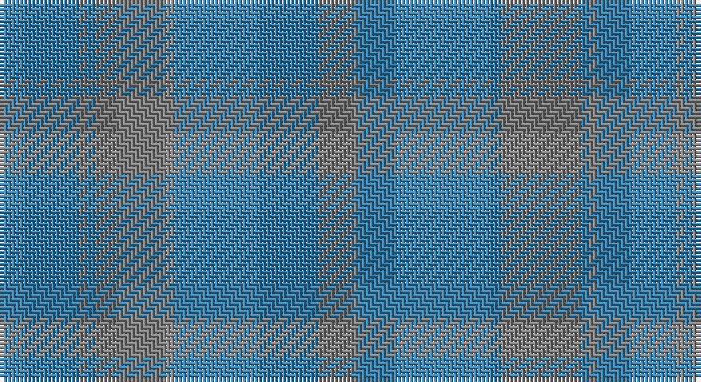

This page is one **sett** — a single exact thread-count. It belongs to the [tartan](/setts/t10y1t1y10t18y5/)
(the same proportion at any scale), whose colour order is pattern [BGBGBG](/stripes/bgbgbg/).

Sourced from register-of-tartans.  It is a [6 stripe tartan](/stripes/stripes6/).

Original link https://www.tartanregister.gov.uk/tartanDetails.aspx?ref=1615

## Also known as

This cloth is also recorded under:

- Harmony, No 13

2 attestations — the source records this cloth was collapsed from (oldest owns this page)

<ul>
<li>undated — Harmony 13 (register-of-tartans, <a href="https://www.tartanregister.gov.uk/tartanDetails.aspx?ref=1615">record</a>)</li>
<li>undated — Harmony, No 13 (weddslist, <a href="http://www.weddslist.com/cgi-bin/tartans/pg.pl?source=sts">record</a>)</li>
</ul>

## Register references

External register numbers recorded for this tartan.

- Scottish Register of Tartans: [1615](https://www.tartanregister.gov.uk/tartanDetails.aspx?ref=1615)
- Scottish Tartans World Register: 380

## Thread count
B/20 N2 B2 N20 B36 N/10

One full sett is **150 threads**.

## Palette

Palette: <strong>Tartan Register</strong>
<table><thead><tr><th>Colour</th><th>Threads</th><th>Shade</th><th>Base</th><th>OKLCh</th></tr></thead><tbody><tr><td>B/</td><td style="text-align:right;font-variant-numeric:tabular-nums">20</td><td><code style="background-color:#3C82AF;">#3C82AF</code> <small style="color:#888">#3C82AF</small></td><td>B <code style="background-color:#2A418A;">#2A418A</code></td><td><small style="color:#888">oklch(58.1% 0.099 239.8)</small></td></tr><tr><td>N</td><td style="text-align:right;font-variant-numeric:tabular-nums">2</td><td><code style="background-color:#808080;">#808080</code> <small style="color:#888">#808080</small></td><td>G <code style="background-color:#006100;">#006100</code></td><td><small style="color:#888">oklch(60.0% 0.000 89.9)</small></td></tr><tr><td>B</td><td style="text-align:right;font-variant-numeric:tabular-nums">2</td><td><code style="background-color:#3C82AF;">#3C82AF</code> <small style="color:#888">#3C82AF</small></td><td>B <code style="background-color:#2A418A;">#2A418A</code></td><td><small style="color:#888">oklch(58.1% 0.099 239.8)</small></td></tr><tr><td>N</td><td style="text-align:right;font-variant-numeric:tabular-nums">20</td><td><code style="background-color:#808080;">#808080</code> <small style="color:#888">#808080</small></td><td>G <code style="background-color:#006100;">#006100</code></td><td><small style="color:#888">oklch(60.0% 0.000 89.9)</small></td></tr><tr><td>B</td><td style="text-align:right;font-variant-numeric:tabular-nums">36</td><td><code style="background-color:#3C82AF;">#3C82AF</code> <small style="color:#888">#3C82AF</small></td><td>B <code style="background-color:#2A418A;">#2A418A</code></td><td><small style="color:#888">oklch(58.1% 0.099 239.8)</small></td></tr><tr><td>N/</td><td style="text-align:right;font-variant-numeric:tabular-nums">10</td><td><code style="background-color:#808080;">#808080</code> <small style="color:#888">#808080</small></td><td>G <code style="background-color:#006100;">#006100</code></td><td><small style="color:#888">oklch(60.0% 0.000 89.9)</small></td></tr></tbody></table>

# Sample pattern

## Nearest tartans

The nearest existing variants by ΔTartan distance, with this tartan at the top so the swatches line up against it.

ΔTartan

Tartan

Sett

—

<a href="/ttd/edit/#slug=t10y1t1y10t18y5~x2">Harmony 13</a> <a class="nn-out" href="/variants/s6/t10y1t1y10t18y5~x2/" title="open its dictionary page">↗</a>

2.32

<a href="/ttd/edit/#slug=o6y2o29y29o2y6~x2&amp;base=t10y1t1y10t18y5~x2">Harmony, 12</a> <a class="nn-out" href="/variants/s6/o6y2o29y29o2y6~x2/" title="open its dictionary page">↗</a>

2.38

<a href="/ttd/edit/#slug=t48o28w4o28t48ly3~x2&amp;base=t10y1t1y10t18y5~x2">McKerrell of Hillhouse Dress</a> <a class="nn-out" href="/variants/s6/t48o28w4o28t48ly3~x2/" title="open its dictionary page">↗</a>

2.92

<a href="/ttd/edit/#slug=lo5n2y8n1y8n4y4n6y18lr1lo5~x2&amp;base=t10y1t1y10t18y5~x2">Bute Heather, Ancient Wth'd (Fashion</a> <a class="nn-out" href="/variants/s11/lo5n2y8n1y8n4y4n6y18lr1lo5~x2/" title="open its dictionary page">↗</a>

3.02

<a href="/ttd/edit/#slug=dy2n4y12n3dy6t2n24dy2n2y2~x2&amp;base=t10y1t1y10t18y5~x2">Wicklow Irish County Tartan</a> <a class="nn-out" href="/variants/s10/dy2n4y12n3dy6t2n24dy2n2y2~x2/" title="open its dictionary page">↗</a>

3.24

<a href="/ttd/edit/#slug=dy6dg2dy29dg29dy2dg6~x2&amp;base=t10y1t1y10t18y5~x2">Harmony 11 #2</a> <a class="nn-out" href="/variants/s6/dy6dg2dy29dg29dy2dg6~x2/" title="open its dictionary page">↗</a>

3.40

<a href="/ttd/edit/#slug=n2y3n3y3n10y2n18y1~x4&amp;base=t10y1t1y10t18y5~x2">Hebridean Cairn Fashion Tartan</a> <a class="nn-out" href="/variants/s8/n2y3n3y3n10y2n18y1~x4/" title="open its dictionary page">↗</a>

3.46

<a href="/ttd/edit/#slug=oi12o6oi2ly1~x4&amp;base=t10y1t1y10t18y5~x2">Loch Garth</a> <a class="nn-out" href="/variants/s4/oi12o6oi2ly1~x4/" title="open its dictionary page">↗</a>

3.66

<a href="/ttd/edit/#slug=y34n27r3n27y34w3~x2&amp;base=t10y1t1y10t18y5~x2">London Regiment (Military)</a> <a class="nn-out" href="/variants/s6/y34n27r3n27y34w3~x2/" title="open its dictionary page">↗</a>

3.96

<a href="/ttd/edit/#slug=y14n7lo6n2~x8&amp;base=t10y1t1y10t18y5~x2">Outlander #3</a> <a class="nn-out" href="/variants/s4/y14n7lo6n2~x8/" title="open its dictionary page">↗</a>

3.96

<a href="/ttd/edit/#slug=do11n1do4n8r1~x8&amp;base=t10y1t1y10t18y5~x2">Cairns, David (Personal)</a> <a class="nn-out" href="/variants/s5/do11n1do4n8r1~x8/" title="open its dictionary page">↗</a>

## Neighbour map

Every grey dot is one of 14360 variants placed by the first two principal components of the ΔTartan feature space (44% of its variance). Red is this tartan; blue dots are its nearest — click one to open its page.

<svg viewBox="0 0 640 380" role="img" style="max-width:100%;height:auto;border:1px solid #e0e0e0;border-radius:4px;display:block" xmlns="http://www.w3.org/2000/svg"><image href="/nn/cloud.v1.png" width="640" height="380"/><a href="/variants/s6/o6y2o29y29o2y6~x2/"><circle cx="626.0" cy="359.7" r="4" fill="#3465a4"><title>Harmony, 12</title></circle></a><a href="/variants/s6/t48o28w4o28t48ly3~x2/"><circle cx="550.9" cy="328.9" r="4" fill="#3465a4"><title>McKerrell of Hillhouse Dress</title></circle></a><a href="/variants/s11/lo5n2y8n1y8n4y4n6y18lr1lo5~x2/"><circle cx="560.0" cy="292.2" r="4" fill="#3465a4"><title>Bute Heather, Ancient Wth'd (Fashion</title></circle></a><a href="/variants/s10/dy2n4y12n3dy6t2n24dy2n2y2~x2/"><circle cx="552.4" cy="298.8" r="4" fill="#3465a4"><title>Wicklow Irish County Tartan</title></circle></a><a href="/variants/s6/dy6dg2dy29dg29dy2dg6~x2/"><circle cx="622.7" cy="366.0" r="4" fill="#3465a4"><title>Harmony 11 #2</title></circle></a><a href="/variants/s8/n2y3n3y3n10y2n18y1~x4/"><circle cx="626.0" cy="322.2" r="4" fill="#3465a4"><title>Hebridean Cairn Fashion Tartan</title></circle></a><a href="/variants/s4/oi12o6oi2ly1~x4/"><circle cx="620.0" cy="354.7" r="4" fill="#3465a4"><title>Loch Garth</title></circle></a><a href="/variants/s6/y34n27r3n27y34w3~x2/"><circle cx="468.5" cy="328.4" r="4" fill="#3465a4"><title>London Regiment (Military)</title></circle></a><a href="/variants/s4/y14n7lo6n2~x8/"><circle cx="437.4" cy="366.0" r="4" fill="#3465a4"><title>Outlander #3</title></circle></a><a href="/variants/s5/do11n1do4n8r1~x8/"><circle cx="545.4" cy="340.3" r="4" fill="#3465a4"><title>Cairns, David (Personal)</title></circle></a><circle cx="626.0" cy="366.0" r="5" fill="#c00000"/></svg>

ID: /variants/s6/t10y1t1y10t18y5~x2/
