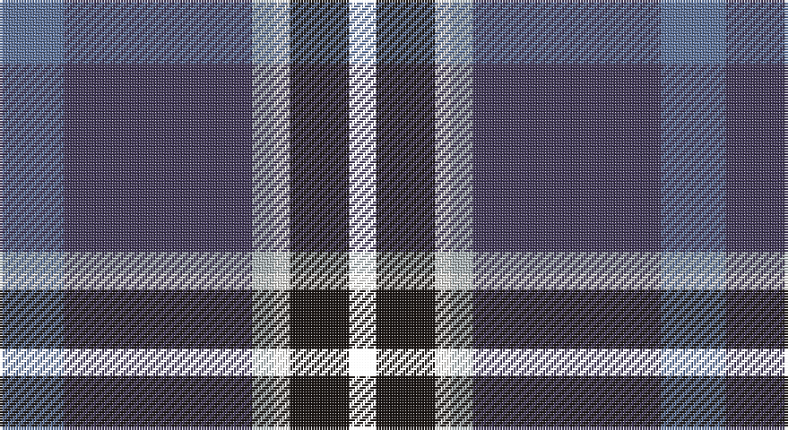

This page is one **sett** — a single exact thread-count. It belongs to the [tartan](/setts/t12dp35lr4w3ki11k5/)
(the same proportion at any scale), whose colour order is pattern [BBYWKK](/stripes/bbywkk/).

Part of the [Ferster, James Carney](/tartans/ferster-james-carney/) tartan — the named design grouping this sett with its other cloths.

Sourced from register-of-tartans.  It is a [6 stripe tartan](/stripes/stripes6/).

Original link https://www.tartanregister.gov.uk/tartanDetails.aspx?ref=10595

## Register references

External register numbers recorded for this tartan.

- Scottish Register of Tartans: [10595](https://www.tartanregister.gov.uk/tartanDetails.aspx?ref=10595)

## Thread count
B/24 N70 Na8 W6 K22 P/10

One full sett is **246 threads**.

## Palette

Palette: <strong>Tartan Register</strong> <small style="color:#888">(2 of 5 colours)</small>
<table><thead><tr><th>Colour</th><th>Threads</th><th>Shade</th><th>Base</th><th>OKLCh</th></tr></thead><tbody><tr><td>B/</td><td style="text-align:right;font-variant-numeric:tabular-nums">24</td><td><code style="background-color:#5F749C;">#5F749C</code> <small style="color:#888">#5F749C</small></td><td>B <code style="background-color:#2A418A;">#2A418A</code></td><td><small style="color:#888">oklch(55.8% 0.067 262.9)</small></td></tr><tr><td>N</td><td style="text-align:right;font-variant-numeric:tabular-nums">70</td><td><code style="background-color:#433A5A;">#433A5A</code> <small style="color:#888">#433A5A</small></td><td>B <code style="background-color:#2A418A;">#2A418A</code></td><td><small style="color:#888">oklch(37.2% 0.055 296.6)</small></td></tr><tr><td>Na</td><td style="text-align:right;font-variant-numeric:tabular-nums">8</td><td><code style="background-color:#AFB8BB;">#AFB8BB</code> <small style="color:#888">#AFB8BB</small></td><td>Y <code style="background-color:#F2BF00;">#F2BF00</code></td><td><small style="color:#888">oklch(77.6% 0.011 219.6)</small></td></tr><tr><td>W</td><td style="text-align:right;font-variant-numeric:tabular-nums">6</td><td><code style="background-color:#F9F5EF;">#F9F5EF</code> <small style="color:#888">#F9F5EF</small></td><td>W <code style="background-color:#F7F7F7;">#F7F7F7</code></td><td><small style="color:#888">oklch(97.2% 0.009 78.3)</small></td></tr><tr><td>K</td><td style="text-align:right;font-variant-numeric:tabular-nums">22</td><td><code style="background-color:#1C1714;">#1C1714</code> <small style="color:#888">#1C1714</small></td><td>K <code style="background-color:#000000;">#000000</code></td><td><small style="color:#888">oklch(20.9% 0.010 52.9)</small></td></tr><tr><td>/</td><td style="text-align:right;font-variant-numeric:tabular-nums">10</td><td><code style="background-color:;"></code> <small style="color:#888"></small></td><td> <code style="background-color:;"></code></td><td><small style="color:#888"></small></td></tr></tbody></table>

# Sample pattern

## Nearest tartans

The nearest existing variants by ΔTartan distance, with this tartan at the top so the swatches line up against it.

ΔTartan

Tartan

Sett

—

<a href="/ttd/edit/#slug=t12dp35lr4w3ki11k5~x2">Ferster, James Carney</a> <a class="nn-out" href="/variants/s6/t12dp35lr4w3ki11k5~x2/" title="open its dictionary page">↗</a>

0.77

<a href="/ttd/edit/#slug=dg10w2dt10lo5db35r6~x2&amp;base=t12dp35lr4w3ki11k5~x2">Hatfield &amp; Mize (Personal)</a> <a class="nn-out" href="/variants/s6/dg10w2dt10lo5db35r6~x2/" title="open its dictionary page">↗</a>

0.83

<a href="/ttd/edit/#slug=r3db38k13w3o20ly2~x2&amp;base=t12dp35lr4w3ki11k5~x2">LLoyd of Astargus Canadian Family Tartan</a> <a class="nn-out" href="/variants/s6/r3db38k13w3o20ly2~x2/" title="open its dictionary page">↗</a>

0.83

<a href="/ttd/edit/#slug=b12dt35lb4w3k11r5~x2&amp;base=t12dp35lr4w3ki11k5~x2">Ferster, James Carney (Personal)</a> <a class="nn-out" href="/variants/s6/b12dt35lb4w3k11r5~x2/" title="open its dictionary page">↗</a>

0.91

<a href="/ttd/edit/#slug=w1dp3g6k1db12ly1db2ly1~x4&amp;base=t12dp35lr4w3ki11k5~x2">Lambert, Patrice (Personal)</a> <a class="nn-out" href="/variants/s8/w1dp3g6k1db12ly1db2ly1~x4/" title="open its dictionary page">↗</a>

0.93

<a href="/ttd/edit/#slug=k4n4dt32r4t17w2~x2&amp;base=t12dp35lr4w3ki11k5~x2">Shearer (2016)</a> <a class="nn-out" href="/variants/s6/k4n4dt32r4t17w2~x2/" title="open its dictionary page">↗</a>

0.97

<a href="/ttd/edit/#slug=ly4g22r3k17r3db37w3~x2&amp;base=t12dp35lr4w3ki11k5~x2">Souza Nery (Personal)</a> <a class="nn-out" href="/variants/s7/ly4g22r3k17r3db37w3~x2/" title="open its dictionary page">↗</a>

0.99

<a href="/ttd/edit/#slug=dg10w2k10ly10db35r6~x2&amp;base=t12dp35lr4w3ki11k5~x2">Hatfield &amp; Mize (Personal)</a> <a class="nn-out" href="/variants/s6/dg10w2k10ly10db35r6~x2/" title="open its dictionary page">↗</a>

1.04

<a href="/ttd/edit/#slug=db3dg10db5ly1db10k1r4w1~x4&amp;base=t12dp35lr4w3ki11k5~x2">Côté-Haché (Personal)</a> <a class="nn-out" href="/variants/s8/db3dg10db5ly1db10k1r4w1~x4/" title="open its dictionary page">↗</a>

1.06

<a href="/ttd/edit/#slug=b11db5g4w3r3k16db28b2~x2&amp;base=t12dp35lr4w3ki11k5~x2">Scottish Italian</a> <a class="nn-out" href="/variants/s8/b11db5g4w3r3k16db28b2~x2/" title="open its dictionary page">↗</a>

1.15

<a href="/ttd/edit/#slug=lo4k28r2db22b8dy3~x2&amp;base=t12dp35lr4w3ki11k5~x2">Loch Long One Design (Corporate)</a> <a class="nn-out" href="/variants/s6/lo4k28r2db22b8dy3~x2/" title="open its dictionary page">↗</a>

## Neighbour map

Every grey dot is one of 14360 variants placed by the first two principal components of the ΔTartan feature space (44% of its variance). Red is this tartan; blue dots are its nearest — click one to open its page.

<svg viewBox="0 0 640 380" role="img" style="max-width:100%;height:auto;border:1px solid #e0e0e0;border-radius:4px;display:block" xmlns="http://www.w3.org/2000/svg"><image href="/nn/cloud.v1.png" width="640" height="380"/><a href="/variants/s6/dg10w2dt10lo5db35r6~x2/"><circle cx="254.0" cy="157.2" r="4" fill="#3465a4"><title>Hatfield &amp; Mize (Personal)</title></circle></a><a href="/variants/s6/r3db38k13w3o20ly2~x2/"><circle cx="236.4" cy="146.3" r="4" fill="#3465a4"><title>LLoyd of Astargus Canadian Family Tartan</title></circle></a><a href="/variants/s6/b12dt35lb4w3k11r5~x2/"><circle cx="220.1" cy="173.4" r="4" fill="#3465a4"><title>Ferster, James Carney (Personal)</title></circle></a><a href="/variants/s8/w1dp3g6k1db12ly1db2ly1~x4/"><circle cx="235.0" cy="145.6" r="4" fill="#3465a4"><title>Lambert, Patrice (Personal)</title></circle></a><a href="/variants/s6/k4n4dt32r4t17w2~x2/"><circle cx="249.0" cy="151.0" r="4" fill="#3465a4"><title>Shearer (2016)</title></circle></a><a href="/variants/s7/ly4g22r3k17r3db37w3~x2/"><circle cx="176.0" cy="156.3" r="4" fill="#3465a4"><title>Souza Nery (Personal)</title></circle></a><a href="/variants/s6/dg10w2k10ly10db35r6~x2/"><circle cx="201.6" cy="149.7" r="4" fill="#3465a4"><title>Hatfield &amp; Mize (Personal)</title></circle></a><a href="/variants/s8/db3dg10db5ly1db10k1r4w1~x4/"><circle cx="235.0" cy="183.6" r="4" fill="#3465a4"><title>Côté-Haché (Personal)</title></circle></a><a href="/variants/s8/b11db5g4w3r3k16db28b2~x2/"><circle cx="208.2" cy="156.9" r="4" fill="#3465a4"><title>Scottish Italian</title></circle></a><a href="/variants/s6/lo4k28r2db22b8dy3~x2/"><circle cx="216.3" cy="178.6" r="4" fill="#3465a4"><title>Loch Long One Design (Corporate)</title></circle></a><circle cx="222.4" cy="168.0" r="5" fill="#c00000"/></svg>

ID: /variants/s6/t12dp35lr4w3ki11k5~x2/
