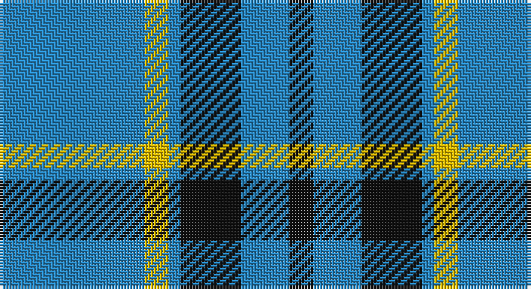

This page is one **sett** — a single exact thread-count. It belongs to the [tartan](/setts/t12ly2t1k5t4k2/)
(the same proportion at any scale), whose colour order is pattern [BYBKBK](/stripes/bybkbk/).

Sourced from register-of-tartans.  It is a [6 stripe tartan](/stripes/stripes6/).

Original link https://www.tartanregister.gov.uk/tartanDetails.aspx?ref=3470

2 attestations — the source records this cloth was collapsed from (oldest owns this page)

<ul>
<li>01/01/1973 — Rea (register-of-tartans, <a href="https://www.tartanregister.gov.uk/tartanDetails.aspx?ref=3470">record</a>)</li>
<li>1973 — Rea (Name) (tartans-authority, <a href="http://www.tartansauthority.com/tartan-ferret/display/6613/">record</a>)</li>
</ul>

## Register references

External register numbers recorded for this tartan.

- Scottish Register of Tartans: [3470](https://www.tartanregister.gov.uk/tartanDetails.aspx?ref=3470)
- Scottish Tartans Authority (ITI): 6613

## Thread count
B/48 Y8 B4 K20 B16 K/8

One full sett is **152 threads**.

## Palette

Palette: <strong>Tartan Register</strong>
<table><thead><tr><th>Colour</th><th>Threads</th><th>Shade</th><th>Base</th><th>OKLCh</th></tr></thead><tbody><tr><td>B/</td><td style="text-align:right;font-variant-numeric:tabular-nums">48</td><td><code style="background-color:#2888C4;">#2888C4</code> <small style="color:#888">#2888C4</small></td><td>B <code style="background-color:#2A418A;">#2A418A</code></td><td><small style="color:#888">oklch(60.1% 0.125 241.5)</small></td></tr><tr><td>Y</td><td style="text-align:right;font-variant-numeric:tabular-nums">8</td><td><code style="background-color:#E8C000;">#E8C000</code> <small style="color:#888">#E8C000</small></td><td>Y <code style="background-color:#F2BF00;">#F2BF00</code></td><td><small style="color:#888">oklch(81.9% 0.168 93.7)</small></td></tr><tr><td>B</td><td style="text-align:right;font-variant-numeric:tabular-nums">4</td><td><code style="background-color:#2888C4;">#2888C4</code> <small style="color:#888">#2888C4</small></td><td>B <code style="background-color:#2A418A;">#2A418A</code></td><td><small style="color:#888">oklch(60.1% 0.125 241.5)</small></td></tr><tr><td>K</td><td style="text-align:right;font-variant-numeric:tabular-nums">20</td><td><code style="background-color:#101010;">#101010</code> <small style="color:#888">#101010</small></td><td>K <code style="background-color:#000000;">#000000</code></td><td><small style="color:#888">oklch(17.3% 0.000 89.9)</small></td></tr><tr><td>B</td><td style="text-align:right;font-variant-numeric:tabular-nums">16</td><td><code style="background-color:#2888C4;">#2888C4</code> <small style="color:#888">#2888C4</small></td><td>B <code style="background-color:#2A418A;">#2A418A</code></td><td><small style="color:#888">oklch(60.1% 0.125 241.5)</small></td></tr><tr><td>K/</td><td style="text-align:right;font-variant-numeric:tabular-nums">8</td><td><code style="background-color:#101010;">#101010</code> <small style="color:#888">#101010</small></td><td>K <code style="background-color:#000000;">#000000</code></td><td><small style="color:#888">oklch(17.3% 0.000 89.9)</small></td></tr></tbody></table>

# Sample pattern

## Nearest tartans

The nearest existing variants by ΔTartan distance, with this tartan at the top so the swatches line up against it.

ΔTartan

Tartan

Sett

—

<a href="/ttd/edit/#slug=t12ly2t1k5t4k2~x4">Rea</a> <a class="nn-out" href="/variants/s6/t12ly2t1k5t4k2~x4/" title="open its dictionary page">↗</a>

1.12

<a href="/ttd/edit/#slug=lb1lg11k6lg3lb1lg1lb1~x4&amp;base=t12ly2t1k5t4k2~x4">Angle, Blue (Fashion)</a> <a class="nn-out" href="/variants/s7/lb1lg11k6lg3lb1lg1lb1~x4/" title="open its dictionary page">↗</a>

1.19

<a href="/ttd/edit/#slug=t37w9t3db9w3~x2&amp;base=t12ly2t1k5t4k2~x4">Loch Lomond</a> <a class="nn-out" href="/variants/s5/t37w9t3db9w3~x2/" title="open its dictionary page">↗</a>

1.34

<a href="/ttd/edit/#slug=dt5b5dt30w4dt4b18w3dt3~x2&amp;base=t12ly2t1k5t4k2~x4">Salem Scottish Dancers (Corporate)</a> <a class="nn-out" href="/variants/s8/dt5b5dt30w4dt4b18w3dt3~x2/" title="open its dictionary page">↗</a>

1.35

<a href="/ttd/edit/#slug=t50dr4t12dr23ly4dr4~x2&amp;base=t12ly2t1k5t4k2~x4">Sligo</a> <a class="nn-out" href="/variants/s6/t50dr4t12dr23ly4dr4~x2/" title="open its dictionary page">↗</a>

1.44

<a href="/ttd/edit/#slug=db24t13db4t4w2~x2&amp;base=t12ly2t1k5t4k2~x4">Gallaecia (Unofficial) (District)</a> <a class="nn-out" href="/variants/s5/db24t13db4t4w2~x2/" title="open its dictionary page">↗</a>

1.53

<a href="/ttd/edit/#slug=k30b40ly3b5w2b6~x2&amp;base=t12ly2t1k5t4k2~x4">Micron</a> <a class="nn-out" href="/variants/s6/k30b40ly3b5w2b6~x2/" title="open its dictionary page">↗</a>

1.58

<a href="/ttd/edit/#slug=t50k4t12k23lo4k4~x2&amp;base=t12ly2t1k5t4k2~x4">Sligo Irish County Tartan</a> <a class="nn-out" href="/variants/s6/t50k4t12k23lo4k4~x2/" title="open its dictionary page">↗</a>

1.59

<a href="/ttd/edit/#slug=dt30w7dt18w11dt6ly3~x2&amp;base=t12ly2t1k5t4k2~x4">Ochterlonie</a> <a class="nn-out" href="/variants/s6/dt30w7dt18w11dt6ly3~x2/" title="open its dictionary page">↗</a>

1.63

<a href="/ttd/edit/#slug=b11lo2r1lo2r1~x4&amp;base=t12ly2t1k5t4k2~x4">Carlisle Ancient</a> <a class="nn-out" href="/variants/s5/b11lo2r1lo2r1~x4/" title="open its dictionary page">↗</a>

1.69

<a href="/variants/s4/t8dg1r2~x20/">Gyle</a>

## Neighbour map

Every grey dot is one of 14360 variants placed by the first two principal components of the ΔTartan feature space (44% of its variance). Red is this tartan; blue dots are its nearest — click one to open its page.

<svg viewBox="0 0 640 380" role="img" style="max-width:100%;height:auto;border:1px solid #e0e0e0;border-radius:4px;display:block" xmlns="http://www.w3.org/2000/svg"><image href="/nn/cloud.v1.png" width="640" height="380"/><a href="/variants/s7/lb1lg11k6lg3lb1lg1lb1~x4/"><circle cx="337.9" cy="192.6" r="4" fill="#3465a4"><title>Angle, Blue (Fashion)</title></circle></a><a href="/variants/s5/t37w9t3db9w3~x2/"><circle cx="381.7" cy="206.8" r="4" fill="#3465a4"><title>Loch Lomond</title></circle></a><a href="/variants/s8/dt5b5dt30w4dt4b18w3dt3~x2/"><circle cx="328.6" cy="204.1" r="4" fill="#3465a4"><title>Salem Scottish Dancers (Corporate)</title></circle></a><a href="/variants/s6/t50dr4t12dr23ly4dr4~x2/"><circle cx="399.6" cy="207.5" r="4" fill="#3465a4"><title>Sligo</title></circle></a><a href="/variants/s5/db24t13db4t4w2~x2/"><circle cx="365.3" cy="235.6" r="4" fill="#3465a4"><title>Gallaecia (Unofficial) (District)</title></circle></a><a href="/variants/s6/k30b40ly3b5w2b6~x2/"><circle cx="354.9" cy="175.7" r="4" fill="#3465a4"><title>Micron</title></circle></a><a href="/variants/s6/t50k4t12k23lo4k4~x2/"><circle cx="369.2" cy="198.3" r="4" fill="#3465a4"><title>Sligo Irish County Tartan</title></circle></a><a href="/variants/s6/dt30w7dt18w11dt6ly3~x2/"><circle cx="383.1" cy="229.4" r="4" fill="#3465a4"><title>Ochterlonie</title></circle></a><a href="/variants/s5/b11lo2r1lo2r1~x4/"><circle cx="395.7" cy="210.1" r="4" fill="#3465a4"><title>Carlisle Ancient</title></circle></a><a href="/variants/s4/t8dg1r2~x20/"><circle cx="405.4" cy="256.0" r="4" fill="#3465a4"><title>Gyle</title></circle></a><circle cx="363.3" cy="219.2" r="5" fill="#c00000"/></svg>

ID: /variants/s6/t12ly2t1k5t4k2~x4/
