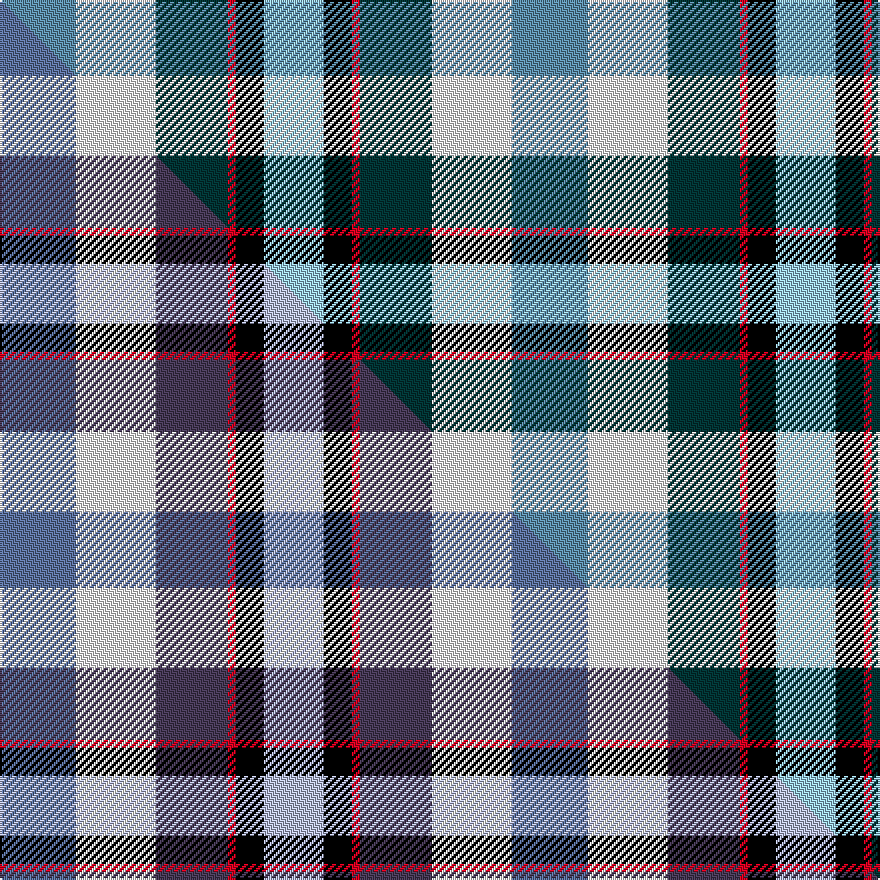

This is one **variant** — a specific cloth: this exact thread count and colourway, with its own
provenance below. It is one weaving of the [sett](/tartans/s/si/sirrell/) (the scale-free proportion — the
same cloth at any scale or shade), whose colour order is pattern [BWBRKW](/stripes/bwbrkw/).

Part of the [Sirrell](/tartans/s/si/sirrell/) tartan — the named design grouping this sett with its other cloths.

Sourced from tartans-authority.  It is a [6 stripe tartan](/stripes/stripes6/).

Original link <code>http://www.tartansauthority.com/tartan-ferret/display/11109/</code> — retired · [Internet Archive copy](https://web.archive.org/web/*/http://www.tartansauthority.com/tartan-ferret/display/11109/*)

Dataset <small>— provenance for this record, inherited from the source manifest</small>

<dl class="dataset-prov">
<dt>source</dt><dd><a href="/sources/tartans-authority/">Scottish Tartans Authority</a></dd>
<dt>data captured from</dt><dd><a href="https://github.com/thetartan/tartan-database/blob/master/data/tartans-authority/data.csv">https://github.com/thetartan/tartan-database/blob/master/data/tartans-authority/data.csv</a></dd>
<dt>data date</dt><dd>2014 <small>(this record)</small></dd>
<dt>licence</dt><dd><a href="https://creativecommons.org/licenses/by-nc-nd/4.0/">CC BY-NC-ND 4.0</a></dd>
</dl>

Capture chain <small>— the hands this data passed through, oldest first; each capture carries its own licence</small>

<ol class="capture-chain">
<li><a href="https://www.tartansauthority.com/">Scottish Tartans Authority</a> <small>the heritage body’s archive — its tartan-ferret record browser is retired; dead record links are shown unlinked, with an Internet Archive copy (ITI numbers are not SRT references)</small></li>
<li><a href="https://github.com/thetartan/tartan-database">thetartan/tartan-database</a> <small>2016-2017</small> · <a href="https://creativecommons.org/licenses/by-nc-nd/4.0/">CC BY-NC-ND 4.0</a> <small>Levko Kravets's frozen compilation — the capture we vendored, and where its CC licence text came from</small></li>
<li>this dictionary <small>captured 2026-06-10 · commit 5bf86c7566</small> <small>each re-capture is a git commit to data/sources</small></li>
</ol>

## Register references

External register numbers recorded for this tartan.

- Scottish Register of Tartans: [11109](https://www.tartanregister.gov.uk/tartanDetails?ref=11109)
- Scottish Tartans Authority (ITI): 11109

## Thread count
T/38 W40 DT36 R4 K14 LB/30

One full sett is **256 threads**.

## Palette
<table><thead><tr><th>Colour</th><th>Shade</th><th>OKLCh</th></tr></thead><tbody><tr><td>T</td><td><code style="background-color:#5C8CA8;">#5C8CA8</code> <small style="color:#888">#5C8CA8</small></td><td><small style="color:#888">oklch(61.7% 0.067 235.0)</small></td></tr><tr><td>DT</td><td><code style="background-color:#023535;">#023535</code> <small style="color:#888">#023535</small></td><td><small style="color:#888">oklch(29.8% 0.050 194.8)</small></td></tr><tr><td>K</td><td><code style="background-color:#000000;">#000000</code> <small style="color:#888">#000000</small></td><td><small style="color:#888">oklch(0.0% 0.000 0.0)</small></td></tr><tr><td>LB</td><td><code style="background-color:#98C8E8;">#98C8E8</code> <small style="color:#888">#98C8E8</small></td><td><small style="color:#888">oklch(81.0% 0.068 237.9)</small></td></tr><tr><td>R</td><td><code style="background-color:#D60020;">#D60020</code> <small style="color:#888">#D60020</small></td><td><small style="color:#888">oklch(55.2% 0.224 25.5)</small></td></tr><tr><td>W</td><td><code style="background-color:#F7F7F7;">#F7F7F7</code> <small style="color:#888">#F7F7F7</small></td><td><small style="color:#888">oklch(97.6% 0.000 89.9)</small></td></tr></tbody></table>

# Sample pattern

## Compared to the master

This cloth is one sett of its design; the master sett (the exemplar the design is anchored on) is below for comparison.

Its **ΔTartan distance** from the master is **1.00** — the same measure the nearest-tartans table ranks by (0 is identical; a re-scale of the same cloth is near 0, a recolour or a different proportion further).

<figure class="master-compare" style="margin:0">

this sett
master sett ★

<figcaption style="color:#888;font-size:smaller">One weave of this sett against the <a href="/setts/n19w20dp18r2k7lb15/">master sett ★</a>, split on the diagonal: a shared proportion runs seamlessly across it with only the shades shifting; a different proportion breaks on it.</figcaption>
</figure>

## Nearest tartan variants

The nearest existing variants by ΔTartan distance, with this cloth at the top so the swatches line up against it.

ΔTartan

Threads

Variant

Sett

—

256

<a href="/variants/s6/t19w20dt18r2k7lb15~x2~t2503227-lb3203246/">Sirrell (2014)</a>

<a href="/ttd/edit/#slug=n19w20dp18r2k7lb15~x2~n2203265-dp1502305&amp;base=t19w20dt18r2k7lb15~x2~t2503227-lb3203246" title="compare in the TTD">1.00</a>

256

<a href="/variants/s6/n19w20dp18r2k7lb15~x2~n2203265-dp1502305/">Sirrell (2014)</a>

<a href="/ttd/edit/#slug=dp2w12t11lb12k1g2~x4&amp;base=t19w20dt18r2k7lb15~x2~t2503227-lb3203246" title="compare in the TTD">1.10</a>

304

<a href="/variants/s6/dp2w12t11lb12k1g2~x4/">Isle of Barra (District)</a>

<a href="/ttd/edit/#slug=dp2w12t11lb12k1g2~x4~dp1607327&amp;base=t19w20dt18r2k7lb15~x2~t2503227-lb3203246" title="compare in the TTD">1.10</a>

304

<a href="/variants/s6/dp2w12t11lb12k1g2~x4~dp1607327/">Isle of Barra</a>

<a href="/ttd/edit/#slug=r10k18lb10db18g40y5&amp;base=t19w20dt18r2k7lb15~x2~t2503227-lb3203246" title="compare in the TTD">1.98</a>

187

<a href="/variants/s6/r10k18lb10db18g40y5/">Gallowater</a>

<a href="/ttd/edit/#slug=k20y4db13w4g30w4r13~x2&amp;base=t19w20dt18r2k7lb15~x2~t2503227-lb3203246" title="compare in the TTD">2.11</a>

286

<a href="/variants/s7/k20y4db13w4g30w4r13~x2/">South Africa 1994 (Fashion)</a>

<a href="/ttd/edit/#slug=y8k3b2db1w6g12db2~x2&amp;base=t19w20dt18r2k7lb15~x2~t2503227-lb3203246" title="compare in the TTD">2.19</a>

116

<a href="/variants/s7/y8k3b2db1w6g12db2~x2/">Carmen Lau (Hong Kong) (Personal)</a>

<a href="/ttd/edit/#slug=lb62k13ly17dy13w40db20~x2&amp;base=t19w20dt18r2k7lb15~x2~t2503227-lb3203246" title="compare in the TTD">2.25</a>

496

<a href="/variants/s6/lb62k13ly17dy13w40db20~x2/">MacGregor-Ryan (Personal)</a>

<a href="/ttd/edit/#slug=dg10k1db13k3w9y3~x2&amp;base=t19w20dt18r2k7lb15~x2~t2503227-lb3203246" title="compare in the TTD">2.48</a>

130

<a href="/variants/s6/dg10k1db13k3w9y3~x2/">Inverary Clan Tartan</a>

<a href="/ttd/edit/#slug=g10k1db13k3lb9lo3~x2&amp;base=t19w20dt18r2k7lb15~x2~t2503227-lb3203246" title="compare in the TTD">2.53</a>

130

<a href="/variants/s6/g10k1db13k3lb9lo3~x2/">Inverary</a>

<a href="/ttd/edit/#slug=p5g9r2dy2db6lb14w3~x4&amp;base=t19w20dt18r2k7lb15~x2~t2503227-lb3203246" title="compare in the TTD">2.69</a>

296

<a href="/variants/s7/p5g9r2dy2db6lb14w3~x4/">Manx National</a>

## Neighbour map

Every grey dot is one of 13656 variants placed by the first two principal components of the ΔTartan feature space (42% of its variance). Red is this tartan; blue dots are its nearest — click one to open its page. The map is a flat projection of a many-dimensional space — [how to read it](/posts/neighbourhood-maps/).

<svg viewBox="0 0 640 380" role="img" style="max-width:100%;height:auto;border:1px solid #e0e0e0;border-radius:4px;display:block" xmlns="http://www.w3.org/2000/svg"><image href="/nn/cloud.v1.png" width="640" height="380"/><a href="/variants/s6/n19w20dp18r2k7lb15~x2~n2203265-dp1502305/"><circle cx="26.4" cy="204.3" r="4" fill="#3465a4"><title>Sirrell (2014)</title></circle></a><a href="/variants/s6/dp2w12t11lb12k1g2~x4/"><circle cx="116.0" cy="183.7" r="4" fill="#3465a4"><title>Isle of Barra (District)</title></circle></a><a href="/variants/s6/dp2w12t11lb12k1g2~x4~dp1607327/"><circle cx="120.1" cy="184.9" r="4" fill="#3465a4"><title>Isle of Barra</title></circle></a><a href="/variants/s6/r10k18lb10db18g40y5/"><circle cx="90.2" cy="190.4" r="4" fill="#3465a4"><title>Gallowater</title></circle></a><a href="/variants/s7/k20y4db13w4g30w4r13~x2/"><circle cx="57.6" cy="179.1" r="4" fill="#3465a4"><title>South Africa 1994 (Fashion)</title></circle></a><a href="/variants/s7/y8k3b2db1w6g12db2~x2/"><circle cx="93.8" cy="167.9" r="4" fill="#3465a4"><title>Carmen Lau (Hong Kong) (Personal)</title></circle></a><a href="/variants/s6/lb62k13ly17dy13w40db20~x2/"><circle cx="69.5" cy="215.6" r="4" fill="#3465a4"><title>MacGregor-Ryan (Personal)</title></circle></a><a href="/variants/s6/dg10k1db13k3w9y3~x2/"><circle cx="97.4" cy="185.1" r="4" fill="#3465a4"><title>Inverary Clan Tartan</title></circle></a><a href="/variants/s6/g10k1db13k3lb9lo3~x2/"><circle cx="107.0" cy="190.4" r="4" fill="#3465a4"><title>Inverary</title></circle></a><a href="/variants/s7/p5g9r2dy2db6lb14w3~x4/"><circle cx="82.6" cy="195.4" r="4" fill="#3465a4"><title>Manx National</title></circle></a><circle cx="18.7" cy="205.5" r="5" fill="#c00000"/><text x="320" y="376" text-anchor="middle" font-size="11" fill="#999">ground</text><text x="11" y="190" text-anchor="middle" font-size="11" fill="#999" transform="rotate(-90 11 190)">complexity</text></svg>

ID: /variants/s6/t19w20dt18r2k7lb15~x2~t2503227-lb3203246/
