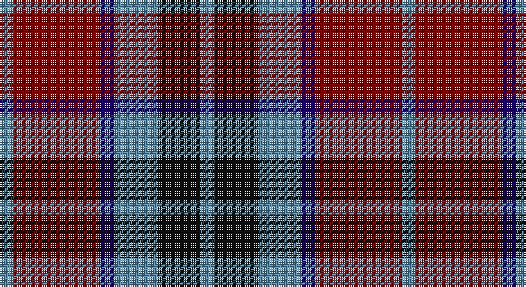

This page is one **sett** — a single exact thread-count. It belongs to the [tartan](/setts/t1r6db1t3k3t1/)
(the same proportion at any scale), whose colour order is pattern [BKBBRB](/stripes/bkbbrb/).

Part of the [MacTavish](/tartans/mactavish-2/) tartan — the named design grouping this sett with its other cloths.

Sourced from register-of-tartans.  It is a [6 stripe tartan](/stripes/stripes6/).

Original link https://www.tartanregister.gov.uk/tartanDetails.aspx?ref=4840

## Also known as

This cloth is also recorded under:

- MacTavish #2
- Thompson/Thomson/MacTavish

2 attestations — the source records this cloth was collapsed from (oldest owns this page)

<ul>
<li>01/01/1906 — MacTavish #2 (register-of-tartans, <a href="https://www.tartanregister.gov.uk/tartanDetails.aspx?ref=4840">record</a>)</li>
<li>1906 — MacTavish (Clan) (tartans-authority, <a href="http://www.tartansauthority.com/tartan-ferret/display/3598/">record</a>)</li>
</ul>

## Register references

External register numbers recorded for this tartan.

- Scottish Register of Tartans: [4840](https://www.tartanregister.gov.uk/tartanDetails.aspx?ref=4840)
- Scottish Tartans Authority (ITI): 3598

## Thread count
B/8 DR48 DB8 B24 K24 B/8

One full sett is **224 threads**.

## Palette

Palette: <strong>Tartan Register</strong>
<table><thead><tr><th>Colour</th><th>Threads</th><th>Shade</th><th>Base</th><th>OKLCh</th></tr></thead><tbody><tr><td>B/</td><td style="text-align:right;font-variant-numeric:tabular-nums">8</td><td><code style="background-color:#5C8CA8;">#5C8CA8</code> <small style="color:#888">#5C8CA8</small></td><td>B <code style="background-color:#2A418A;">#2A418A</code></td><td><small style="color:#888">oklch(61.7% 0.067 235.0)</small></td></tr><tr><td>DR</td><td style="text-align:right;font-variant-numeric:tabular-nums">48</td><td><code style="background-color:#880000;">#880000</code> <small style="color:#888">#880000</small></td><td>R <code style="background-color:#CC0000;">#CC0000</code></td><td><small style="color:#888">oklch(39.4% 0.162 29.2)</small></td></tr><tr><td>DB</td><td style="text-align:right;font-variant-numeric:tabular-nums">8</td><td><code style="background-color:#1C0070;">#1C0070</code> <small style="color:#888">#1C0070</small></td><td>B <code style="background-color:#2A418A;">#2A418A</code></td><td><small style="color:#888">oklch(26.3% 0.162 277.1)</small></td></tr><tr><td>B</td><td style="text-align:right;font-variant-numeric:tabular-nums">24</td><td><code style="background-color:#5C8CA8;">#5C8CA8</code> <small style="color:#888">#5C8CA8</small></td><td>B <code style="background-color:#2A418A;">#2A418A</code></td><td><small style="color:#888">oklch(61.7% 0.067 235.0)</small></td></tr><tr><td>K</td><td style="text-align:right;font-variant-numeric:tabular-nums">24</td><td><code style="background-color:#101010;">#101010</code> <small style="color:#888">#101010</small></td><td>K <code style="background-color:#000000;">#000000</code></td><td><small style="color:#888">oklch(17.3% 0.000 89.9)</small></td></tr><tr><td>B/</td><td style="text-align:right;font-variant-numeric:tabular-nums">8</td><td><code style="background-color:#5C8CA8;">#5C8CA8</code> <small style="color:#888">#5C8CA8</small></td><td>B <code style="background-color:#2A418A;">#2A418A</code></td><td><small style="color:#888">oklch(61.7% 0.067 235.0)</small></td></tr></tbody></table>

# Sample pattern

## Compared to the master

This cloth is one sett of its design; the master sett (the exemplar the design is anchored on) is below for comparison.

<figure style="margin:0"><figcaption style="color:#888;font-size:smaller">this sett</figcaption></figure>
<figure style="margin:0"><figcaption style="color:#888;font-size:smaller"><a href="/setts/db4r30k6db13k13db3/">master sett →</a></figcaption></figure>

## Nearest tartans

The nearest existing variants by ΔTartan distance, with this tartan at the top so the swatches line up against it.

ΔTartan

Tartan

Sett

—

<a href="/ttd/edit/#slug=t1r6db1t3k3t1~x8">MacTavish #2</a> <a class="nn-out" href="/variants/s6/t1r6db1t3k3t1~x8/" title="open its dictionary page">↗</a>

0.63

<a href="/ttd/edit/#slug=db5k1dg1k1r3k1~x4&amp;base=t1r6db1t3k3t1~x8">Clerk</a> <a class="nn-out" href="/variants/s6/db5k1dg1k1r3k1~x4/" title="open its dictionary page">↗</a>

0.95

<a href="/ttd/edit/#slug=n32w4n4k24dp29k4&amp;base=t1r6db1t3k3t1~x8">Grammar School at Leeds (School)</a> <a class="nn-out" href="/variants/s6/n32w4n4k24dp29k4/" title="open its dictionary page">↗</a>

1.00

<a href="/ttd/edit/#slug=dt2k2dt2r5ly1~x12&amp;base=t1r6db1t3k3t1~x8">Chivas Regal (Corporate)</a> <a class="nn-out" href="/variants/s5/dt2k2dt2r5ly1~x12/" title="open its dictionary page">↗</a>

1.03

<a href="/ttd/edit/#slug=r33dg17db50dg17r11dg17r9k7&amp;base=t1r6db1t3k3t1~x8">Carnegie #3</a> <a class="nn-out" href="/variants/s8/r33dg17db50dg17r11dg17r9k7/" title="open its dictionary page">↗</a>

1.03

<a href="/ttd/edit/#slug=db3r2g5r8db12w3~x2&amp;base=t1r6db1t3k3t1~x8">Edinburgh Bus Company (Corporate)</a> <a class="nn-out" href="/variants/s6/db3r2g5r8db12w3~x2/" title="open its dictionary page">↗</a>

1.05

<a href="/ttd/edit/#slug=r12dbi3g5db16ly2g2~x2&amp;base=t1r6db1t3k3t1~x8">Dunbog Primary School Corporate Tartan</a> <a class="nn-out" href="/variants/s6/r12dbi3g5db16ly2g2~x2/" title="open its dictionary page">↗</a>

1.05

<a href="/ttd/edit/#slug=g3k15r8g2o8k2~x4&amp;base=t1r6db1t3k3t1~x8">Thompson Black (Fashion)</a> <a class="nn-out" href="/variants/s6/g3k15r8g2o8k2~x4/" title="open its dictionary page">↗</a>

1.06

<a href="/ttd/edit/#slug=m10dy60dt13lo24dt24dy8&amp;base=t1r6db1t3k3t1~x8">Bronte House Check</a> <a class="nn-out" href="/variants/s6/m10dy60dt13lo24dt24dy8/" title="open its dictionary page">↗</a>

1.08

<a href="/ttd/edit/#slug=db1o8w1db4r8w1~x6&amp;base=t1r6db1t3k3t1~x8">Little's (Corporate)</a> <a class="nn-out" href="/variants/s6/db1o8w1db4r8w1~x6/" title="open its dictionary page">↗</a>

1.09

<a href="/ttd/edit/#slug=dp3r19dp18g19dp3g3~x2&amp;base=t1r6db1t3k3t1~x8">MacNab 1</a> <a class="nn-out" href="/variants/s6/dp3r19dp18g19dp3g3~x2/" title="open its dictionary page">↗</a>

## Neighbour map

Every grey dot is one of 14360 variants placed by the first two principal components of the ΔTartan feature space (44% of its variance). Red is this tartan; blue dots are its nearest — click one to open its page.

<svg viewBox="0 0 640 380" role="img" style="max-width:100%;height:auto;border:1px solid #e0e0e0;border-radius:4px;display:block" xmlns="http://www.w3.org/2000/svg"><image href="/nn/cloud.v1.png" width="640" height="380"/><a href="/variants/s6/db5k1dg1k1r3k1~x4/"><circle cx="195.2" cy="243.4" r="4" fill="#3465a4"><title>Clerk</title></circle></a><a href="/variants/s6/n32w4n4k24dp29k4/"><circle cx="207.2" cy="230.1" r="4" fill="#3465a4"><title>Grammar School at Leeds (School)</title></circle></a><a href="/variants/s5/dt2k2dt2r5ly1~x12/"><circle cx="175.6" cy="262.7" r="4" fill="#3465a4"><title>Chivas Regal (Corporate)</title></circle></a><a href="/variants/s8/r33dg17db50dg17r11dg17r9k7/"><circle cx="171.6" cy="227.1" r="4" fill="#3465a4"><title>Carnegie #3</title></circle></a><a href="/variants/s6/db3r2g5r8db12w3~x2/"><circle cx="181.6" cy="231.2" r="4" fill="#3465a4"><title>Edinburgh Bus Company (Corporate)</title></circle></a><a href="/variants/s6/r12dbi3g5db16ly2g2~x2/"><circle cx="180.0" cy="200.4" r="4" fill="#3465a4"><title>Dunbog Primary School Corporate Tartan</title></circle></a><a href="/variants/s6/g3k15r8g2o8k2~x4/"><circle cx="200.8" cy="224.2" r="4" fill="#3465a4"><title>Thompson Black (Fashion)</title></circle></a><a href="/variants/s6/m10dy60dt13lo24dt24dy8/"><circle cx="248.2" cy="223.4" r="4" fill="#3465a4"><title>Bronte House Check</title></circle></a><a href="/variants/s6/db1o8w1db4r8w1~x6/"><circle cx="183.3" cy="209.7" r="4" fill="#3465a4"><title>Little's (Corporate)</title></circle></a><a href="/variants/s6/dp3r19dp18g19dp3g3~x2/"><circle cx="210.1" cy="246.7" r="4" fill="#3465a4"><title>MacNab 1</title></circle></a><circle cx="192.3" cy="235.8" r="5" fill="#c00000"/></svg>

ID: /variants/s6/t1r6db1t3k3t1~x8/
