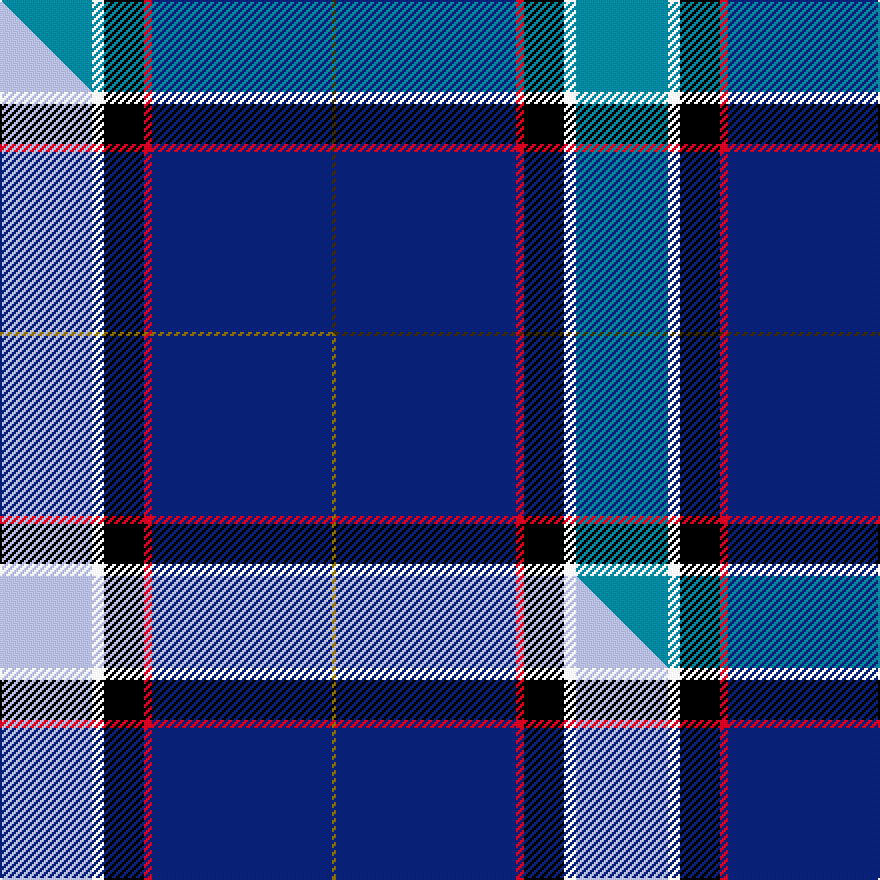

This is one **variant** — a specific cloth: this exact thread count and colourway, with its own
provenance below. It is one weaving of the [sett](/setts/t23w3k10r2db45dy1/) (the scale-free proportion — the
same cloth at any scale or shade), whose colour order is pattern [BWKRBG](/stripes/bwkrbg/).

Part of the [Kirkcaldy](/tartans/k/ki/kirkcaldy/) tartan — the named design grouping this sett with its other cloths.

Sourced from house-of-tartan.  It is a [6 stripe tartan](/stripes/stripes6/).

Original link [http://www.house-of-tartan.scotland.net/house/TartanViewjs.asp?colr=Def&tnam=9072](http://www.house-of-tartan.scotland.net/house/TartanViewjs.asp?colr=Def&tnam=9072)

## Provenance

Earliest known date: 2008 Blue and white for the Scottish flag, the red and yellow is from William Kirkcaldy's shield (it is also my son's army colours). It is for general use.

Dataset <small>— provenance for this record, inherited from the source manifest</small>

<dl class="dataset-prov">
<dt>source</dt><dd><a href="/sources/house-of-tartan/">House of Tartan</a></dd>
<dt>data captured from</dt><dd><a href="https://github.com/thetartan/tartan-database/blob/master/data/house-of-tartan/data.csv">https://github.com/thetartan/tartan-database/blob/master/data/house-of-tartan/data.csv</a></dd>
<dt>data date</dt><dd>2008 <small>(this record)</small></dd>
<dt>licence</dt><dd><a href="https://creativecommons.org/licenses/by-nc-nd/4.0/">CC BY-NC-ND 4.0</a></dd>
</dl>

Capture chain <small>— the hands this data passed through, oldest first; each capture carries its own licence</small>

<ol class="capture-chain">
<li><a href="http://www.house-of-tartan.scotland.net/">House of Tartan</a> <small>the weaver/retailer's database — the site is now offline; the URL is kept as the ultimate source's identity</small></li>
<li><a href="https://github.com/thetartan/tartan-database">thetartan/tartan-database</a> <small>2016-2017</small> · <a href="https://creativecommons.org/licenses/by-nc-nd/4.0/">CC BY-NC-ND 4.0</a> <small>Levko Kravets's frozen compilation — the capture we vendored, and where its CC licence text came from</small></li>
<li>this dictionary <small>captured 2026-06-10 · commit 5bf86c7566</small> <small>each re-capture is a git commit to data/sources</small></li>
</ol>

## Thread count
T/46 W6 K20 R4 DB90 DY/2

One full sett is **288 threads**.

## Palette
<table><thead><tr><th>Colour</th><th>Shade</th><th>OKLCh</th></tr></thead><tbody><tr><td>T</td><td><code style="background-color:#00879F;">#00879F</code> <small style="color:#888">#00879F</small></td><td><small style="color:#888">oklch(57.4% 0.102 216.1)</small></td></tr><tr><td>DB</td><td><code style="background-color:#082077;">#082077</code> <small style="color:#888">#082077</small></td><td><small style="color:#888">oklch(30.0% 0.149 265.1)</small></td></tr><tr><td>R</td><td><code style="background-color:#D60020;">#D60020</code> <small style="color:#888">#D60020</small></td><td><small style="color:#888">oklch(55.2% 0.224 25.5)</small></td></tr><tr><td>K</td><td><code style="background-color:#000000;">#000000</code> <small style="color:#888">#000000</small></td><td><small style="color:#888">oklch(0.0% 0.000 0.0)</small></td></tr><tr><td>DY</td><td><code style="background-color:#3A2B0D;">#3A2B0D</code> <small style="color:#888">#3A2B0D</small></td><td><small style="color:#888">oklch(30.0% 0.049 82.0)</small></td></tr><tr><td>W</td><td><code style="background-color:#F7F7F7;">#F7F7F7</code> <small style="color:#888">#F7F7F7</small></td><td><small style="color:#888">oklch(97.6% 0.000 89.9)</small></td></tr></tbody></table>

# Sample pattern

## Compared to the master

This cloth is one sett of its design; the master sett (the exemplar the design is anchored on) is below for comparison.

Its **ΔTartan distance** from the master is **0.12** — the same measure the nearest-tartans table ranks by (0 is identical; a re-scale of the same cloth is near 0, a recolour or a different proportion further).

<figure class="master-compare" style="margin:0">

this sett
master sett ★

<figcaption style="color:#888;font-size:smaller">One weave of this sett against the <a href="/setts/lb23w3k10r2db45y1/">master sett ★</a>, split on the diagonal: a shared proportion runs seamlessly across it with only the shades shifting; a different proportion breaks on it.</figcaption>
</figure>

## Nearest tartan variants

The nearest existing variants by ΔTartan distance, with this cloth at the top so the swatches line up against it.

ΔTartan

Threads

Variant

Sett

—

288

<a href="/variants/s6/t23w3k10r2db45dy1~x2/">Kirkcaldy Name Tartan</a>

<a href="/ttd/edit/#slug=lb23w3k10r2db45y1~x2&amp;base=t23w3k10r2db45dy1~x2" title="compare in the TTD">0.12</a>

288

<a href="/variants/s6/lb23w3k10r2db45y1~x2/">Kirkcaldy</a>

<a href="/ttd/edit/#slug=k4n4db32r4b17w2~x2~db1404245-b2603265&amp;base=t23w3k10r2db45dy1~x2" title="compare in the TTD">1.48</a>

240

<a href="/variants/s6/k4n4db32r4b17w2~x2~db1404245-b2603265/">Shearer (2016)</a>

<a href="/ttd/edit/#slug=dr4lb16k3db44dr1w3y2~x2&amp;base=t23w3k10r2db45dy1~x2" title="compare in the TTD">1.55</a>

280

<a href="/variants/s7/dr4lb16k3db44dr1w3y2~x2/">Dress Blue</a>

<a href="/ttd/edit/#slug=r4lb16k3db44r1w3ly2~x2&amp;base=t23w3k10r2db45dy1~x2" title="compare in the TTD">1.55</a>

280

<a href="/variants/s7/r4lb16k3db44r1w3ly2~x2/">Dress Blue (Fashion)</a>

<a href="/ttd/edit/#slug=ly4t8dp4k53db54w2&amp;base=t23w3k10r2db45dy1~x2" title="compare in the TTD">1.83</a>

244

<a href="/variants/s6/ly4t8dp4k53db54w2/">Pipers' Trail (Corporate)</a>

<a href="/ttd/edit/#slug=b5g8k5db32w2r2~x2&amp;base=t23w3k10r2db45dy1~x2" title="compare in the TTD">1.98</a>

202

<a href="/variants/s6/b5g8k5db32w2r2~x2/">Marion (Personal)</a>

<a href="/ttd/edit/#slug=dg10w2k10y5db35r6~x2&amp;base=t23w3k10r2db45dy1~x2" title="compare in the TTD">2.04</a>

240

<a href="/variants/s6/dg10w2k10y5db35r6~x2/">Hatfield &amp; Mize (Personal)</a>

<a href="/ttd/edit/#slug=r8y2b7y2db24k2g1~x2&amp;base=t23w3k10r2db45dy1~x2" title="compare in the TTD">2.07</a>

166

<a href="/variants/s7/r8y2b7y2db24k2g1~x2/">(4) Traill</a>

<a href="/ttd/edit/#slug=db50g25ly3lb8r1w1r1~x2&amp;base=t23w3k10r2db45dy1~x2" title="compare in the TTD">2.13</a>

254

<a href="/variants/s7/db50g25ly3lb8r1w1r1~x2/">Wells (2014)</a>

<a href="/ttd/edit/#slug=db40dr3k10lo2lb15w2lb4~x2&amp;base=t23w3k10r2db45dy1~x2" title="compare in the TTD">2.23</a>

216

<a href="/variants/s7/db40dr3k10lo2lb15w2lb4~x2/">U.S. Forces Thurso (Military)</a>

## Neighbour map

Every grey dot is one of 13656 variants placed by the first two principal components of the ΔTartan feature space (42% of its variance). Red is this tartan; blue dots are its nearest — click one to open its page. The map is a flat projection of a many-dimensional space — [how to read it](/posts/neighbourhood-maps/).

<svg viewBox="0 0 640 380" role="img" style="max-width:100%;height:auto;border:1px solid #e0e0e0;border-radius:4px;display:block" xmlns="http://www.w3.org/2000/svg"><image href="/nn/cloud.v1.png" width="640" height="380"/><a href="/variants/s6/lb23w3k10r2db45y1~x2/"><circle cx="259.2" cy="83.1" r="4" fill="#3465a4"><title>Kirkcaldy</title></circle></a><a href="/variants/s6/k4n4db32r4b17w2~x2~db1404245-b2603265/"><circle cx="251.0" cy="147.3" r="4" fill="#3465a4"><title>Shearer (2016)</title></circle></a><a href="/variants/s7/dr4lb16k3db44dr1w3y2~x2/"><circle cx="318.6" cy="69.4" r="4" fill="#3465a4"><title>Dress Blue</title></circle></a><a href="/variants/s7/r4lb16k3db44r1w3ly2~x2/"><circle cx="313.4" cy="66.5" r="4" fill="#3465a4"><title>Dress Blue (Fashion)</title></circle></a><a href="/variants/s6/ly4t8dp4k53db54w2/"><circle cx="237.4" cy="115.1" r="4" fill="#3465a4"><title>Pipers' Trail (Corporate)</title></circle></a><a href="/variants/s6/b5g8k5db32w2r2~x2/"><circle cx="278.9" cy="129.1" r="4" fill="#3465a4"><title>Marion (Personal)</title></circle></a><a href="/variants/s6/dg10w2k10y5db35r6~x2/"><circle cx="229.6" cy="140.0" r="4" fill="#3465a4"><title>Hatfield &amp; Mize (Personal)</title></circle></a><a href="/variants/s7/r8y2b7y2db24k2g1~x2/"><circle cx="266.2" cy="112.1" r="4" fill="#3465a4"><title>(4) Traill</title></circle></a><a href="/variants/s7/db50g25ly3lb8r1w1r1~x2/"><circle cx="333.5" cy="89.0" r="4" fill="#3465a4"><title>Wells (2014)</title></circle></a><a href="/variants/s7/db40dr3k10lo2lb15w2lb4~x2/"><circle cx="231.5" cy="108.7" r="4" fill="#3465a4"><title>U.S. Forces Thurso (Military)</title></circle></a><circle cx="285.7" cy="94.3" r="5" fill="#c00000"/><text x="320" y="376" text-anchor="middle" font-size="11" fill="#999">ground</text><text x="11" y="190" text-anchor="middle" font-size="11" fill="#999" transform="rotate(-90 11 190)">complexity</text></svg>

ID: /variants/s6/t23w3k10r2db45dy1~x2/
