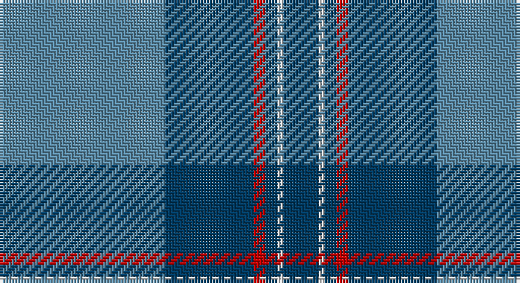

This page is one **sett** — a single exact thread-count. It belongs to the [tartan](/setts/t28dt15r2dt2w1dt6/)
(the same proportion at any scale), whose colour order is pattern [BBRBWB](/stripes/bbrbwb/).

Sourced from register-of-tartans.  It is a [6 stripe tartan](/stripes/stripes6/).

Original link https://www.tartanregister.gov.uk/tartanDetails.aspx?ref=774

2 attestations — the source records this cloth was collapsed from (oldest owns this page)

<ul>
<li>01/01/2006 — Corries (register-of-tartans, <a href="https://www.tartanregister.gov.uk/tartanDetails.aspx?ref=774">record</a>)</li>
<li>2006 — Corries (Corporate) (tartans-authority, <a href="http://www.tartansauthority.com/tartan-ferret/display/7022/">record</a>)</li>
</ul>

## Register references

External register numbers recorded for this tartan.

- Scottish Register of Tartans: [774](https://www.tartanregister.gov.uk/tartanDetails.aspx?ref=774)
- Scottish Tartans Authority (ITI): 7022

## Thread count
B/56 DB30 R4 DB4 LN2 DB/12

One full sett is **148 threads**.

## Palette

Palette: <strong>Tartan Register</strong>
<table><thead><tr><th>Colour</th><th>Threads</th><th>Shade</th><th>Base</th><th>OKLCh</th></tr></thead><tbody><tr><td>B/</td><td style="text-align:right;font-variant-numeric:tabular-nums">56</td><td><code style="background-color:#5C8CA8;">#5C8CA8</code> <small style="color:#888">#5C8CA8</small></td><td>B <code style="background-color:#2A418A;">#2A418A</code></td><td><small style="color:#888">oklch(61.7% 0.067 235.0)</small></td></tr><tr><td>DB</td><td style="text-align:right;font-variant-numeric:tabular-nums">30</td><td><code style="background-color:#003C64;">#003C64</code> <small style="color:#888">#003C64</small></td><td>B <code style="background-color:#2A418A;">#2A418A</code></td><td><small style="color:#888">oklch(34.5% 0.089 246.0)</small></td></tr><tr><td>R</td><td style="text-align:right;font-variant-numeric:tabular-nums">4</td><td><code style="background-color:#C80000;">#C80000</code> <small style="color:#888">#C80000</small></td><td>R <code style="background-color:#CC0000;">#CC0000</code></td><td><small style="color:#888">oklch(52.3% 0.215 29.2)</small></td></tr><tr><td>DB</td><td style="text-align:right;font-variant-numeric:tabular-nums">4</td><td><code style="background-color:#003C64;">#003C64</code> <small style="color:#888">#003C64</small></td><td>B <code style="background-color:#2A418A;">#2A418A</code></td><td><small style="color:#888">oklch(34.5% 0.089 246.0)</small></td></tr><tr><td>LN</td><td style="text-align:right;font-variant-numeric:tabular-nums">2</td><td><code style="background-color:#E0E0E0;">#E0E0E0</code> <small style="color:#888">#E0E0E0</small></td><td>W <code style="background-color:#F7F7F7;">#F7F7F7</code></td><td><small style="color:#888">oklch(90.7% 0.000 89.9)</small></td></tr><tr><td>DB/</td><td style="text-align:right;font-variant-numeric:tabular-nums">12</td><td><code style="background-color:#003C64;">#003C64</code> <small style="color:#888">#003C64</small></td><td>B <code style="background-color:#2A418A;">#2A418A</code></td><td><small style="color:#888">oklch(34.5% 0.089 246.0)</small></td></tr></tbody></table>

# Sample pattern

## Nearest tartans

The nearest existing variants by ΔTartan distance, with this tartan at the top so the swatches line up against it.

ΔTartan

Tartan

Sett

—

<a href="/ttd/edit/#slug=t28dt15r2dt2w1dt6~x2">Corries</a> <a class="nn-out" href="/variants/s6/t28dt15r2dt2w1dt6~x2/" title="open its dictionary page">↗</a>

0.71

<a href="/ttd/edit/#slug=t9db2t39dt33lo2dt5~x2&amp;base=t28dt15r2dt2w1dt6~x2">Port Authority of NY &amp; NJ</a> <a class="nn-out" href="/variants/s6/t9db2t39dt33lo2dt5~x2/" title="open its dictionary page">↗</a>

1.09

<a href="/ttd/edit/#slug=n42db2n2db17lo8db4~x2&amp;base=t28dt15r2dt2w1dt6~x2">Connecticut State Police PB (Cor.)</a> <a class="nn-out" href="/variants/s6/n42db2n2db17lo8db4~x2/" title="open its dictionary page">↗</a>

1.23

<a href="/ttd/edit/#slug=o37lo2r6lo2o8db49o3~x2&amp;base=t28dt15r2dt2w1dt6~x2">U.S. Merchant Marine Academy (Corpo</a> <a class="nn-out" href="/variants/s7/o37lo2r6lo2o8db49o3~x2/" title="open its dictionary page">↗</a>

1.35

<a href="/ttd/edit/#slug=dg4w1dg26b26k2b4~x4&amp;base=t28dt15r2dt2w1dt6~x2">Melville (Two black lines)</a> <a class="nn-out" href="/variants/s6/dg4w1dg26b26k2b4~x4/" title="open its dictionary page">↗</a>

1.39

<a href="/ttd/edit/#slug=r2t21r2db6ly1r1~x4&amp;base=t28dt15r2dt2w1dt6~x2">Lauder Primary School (Corporate)</a> <a class="nn-out" href="/variants/s6/r2t21r2db6ly1r1~x4/" title="open its dictionary page">↗</a>

1.39

<a href="/ttd/edit/#slug=db4k4db24g32w1g2~x4&amp;base=t28dt15r2dt2w1dt6~x2">Oliphant (Clan)</a> <a class="nn-out" href="/variants/s6/db4k4db24g32w1g2~x4/" title="open its dictionary page">↗</a>

1.40

<a href="/ttd/edit/#slug=db22ly2db1ly2db10y2g11y6~x2&amp;base=t28dt15r2dt2w1dt6~x2">Katsushika (Corporate)</a> <a class="nn-out" href="/variants/s8/db22ly2db1ly2db10y2g11y6~x2/" title="open its dictionary page">↗</a>

1.45

<a href="/ttd/edit/#slug=db4r1db18b18w1b4~x4&amp;base=t28dt15r2dt2w1dt6~x2">Ewell Castle School</a> <a class="nn-out" href="/variants/s6/db4r1db18b18w1b4~x4/" title="open its dictionary page">↗</a>

1.47

<a href="/ttd/edit/#slug=t52db28w3db2w2db10~x2&amp;base=t28dt15r2dt2w1dt6~x2">St Andrews Earl of Royal family Tartan</a> <a class="nn-out" href="/variants/s6/t52db28w3db2w2db10~x2/" title="open its dictionary page">↗</a>

1.48

<a href="/ttd/edit/#slug=dt4lr1dt1lr3dt24o9k1o9k3~x2&amp;base=t28dt15r2dt2w1dt6~x2">Historic Scotland (pre 1998) (Corp)</a> <a class="nn-out" href="/variants/s9/dt4lr1dt1lr3dt24o9k1o9k3~x2/" title="open its dictionary page">↗</a>

## Neighbour map

Every grey dot is one of 14360 variants placed by the first two principal components of the ΔTartan feature space (44% of its variance). Red is this tartan; blue dots are its nearest — click one to open its page.

<svg viewBox="0 0 640 380" role="img" style="max-width:100%;height:auto;border:1px solid #e0e0e0;border-radius:4px;display:block" xmlns="http://www.w3.org/2000/svg"><image href="/nn/cloud.v1.png" width="640" height="380"/><a href="/variants/s6/t9db2t39dt33lo2dt5~x2/"><circle cx="381.2" cy="203.2" r="4" fill="#3465a4"><title>Port Authority of NY &amp; NJ</title></circle></a><a href="/variants/s6/n42db2n2db17lo8db4~x2/"><circle cx="380.8" cy="179.7" r="4" fill="#3465a4"><title>Connecticut State Police PB (Cor.)</title></circle></a><a href="/variants/s7/o37lo2r6lo2o8db49o3~x2/"><circle cx="346.0" cy="162.2" r="4" fill="#3465a4"><title>U.S. Merchant Marine Academy (Corpo</title></circle></a><a href="/variants/s6/dg4w1dg26b26k2b4~x4/"><circle cx="370.1" cy="193.7" r="4" fill="#3465a4"><title>Melville (Two black lines)</title></circle></a><a href="/variants/s6/r2t21r2db6ly1r1~x4/"><circle cx="413.5" cy="165.4" r="4" fill="#3465a4"><title>Lauder Primary School (Corporate)</title></circle></a><a href="/variants/s6/db4k4db24g32w1g2~x4/"><circle cx="374.3" cy="178.6" r="4" fill="#3465a4"><title>Oliphant (Clan)</title></circle></a><a href="/variants/s8/db22ly2db1ly2db10y2g11y6~x2/"><circle cx="348.8" cy="173.7" r="4" fill="#3465a4"><title>Katsushika (Corporate)</title></circle></a><a href="/variants/s6/db4r1db18b18w1b4~x4/"><circle cx="345.4" cy="205.1" r="4" fill="#3465a4"><title>Ewell Castle School</title></circle></a><a href="/variants/s6/t52db28w3db2w2db10~x2/"><circle cx="401.3" cy="192.0" r="4" fill="#3465a4"><title>St Andrews Earl of Royal family Tartan</title></circle></a><a href="/variants/s9/dt4lr1dt1lr3dt24o9k1o9k3~x2/"><circle cx="363.8" cy="161.7" r="4" fill="#3465a4"><title>Historic Scotland (pre 1998) (Corp)</title></circle></a><circle cx="381.3" cy="178.9" r="5" fill="#c00000"/></svg>

ID: /variants/s6/t28dt15r2dt2w1dt6~x2/
